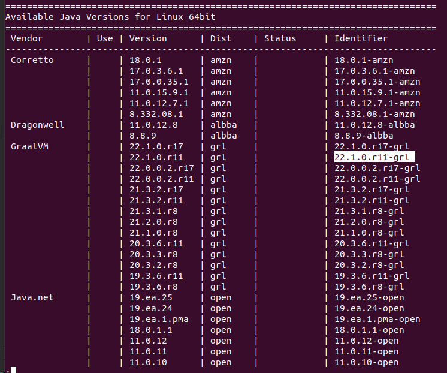

# 07.01 sdkman

## Referencias
https://sdkman.io/usage


## 1. Instalar
``` shell
curl -s "https://get.sdkman.io" | bash

```

``` shell
source "$HOME/.sdkman/bin/sdkman-init.sh"
```

``` shell
sdk version
```

## 2. Listar 

### Ver las versiones disponibles
```
sdk list java
```

Se muestra el listado de las jvm disponibles



### instalar 
Gralvm version 22.1.0.r11-grl
```
sdk install java 22.1.0.r11-grl
```

### Indicar version por defecto
```
sdk default java 22.1.0.r11-grl
```

### Ver version actual
```
sdk current java
```


### Seleccionar una version para usarla
```
sdk use java java 22.1.0.r11-grl
```


### remover
```
sdk uninstall java 22.1.0.r11-grl
```

## Env Command
(Tomado de las referencias oficiales de SDKMNAN)
Para establecer el ambiente mediante atributos
crear un achivo con la extensión
```
.sdkmanrc
```

### Generación atimoatica
```
sdk env init
```

Se genera un contenido similar 
```
# Enable auto-env through the sdkman_auto_env config
# Add key=value pairs of SDKs to use below
java=17.0.3-tem
```
### Ejecutar el archivo
Ingrese al directorio donde esta el archivo y ejecute
```
sdk env
```
### Limpiar el env
```
sdk env clear
```

Despues de limpiar el env perdemos el jdk, por lo que debemos ejecutar nuevamente
```
 sdk env install
```

## Donge guarda SDKMAN las JDK
```
/home/myuser/.sdkman/candidates/java/
```


