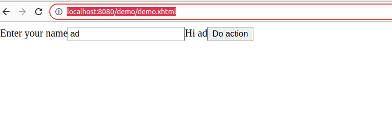

# 2.1 Crear Views desde Java code
New API to programmatically create Facelets: First class support for creating views in Java as opposed to creating such view using XML as is currently done with Facelets.
***
## Ejemplo con Wildfky/ GlassFish 7.0
Mi proyecto de ejemplo: 
[jakartasetverfaces40](https://github.com/avbravo/jakartasetverfaces40.git) 

Utiliza Wildfly como servidor


```java
@View("/demo.xhtml")
@ApplicationScoped
public class DemoFacelet extends Facelet {

    @Override
    public void apply(FacesContext facesContext, UIComponent root) throws IOException {
        if (!facesContext.getAttributes().containsKey(IS_BUILDING_INITIAL_STATE)) {
            return;
        }

        ComponentBuilder components = new ComponentBuilder(facesContext);
        List<UIComponent> rootChildren = root.getChildren();

        UIOutput output = new UIOutput();

        output.setValue("<html xmlns=\"http://www.w3.org/1999/xhtml\">");
        rootChildren.add(output);

        HtmlBody body = components.create(HtmlBody.COMPONENT_TYPE);
        rootChildren.add(body);

        HtmlForm form = components.create(HtmlForm.COMPONENT_TYPE);
        form.setId("form");
        body.getChildren().add(form);

        HtmlOutputLabel label = components.create(HtmlOutputLabel.COMPONENT_TYPE);
        label.setValue("Enter your name");
        form.getChildren().add(label);

        HtmlInputText message = components.create(HtmlInputText.COMPONENT_TYPE);
        message.setId("message");
        form.getChildren().add(message);

        HtmlOutputText text = components.create(HtmlOutputText.COMPONENT_TYPE);
        form.getChildren().add(text);
        /**
         * Datatable
         */
        HtmlDataTable dataTable = new HtmlDataTable();
        // Get amount of columns.
        List<Oceano> list = new ArrayList<>();
        int columns = ((List) list.get(0)).size();

        // Set columns.
        for (int i = 0; i < columns; i++) {

            // Set header (optional).
            UIOutput header = new UIOutput();
            header.setValue("idoceano");
            

            // Set output.
            UIOutput outputColumn = new UIOutput();
            ValueBinding myItem
                    = FacesContext
                            .getCurrentInstance()
                            .getApplication()
                            .createValueBinding("#{myItem[" + i + "]}");
            outputColumn.setValueBinding("value", myItem);

            // Set column.
            UIColumn column = new UIColumn();
            column.setHeader(header);
            column.getChildren().add(outputColumn);

            // Add column.
          dataTable.getChildren().add(column);
        }
form.getChildren().add(dataTable);
        /**
         * CommandButton
         */
        HtmlCommandButton actionButton = components.create(HtmlCommandButton.COMPONENT_TYPE);
        actionButton.setId("button");
        actionButton.addActionListener(e -> text.setValue("Hi " + message.getValue()));
        actionButton.setValue("Do action");
        form.getChildren().add(actionButton);

        output = new UIOutput();
        output.setValue("</html>");
        rootChildren.add(output);
    }

    private static class ComponentBuilder {

        FacesContext facesContext;

        ComponentBuilder(FacesContext facesContext) {
            this.facesContext = facesContext;
        }

        @SuppressWarnings("unchecked")
        <T> T create(String componentType) {
            return (T) facesContext.getApplication().createComponent(facesContext, componentType, null);
        }
    }
}

```

Al ejecutarlo ingresar al navegador
```
http://localhost:8080/demo/demo.xhtml
```

Guia en al que me base
[Getting started with JSF 4.0 on WildFly 27](http://www.mastertheboss.com/java-ee/jsf/getting-started-with-jsf-4-0-on-wildfly-27/?amp=1)

[Crear usuarios en Wildfly](http://avbravo.blogspot.com/2014/03/crear-usuarios-en-wildfly.html)  
en el ejemplo use   
```
user: avbravo  
password: denver16  
```

[Integrar Wildfly con NetBeans](http://avbravo.blogspot.com/2014/03/integrar-wildfly-con-netbeans.html)

***


https://github.com/jakartaee/faces/issues/1581

https://dzone.com/articles/unit-api-what-how-and-why?utm_campaign=unit-api-what-how-and-why&utm_medium=social_link&utm_source=missinglettr-twitter

https://github.com/eclipse-ee4j/mojarra/releases/tag/4.0.0-RELEASE

https://newsroom.eclipse.org/eclipse-newsletter/2022/april/top-5-new-features-coming-jakarta-ee-10

http://www.mastertheboss.com/java-ee/jakarta-ee/whats-new-in-jakarta-ee-10/


