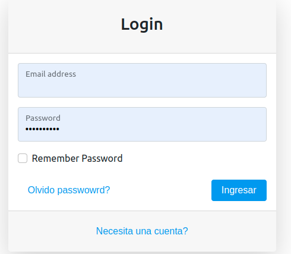
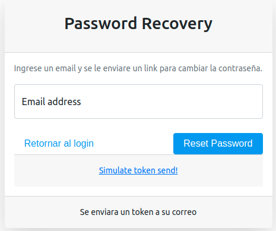
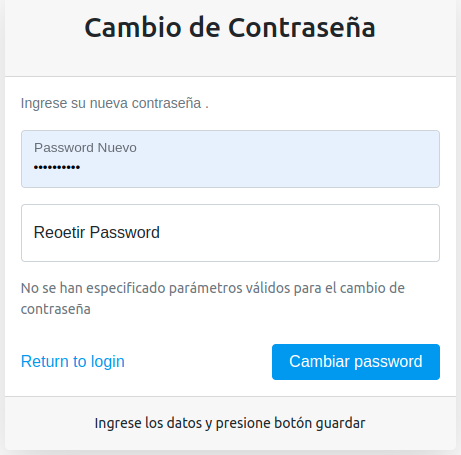
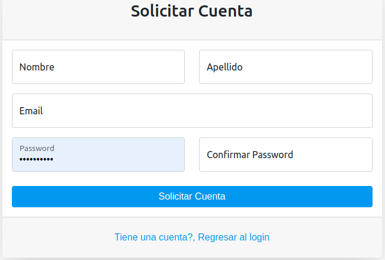

# 2.2 Login

Controlara al acceso a la aplicación.

Se cuenta con un formuñario para solocitar las credenciales

## Olvido Password

Si olvida el password puede solicitarlo

## Cambio de Password

Se enviara un correo con el url para que el usuario pueda cambiar el password.
Este correo contendra la información encriptada para mayor seguridaad de la aplicación

## Registrarse

Este formulario enviara los datos al admistrador del sistema para que haga las aprobaciones

