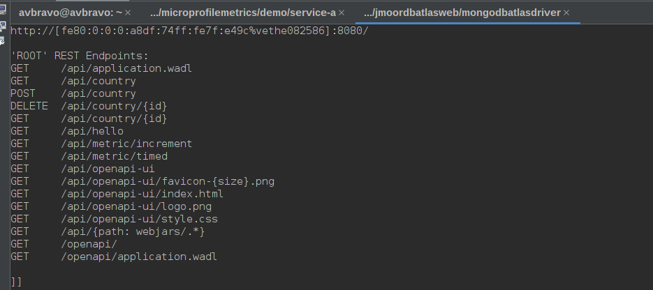
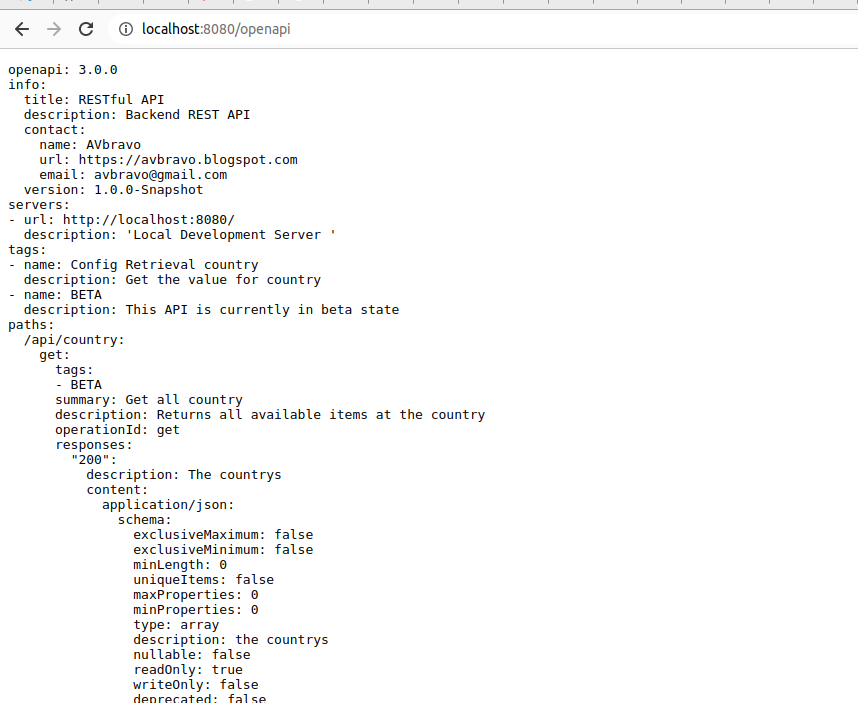
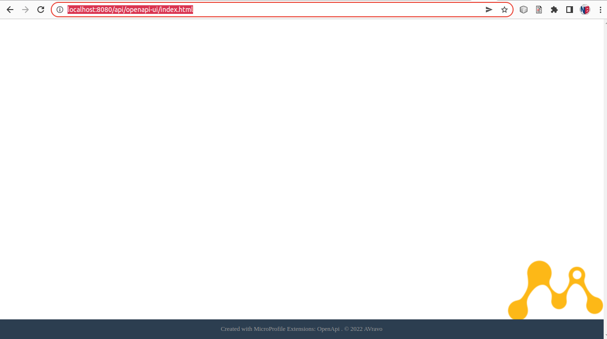

# 03.03 OpenApi-ui
Es un api que nos muestra una interface grafica con documentación rest

## Dependencia
Agregue al archivo pom.xml
```
       <!--
                OpenAPI-UI
-->
  
           <dependency>
            <groupId>org.microprofile-ext.openapi-ext</groupId>
            <artifactId>openapi-ui</artifactId>
            <version>1.1.5</version>
        </dependency>
```

## Configure el archivo microprofile-config.properties
```
#--OpenApi Swagger
openapi.ui.copyrightYear=2022
openapi.ui.copyrightBy=AVravo
openapi.ui.contextRoot=/
openapi.ui.serverInfo=mongodbatlasdriver
openapi-ui.title=My awesome services
openapi-ui.swaggerHeaderVisibility=hidden
```

## Agregar documentación al ApplicatiomPath
```
import javax.ws.rs.ApplicationPath;
import javax.ws.rs.core.Application;
import org.eclipse.microprofile.openapi.annotations.OpenAPIDefinition;
import org.eclipse.microprofile.openapi.annotations.info.Contact;
import org.eclipse.microprofile.openapi.annotations.info.Info;
import org.eclipse.microprofile.openapi.annotations.servers.Server;

/**
 * Configures Jakarta RESTful Web Services for the application.
 * @author Juneau
 */
@ApplicationPath("api")
@OpenAPIDefinition(info = @Info(
        title = "RESTful API",
        description = "Backend REST API",
        version = "1.0.0-Snapshot",
        contact = @Contact(
                name = "AVbravo",
                email = "avbravo@gmail.com",
                url = "https://avbravo.blogspot.com")
),
        servers = {
            @Server(url = "http://localhost:8080/", description = "Local Development Server "),}
)
public class JakartaRestConfiguration extends Application {
    
}


```

## Documentar los Controller
```
import com.avbravo.mongodbatlasdriver.model.Country;
import com.avbravo.mongodbatlasdriver.repository.implementations.CountryRepositoryImpl;
import java.util.ArrayList;
import java.util.Collection;
import java.util.List;
import java.util.function.Supplier;
import javax.inject.Inject;
import javax.ws.rs.DELETE;
import javax.ws.rs.GET;
import javax.ws.rs.POST;
import javax.ws.rs.Path;
import javax.ws.rs.PathParam;
import javax.ws.rs.Produces;
import javax.ws.rs.WebApplicationException;
import javax.ws.rs.core.MediaType;
import javax.ws.rs.core.Response;
import org.eclipse.microprofile.openapi.annotations.Operation;
import org.eclipse.microprofile.openapi.annotations.enums.SchemaType;
import org.eclipse.microprofile.openapi.annotations.media.Content;
import org.eclipse.microprofile.openapi.annotations.media.Schema;
import org.eclipse.microprofile.openapi.annotations.parameters.Parameter;
import org.eclipse.microprofile.openapi.annotations.parameters.RequestBody;
import org.eclipse.microprofile.openapi.annotations.responses.APIResponse;
import org.eclipse.microprofile.openapi.annotations.tags.Tag;


/**
 *
 * @author avbravo
 */
@Path("/country")
@Tag(name = "Config Retrieval country", description = "Get the value for country")
public class CountryController {

 private static final Supplier<WebApplicationException> NOT_FOUND =
            () -> new WebApplicationException(Response.Status.NOT_FOUND);
    @Inject
    CountryRepositoryImpl countryRepository;

    // <editor-fold defaultstate="collapsed" desc="@GET">
    @GET
    @Produces({MediaType.APPLICATION_XML, MediaType.APPLICATION_JSON})
    @Operation(summary = "Get all country", description = "Returns all available items at the country")
    @APIResponse(responseCode = "500", description = "Server unavailable")
    @APIResponse(responseCode = "200", description = "The countrys")
    @Tag(name = "BETA", description = "This API is currently in beta state")
    @APIResponse(description = "The countrys", responseCode = "200", content = @Content(mediaType = MediaType.APPLICATION_JSON, schema = @Schema(implementation = Collection.class, readOnly = true, description = "the countrys", required = true, name = "countrys")))
    public List<Country> get() {
        List<Country> list = new ArrayList<>();
        try {
          
            list = countryRepository.findAll();

        } catch (Exception e) {
            System.out.println("get() " + e.getLocalizedMessage());
        }

        return list;
    }


    
     @GET
    @Path("{id}")
    @Operation(summary = "Find a country by id", description = "Find a country by id")
    @APIResponse(responseCode = "200", description = "The country")
    @APIResponse(responseCode = "404", description = "When the id does not exist")
    @APIResponse(responseCode = "500", description = "Server unavailable")
    @Tag(name = "BETA", description = "This API is currently in beta state")
    @APIResponse(description = "The country", content = @Content(mediaType = MediaType.APPLICATION_JSON, schema = @Schema(implementation = Country.class)))
    public Country findById(
            @Parameter(description = "The item ID", required = true, example = "1", schema = @Schema(type = SchemaType.STRING)) @PathParam("id") String id) {
        return countryRepository.findById(id).orElseThrow(
                () -> new WebApplicationException("There is no country with the id " + id, Response.Status.NOT_FOUND));
    }
    
    
     @POST
    @Operation(summary = "Insert a country", description = "Insert a country")
    @APIResponse(responseCode = "201", description = "When creates an country")
    @APIResponse(responseCode = "500", description = "Server unavailable")
    @Tag(name = "BETA", description = "This API is currently in beta state")
    public Response insert(
            @RequestBody(description = "Create a new country.", content = @Content(mediaType = "application/json", schema = @Schema(implementation = Country.class))) Country country) {
        return Response.status(Response.Status.CREATED).entity(countryRepository.save(country)).build();
    }

    @DELETE
    @Path("{id}")
    @Operation(summary = "Delete a country by ID", description = "Delete a country by ID")
    @APIResponse(responseCode = "200", description = "When deletes the country")
    @APIResponse(responseCode = "500", description = "Server unavailable")
    @Tag(name = "BETA", description = "This API is currently in beta state")
    public Response delete(
       @Parameter(description = "The item ID", required = true, example = "1", schema = @Schema(type = SchemaType.STRING)) @PathParam("id") String id) {
      countryRepository.deleteById(id);
        return Response.status(Response.Status.NO_CONTENT).build();
    }
}
```

## Ejecutar el proyecto

Podemos observar los endpoints de openapi

```
'ROOT' REST Endpoints:
GET     /api/application.wadl
GET     /api/country
POST    /api/country
DELETE  /api/country/{id}
GET     /api/country/{id}
GET     /api/hello
GET     /api/metric/increment
GET     /api/metric/timed
GET     /api/openapi-ui
GET     /api/openapi-ui/favicon-{size}.png
GET     /api/openapi-ui/index.html
GET     /api/openapi-ui/logo.png
GET     /api/openapi-ui/style.css
GET     /api/{path: webjars/.*}
GET     /openapi/
GET     /openapi/application.wadl

]]
```



## Desde el navegador
Ingresar a 
```
http://localhost:8080/openapi

```




Para ver openapi-ui (Aun no esta configurado)
```
http://localhost:8080/api/openapi-ui

```




@Inject
	private ProductRepository repository;
	
	// TODO don't worried about pagination
	@GET
	@Operation(summary = "Get all products", description = "Returns all available items at the restaurant")
	@APIResponse(responseCode = "500", description = "Server unavailable")
	@APIResponse(responseCode = "200", description = "The products")
	@Tag(name = "BETA", description = "This API is currently in beta state")
	@APIResponse(description = "The products", responseCode = "200", content = @Content(mediaType = MediaType.APPLICATION_JSON, schema = @Schema(implementation = Collection.class, readOnly = true, description = "the products", required = true, name = "products")))
	public Collection<Product> getAll()
	{
		return this.repository.getAll();
	}
	
	@GET
	@Path("{id}")
	@Operation(summary = "Find a product by id", description = "Find a product by id")
	@APIResponse(responseCode = "200", description = "The product")
	@APIResponse(responseCode = "404", description = "When the id does not exist")
	@APIResponse(responseCode = "500", description = "Server unavailable")
	@Tag(name = "BETA", description = "This API is currently in beta state")
	@APIResponse(description = "The product", content = @Content(mediaType = MediaType.APPLICATION_JSON, schema = @Schema(implementation = Product.class)))
	public Product findById(
		@Parameter(description = "The item ID", required = true, example = "1", schema = @Schema(type = SchemaType.INTEGER)) @PathParam("id") final long id)
	{
		return this.repository.findById(id).orElseThrow(
			() -> new WebApplicationException("There is no product with the id " + id, Response.Status.NOT_FOUND));
	}
	
	@POST
	@Operation(summary = "Insert a product", description = "Insert a product")
	@APIResponse(responseCode = "201", description = "When creates an product")
	@APIResponse(responseCode = "500", description = "Server unavailable")
	@Tag(name = "BETA", description = "This API is currently in beta state")
	public Response insert(
		@RequestBody(description = "Create a new product.", content = @Content(mediaType = "application/json", schema = @Schema(implementation = Product.class))) final Product product)
	{
		return Response.status(Response.Status.CREATED).entity(this.repository.save(product)).build();
	}
	
	@DELETE
	@Path("{id}")
	@Operation(summary = "Delete a product by ID", description = "Delete a product by ID")
	@APIResponse(responseCode = "200", description = "When deletes the product")
	@APIResponse(responseCode = "500", description = "Server unavailable")
	@Tag(name = "BETA", description = "This API is currently in beta state")
	public Response delete(
		@Parameter(description = "The item ID", required = true, example = "1", schema = @Schema(type = SchemaType.INTEGER)) @PathParam("id") final long id)
	{
		this.repository.deleteById(id);
		return Response.status(Response.Status.NO_CONTENT).build();
	}
	
}
