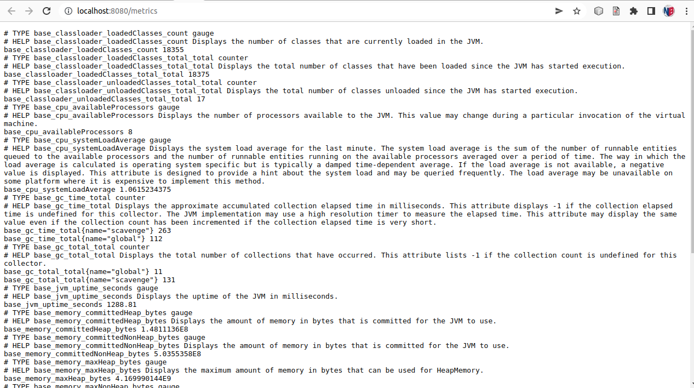
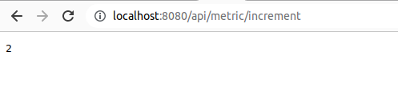
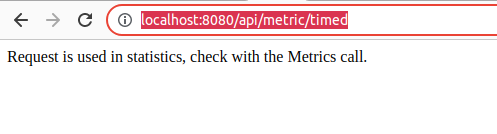

# 03.04 Metric

## Proyecto
[mongodbatlasdriver](https://github.com/avbravo/mongodbatlasdriver)


## Controller

```
import org.eclipse.microprofile.metrics.Counter;
import org.eclipse.microprofile.metrics.MetricUnits;
import org.eclipse.microprofile.metrics.annotation.Gauge;
import org.eclipse.microprofile.metrics.annotation.Metric;
import org.eclipse.microprofile.metrics.annotation.Timed;

import javax.enterprise.context.ApplicationScoped;
import javax.inject.Inject;
import javax.ws.rs.GET;
import javax.ws.rs.Path;
import java.util.Random;

@Path("/metric")
@ApplicationScoped //Required for @Gauge
public class MetricController {

    @Inject
    @Metric(name = "endpoint_counter")

    private Counter counter;

    @Path("timed")
    @Timed(name = "timed-request")
    @GET
    public String timedRequest() {
        // Demo, not production style
        int wait = new Random().nextInt(1000);
        try {
            Thread.sleep(wait);
        } catch (InterruptedException e) {
            // Demo
            e.printStackTrace();
        }

        return "Request is used in statistics, check with the Metrics call.";
    }


    @Path("increment")
    @GET
    public long doIncrement() {
        counter.inc();
        return counter.getCount();
    }

    @Gauge(name = "counter_gauge", unit = MetricUnits.NONE)
    private long getCustomerCount() {
        return counter.getCount();
    }
}
```

## Al ejecutarlo
```
GET     /api/metric/increment
GET     /api/metric/timed

```
## En el navegador
```
http://localhost:8002/metrics

http://localhost:8002/api/metric/increment

http://localhost:8002/api/metric/timed

```

### Metrics


### Increment


### Time


