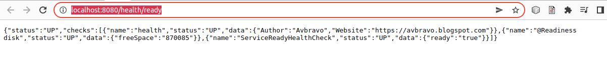
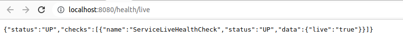

# 03.05 Health
Nos permite medir el estatus de ciertos componentes

Creamos clases que nos muestren diferentes tipos de información, si usted observa el endpoints, no se muestra para Healt,  los debemos invocar mediante
```
Desde el navegador  o Postman
http://localhost:8080/health/ready

http://localhost:8080/health/live


o mediante desde el shell

curl http://localhost:8080/health/ready

curl http://localhost:8080/health/live
```


## Clases


### ServiceLiveHealthCheck.java
```
import org.eclipse.microprofile.health.HealthCheck;
import org.eclipse.microprofile.health.HealthCheckResponse;
import org.eclipse.microprofile.health.Liveness;

import javax.enterprise.context.ApplicationScoped;

@Liveness
@ApplicationScoped
public class ServiceLiveHealthCheck implements HealthCheck {

    @Override
    public HealthCheckResponse call() {

        return HealthCheckResponse.named(ServiceLiveHealthCheck.class.getSimpleName()).withData("live",true).up().build();

    }
}

```

### ServiceReadyHealthCheck.java

```
import org.eclipse.microprofile.health.HealthCheck;
import org.eclipse.microprofile.health.HealthCheckResponse;
import org.eclipse.microprofile.health.Readiness;

import javax.enterprise.context.ApplicationScoped;

@Readiness
@ApplicationScoped
public class ServiceReadyHealthCheck implements HealthCheck {

    @Override
    public HealthCheckResponse call() {

        return HealthCheckResponse.named(ServiceReadyHealthCheck.class.getSimpleName()).withData("ready",true).up().build();

    }
}

```
### CheckAuthor.java

```
import javax.enterprise.context.ApplicationScoped;
import org.eclipse.microprofile.health.HealthCheck;
import org.eclipse.microprofile.health.HealthCheckResponse;
import org.eclipse.microprofile.health.Readiness;

/**
 *
 * @author avbravo
 */
@Readiness
@ApplicationScoped
public class CheckAuthor implements HealthCheck {

    @Override
    public HealthCheckResponse call() {
        return HealthCheckResponse.named("health")
                .up()
                .withData("Author", "Avbravo")
                .withData("Website", "https://avbravo.blogspot.com")
                .build();
    }

}
```
### CheckDiskspace.java
```
import java.io.File;
import javax.enterprise.context.ApplicationScoped;
import org.eclipse.microprofile.health.HealthCheck;
import org.eclipse.microprofile.health.HealthCheckResponse;
import org.eclipse.microprofile.health.Readiness;

/**
 *
 * @author avbravo
 */
@Readiness
@ApplicationScoped
public class CheckDiskspace implements HealthCheck {

    private static final String readinessCheck = "@Readiness Disk Check";
    File file = new File("/");
    long freeSpace = file.getFreeSpace() / 1024 / 1024;

    @Override
    public HealthCheckResponse call() {
        return HealthCheckResponse.named("@Readiness disk")
                .withData("freeSpace", freeSpace)
                .up()
                .build();

    }
}
```

## Ready


## Livenes
