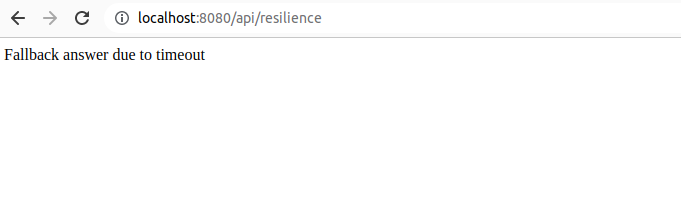

# Fault Tolerance

Permite hacer pruebas de tolerancia sobre la aplicacion

## ResilienceController.java

```
package com.avbravo.mongodbatlasdriver.faultolerance;

import org.eclipse.microprofile.faulttolerance.Fallback;
import org.eclipse.microprofile.faulttolerance.Timeout;

import javax.enterprise.context.ApplicationScoped;
import javax.ws.rs.GET;
import javax.ws.rs.Path;

@Path("/resilience")
@ApplicationScoped
public class ResilienceController {

    @Fallback(fallbackMethod = "fallback") // better use FallbackHandler
    @Timeout(500)
    @GET
    public String checkTimeout() {
        try {
            Thread.sleep(700L);
        } catch (InterruptedException e) {
            //
        }
        return "Never from normal processing";
    }

    public String fallback() {
        return "Fallback answer due to timeout";
    }
}
```

Al ejecutar el prpyecto


Payara Micro URLs:
http://[fe80:0:0:0:a8df:74ff:fe7f:e49c%vethe082586]:8080/
```
'ROOT' REST Endpoints:
GET     /api/application.wadl
GET     /api/country
POST    /api/country
DELETE  /api/country/{id}
GET     /api/country/{id}
GET     /api/hello
GET     /api/metric/increment
GET     /api/metric/timed
GET     /api/openapi-ui
GET     /api/openapi-ui/favicon-{size}.png
GET     /api/openapi-ui/index.html
GET     /api/openapi-ui/logo.png
GET     /api/openapi-ui/style.css
GET     /api/resilience
GET     /api/{path: webjars/.*}
GET     /openapi/
GET     /openapi/application.wadl
```
Podemos ver que el enpoint /api/resilence
nos devolvera el resutado

## Desde el navegador
