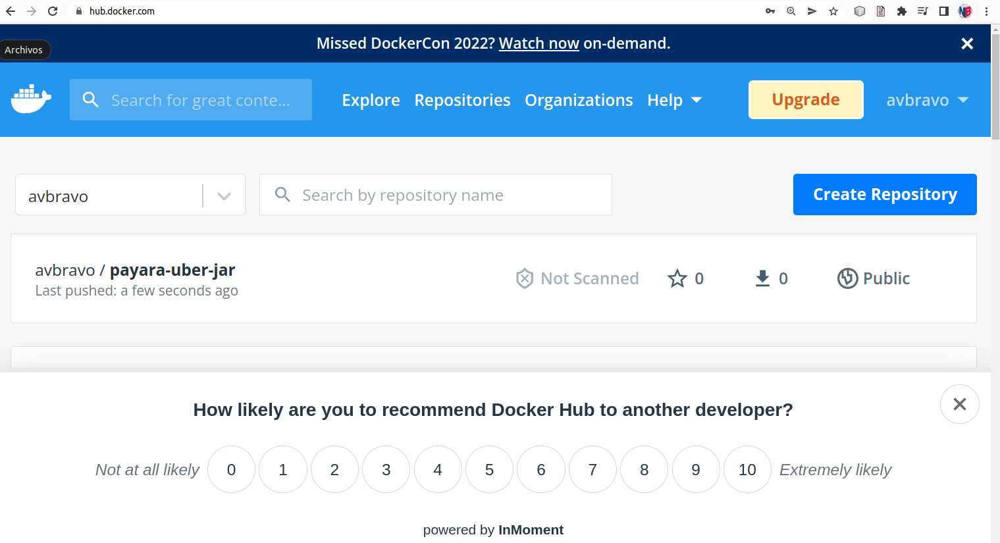

# 08.02 Subir imagen a docker hub

Debemos tener una cueenta creada en dockerhub

## subirlo a docker-hub

Login docker
```
docker login
```

renombrar la imagen a username/imagen:version
```
docker tag payara-uber-jar avbravo/payara-uber-jar:v1 
```

subir la imagen
```
docker push avbravo/payara-uber-jar:v1
```


Ingresar al sitio de docker hub aparece la imagen publicada



## Borrar las imagenes locales


## Instalar desde docker-hub
```
docker run -p 8080:8080 avbravo/payara-uber-jar:v1
```

## ingresar al navegador
Openapi
```
http://localhost:8080/openapi
```

province
```

http://localhost:8080/api/province/findall
```
