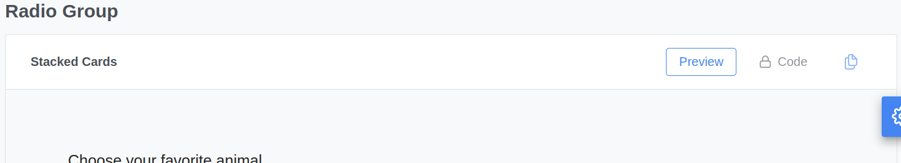
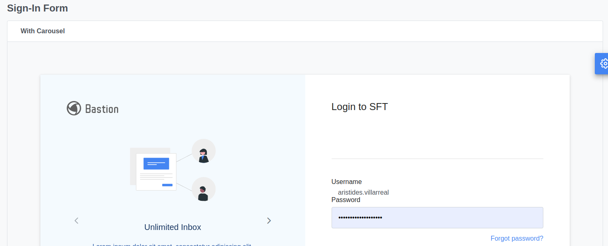
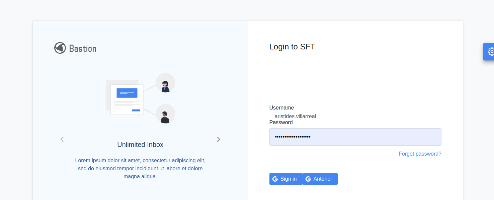

# Configurar PrimeBlocks

0. Clonar el proyecto primejmoordbcore
[https://github.com/avbravo/primejmoordb.git](https://github.com/avbravo/primejmoordb.git)


Proyecto que implementa los componentes basado en primejmoordb es 
**sft**
[https://github.com/avbravo/sft.git](https://github.com/avbravo/sft.git)

editar
1. pom.xml
agregue en <build>
```xml

           <!--
Blocks
            -->
            <resources>
                <resource>
                    <directory>src/main/resources</directory>
                    <filtering>true</filtering>
                </resource>
                <resource>
                    <directory>${basedir}/src/main/webapp/WEB-INF</directory>
                    <includes>
                        <include>web.xml</include>
                    </includes>
                    <filtering>true</filtering>
                    <targetPath>${project.build.directory}</targetPath>
                </resource>
            </resources>
```


# 2 copiar
WEB-INF 

- config.xhtml
- faces-config.xml --> cambiar el nombre
- template.xhtml
- topbar.xhtml
- web.xml


---


# 3. Quitar los tabs que dicen Preview., Code y el boton copiar



En Web-Pages/resources/primeblocks/
encontrara blocViewer.xhtml

Proceda a comentar las secciones para que no aparezcan esos botones, el resultado final es como se muestra acontinuación.
 
```
<?xml version = "1.0" encoding = "UTF-8"?>
<!DOCTYPE html PUBLIC "-//W3C//DTD XHTML 1.0 Transitional//EN"
        "http://www.w3.org/TR/xhtml1/DTD/xhtml1-transitional.dtd">

<html xmlns = "http://www.w3.org/1999/xhtml"
      xmlns:h = "http://java.sun.com/jsf/html"
      xmlns:ui="http://java.sun.com/jsf/facelets"
      xmlns:f = "http://java.sun.com/jsf/core"
      xmlns:p="http://primefaces.org/ui"
      xmlns:composite = "http://java.sun.com/jsf/composite">

<composite:interface componentType="BlockViewer">
  <composite:attribute name = "header" type="java.lang.String" />
  <composite:attribute name = "free" type="java.lang.Boolean" default="false" />
  <composite:attribute name = "newFeature" type="java.lang.Boolean" default="false" />
  <composite:attribute name = "containerClass" type="java.lang.String" />
  <composite:attribute name = "previewStyle" type="java.lang.String" />
  <composite:attribute name = "code" type="java.lang.String" />
</composite:interface>

<composite:implementation>
  <h:form id="blockViewerForm">
    <p:remoteCommand name="#{cc.clientId}_code" update=":#{cc.clientId}:blockViewerForm" action="#{cc.change2CodeMode}" oncomplete="Prism.highlightAll();"/>
    <p:remoteCommand name="#{cc.clientId}_preview" update=":#{cc.clientId}:blockViewerForm" action="#{cc.change2PreviewMode}" oncomplete="Prism.highlightAll();"/>

    <div id="blockSection" class="block-section">
      <div class="block-header">
        <span class="block-title">
          <span>#{cc.attrs.header}</span>
          <ui:fragment rendered="#{cc.attrs.free}">
            <span class="badge-free">Free</span>
          </ui:fragment>
          <ui:fragment rendered="#{cc.attrs.newFeature}">
            <span class="badge-new">New</span>
          </ui:fragment>
        </span>
        <div class="block-actions">
          <!--<a tabindex="0" class="#{!cc.codeMode ? 'block-action-active' : ''}" onclick="#{cc.clientId}_preview()"><span>Preview</span></a>-->
<!--          <a tabindex="0" class="#{cc.codeMode ? 'block-action-active' : ''} #{!cc.attrs.free and app.productionEnvironment ? 'block-action-disabled' : ''}"
             onclick="#{cc.clientId}_code()">
            <ui:fragment rendered="#{!cc.attrs.free and app.productionEnvironment}">
              <i class="pi pi-lock" />
            </ui:fragment>
            <span>Code</span>
          </a>-->
          <ui:fragment rendered="#{cc.attrs.free or !app.productionEnvironment}">
            <p:remoteCommand name="#{cc.clientId}_copyCode" action="#{app.copyCode(cc.attrs.code)}"/>
<!--            <a tabindex="0" class="block-action-copy" data-tooltip="Copied to clipboard" onclick="#{cc.clientId}_copyCode()" >
              <i class="pi pi-copy"/>
            </a>-->
          </ui:fragment>
          <ui:fragment rendered="#{!cc.attrs.free and app.productionEnvironment}">
            <a tabindex="0" class="block-action-copy block-action-disabled">
              <i class="pi pi-copy"/>
            </a>
          </ui:fragment>
        </div>
      </div>
      <div id="blockContent" class="block-content">
        <ui:fragment rendered="#{!cc.codeMode}">
          <div class="block-content-active #{cc.attrs.containerClass}" style="#{cc.attrs.previewStyle}">
            <composite:insertChildren/>
          </div>
        </ui:fragment>
        <ui:fragment rendered="#{cc.codeMode}">
          <div class="block-code block-content-active" >
            <ui:fragment rendered="#{cc.attrs.free or !app.productionEnvironment}">
              <pre class=" language-markup"><code class=" language-markup">#{cc.attrs.code}</code></pre>
            </ui:fragment>
          </div>
        </ui:fragment>
      </div>
    </div>
  </h:form>
</composite:implementation>
</html>

```

Quedaria



## Para cambiar los textos del lgin


Revise la clase **SignInView..java** alli contiene los mensajes e imagenes
estas se pueden obtener de archivo de propiedades


## <pb:blockViewer No usar en los formularios
En los formularios debe eliminar el uso de <pb:blockViewer.
Ya que este componentesolo es para el tab de presentación de PrimeBlocks y si se usa impide que los eventos de los botones se ejecutem

