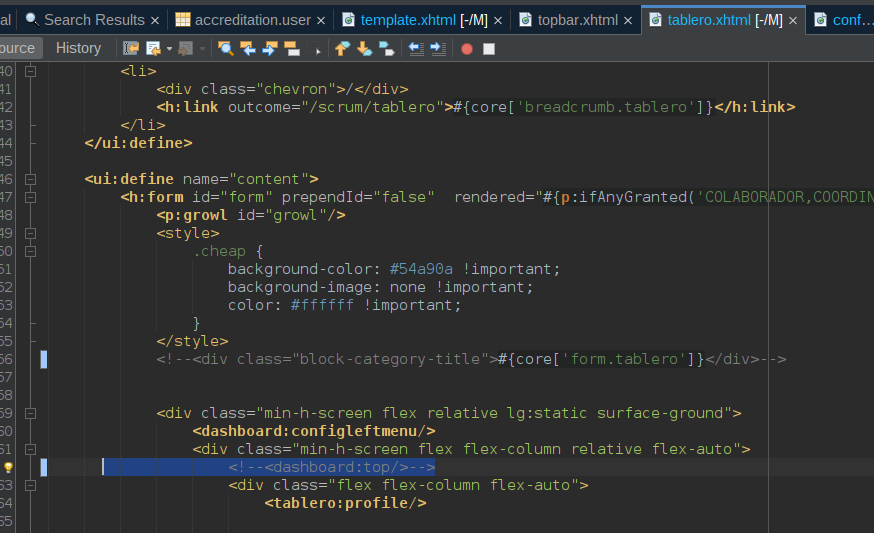

# 1. Template

## Pagina Principal


- home.xhtml: Contiene todos los componentes de la plantilla
- para el proyecto se usa login.xhtml
- configure el web.xml

---

Agregue al template en el </h:head>

```xml
 
        <f:view locale="#{jmoordbLanguajes.locale !=null?jmoordbLanguajes.locale:'es'}">
        </f:view>
        <f:loadBundle basename="com.properties.messages" var="msg" />
        <f:loadBundle basename="com.properties.configuration" var="conf" />
        <f:loadBundle basename="com.jmoordbutilfaces.properties.core" var="core" />
        
```


---
## Quitar la barra superior del template

Edite el archivo microprofile-config.properties

```
## Template
showTopBarInTemplate = false

## Mostrar los textos en menu izquierdo
showTextLeftMenu = false

```

En template.xhtml se valida si esta o no habilitado

```
   <c:if test="#{loginFaces.showTopBarInTemplate.get() eq true}">
                <ui:include src="./topbar.xhtml" />
    </c:if>

```


-----


### config.xhtml 
se quito el update :topbar-logo

### template.xhtml
comentar
<!--<ui:include src="./topbar.xhtml" />-->

### tablero comentar <dashboard:top>
el titulo form.


### revisar si lo renderiza en movil



### Cambiar fuentes 

* Fuente

* datatable

* dialogo

```css
style type="text/css">
            .ui-analog-clock {
                width: 50px;
            }
        </style>
        
        <!-- 
        Cambia el tamaño de letra en toda la aplicación
       
        -->
          <style type="text/css">
       .ui-widget,
.ui-widget .ui-widget {
    font-size: 15px !important;
}
        </style>
        <!-- 
        Cambia el tamaño de dialogo
       
        -->
          <style type="text/css">
.ui-dialog .ui-dialog-content .ui-datatable table {
    width: auto;
    padding: 0px !important;
}
        </style>
        
         <!-- 
        Cambia el tamaño de datatable
       
        -->
        <style type="text/css">
   .ui-datatable,
   .ui-datatable .ui-datatable-tablewrapper table {
        font-size: 15px !important;
   }
            
   /* For Paginator */
   .ui-datatable .ui-paginator .ui-paginator-first, 
   .ui-datatable .ui-paginator .ui-paginator-prev, 
   .ui-datatable .ui-paginator .ui-paginator-pages .ui-paginator-page, 
   .ui-datatable .ui-paginator .ui-paginator-next, 
   .ui-datatable .ui-paginator .ui-paginator-last, 
   .ui-datatable .ui-paginator .ui-paginator-rpp-options {
        font-size: 15px !important;
   }
            
   .ui-datatable .ui-paginator .ui-paginator-current {
       font-size: 14px !important;
   }
 </style>


``