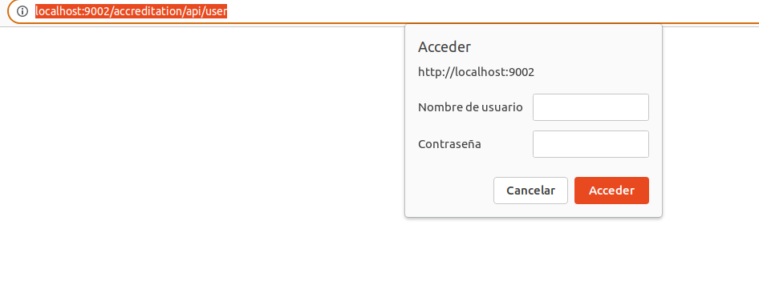
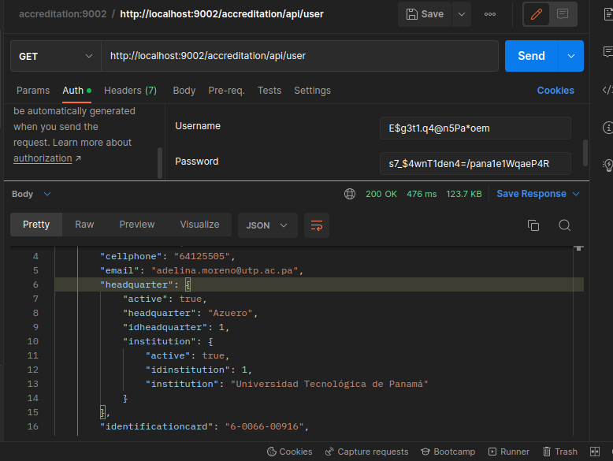

# 9. Seguridad de Microservicios Accreditation

Proyecto: accrediation
[https://github.com/avbravo/accreditation.git](https://github.com/avbravo/accreditation.git)

Para establecer la seguridad del Microservicio en el servidor seguimos estos pasos

## 9.0. Agregar JmoordbEncripter

```xml

   <version.jmoordbencripter>1.0</version.jmoordbencripter>
```

Agregar dependencia
```xml
  <dependency>
    <groupId>com.github.avbravo</groupId>
    <artifactId>jmoordbencripter</artifactId>
    <version>${version.jmoordbencripter}</version>
</dependency>
```


## 9.1 Encriptar

```java

@Path("encripter")
public class EncripterController {
    public JWTToken encripter(@QueryParam("subject") final String subject,  @QueryParam("password") final String password,
            @QueryParam("group") final String group,  @QueryParam("expirationDays") final int expirationDays,  @QueryParam("secretKey") final String secretKey
    ) {
        JWTToken jWTToken = new JWTToken();
        String token = "";
        try {
            String encryptedString = Encryptor.encrypt(password, secretKey);

            JWTEntity jWTEntity = new JWTEntity.Builder()
                    .subject(subject)// vacio o el nombre del subject
                    .group(group) // vacio o el nombre de grupo
                    .password(encryptedString) // password
                    .expirationDays(expirationDays) // tiempo de expiracion en dias 90
                    .secretKey(secretKey) // llave secreta
                    .build();

            token = JWTEncrypter.encrypt(jWTEntity);

            jWTToken.setToken(token);      

        } catch (Exception ex) {
            Logger.getLogger(EncripterController.class.getName()).log(Level.SEVERE, null, ex);
        }
        return jWTToken;

    }


    @Path("decript")
    @GET
    @Produces({MediaType.APPLICATION_XML, MediaType.APPLICATION_JSON})

    public JWTEntity decript(@QueryParam("token") final String token,
            @QueryParam("secretKey") final String secretKey) {
        JWTEntity jWTEntity = new JWTEntity();
        try {
            jWTEntity = JWTEncrypter.decrypt(token, secretKey);
           
            String decryptedString = Encryptor.decrypt(jWTEntity.getPassword(), secretKey);
          
            jWTEntity.setPassword(decryptedString);
           
        } catch (Exception e) {
            System.out.println("decript() " + e.getLocalizedMessage());
        }

        return jWTEntity;
    }

```

## Seguridad mediante Microprofile-config.properties

En este caso mostraremos como validar la seguridad mediante un usuario y password almacenado en el archivo microprofile-config.properties


## User y Password

Las credenciales que usaremos son 


```xml

user: E$g3t1.q4@n5Pa*oem
password: s7_$4wnT1den4=/pana1e1WqaeP4R

secretKey = SCox1jmWrkma$*opne2Amwz
```

Al Encriptados quedan los valores

```xml
user: iJYxBAmcCfr016hVry8MCKS0xA4S6SExizJM442E+18=
password: 2tbHQCWpe69CvNbAAmCXcJxTFEQtjRxXNA5yIYz7lbE=

```

### microprofile-config.properties

Agregar un usuario y password encriptado

```xml
#-- Security Microprofile
userSecurity=iJYxBAmcCfr016hVry8MCKS0xA4S6SExizJM442E+18=
passwordSecurity=2tbHQCWpe69CvNbAAmCXcJxTFEQtjRxXNA5yIYz7lbE=

```


### Crear la clase AuthentificactionIdentityStore  
- Genere credenciales para un usuario y almacenelo en microprofile-config.properties
- Aqui usted puede insertar una base datos donde se almacenen los user y password de credenciales 
```java
@ApplicationScoped
public class AuthentificactionIdentityStore implements IdentityStore {
   

// <editor-fold defaultstate="collapsed" fields ">
    String userAutentification;
    String passwordAutentification;
    String secretKey="SCox1jmWrkma$*opne2Amwz";
// </editor-fold>
    // <editor-fold defaultstate="collapsed" desc="@Inject">
    
//     @Inject
//           LoggerServices loggerServices;
// </editor-fold>

    
    // <editor-fold defaultstate="collapsed" desc="Microprofile Config">
    @Inject
    private Config config;
    @Inject
    @ConfigProperty(name = "userSecurity", defaultValue = "")
    private String userSecurity;
    @Inject
    @ConfigProperty(name = "passwordSecurity", defaultValue = "")
    private String passwordSecurity;


    // <editor-fold defaultstate="collapsed" desc="init">
    @PostConstruct
    public void init() {
        try {
            

        } catch (Exception e) {
        }

    }

   
    // </editor-fold> 
     // <editor-fold defaultstate="collapsed" desc="CredentialValidationResult validate(UsernamePasswordCredential usernamePasswordCredential)">
    public CredentialValidationResult validate(UsernamePasswordCredential usernamePasswordCredential) {
        try {
            
            /**
             * Desencripta el usuario y password que viene del archivo microprofile-config
             * y lo compara con el que viene del cliente.
             */

            userAutentification = Encryptor.decrypt(userSecurity, secretKey);
            passwordAutentification = Encryptor.decrypt(passwordSecurity,secretKey);
         
            if (usernamePasswordCredential.compareTo(userAutentification, passwordAutentification)) {
         
                return new CredentialValidationResult(userAutentification, new HashSet<>(asList("admin", "testing")));
            }else{
                System.out.println("No coinciden las credenciuales");
            }
        } catch (Exception e) {

             System.out.println("validate() "+e.getLocalizedMessage());
           
        }

        return INVALID_RESULT;
    }
    // </editor-fold>
}


```


### Enpoint principal
En el endpoint principal
colocar

```java
@BasicAuthenticationMechanismDefinition(realmName = "admin-realm")
```
Quedaria

```java
@ApplicationPath("api")
@OpenAPIDefinition(info = @Info(
        title = "RESTful API",
        description = "capitulo 02",
        version = "1.0.0-Snapshot",
        contact = @Contact(
                name = "AVbravo",
                email = "avbravo@gmail.com",
                url = "https://avbravo.blogspot.com")
),
        servers = {
            @Server(url = "http://localhost:8080/", description = "Local Development Server "),}
)
@BasicAuthenticationMechanismDefinition(realmName = "admin-realm")
public class JakartaRestConfiguration extends Application {
    
}

````
####
En los Controller y Metodos que quiera validar aplique la seguridad indicando los roles permitidos.
A los que no se aplica no es necesario usar credenciales de acceso
```java
    @RolesAllowed({"admin"})

```

### WEB-XML

Agregar los roles de seguridad al archivo web.xml
```java
 <security-constraint>
        <web-resource-collection>
            <web-resource-name>Application pages</web-resource-name>
            <url-pattern>/faces/pages/*</url-pattern>
        </web-resource-collection>
        <auth-constraint>
            <role-name>admin</role-name>
            <role-name>testing</role-name>
        </auth-constraint>
    </security-constraint>
    <security-role>
        <role-name>admin</role-name>
    </security-role>
    <security-role>
        <role-name>testing</role-name>
    </security-role>
    

```

### Conectarse desde el navegador

Entramos al navegador, 
[http://localhost:9002/accreditation/api/user](http://localhost:9002/accreditation/api/user)
nos pedira  usuario y password


Utilizar

```xml

user: E$g3t1.q4@n5Pa*oem
password: s7_$4wnT1den4=/pana1e1WqaeP4R


```


#### Con Postman
Debemos indicar en el Tab **Autorization** Basic Autentification
y especificar el usar y password.

```xml

user: E$g3t1.q4@n5Pa*oem
password: s7_$4wnT1den4=/pana1e1WqaeP4R


```




### Puerto
Este microservicio se indico que se ejecute en el puerto 9002 en el archivo pom.xml

```xml

<plugin>
                <groupId>fish.payara.maven.plugins</groupId>
                <artifactId>payara-micro-maven-plugin</artifactId>
                <configuration>
                    <payaraVersion>${version.payara}</payaraVersion>
                    <deployWar>false</deployWar>
                    <commandLineOptions>
                        <option>
                            <key>--autoBindHttp</key>
                        </option>
       
                        <!--puerto 9002 -->
                        <option>
                           <key>--port</key>
                           <value>9002</value>
                       </option>
                        <option>
                            <key>--deploy</key>
                            <value>${project.build.directory}/${project.build.finalName}</value>
                        </option>
                    </commandLineOptions>
                </configuration>
                <version>1.4.0</version>
            </plugin>
            

```
