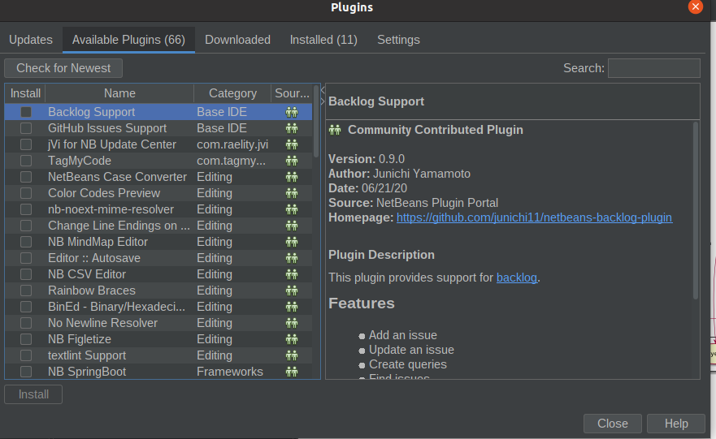
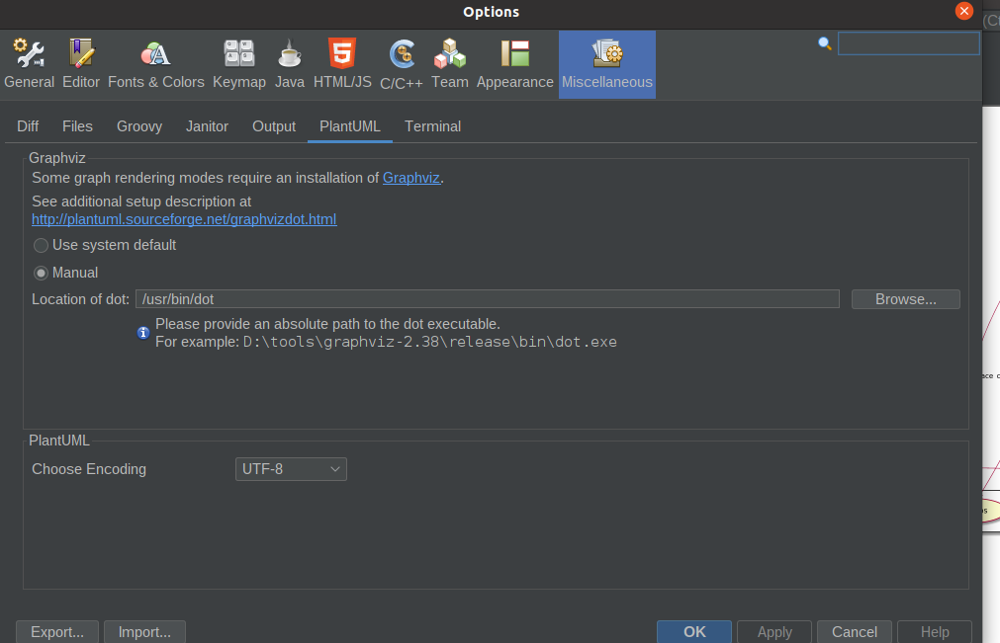
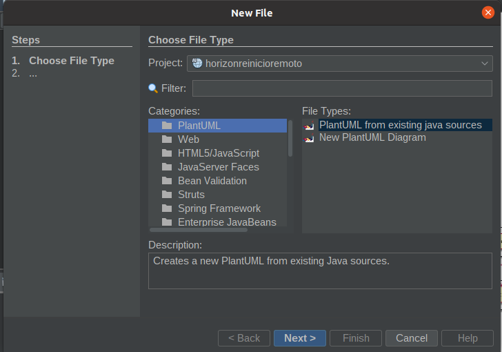
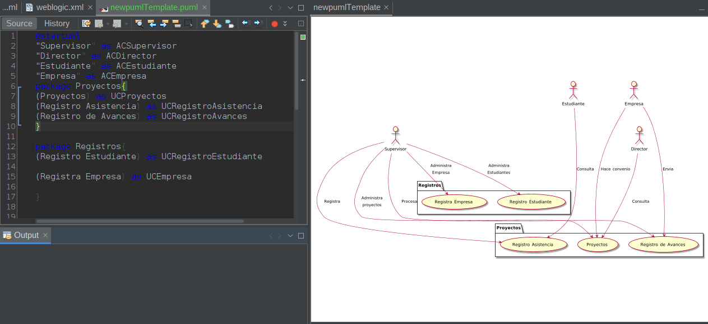

 # 14. PlantUML


# PlantUML en NetBeans
PlantUML en NetBeans
​
[Sitio oficial de PlanetUML](https://plantuml.com/es/)
​
​​
Instalar [graphviz](https://graphviz.org/download/) en Ubuntu

```
sudo apt install graphviz
```

## NetBeans Plugins

[Plugin](https://sourceforge.net/projects/plantumlnb/)
Instalar el plugin de PlantUML desde los repositorios oficiales
​
NetBeans --> Tools --> Plugins



Una vez instalado
Ingresar NetBeans --> Tools --> Option --> Miscelanius




indicar configuración Manual y agregar
```
/usr/bin/dot
```

Si no sabemos donde esta instalado usamos desde el terminal de Ubuntu
whereis dot
Para usarlo abrir un proyecto y seleccionar File --> New --> PlantUML
y nos permite crear un diagrama de las clases existentes o uno nuevo




Contamos con el diagrama y la vista

