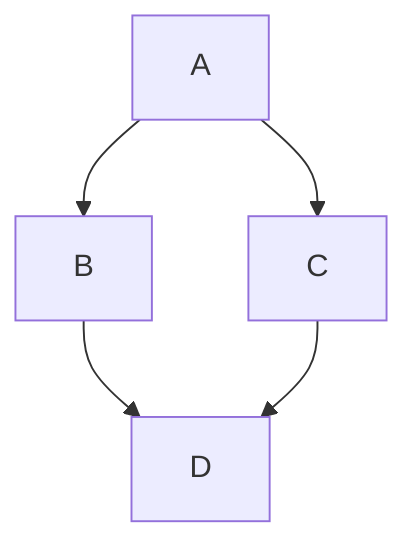

# Microservicios

Debian 12
Virtual Box

# Requisitos
1. Instalar docker
2. Instalar docker-compose
3. Crear una red para docker
   ```shell

   ```
   


## nswitch
desabilita los hots los dns

Copia el archivo de script


/etc/host

# Reverse_proxy se encarga del redireccionamiento
indica el limite de archivos

# sincronia se usa redis
se puede escuchar en el cliente, maquina de dominio virtual

## nswitch
desabilita los hots los dns

Copia el archivo de script


/etc/host

# Reverse_proxy se encarga del redireccionamiento
indica el limite de archivos

# sincronia se usa redis
se puede escuchar en el cliente, maquina de dominio virtual


CAS

Apereo CAS



