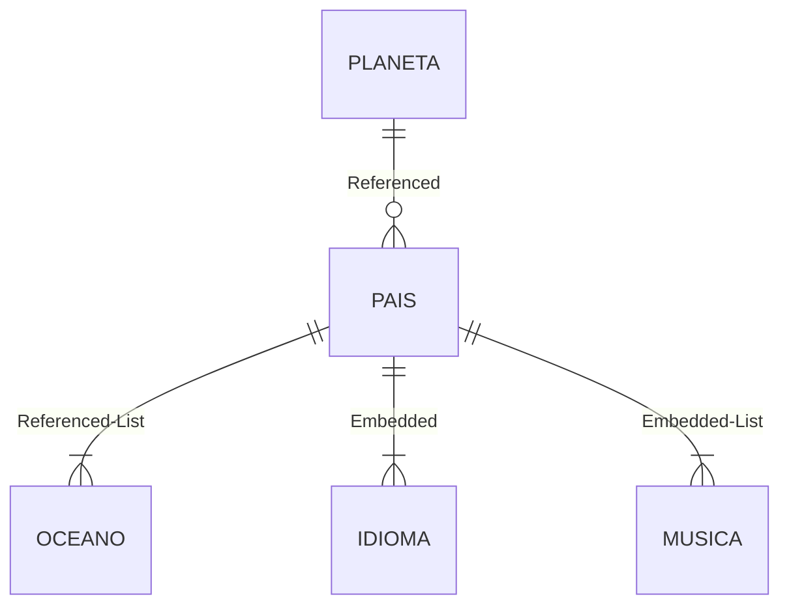
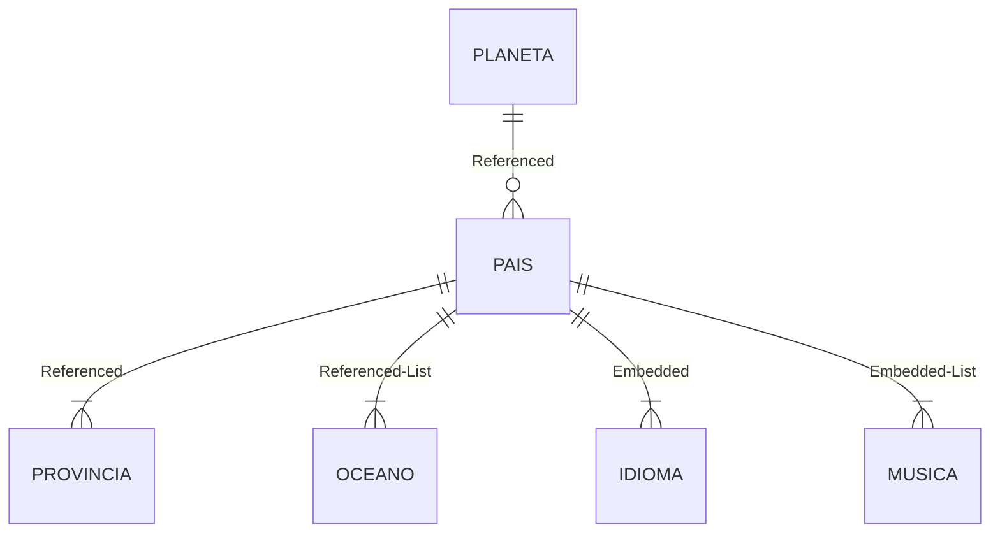
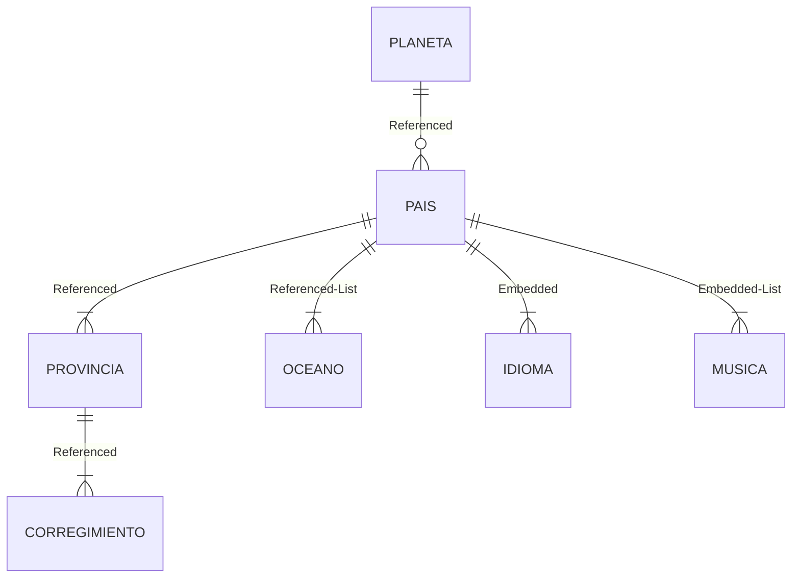
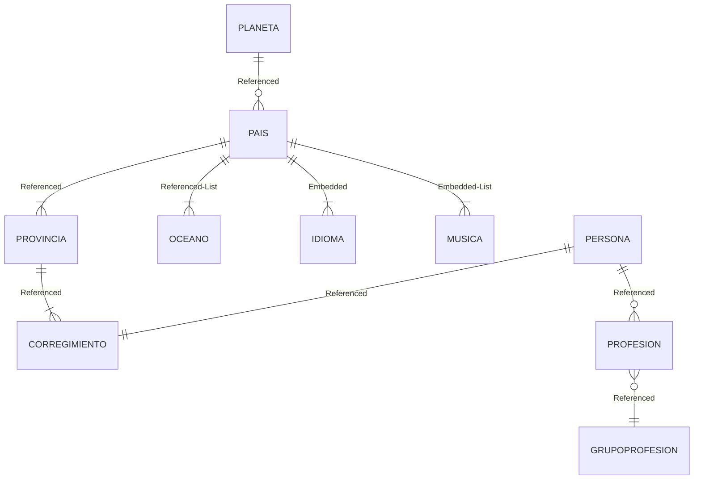

01.00.05 Modelos datos mongoDB.md
```mermaid
erDiagram
    PLANETA ||--o{ PAIS : Referenced
    PAIS ||--|{ PROVINCIA : Referenced
    PAIS ||--|{ OCEANO : Referenced-List 
    PAIS ||--|{ IDIOMA : Embedded
    PAIS ||--|{ MUSICA : Embedded-List
    PROVINCIA ||--|{ CORREGIMIENTO : Referenced
    PERSONA ||--|| CORREGIMIENTO : Referenced
    PERSONA ||--o{ PROFESION  : Referenced
    PROFESION }o--|| GRUPOPROFESION : Referenced


# 01.01.02 Collections
## planeta
```json
{ "_id" : { "$oid" : "62bdc837bd083f1d60193f15" }, "idplaneta" : "tr", "planeta" : "Tierra" }
{ "_id" : { "$oid" : "62bdc86bbd083f1d60193f16" }, "idplaneta" : "ma", "planeta" : "Marte" }
```

## oceano
```json
{ "_id" : { "$oid" : "62bf2b8a3f94281a78781f5e" }, "idoceano" : "p", "oceano" : "Pacífico" }
{ "_id" : { "$oid" : "62bf2b9f3f94281a78781f5f" }, "idoceano" : "a", "oceano" : "Atlántico" }
{ "_id" : { "$oid" : "62bf2c123f94281a78781f60" }, "idoceano" : "i", "oceano" : "Indico" }
{ "_id" : { "$oid" : "62bf2c4c3f94281a78781f61" }, "idoceano" : "gar", "oceano" : "Oceano Glacial Artico" }
{ "_id" : { "$oid" : "62bf2c6f3f94281a78781f62" }, "idoceano" : "gan", "oceano" : "Oceano Glacial Antártico" }

```

## pais
```json
{ "_id" : { "$oid" : "62bdcd44bd083f1d60193f17" }, "idpais" : "pa", "pais" : "Panama", "idioma" : { "idioma" : "Español" }, "musica" : [{ "idmusica" : "reggae", "musica" : "Reggae" }, { "idmusica" : "tipico", "musica" : "Tipico" }], "planeta" : { "idplaneta" : "tr" }, "oceano" : [{ "idoceano" : "p" }, { "idoceano" : "a" }] }
{ "_id" : { "$oid" : "62bdcd63bd083f1d60193f18" }, "idpais" : "usa", "pais" : "Estados Unidos", "idioma" : { "idioma" : "English" }, "musica" : [{ "idmusica" : "rock", "musica" : "Rock" }, { "idmusica" : "metal", "musica" : "Metal" }], "planeta" : { "idplaneta" : "tr" }, "oceano" : [{ "idoceano" : "gar" }, { "idoceano" : "a" }] }

```

***
# Referencias de Nivel 1 (Pais)
A->B



## Ejecutar $lookup pais - planeta
```json
db.pais.aggregate(
[
  
   {
    $lookup:{
            from:"planeta",
            localField:"planeta.idplaneta",
            foreignField:"idplaneta",
            as:"planeta"
            }
    }
]
).pretty()
```

Genera
```json
{
        "_id" : ObjectId("62bdcd44bd083f1d60193f17"),
        "idpais" : "pa",
        "pais" : "Panama",
        "idioma" : {
                "idioma" : "Español"
        },
        "musica" : [
                {
                        "idmusica" : "reggae",
                        "musica" : "Reggae"
                },
                {
                        "idmusica" : "tipico",
                        "musica" : "Tipico"
                }
        ],
        "planeta" : [
                {
                        "_id" : ObjectId("62bdc837bd083f1d60193f15"),
                        "idplaneta" : "tr",
                        "planeta" : "Tierra"
                }
        ],
        "oceano" : [
                {
                        "idoceano" : "p"
                },
                {
                        "idoceano" : "a"
                }
        ]
}
{
        "_id" : ObjectId("62bdcd63bd083f1d60193f18"),
        "idpais" : "usa",
        "pais" : "Estados Unidos",
        "idioma" : {
                "idioma" : "English"
        },
        "musica" : [
                {
                        "idmusica" : "rock",
                        "musica" : "Rock"
                },
                {
                        "idmusica" : "metal",
                        "musica" : "Metal"
                }
        ],
        "planeta" : [
                {
                        "_id" : ObjectId("62bdc837bd083f1d60193f15"),
                        "idplaneta" : "tr",
                        "planeta" : "Tierra"
                }
        ],
        "oceano" : [
                {
                        "idoceano" : "gar"
                },
                {
                        "idoceano" : "a"
                }
        ]
}

```

***
## pais-planeta  y pais-oceano
Observe que oceano es una lista referenciada
```json
db.pais.aggregate(
[
  
   {
    $lookup:{
            from:"planeta",
            localField:"planeta.idplaneta",
            foreignField:"idplaneta",
            as:"planeta"
            }
    }
,
{ 
  $lookup:{
            from:"oceano",
            localField:"oceano.idoceano",
            foreignField:"idoceano",
            as:"oceano"
            }
  }

]
).pretty()
```

Resultado
Observe que se generan todos los ocenanos y no se produce un filtro adecuado.
```json
{                                                                                                                          
        "_id" : ObjectId("62bdcd44bd083f1d60193f17"),                                                                      
        "idpais" : "pa",                                                                                                   
        "pais" : "Panama",                                                                                                 
        "idioma" : {                                                                                                       
                "idioma" : "Español"                                                                                       
        },                                                                                                                 
        "musica" : [                                                                                                       
                {                                                                                                          
                        "idmusica" : "reggae",                                                                             
                        "musica" : "Reggae"                                                                                
                },                                                                                                         
                {
                        "idmusica" : "tipico",
                        "musica" : "Tipico"
                }
        ],
        "planeta" : [
                {
                        "_id" : ObjectId("62bdc837bd083f1d60193f15"),
                        "idplaneta" : "tr",
                        "planeta" : "Tierra"
                }
        ],
        "oceano" : [
                {
                        "_id" : ObjectId("62bf2b8a3f94281a78781f5e"),
                        "idoceano" : "p",
                        "oceano" : "Pacífico"
                },
                {
                        "_id" : ObjectId("62bf2b9f3f94281a78781f5f"),
                        "idoceano" : "a",
                        "oceano" : "Atlántico"
                }
        ]
}
{
        "_id" : ObjectId("62bdcd63bd083f1d60193f18"),
        "idpais" : "usa",
        "pais" : "Estados Unidos",
        "idioma" : {
                "idioma" : "English"
        },
        "musica" : [
                {
                        "idmusica" : "rock",
                        "musica" : "Rock"
                },
                {
                        "idmusica" : "metal",
                        "musica" : "Metal"
                }
        ],
        "planeta" : [
                {
                        "_id" : ObjectId("62bdc837bd083f1d60193f15"),
                        "idplaneta" : "tr",
                        "planeta" : "Tierra"
                }
        ],
        "oceano" : [
                {
                        "_id" : ObjectId("62bf2b9f3f94281a78781f5f"),
                        "idoceano" : "a",
                        "oceano" : "Atlántico"
                },
                {
                        "_id" : ObjectId("62bf2c4c3f94281a78781f61"),
                        "idoceano" : "gar",
                        "oceano" : "Oceano Glacial Artico"
                }
        ]
}

```

***
# Referencia de 2 Nivel (Provincia)
Lleva una referencia A->B->C  
                     A->B->D  
Donde el lookup que genera debe incluir la coleccion de segundo nivel B.C  



## Ejemplos
   provincia -->pais --> planeta
   provincia -->pais --> oceano
Observe que los aniados deben incluir pais.pleneta.idplaneta  
                                      pais.oceano.idoceano  
```json
db.provincia.aggregate(
[
  
   {
    $lookup:{
            from:"pais",
            localField:"pais.idpais",
            foreignField:"idpais",
            as:"pais"
            }
    }
,
{
    $lookup:{
            from:"planeta",
            localField:"pais.planeta.idplaneta",
            foreignField:"idplaneta",
            as:"planeta"
            }
    }
,
{ 
  $lookup:{
            from:"oceano",
            localField:"pais.oceano.idoceano",
            foreignField:"idoceano",
            as:"oceano"
            }
  }

]
).pretty()
```

Salida

```json
{
        "_id" : ObjectId("62c0f725038c520e952b9bee"),
        "idprovincia" : "7",
        "provincia" : "Los Santos",
        "pais" : [
                {
                        "_id" : ObjectId("62bdcd44bd083f1d60193f17"),
                        "idpais" : "pa",
                        "pais" : "Panama",
                        "idioma" : {
                                "idioma" : "Español"
                        },
                        "musica" : [
                                {
                                        "idmusica" : "reggae",
                                        "musica" : "Reggae"
                                },
                                {
                                        "idmusica" : "tipico",
                                        "musica" : "Tipico"
                                }
                        ],
                        "planeta" : {
                                "idplaneta" : "tr"
                        },
                        "oceano" : [
                                {
                                        "idoceano" : "p"
                                },
                                {
                                        "idoceano" : "a"
                                }
                        ]
                }
        ],
        "planeta" : [
                {
                        "_id" : ObjectId("62bdc837bd083f1d60193f15"),
                        "idplaneta" : "tr",
                        "planeta" : "Tierra"
                }
        ],
        "oceano" : [
                {
                        "_id" : ObjectId("62bf2b8a3f94281a78781f5e"),
                        "idoceano" : "p",
                        "oceano" : "Pacífico"
                },
                {
                        "_id" : ObjectId("62bf2b9f3f94281a78781f5f"),
                        "idoceano" : "a",
                        "oceano" : "Atlántico"
                }
        ]
}
{
        "_id" : ObjectId("62c0f768038c520e952b9bef"),
        "idprovincia" : "8",
        "provincia" : "Pensilvania",
        "pais" : [
                {
                        "_id" : ObjectId("62bdcd63bd083f1d60193f18"),
                        "idpais" : "usa",
                        "pais" : "Estados Unidos",
                        "idioma" : {
                                "idioma" : "English"
                        },
                        "musica" : [
                                {
                                        "idmusica" : "rock",
                                        "musica" : "Rock"
                                },
                                {
                                        "idmusica" : "metal",
                                        "musica" : "Metal"
                                }
                        ],
                        "planeta" : {
                                "idplaneta" : "tr"
                        },
                        "oceano" : [
                                {
                                        "idoceano" : "gar"
                                },
                                {
                                        "idoceano" : "a"
                                }
                        ]
                }
        ],
        "planeta" : [
                {
                        "_id" : ObjectId("62bdc837bd083f1d60193f15"),
                        "idplaneta" : "tr",
                        "planeta" : "Tierra"
                }
        ],
        "oceano" : [
                {
                        "_id" : ObjectId("62bf2b9f3f94281a78781f5f"),
                        "idoceano" : "a",
                        "oceano" : "Atlántico"
                },
                {
                        "_id" : ObjectId("62bf2c4c3f94281a78781f61"),
                        "idoceano" : "gar",
                        "oceano" : "Oceano Glacial Artico"
                }
        ]
}
```

***
# Referencias de Nivel 3 (Corregimiento)



SI CADA NIVEL AÑADE HAY QUE AGREGAR UN CAMPO DE LA REFERENCIA EN E LOOKUPSUPPLIER PASARLE LA CLASE ANTERIOR


***
# Referencias de Nivel 4 (Persona)

