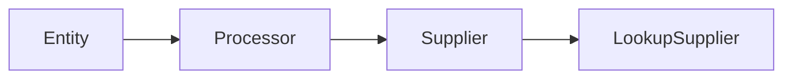
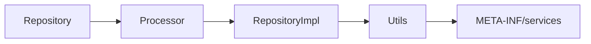
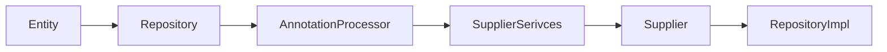
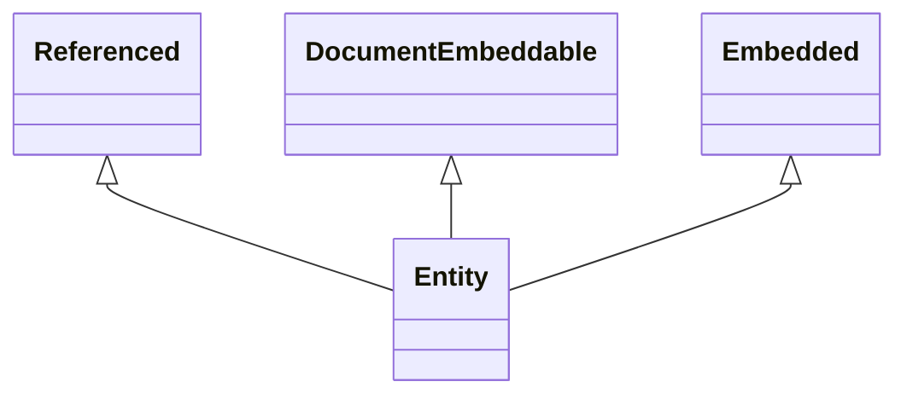
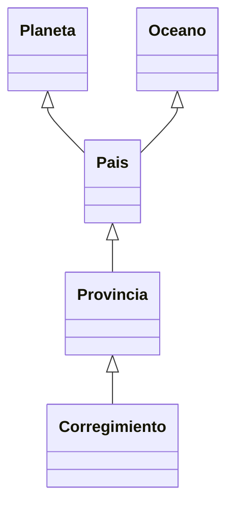

# 01.00.04 Como programar el processor.md

Etapas
Lectura -->Validación de Anotaciones--> Generacion

Se usa la clase RepositoryDataSupplier para devolver los parámetros de @Repository


## Documentacion
- Muestra como procesar java Annotation Processor  
[JAVA ANNOTATION PROCESSORS – AN INTRODUCTION](https://cloudogu.com/en/blog/Java-Annotation-Processors_1-Intro)

- Muestra como generar codigo  

[Annotation processing during compilation time: Generating source code](http://hauchee.blogspot.com/2016/01/compile-time-annotation-processing-code-generation.html?m=1)

@Target(ElementType.FIELD) // Target to field element only
@Retention(RetentionPolicy.SOURCE) // Source level retention policy
public @interface Pojo {
```java    
    /**
     * The types of the fields in this POJO class. 
     * Each type has a corresponding name specified in 'fieldNames' attribute.
     */
    Class[] fieldTypes() default {};
    
    /**
     * The names of the fields in this POJO class. 
     * Each name has a corresponding type specified in 'fieldTypes' attribute.
     */
    String[] fieldNames() default {};
}
```

```java
    
    private String id; // VariableElement
    
    @Pojo( // AnnotationMirror
        // ExecutableElement:AnnotationValue pairs    
        fieldNames = {"name", "price"}, 
        fieldTypes = {String.class, Double.class}
    )
    private Game game; // VariableElement
```
- Muestra como generar anotaciones
[Generate Code using Java Annotation Processor](https://www.logicbig.com/tutorials/core-java-tutorial/java-se-annotation-processing-api/annotation-processor-generate-code.html)


***
## Diagramas




## Pasos:
- Crear anotación
- Crear clases de utilidades
- Crear el processor
- Registrarlo en META-INF/services
- Leer las entidades y sus referencias internas
- Leer las anotaciones


## videos
Muestra como desarrollar con jmoord
[manual del desarrollador de jmoordb core](https://www.youtube.com/watch?v=Us23rWwLAAA)

# Procesar @Repository.java
Necesitamos las clases
```java
RepositoryProcessor --> RepositoryAnalizer --> { 
                                                @Query  --: (QueryAnalizer --> QueryAnalizerUtil),  
                                                @Lookup --: (LookupAnalizer ),
                                                
                                                }  
                                                
```                                                
```java
 Query query = executableElement.getAnnotation(Query.class);
            if (query != null) {
               
                if (!QueryAnalizer.analizer(query, element, executableElement)) {
                    messager.printMessage(Diagnostic.Kind.ERROR, QueryAnalizer.getMessage(), element);
                }
 }
 ```

Proyecto
[jmoordb-core-processor-javadriver](https://github.com/avbravo/jmoordb-core-processor-javadriver.git)
***
## Repository
- Debe injectar su correspondiente EntitySupplier
```java

```

***
## Supplier
- Son de alcance @RequestScoped
- Debe llevar un solo get()
- Analiza @Referenced para generar las consultas externas
- 

***
## Diagramas



## Pasos:
- Crear anotación
- Crear clases de utilidades
- Crear el processor
- Registrarlo en META-INF/services
- Leer las entidades y sus referencias internas
- Leer las anotaciones

# Anotaciones


## Ejemplo



