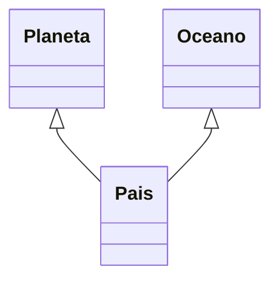

# Supplier
- Es una clase que se generara al procesar la anotación @Entity
- Soporta valores de tipo simple, List<> , Set<>, Stream<>
- Su función es obtener los datos de un document y convertirlo al entity correspondiente
- Es invocado desde Repository
- Cuando tiene Embebidos el busca internamente
- Cuando un @Referenced tiene Referenciados se inyecta las Referencias y se buscan internamente
- Un @Referecenced con TypeReferenced == EMBEDDED indica que aunque este referenciado debe buscarlo internamente.
- Descompone cada entidad asignando cada atributo
- Para los Referenciados el Framework Inyecta los Repositorios correspondientes a cada entidad y realiza las busquedas.
## Modelo

***
- Definir atributos embebidos y referenciados
- Observe que edificio esta definido como @Referenced pero el tipo de referencia 
es EMBEDDED, esto indica que el framework no buscará en la colección referenciada 
EdificioRepository si no que lo cargara como un embebido local. Recuerde que el 
framework almacena todas las referencias como documentos embebidos y permite que
 usted especifuque si desea hacer una busqueda referenciada o lo utiliza mediante
 un Embedded. La ventaja es que permite un mejor performance ya que no se hace una
 consulta a otra colección. Desventaja es que el programador tendra la responsabilidad
 de verificar si esa entidad referenciada cambio en la otra colección mediante
 consultas a la otra colección.
- 
```java
@Entity
public class Tiposdatos {

    @Id(autogeneratedActive = AutogeneratedActive.ON)
    private Long idtiposdatos;

    @Column
    private Double saldo;
    @Column
    private Integer edad;
    @Column
    private Date fecha;
    @Column
    private Boolean activo;
    @Column
    private ObjectId objectId;
    @Column
    private Float flotante;
    @Column
    private int intprimitivo;
    @Column
    private List<String> apodos;
    @Column
    private List<Double> ventas;
    @Column
    private Set<String> deportes;
    @Column
    private Stream<String> valores;
    @Embedded
    private Idioma idioma;

    @Embedded
    private List<Musica> musica;
    @Embedded
    private Set<Persona> persona;

    @Embedded
    private Stream<Corregimiento> corregimiento;

    @Referenced(from = "oceano", localField = "oceano.idoceano", foreignField = "idplaneta", as = "oceano", typePK = TypePK.STRING)
    private Oceano oceano;
    @Referenced(from = "idprofesion", localField = "profesion.idprofesion", foreignField = "idprofesion", as = "profesion", typePK = TypePK.LONG)
    private Profesion profesion;
    @Referenced(from = "planeta", localField = "planeta.idplaneta", foreignField = "idplaneta", as = "planeta", typePK = TypePK.STRING)
    private List<Planeta> planeta;

    @Referenced(from = "grupoprofesion", localField = "grupoprofesion.idgrupoprofesion",
            foreignField = "idgrupoprofesion", as = "grupoprofesion",
            typePK = TypePK.STRING)
    private Stream<Grupoprofesion> grupoprofesion;
   

    @Referenced(from = "edificio", localField = "edificio.idedificio",
            foreignField = "idedificio", as = "edificio",
            typePK = TypePK.LONG,
            typeReferenced = TypeReferenced.EMBEDDED)
    private Set<Edificio> edificio;
```
***
 @Id o @Column
 Realiza una conversión por cada tipo de datos
```java
 @Id(autogeneratedActive = AutogeneratedActive.ON)
    private Long idtiposdatos;

    @Column
    private Double saldo;
    @Column
    private Integer edad;
    @Column
    private Date fecha;
    @Column
    private Boolean activo;
    @Column
    private ObjectId objectId;
    @Column
    private Float flotante;
    @Column
    private int intprimitivo;
    @Column
    private List<String> apodos;
    @Column
    private List<Double> ventas;
    @Column
    private Set<String> deportes;
    @Column
    private Stream<String> valores;
```
Genera
```java
	 tiposdatos.setIdtiposdatos(document.getLong("idtiposdatos"));
	tiposdatos.setSaldo(document.getDouble("saldo"));
	tiposdatos.setEdad(document.getInteger("edad"));
	tiposdatos.setFecha(document.getDate("fecha"));
	tiposdatos.setActivo(document.getBoolean("activo"));
	tiposdatos.setObjectId(document.getObjectId("objectId"));
	tiposdatos.setFlotante((Float)document.get("flotante"));
	tiposdatos.setIntprimitivo((int)document.get("intprimitivo"));
	tiposdatos.setApodos(document.getList("apodos",java.lang.String.class));
	tiposdatos.setVentas(document.getList("ventas",java.lang.Double.class));
	tiposdatos.setDeportes(new java.util.HashSet<>(document.getList("deportes",java.lang.String.class)));
	tiposdatos.setValores(document.getList("valores",java.lang.String.class).stream());
```
***

***
 @Embedded simple
```java
  @Embedded
    private Idioma idioma;
```
Genera
```java
// Embedded idioma
	Document doc = (Document) document.get("idioma");
	Jsonb jsonb = JsonbBuilder.create();
	Idioma idioma = jsonb.fromJson(doc.toJson(), Idioma.class);
	tiposdatos.setIdioma(idioma);
```
***
@Embedd List<> 
```java
  @Embedded
    private List<Musica> musica;
```
Genera
```java
	// Embedded musica
	List<Musica> musicaList = new ArrayList<>();
	List<Document> musicaDoc = (List) document.get("musica");
	for( Document docMusica : musicaDoc){
		Musica musica = jsonb.fromJson(docMusica.toJson(),Musica.class);
		musicaList.add(musica);
	};
	tiposdatos.setMusica(musicaList);
```
***
@Embedd Set<> 
```java
  @Embedded
    private Set<Persona> persona;
```
Genera
```java
// Embedded persona
	List<Persona> personaList = new ArrayList<>();
	List<Document> personaDoc = (List) document.get("persona");
	for( Document docPersona : personaDoc){
		Persona persona = jsonb.fromJson(docPersona.toJson(),Persona.class);
		personaList.add(persona);
	};
```

***
@Embedd Stream<> 
```java
    @Embedded
    private Stream<Corregimiento> corregimiento;
```
Genera
```java
// Embedded corregimiento
	List<Corregimiento> corregimientoList = new ArrayList<>();
	List<Document> corregimientoDoc = (List) document.get("corregimiento");
	for( Document docCorregimiento : corregimientoDoc){
		Corregimiento corregimiento = jsonb.fromJson(docCorregimiento.toJson(),Corregimiento.class);
		corregimientoList.add(corregimiento);
	};
	tiposdatos.setCorregimiento(corregimientoList.stream());
```

***
## Referenced Simple
Tipo String y tipo LONG
```java
  @Referenced(from = "oceano", localField = "oceano.idoceano", foreignField = "idplaneta", as = "oceano", typePK = TypePK.STRING)
  private Oceano oceano;
  
    @Referenced(from = "idprofesion", localField = "profesion.idprofesion", foreignField = "idprofesion", as = "profesion", typePK = TypePK.LONG)
    private Profesion profesion;
```
Genera
```java
// Referenced oceano
	String idOceano= document.getString("oceano.idoceano");
	 Optional<Oceano> oceanoOptional = oceanoRepository.findByPk(idOceano);
	if(oceanoOptional.isPresent()){
		tiposdatos.setOceano(oceanoOptional.get());
	}
	// Referenced profesion
	Long idProfesion= document.getLong("profesion.idprofesion");
	 Optional<Profesion> profesionOptional = profesionRepository.findByPk(idProfesion);
	if(profesionOptional.isPresent()){
		tiposdatos.setProfesion(profesionOptional.get());
	}
```
***
## Referenced List

```java
@Referenced(from = "planeta", localField = "planeta.idplaneta", foreignField = "idplaneta", as = "planeta", typePK = TypePK.STRING)
    private List<Planeta> planeta;
```
Genera
```java
// Referenced List<planeta>
	 List<String>PlanetaPKList = (List)document.get("planeta.idplaneta");
	List<Planeta> planetaList = new ArrayList<>();
	for(String index :PlanetaPKList){
		 Optional<Planeta> planetaOptional = planetaRepository.findByPk(index);
		if(planetaOptional.isPresent()){
			planetaList.add(planetaOptional.get());
		}
	}
```
***
## Referenced Set

```java
@Referenced(from = "edificio", localField = "edificio.idedificio",
            foreignField = "idedificio", as = "edificio",
            typePK = TypePK.LONG,
            typeReferenced = TypeReferenced.REFERENCED)
    private Set<Edificio> edificio;
```
Genera
```java
// Referenced Set<edificio>
	 List<Long>EdificioPKList = (List)document.get("edificio.idedificio");
	List<Edificio> edificioList = new ArrayList<>();
	for(Long index :EdificioPKList){
		 Optional<Edificio> edificioOptional = edificioRepository.findByPk(index);
		if(edificioOptional.isPresent()){
			edificioList.add(edificioOptional.get());
		}
	}
	tiposdatos.setEdificio(new java.util.HashSet<>(edificioList));
```

***
## Referenced Stream

```java
@Referenced(from = "grupoprofesion", localField = "grupoprofesion.idgrupoprofesion",
            foreignField = "idgrupoprofesion", as = "grupoprofesion",
            typePK = TypePK.STRING)
    private Stream<Grupoprofesion> grupoprofesion;
```
Genera
```java
// Referenced Stream<grupoprofesion>
	 List<String>GrupoprofesionPKList = (List)document.get("grupoprofesion.idgrupoprofesion");
	List<Grupoprofesion> grupoprofesionList = new ArrayList<>();
	for(String index :GrupoprofesionPKList){
		 Optional<Grupoprofesion> grupoprofesionOptional = grupoprofesionRepository.findByPk(index);
		if(grupoprofesionOptional.isPresent()){
			grupoprofesionList.add(grupoprofesionOptional.get());
		}
	}
	tiposdatos.setGrupoprofesion(grupoprofesionList.stream());
```

***
## Definiendo @Referenced de tipo typeReferenced = TypeReferenced.REFERENCED
```java
 @Referenced(from = "edificio", localField = "edificio.idedificio",
            foreignField = "idedificio", as = "edificio",
            typePK = TypePK.LONG,
            typeReferenced = TypeReferenced.REFERENCED)
    private Set<Edificio> edificio;
```
Genera
```java
// Referenced Set<edificio>
	 List<Long>EdificioPKList = (List)document.get("edificio.idedificio");
	List<Edificio> edificioList = new ArrayList<>();
	for(Long index :EdificioPKList){
		 Optional<Edificio> edificioOptional = edificioRepository.findByPk(index);
		if(edificioOptional.isPresent()){
			edificioList.add(edificioOptional.get());
		}
	}
	tiposdatos.setEdificio(new java.util.HashSet<>(edificioList));

```

***
## Definiendo @Referenced de tipo Embedded
```java
    @Referenced(from = "edificio", localField = "edificio.idedificio",
            foreignField = "idedificio", as = "edificio",
            typePK = TypePK.LONG,
            typeReferenced = TypeReferenced.EMBEDDED)
    private Set<Edificio> edificio;
```
Genera
```java
// Embedded edificio
	List<Edificio> edificioList = new ArrayList<>();
	List<Document> edificioDoc = (List) document.get("edificio");
	for( Document docEdificio : edificioDoc){
		Edificio edificio = jsonb.fromJson(docEdificio.toJson(),Edificio.class);
		edificioList.add(edificio);
	};
	tiposdatos.setEdificio(new java.util.HashSet<>(edificioList));
```

***
Codigo completo generado de la interface
```java
@RequestScoped
public class TiposdatosSupplier  implements Serializable{
// <editor-fold defaultstate="collapsed" desc="inject">

    @Inject
   OceanoRepository oceanoRepository ;
    @Inject
   ProfesionRepository profesionRepository ;
    @Inject
   PlanetaRepository planetaRepository ;
    @Inject
   GrupoprofesionRepository grupoprofesionRepository ;
    @Inject
   EdificioRepository edificioRepository ;
// </editor-fold>
// <editor-fold defaultstate="collapsed" desc=" public Tiposdatos get(Supplier<? extendsTiposdatos> s, Document document) ">

    public Tiposdatos get(Supplier<? extends Tiposdatos> s, Document document) {
        Tiposdatos tiposdatos= s.get(); 
        try {
		 tiposdatos.setIdtiposdatos(document.getLong("idtiposdatos"));
	tiposdatos.setSaldo(document.getDouble("saldo"));
	tiposdatos.setEdad(document.getInteger("edad"));
	tiposdatos.setFecha(document.getDate("fecha"));
	tiposdatos.setActivo(document.getBoolean("activo"));
	tiposdatos.setObjectId(document.getObjectId("objectId"));
	tiposdatos.setFlotante((Float)document.get("flotante"));
	tiposdatos.setIntprimitivo((int)document.get("intprimitivo"));
	tiposdatos.setApodos(document.getList("apodos",java.lang.String.class));
	tiposdatos.setVentas(document.getList("ventas",java.lang.Double.class));
	tiposdatos.setDeportes(new java.util.HashSet<>(document.getList("deportes",java.lang.String.class)));
	tiposdatos.setValores(document.getList("valores",java.lang.String.class).stream());
	// Embedded idioma
	Document doc = (Document) document.get("idioma");
	Jsonb jsonb = JsonbBuilder.create();
	Idioma idioma = jsonb.fromJson(doc.toJson(), Idioma.class);
	tiposdatos.setIdioma(idioma);
	// Embedded musica
	List<Musica> musicaList = new ArrayList<>();
	List<Document> musicaDoc = (List) document.get("musica");
	for( Document docMusica : musicaDoc){
		Musica musica = jsonb.fromJson(docMusica.toJson(),Musica.class);
		musicaList.add(musica);
	};
	tiposdatos.setMusica(musicaList);
	// Embedded persona
	List<Persona> personaList = new ArrayList<>();
	List<Document> personaDoc = (List) document.get("persona");
	for( Document docPersona : personaDoc){
		Persona persona = jsonb.fromJson(docPersona.toJson(),Persona.class);
		personaList.add(persona);
	};
	tiposdatos.setPersona(new java.util.HashSet<>(personaList));
	// Embedded corregimiento
	List<Corregimiento> corregimientoList = new ArrayList<>();
	List<Document> corregimientoDoc = (List) document.get("corregimiento");
	for( Document docCorregimiento : corregimientoDoc){
		Corregimiento corregimiento = jsonb.fromJson(docCorregimiento.toJson(),Corregimiento.class);
		corregimientoList.add(corregimiento);
	};
	tiposdatos.setCorregimiento(corregimientoList.stream());
	// Referenced oceano
	String idOceano= document.getString("oceano.idoceano");
	 Optional<Oceano> oceanoOptional = oceanoRepository.findByPk(idOceano);
	if(oceanoOptional.isPresent()){
		tiposdatos.setOceano(oceanoOptional.get());
	}
	// Referenced profesion
	Long idProfesion= document.getLong("profesion.idprofesion");
	 Optional<Profesion> profesionOptional = profesionRepository.findByPk(idProfesion);
	if(profesionOptional.isPresent()){
		tiposdatos.setProfesion(profesionOptional.get());
	}
	// Referenced List<planeta>
	 List<String>PlanetaPKList = (List)document.get("planeta.idplaneta");
	List<Planeta> planetaList = new ArrayList<>();
	for(String index :PlanetaPKList){
		 Optional<Planeta> planetaOptional = planetaRepository.findByPk(index);
		if(planetaOptional.isPresent()){
			planetaList.add(planetaOptional.get());
		}
	}
	tiposdatos.setPlaneta(planetaList);
	// Referenced Set<grupoprofesion>
	 List<String>GrupoprofesionPKList = (List)document.get("grupoprofesion.idgrupoprofesion");
	List<Grupoprofesion> grupoprofesionList = new ArrayList<>();
	for(String index :GrupoprofesionPKList){
		 Optional<Grupoprofesion> grupoprofesionOptional = grupoprofesionRepository.findByPk(index);
		if(grupoprofesionOptional.isPresent()){
			grupoprofesionList.add(grupoprofesionOptional.get());
		}
	}
	tiposdatos.setGrupoprofesion(grupoprofesionList.stream());
	// Embedded edificio
	List<Edificio> edificioList = new ArrayList<>();
	List<Document> edificioDoc = (List) document.get("edificio");
	for( Document docEdificio : edificioDoc){
		Edificio edificio = jsonb.fromJson(docEdificio.toJson(),Edificio.class);
		edificioList.add(edificio);
	};
	tiposdatos.setEdificio(new java.util.HashSet<>(edificioList));

         } catch (Exception e) {
              MessagesUtil.error(MessagesUtil.nameOfClassAndMethod() + " " + e.getLocalizedMessage());
         }
         return tiposdatos;
     }
// </editor-fold>
```
