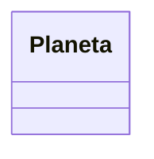

# Supplier Nivel 0

## Modelo

## Pasos:
- Alcance @RequestScoped
- Verificar si tiene @Embedded
- No tiene @Referenced
- Cuando es una entidad simple se hace la conversión mediante JSon-B.

```java
import com.avbravo.jmoordb.core.util.Test;
import com.avbravo.mongodbatlasdriver.model.Planeta;
import java.io.Serializable;
import java.util.function.Supplier;
import javax.enterprise.context.RequestScoped;
import javax.json.bind.Jsonb;
import javax.json.bind.JsonbBuilder;
import org.bson.Document;

/**
 *
 * @author avbravo
 */
@RequestScoped
public class PlanetaSupplier implements Serializable {

  
    // <editor-fold defaultstate="collapsed" desc="graphics">

    /**
     * Planeta{ }
     */
// </editor-fold>

// <editor-fold defaultstate="collapsed" desc="Planeta get(Supplier<? extends Planeta> s, Document document)">
    /**
     * Como es una clase que no tiene padres se puede implmentar JSON-B para
     * convertirlo directamente a Objeto.
     *
     * @param s
     * @param document
     * @return
     */
    public Planeta get(Supplier<? extends Planeta> s, Document document) {
        Planeta planeta = s.get();
        try {
            /**
             * Entidad: Planeta Planeta{ // No tiene embedded ni @Referenced }
             *
             * Nivel de Trabajo : 0
             *
             * Esquema de Niveles: | Nivel 0| Planeta
             *
             */
          
            Jsonb jsonb = JsonbBuilder.create();
            planeta = jsonb.fromJson(document.toJson(), Planeta.class);
        } catch (Exception e) {
            Test.error(Test.nameOfClassAndMethod() + " " + e.getLocalizedMessage());
        }
        return planeta;

    }
// </editor-fold>

}

```
