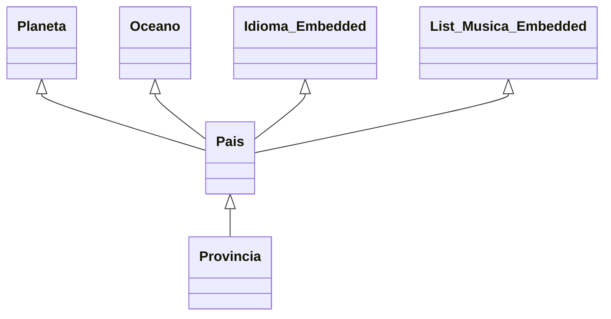

# Supplier nivel 2 (pronvincia-->pais-->planeta/oceano)




## General
- Observe que Provincia.java tiene un @Referenced a una sola colección Pais  
- Debemos Injectar PaisSupplierServices paisSupplierServices;
- Crear una instancia de Referenced de Pais que es la entidad referenciada
- Verificar que es una Referencia simple no un @Referenced List<>
- Revisar que no posee embebidos
    

```java
@RequestScoped
public class ProvinciaSupplier implements Serializable{

            // <editor-fold defaultstate="collapsed" desc="graphics">

    /**
     *
     * Provincia{
     *
     * @Referenced Pais{
     * @Referenced Planeta
     * @Referenced Oceano
     * @Embedded Idioma idioma;
     * @Embedded List<Musica>; } }
     *
     */
// </editor-fold>
   // <editor-fold defaultstate="collapsed" desc="@Inject">
    @Inject
    PaisSupplierServices paisSupplierServices;
   
// </editor-fold>

    // <editor-fold defaultstate="collapsed" desc="Provincia get(Supplier<? extends Provincia> s, Document document)">
    public Provincia get(Supplier<? extends Provincia> s, Document document) {
        Provincia provincia = s.get();
        try {

            /**
             * --------------------------------------------------------
             *
             * Step:0
             * <Attributes and @Embedded>
             * --------------------------------------------------------
             */
            provincia.setIdprovincia(String.valueOf(document.get("idprovincia")));
            provincia.setProvincia(String.valueOf(document.get("provincia")));

            /**
             * ---------------------------------------------
             *
             * @Embedded simple ----------------------------------------------
             */
           
            /**
             * --------------------------------------------------
             *
             * @Embedded List<>
             * Debe utilizar una lista temporal para almacenar los valores
             * --------------------------------------------------
             */
          

            /**
             * ------------------------------------------------
             *
             * Step 1:
             * <@Referemced>
             * Generar las interfaces Referenced Verificar si es List<> o una
             * Referencia simple Obtener el valor de la llave primaria mediatne
             * DocumentUtil.getIdValue(...)
             *
             */
           
            Referenced paisReferenced = new Referenced() {
                @Override
                public String from() {
                    return "pais";
                }

                @Override
                public String localField() {
                    return "pais.idpais";
                }

                @Override
                public String foreignField() {
                    return "idpais";
                }

                @Override
                public String as() {
                    return "pais";
                }

              @Override
                public TypeReferenced typeReferenced() {
                   return TypeReferenced.REFERENCED;
                }
                @Override
                public Class<? extends Annotation> annotationType() {
                    throw new UnsupportedOperationException("Not supported yet."); // Generated from nbfs://nbhost/SystemFileSystem/Templates/Classes/Code/GeneratedMethodBody
                }

                  @Override
                public TypePK typePK() {
                    return TypePK.STRING;
                }
            };

            /**
             * Crear una variable del tipo y valor de Referenced.foreigndFiel()
             * Verificar el tipo keyString()
             *
             */
            Boolean istListReferecendToPais = false;
            if (!istListReferecendToPais) {
                Optional<Pais> paisOptional = paisSupplierServices.findByPK(document, paisReferenced);
                if (paisOptional.isPresent()) {
                    provincia.setPais(paisOptional.get());
                } else {
                    Test.warning("No tiene referencia a Planeta");
                }
            } else {

                /**
                 * Pasos para @Referenced List<>
                 * 1- Obtener la lista documento 2- Obtener un List<SDocument>
                 * de las llaves primarias
                 */
              
                List<Pais> paisList = paisSupplierServices.findAllByPK(document, paisReferenced);
              
              //provincia.setPais(paisList);
            }
           
           

        } catch (Exception e) {
            Test.error(Test.nameOfClassAndMethod() + " " + e.getLocalizedMessage());
        }

        return provincia;

    }
// </editor-fold>

    
  

}
```
