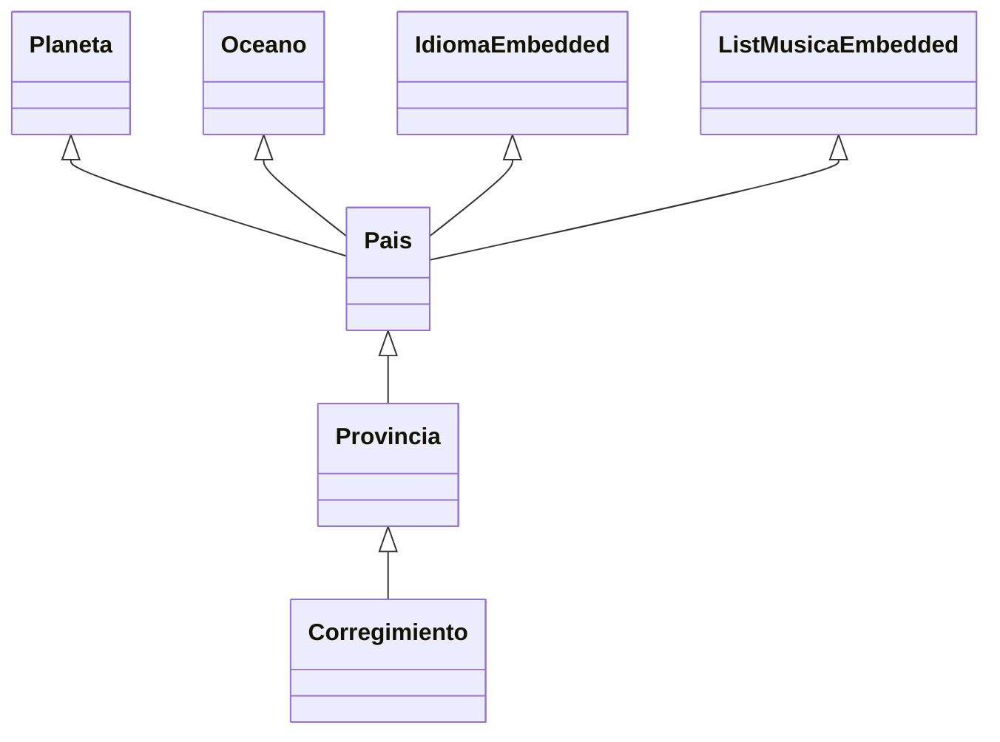

# 04.01.10 Supplier Nivel 3 corregimiento


- Es una referencia corregimiento--> provincia-->pais-->planeta/oceano
- Injectar  ProvinciaSupplierServices
- Verificar si es referencia simple o un List<>
- Verificar si tiene @Embedded
- Observe que todas las entidades aplican lo mismo.


```java
@RequestScoped
public class CorregimientoSupplier implements Serializable {

    // <editor-fold defaultstate="collapsed" desc="grephics">
    /**
     *
     * Corregimiento{
     *
     * @Referenced Provincia{
     * @Referenced Pais{
     * @Referenced Planeta
     * @Referenced Oceano
     * @Embedded Idioma idioma;
     * @Embedded List<Musica>; } } }
     *
     *
     */
    // <editor-fold defaultstate="collapsed" desc="@Inject">
    @Inject
    ProvinciaSupplierServices provinciaSupplierServices;

// </editor-fold>
    // <editor-fold defaultstate="collapsed" desc="Provincia get(Supplier<? extends Provincia> s, Document document)">
    public Corregimiento get(Supplier<? extends Corregimiento> s, Document document) {
        Corregimiento corregimiento = s.get();
        try {

            /**
             * --------------------------------------------------------
             *
             * Step:0
             * <Attributes and @Embedded>
             * --------------------------------------------------------
             */
            corregimiento.setIdcorregimiento(String.valueOf(document.get("idcorregimiento")));
            corregimiento.setCorregimiento(String.valueOf(document.get("corregimiento")));

            /**
             * ---------------------------------------------
             *
             * @Embedded simple ----------------------------------------------
             */
            /**
             * --------------------------------------------------
             *
             * @Embedded List<>
             * Debe utilizar una lista temporal para almacenar los valores
             * --------------------------------------------------
             */
            /**
             * ------------------------------------------------
             *
             * Step 1:
             * <@Referemced>
             * Generar las interfaces Referenced Verificar si es List<> o una
             * Referencia simple Obtener el valor de la llave primaria mediatne
             * DocumentUtil.getIdValue(...)
             *
             */
            Referenced provinciaReferenced = new Referenced() {
                @Override
                public String from() {
                    return "provincia";
                }

                @Override
                public String localField() {
                    return "provincia.idprovincia";
                }

                @Override
                public String foreignField() {
                    return "idprovincia";
                }

                @Override
                public String as() {
                    return "provincia";
                }

              
                @Override
                public Class<? extends Annotation> annotationType() {
                    throw new UnsupportedOperationException("Not supported yet."); // Generated from nbfs://nbhost/SystemFileSystem/Templates/Classes/Code/GeneratedMethodBody
                }

                @Override
                public TypePK typePK() {
                    return TypePK.STRING;
                }

                @Override
                public TypeReferenced typeReferenced() {
                   return TypeReferenced.REFERENCED;
                }

               
            };

            /**
             * Crear una variable del tipo y valor de Referenced.foreigndFiel()
             * Verificar el tipo keyString()
             *
             */
            Boolean istListReferecendToProvincia = false;
            if (!istListReferecendToProvincia) {
                Optional<Provincia> provinciaOptional = provinciaSupplierServices.findByPK(document, provinciaReferenced);
                if (provinciaOptional.isPresent()) {
                    corregimiento.setProvincia(provinciaOptional.get());
                } else {
                    Test.warning("No tiene referencia a Planeta");
                }
            } else {

                /**
                 * Pasos para @Referenced List<>
                 * 1- Obtener la lista documento 2- Obtener un List<SDocument>
                 * de las llaves primarias
                 */
                List<Provincia> provinciaList = provinciaSupplierServices.findAllByPK(document, provinciaReferenced);

                //provincia.setPais(paisList);
            }

        } catch (Exception e) {
            Test.error(Test.nameOfClassAndMethod() + " " + e.getLocalizedMessage());
        }

        return corregimiento;

    }
// </editor-fold>

}

```
