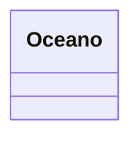

# SupplierServices

- Es una clase que genera métodos de utilidades que seran utilizados por los Supplier Referenciados para obtener los registros en base a las consultas por la llave referenciada.
- Se debe inyectar la interface @Repository
- Optional<Oceano> findByPK(Document document,Referenced referenced). Devuelve la entidad mediante la busqueda de la llave primaria
- List<Oceano> findAllByPK(Document document, Referenced referenced). Cuando es un @Referenced List<Entidad> procesa la lista de llaves primerias y devuelve un List<Entidad>
- Aplica para todos los niveles
- Se debe generar a partir de cada implemetanción de la interface @Repository
- Debe verificar si la llave es de tipo String o Integer. Esta se lee desde @Referenced. Mediante      if (referenced.typePK().equals(TypePK.STRING)) .
  
  


```java
@RequestScoped
public class OceanoSupplierServices implements Serializable {
    // <editor-fold defaultstate="collapsed" desc="@Inject">

    @Inject
    OceanoRepository repository;

// </editor-fold>
    // <editor-fold defaultstate="collapsed" desc="Optional<Oceano> findByPK(Document document, Referenced referenced)">
    /**
     *
     * @param document
     * @param corregimientoReferenced
     * @return Devuelve un Optional del resultado de la busqueda por la llave
     * primaria Dependiendo si es entero o String
     */
    public Optional<Oceano> findByPK(Document document,Referenced referenced) {
        try {
            Optional<Oceano> optional = Optional.empty();
        if (referenced.typePK().equals(TypePK.STRING)) {
                optional = repository.findById(DocumentUtil.getIdValue(document, referenced));
            } else {
                //    oceanoOptional  = oceanoRepository.findById(Integer.parseInt(DocumentUtil.getIdValue(document, referenced)));
            }

            if (optional.isPresent()) {
                return optional;
            }

        } catch (Exception e) {
            Test.error(Test.nameOfClassAndMethod() + " error() " + e.getLocalizedMessage());
        }
        return Optional.empty();
    }
// </editor-fold>

    // <editor-fold defaultstate="collapsed" desc="List<Oceano> findAllByPK(Document document, Referenced referenced) ">
    /**
     *
     * @param document
     * @param referenced
     * @return  List<Entity> en base a un @Referenced List<Entity> de la llave Primaria
     */
    public List<Oceano> findAllByPK(Document document, Referenced referenced) {
        List<Oceano> list = new ArrayList<>();
        try {
            List<Document> documentList = (List<Document>) document.get(referenced.from());
       
            List<Document> documentPkList = DocumentUtil.getListValue(document, referenced);
            if (documentPkList == null || documentPkList.isEmpty()) {
                Test.msg("No se pudo decomponer la lista de id referenced....");
            } else {
                for (Document documentPk : documentPkList) {
                    Optional<Oceano> optional = findByPK(documentPk, referenced);
                    if (optional.isPresent()) {
                        list.add(optional.get());
                    } else {
                        Test.warning("No tiene referencia a " + referenced.from());
                    }
                }
            }
        } catch (Exception e) {
            Test.error(Test.nameOfClassAndMethod() + " error() " + e.getLocalizedMessage());
        }
        return list;
    }
// </editor-fold>
}

```
