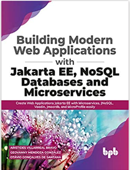
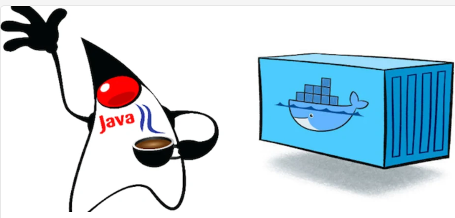
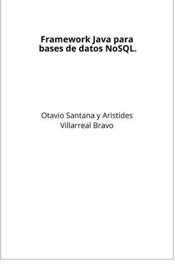

<!DOCTYPE html>
<html>
    <head>
        <title>Jmoordb-Core</title>
        <meta charset="utf-8">
        <style>
            @import url(https://fonts.googleapis.com/css?family=Yanone+Kaffeesatz);
            @import url(https://fonts.googleapis.com/css?family=Droid+Serif:400,700,400italic);
            @import url(https://fonts.googleapis.com/css?family=Ubuntu+Mono:400,700,400italic);

            /*            body {
                            font-family: 'Droid Serif';
                        }
                        h1, h2, h3 {
                            font-family: 'Yanone Kaffeesatz';
                            font-weight: normal;
                        }
                        .remark-code, .remark-inline-code {
                            font-family: 'Ubuntu Mono';
                        }
                        
            */

            body {
                font-family: 'Droid Serif';
            }
            h1, h2, h3 {
                font-family: 'Yanone Kaffeesatz';
                font-weight: 400;
                margin-bottom: 0;
            }
            .remark-slide-content h1 {
                font-size: 3em;
            }
            .remark-slide-content h2 {
                font-size: 2em;
            }
            .remark-slide-content h3 {
                font-size: 1.6em;
            }
            .footnote {
                position: absolute;
                bottom: 3em;
            }
            li p {
                line-height: 1.25em;
            }
            .red {
                color: #fa0000;
            }
            .large {
                font-size: 2em;
            }
            a, a > code {
                color: rgb(249, 38, 114);
                text-decoration: none;
            }
            code {
                background: #e7e8e2;
                border-radius: 5px;
            }
            .remark-code, .remark-inline-code {
                font-family: 'Ubuntu Mono';
            }
            .remark-code-line-highlighted     {
                background-color: #373832;
            }
            .pull-left {
                float: left;
                width: 47%;
            }
            .pull-right {
                float: right;
                width: 47%;
            }
            .pull-right ~ p {
                clear: both;
            }
            #slideshow .slide .content code {
                font-size: 0.8em;
            }
            #slideshow .slide .content pre code {
                font-size: 0.9em;
                padding: 15px;
            }
            .inverse {
                background: #272822;
                color: #777872;
                text-shadow: 0 0 20px #333;
            }
            .inverse h1, .inverse h2 {
                color: #f3f3f3;
                line-height: 0.8em;
            }

            /* Slide-specific styling */
            #slide-inverse .footnote {
                bottom: 12px;
                left: 20px;
            }
            #slide-how .slides {
                font-size: 0.9em;
                position: absolute;
                top:  151px;
                right: 140px;
            }
            #slide-how .slides h3 {
                margin-top: 0.2em;
            }
            #slide-how .slides .first, #slide-how .slides .second {
                padding: 1px 20px;
                height: 90px;
                width: 120px;
                -moz-box-shadow: 0 0 10px #777;
                -webkit-box-shadow: 0 0 10px #777;
                box-shadow: 0 0 10px #777;
            }
            #slide-how .slides .first {
                background: #fff;
                position: absolute;
                top: 20%;
                left: 20%;
                z-index: 1;
            }
            #slide-how .slides .second {
                position: relative;
                background: #fff;
                z-index: 0;
            }

            /* Two-column layout */
            .left-column {
                color: #777;
                width: 20%;
                height: 92%;
                float: left;
            }
            .left-column h2:last-of-type, .left-column h3:last-child {
                color: #000;
            }
            .right-column {
                width: 75%;
                float: right;
                padding-top: 1em;
            }
        </style>
    </head>
    <body>
        <textarea id="source">

name: inverse
layout: true
class: center, middle, inverse
---
#Jmoordb-core Framework
[Framework Java para Bases Datos NoSQL]


.footnote[ Leanpub [Book](https://leanpub.com/jmoordbcore/)]
---


class: center, middle

# Jmoordb-core framework

## Generación de código con Java Annotation Processing.


### Aristides Villarreal Bravo

|NetBeans Dream Teams   |  Duke Choice Awards 2017| Java Champions |
|-----------       | -----------    |-----------      |
|Jug.Leader| Autor Libros  |Revisor Técnico                |

    

---
layout: false
.left-column[
  ## Agenda
]
.right-column[
- [Cloud Native Java](#cloudnativejava)

- [Java Reflection](#reflection)

- [Java Annotation](#annotation)

- [Java Annotation Proccessing](#annotatioprocessing)

- [Jmoordb-core](#jmoordbcore)


.footnote[.red[*] Demo]
]

---
template: inverse
## Java Cloud Native


---
name: cloudnativejava

layout: false
.left-column[
  ## Cloud Native Java

]
.right-column[
  El desarrollo de aplicaciones Cloud Native es una de las grandes tendencias de desarrollo de software en la actualidad.

- Proporciona tiempos de ejecución más rápidos y ligeros, reduce la complejidad de las aplicaciones.

- Java ofrece escalabilidad, optimizaciones de JVM, frameworks multipropósito y tecnologías para imágenes nativas.

- Microprofile son especificaciones para crear microservicios en Java.


.footnote[.red[*] [Microprofile](https://microprofile.io/)]
]
???
El desarrollo de aplicaciones en la Nube. comstituye uno de los aspectos mas relevantes del
desarrollo de software en la actualidad, Java lideriza estas areas, con grandes empresas apostando
por su utilización, Amazon, NetFlix, Oracle, Microsofot.
Crear microservicios con Java proporciona grandes ventajas, aplicaciones ligeras, robustas de alto desempeño
Junto a las bases de datos NoSQL que ofrecen escalabilidad horizontal ofrecen grandes ventajas a los desarrolladores.
La metodología nativa de la nube incorpora: Microservicios,Contenedores, CI/CD, Devops.
---
name: reflection
template: inverse
## Java Reflection


---
.left-column[
  ## ¿Qué es Java Reflection?

]
.right-column[
Java Reflection es un API que permite analizar en tiempo de ejecución medatados de las clases 
e interactuar sobre ellas.

<pre><code>
```java
public Optional<T> findById(T t2) {
Document doc = new Document();
try {
    for (PrimaryKey p : primaryKeyList) {
        String name = "get" + util.letterToUpper(p.getName());
        Method method = entityClass.getDeclaredMethod(name);
        doc.put(p.getName(), method.invoke(t2));               
    }
    return find(doc);    
} catch (Exception e) {  }
  return Optional.empty();
}

```</code></pre>

**Ejemplo**
<pre><code>
```java
Optional<Persona> personaOptional = repository.findById(persona);
Optional<Auto> auto = repository.findById(auto);
```</code></pre>
]
???

Java Reflection permite instanciar clases, leer sus metadatos y ejecutar mètodos
en tiempo de ejecución. En el ejemplo que utilizo, es de mi antiguo framework 
jmoord, el cual usaba genericos y reflextion. Se puede observar que se obtiene 
los nombres de las llaves primarias luego se crea el metodo getNombre() y
ese valor se va asignando a un documento de MongoDB y se hace la invocación 
y este valor devuelto se asigna al documnento que ejecutara una consulta a la
base de datos por la llave primaria.
**Optional** es un objeto contenedor que puede almacenar un  valor no nulo.
**Genericos**:Fue introducido en Java 5,  permite un tipo seguro de manejo de objetos de diversos tipos. E
# Desventajas:
**Velocidad**: Llamadas son más lentos que usar llamadas directas.
**Tipos Seguros**: Métodos que usan referenciados pueden ser invocados con parametros incorrectos
**Trazabilidad**: Si el método invocado falla puede ser dificil realizar trazabilidad.


---
.left-column[
## Java Annotation

]
.right-column[

Las anotaciones nos ofrecen una forma de declarar metadatos a los elementos de un programa.

<pre><code> 
```java
@Target(ElementType.METHOD)
@Retention(RetentionPolicy.SOURCE)
public @interface Mensaje { }
```</code></pre>

**Ejemplo de uso**
<pre><code> 
```java
public interface UsuarioController {
    @Mensaje
    public void saludo(String name){}
}
```</code></pre>
]
???
No causan efectos sobre el programa
ofrecen informacion que puede ser procesada en tiempo de compilacion o ejecucion
En el ejemplo creamos una anotacion llamada mensaje y la implmentamos en un método
esta anotación puede ser procesada en tiempo de compilación o ejecución

---
name: annotatioprocessing
.left-column[
## Java Annotation Processing

]
.right-column[

Un procesador de anotaciones, procesa las anotaciones en tiempo de complicación 
o ejecución ofreciendo funcionalidades como generación de código, verificación de errores.
<pre><code>```java
@SupportedAnnotationTypes(
     {"com.jmoordb.core.annotation.repository.Mensaje"})
@SupportedSourceVersion(SourceVersion.RELEASE_11)
public class MensajeProcessor extends AbstractProcessor { }
```</code></pre>

**Código generado**
<pre><code> ```java
public class UsuarioControllerImpl implements UsuarioController {
    public void saludo(String nombre){
        System.out,println(" Bienvenido a Java "+ nombre);
    }
}
```</code></pre>

]
???
El procesador de anotaciones se puede observar que indicamos el paquete donde definimos
la anotacion, indicamos la version de Java que va a sopotar como minimo y extendemos
AbstractProcessr, con esta clasae podemos obtener informacio de todos los metodos
que implementan esta anotacion y las clases donde estan ubicados, podemos obtener
informacion de los parametros, del nombre del metodo y de los valores de retorno
con esta informacion podemos validar lo que esta escrito enviar advert3ncias y generar
codigo.

---
template: inverse
## Bases Datos NoSQL


---
.left-column[
## MongoDB


]
.right-column[
- Las bases de datos **NoSQL** escalan horizontalmente, ofrecen alto desempeño, aprovechan al máximo la tecnología de la nube.

- MongoDB es una base de datos NoSQL, orientada a documentos y grafos.

- Formato de almacenamiento BSON

- Soportan documentos embebidos

- Son libres de esquemas
<pre><code> ```json
pais:
{
   idpais:"pa",
   pais  :"Panamá",
   oceano:{
          idoceano:"pacifico",
          oceano  :"Océano Pacifico"
          },
  idioma:{
        ididioma:"es",
        idioma: "Español"
        }
}
```</code></pre>

]

???
Las base de datos nosql son una nueva forma de almacenar datos
son mas rapidas

---
name: jmoordbcore
template: inverse
## Jmoordb-core

---

.left-column[
  ## Jmoordb-core

]
.right-column[
* Es un framework Java para bases de datos NoSQL
* Orientado a Java Cloud Native
* Pensado para trabajar con Microservicios.
* Soporta las especificaciones Jakarta EE y Microprofile.
* Es fácil de utilizar
* Construido mediante Java Annotation Proccesing.
* Genera advertencias sobre la escritura de métodos
* Tiene su propio lenguaje de consulta Jmoordb-core query Language
* Soporta inferencia sobre nombre de métodos.
* Genera el código Java Nativo

.pull-left[
@Entity  
@AutoImplement
@DocumentEmbeddable
@Repository  
@Id  
@Column  
@Embedded  
@Referenced  
@Microservices  
@Index
@Save  
@Update 
]
.pull-right[
@Count   
@CountBy   
@CountLikeBy   
@Delete  
@Find  
@LikeBy  
@Lookup  
@Ping  
@Query    
@Regex  
@RegexCount  
@Repository  
 
 

]

]
???
Construido en base a jmoordb
1- Decir que las interfaces las inyectamos en los controller , y se abstrae la implementación, ya que la implementacion del codigo
ser realizara en otra clase. Por lo tanto es un codigo más entendible.
2- Decir que jmnoordb-core se basa en leer anotaciones y generar el codigo de una interface mediante Java Annotation Process
3- Decir que se procesa la antoacion @Entity que creara supplier y explicarlos comparandolos con Lookup de nmongodb
4- Decir que esta orientado a mongoDB
5- Deicr que se procesa la anotaicon @Repository para generar codigo
6- Decir las ventajas y limitaciones de jmoordb aspectos releventes uso de @Referenceds
7- Mostrar todas las anotaciones
6 - Crear una Interface y una implementacion de ejemplo.  
8- Mostrar un proyecto ccrar entidad embebvida otra referenciada repository y compilar el rpopeycto mostar el codigo que se crea
9- mostrar el libro
10 cuandom nse crea Repository mostrar cono se valida en tiempo de edicion el coidugo y que cumpla la sintacis
11- Mostrar la sintaxis las tablas
12- Mostrar un servicio rest corriendo
13- decir que se estra trabajando en el framework de anotaciones
14- crear slide con markdown
¿Por qué crear un framework nuevo?
   La mejor respuesta la encontramos en el control sobre la evolución del mismo y en la experiencia de aprendizaje que podemos alcanzar.


Ejemplo de anotaciones de como funciona editar en el IDE crear una entidad
crear un repositorio compilar codigo quarkus


---
.left-column[
## Jmoordb-core
## Entidad

]
.right-column[

* Una entidad Jmoordb-core define una colección de una base de datos


<pre><code>```java
@Entity
public class Pais{
    @Id
    private String idpais;
    @Column
    private String pais;
    @Embedded
    private Oceano oceano;
    @Referenced(from = "idioma",localField = "idioma.ididioma",
    typeReferenced = TypeReferenced.EMBEDDED)
    private Idioma idioma;
}
```</code></pre>
]

---
.left-column[
## Jmoordb-core
## Entidad
## Repositorio

]
.right-column[

* Es una interface que define operaciones sobre la base de datos mediante métodos.


<pre><code>```java
@Repository(entity = Pais.class,
            jakartaSource = JakartaSource.JAKARTA,
            database = "{mongodb.database}",
            collection = "pais")
public interface PaisRepository extends RepositoryCrud<Pais, String>{
}
```</code></pre>
]

---
.left-column[
## Jmoordb-core
## Entidad
## Repositorio
## Demo Quarkus

]
.right-column[

Desarrollaremos un demo utilizando:
* NetBeans IDE
* Docker
* MongoDB
* Jmoordb-core


<pre><code>```java

```</code></pre>
]

---
name: jmoordbcore
template: inverse
## Preguntas
---
name: reflection
template: inverse
.left-column[
## Libros

]

.right-column[

]

> [Amazon](https://www.amazon.co.uk/Building-Applications-Jakarta-Databases-Microservices/dp/9389423341)

 

>  [Leanpub](https://leanpub.com/jmoordbcore/)


---
name: jmoordbcore
template: inverse
## Muchas gracias

                            </textarea>
                            <!--<script src="https://remarkjs.com/downloads/remark-latest.min.js">-->
                            <script src="remark-latest.min.js">
                            </script>
                            <script>
                                var slideshow = remark.create();
                            </script>
                            </body>
                            </html>