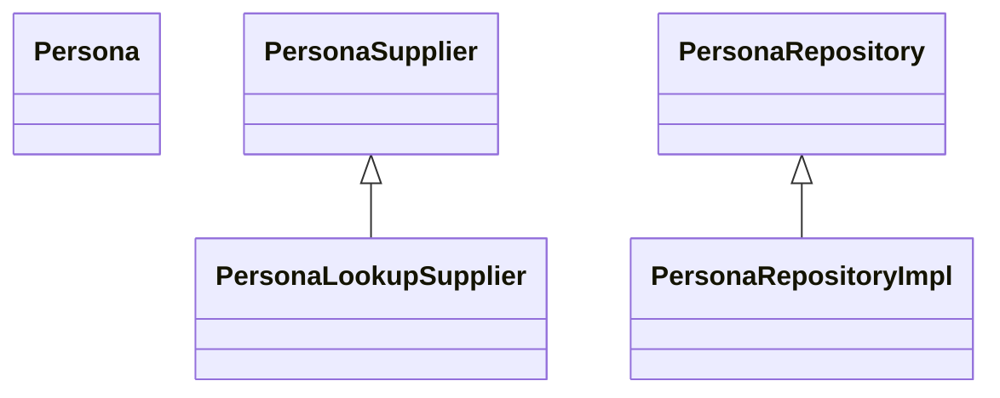

# 00. Introducción

Muestra como crear un proyecto Microprofile con MongoDB mediante el uso de $lookup

Contra:
- El performance decae considerablemente


[MongoDB Retrieve ](https://www.mongodb.com/docs/drivers/java/sync/v4.3/fundamentals/crud/read-operations/retrieve/)
[MongoDB Lookup](https://www.mongodb.com/community/forums/t/aggregation-pipeline-with-lookup-in-java/100454)

[MongoDB DBREFs](https://www.mongodb.com/docs/manual/reference/database-references/?_ga=2.207806738.1409911152.1656608601-647054010.1656608601#dbrefs)


## @Entity
```java
public class Persona{
@Id
private String idpersona;
private String persona;

}
```


# Repository
```java
public class PersonaRepository{
@Query()
public List<Persona> findAll();

}
```

## Supplier

```java
public class PersonaSupplier{

public List<Persona> findAll(){

}

}
```
## LookupSupplier
```java
public class PersonaLookupSupplier{

public Bson get(){
}

}

}
```


```java
public class PersonaRepositoryImpl implements PersonaRepository{

public Persona> supplier(Iterator it){

}

}
```
