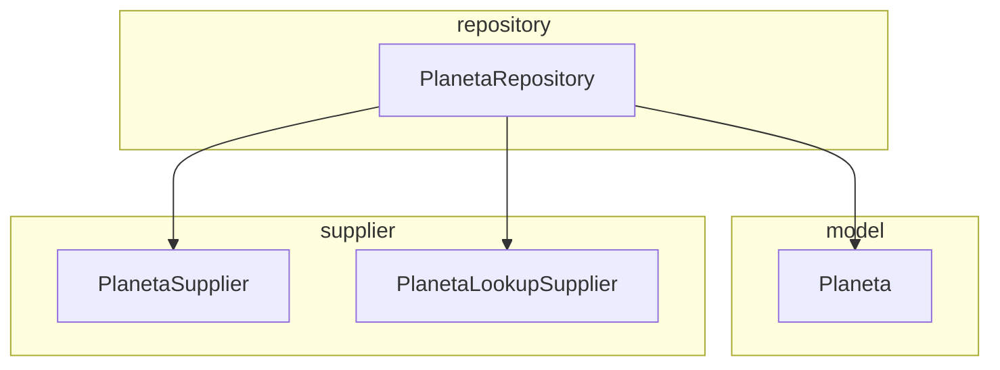
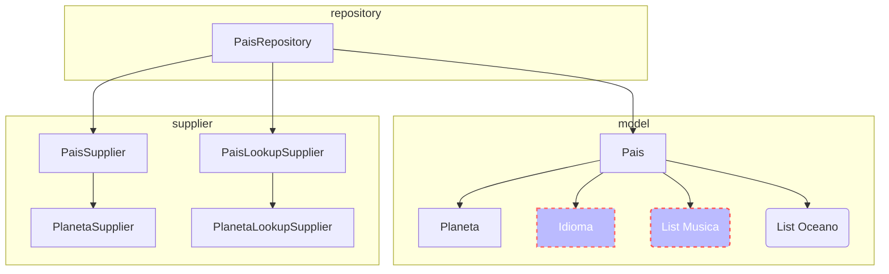
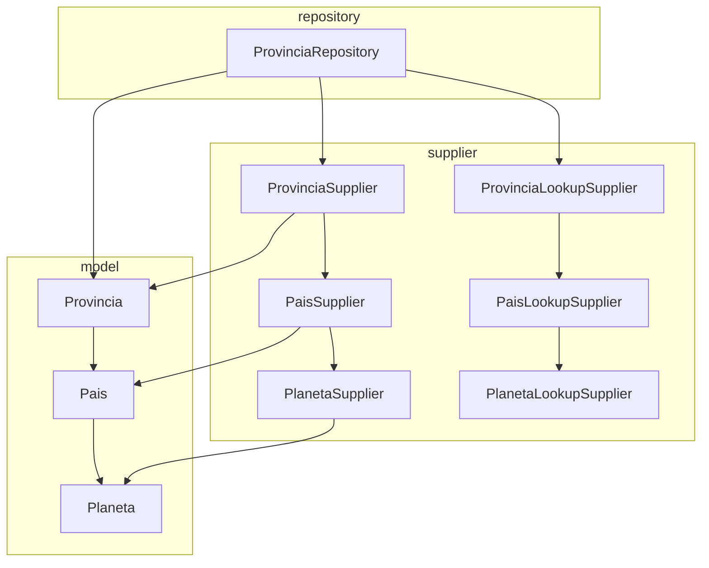
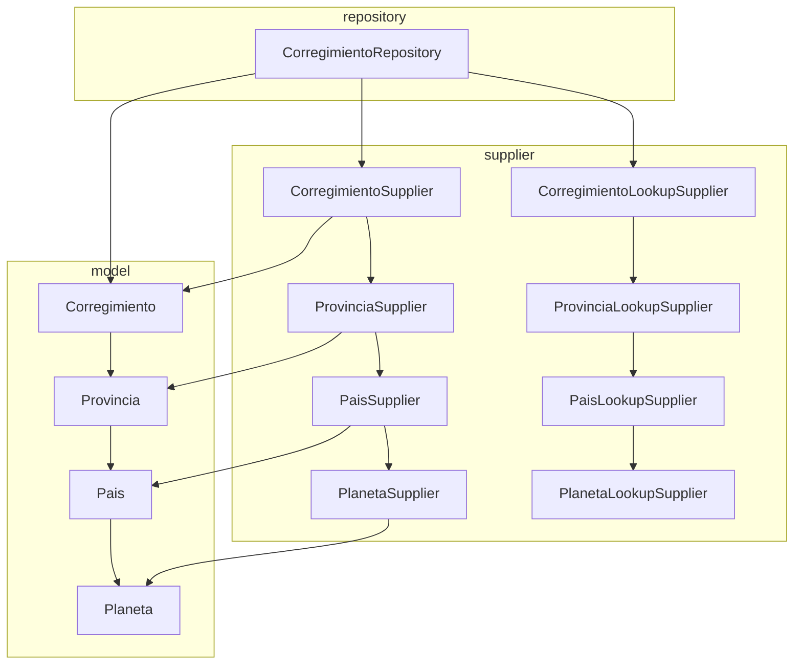

# 01.01.02 flow
## Considerar los embebidos
## Considerar list<Embebidos>
## Referenced usar @DBRef( database, collection, field)
## Validar estas condiciones con el lookup


    




  
 





## Es una clase Padre
    - No tiene mas subclases
    - Se puede hacer conversion on JSON-B en el Supplier
## Planeta
```java
@Entity
public class Planeta {
@Id
String idplaneta;
@Column
String planeta;

}
```
## Repository
```java
public interface PlanetaRepository {
    @Query(value="select * from planeta")
    public List<Planeta> findAll();
    @Query(value="select * from planeta where idplaneta = :id")
    public Optional<Planeta> findById(String id);
    @Query(value="select * from planeta where planeta = :planeta")
    public List<Planeta> findByPlaneta(String planeta);
    public Planeta save(Planeta planeta);
    public void deleteById(String id);
}

```

## Supplier
Genera el Supplier para cada entidad
```java
public class PlanetaSupplier {
// <editor-fold defaultstate="collapsed" desc="Planeta get(Supplier<? extends Planeta> s, Document document)">

    /**
     * Como es una clase que no tiene padres se puede implmentar JSON-B para
     * convertirlo directamente a Objeto.
     *
     * @param s
     * @param document
     * @return
     */

    public static Planeta get(Supplier<? extends Planeta> s, Document document) {
        Planeta planeta = s.get();
        try {
            Jsonb jsonb = JsonbBuilder.create();
            planeta = jsonb.fromJson(document.toJson(), Planeta.class);
        } catch (Exception e) {
            System.out.println("PlanetaSupplier.get() " + e.getLocalizedMessage());
        }
        return planeta;

    }
// </editor-fold>
}

```
## LookupSupplier 
Genera el lookup para cada entidad, devolviendo un List<Bosn> , correpondiente a un List<> de tipo $lookup (from, foreignField, localField, as).
De esta manera puede recorrer las @Referenced internos y obtener todos los joins
```java
public class PlanetaLookupSupplier {
// <editor-fold defaultstate="collapsed" desc="Planeta get(Supplier<? extends Planeta> s, Document document)">

    /**
     * Como es una clase que no tiene padres se puede implmentar JSON-B para
     * convertirlo directamente a Objeto.
     *
     * @param s
     * @param document
     * @return
     */
    public static List<Bson> get(Supplier<? extends Planeta> s, Referenced referenced) {
        List<Bson> list = new ArrayList<>();
        Bson pipeline;
        try {
            pipeline = lookup(referenced.from(), referenced.foreignField(), referenced.localField(), referenced.as());
            list.add(pipeline);
            /**
             * Analiza la entidad y verifica si tiene mas referenced y los busca
             * y los agrega al pipeline
             *
             */

        } catch (Exception e) {
            System.out.println("PlanetaLookupSupplier.get() "+e.getLocalizedMessage());
        }

        return list;

    }
// </editor-fold>
```

## RepositoryImpl
La implementación invoca el Supplier y el lookupSupplier para cada Entidad

```java
@ApplicationScoped
public class PlanetaRepositoryImpl implements PlanetaRepository {

    // <editor-fold defaultstate="collapsed" desc="metodo">

    @Inject
    private Config config;

    @Inject
    MongoClient mongoClient;
// </editor-fold>
    @Override
    public List<Planeta> findAll() {

        List<Planeta> list = new ArrayList<>();
        try {

            MongoDatabase database = mongoClient.getDatabase("world");
     
            MongoCollection<Document> collection = database.getCollection("planeta");

            MongoCursor<Document> cursor = collection.find().iterator();
            
            Jsonb jsonb = JsonbBuilder.create();
            try {
                while (cursor.hasNext()) {
                    Planeta planeta = PlanetaSupplier.get(Planeta::new,cursor.next());                   
                    list.add(planeta);
                }
            } finally {
                cursor.close();
            }

        } catch (Exception e) {
            System.out.println("findAll() " + e.getLocalizedMessage());
        }

        return list;
    }

    @Override
    public Optional<Planeta> findById(String id) {

        try {
            MongoDatabase database = mongoClient.getDatabase("world");
            MongoCollection<Document> collection = database.getCollection("planeta");
            Document doc = collection.find(eq("idplaneta", id)).first();
            
              Planeta planeta = PlanetaSupplier.get(Planeta::new,doc);
            return Optional.of(planeta);
        } catch (Exception e) {
            System.out.println("findById() " + e.getLocalizedMessage());
        }

        return Optional.empty();
    }

    @Override
    public Planeta save(Planeta planeta) {
        throw new UnsupportedOperationException("Not supported yet."); // Generated from nbfs://nbhost/SystemFileSystem/Templates/Classes/Code/GeneratedMethodBody
    }

    @Override
    public void deleteById(String id) {
        throw new UnsupportedOperationException("Not supported yet."); // Generated from nbfs://nbhost/SystemFileSystem/Templates/Classes/Code/GeneratedMethodBody
    }

    @Override
    public List<Planeta> findByPlaneta(String contry) {
        throw new UnsupportedOperationException("Not supported yet."); // Generated from nbfs://nbhost/SystemFileSystem/Templates/Classes/Code/GeneratedMethodBody
    }

}

```
***
Oceano
La implementacion de Oceano es similar a Planeta, que es una clase Padre

```java

@Entity
public class Oceano {

    @Id
    private String idoceano;
      private String oceano;

    public Oceano() {
    }

}
```


***
## Pais
- Es una clase @Referenced a Planeta
- Posee documento emebebido  @Embedded Idioma
- Posee una List Embebido <Musica>
- Un @Referenced a Planeta
- @Referenced List<Oceano>
- Observe que el supplier cambia se verifica cuando es embebido y retorna mediante un JSON-B


```java
@Entity
public class Pais {
    @Id
    private String idpais;
    private String pais;
    @Embedded
    private Idioma idioma;
    @Embedded
    private List<Musica> musica;
    @Referenced
    Planeta Planeta

}
```
### Idioma.java clase embebida @DocumentEmbeddable
- Se almacenara con una entidad embebida

```java
@DocumentEmbeddable
public class Idioma {
   private String ididioma;
   private String idioma;
   

}
```

### Musica.java clase embebida @DocumentEmbeddable
- Se almacenara como un List<> en Pais

```java
@DocumentEmbeddable
public class Musica {
   private String idmusica;
   private String musica;

}
```


## Repository
```java
@Repository(entity=Pais.class)
public interface PaisRepository {
    @Query("select * from pais")
    public List<Pais> findAll();
    @Query("select * from pais where idoais = :id")
    public Optional<Pais> findById(String id);
    @Query("select * from pais where pais = :pais")
    public List<Pais> findByPais(String pais);
    public Pais save(Pais pais);
    public void deleteById(String id);
}

```

## Supplier
Genera el Supplier para cada entidad
```java
public class PaisSupplier {

    public static Pais get(Supplier<? extends Pais> s, Document document) {
        Pais pais = s.get();
        try {

            System.out.println("Document " + document.toJson());

            pais.setIdpais(String.valueOf(document.get("idpais")));
            pais.setPais(String.valueOf(document.get("pais")));

            /**
             * Embebido Simple
             * 
             */
            Document doc = (Document) document.get("idioma");
            Jsonb jsonb = JsonbBuilder.create();
            Idioma idioma = jsonb.fromJson(doc.toJson(), Idioma.class);
            pais.setIdioma(idioma);
            
            /**
             * Lista @Embedded
             */
            List<Musica> musicaList = new ArrayList<>();
            List<Document> musicDoc= (List)document.get("musica");
            for(Document docm:musicDoc){
                Musica musica = jsonb.fromJson(docm.toJson(), Musica.class);
                musicaList.add(musica);
            }
            pais.setMusica(musicaList);
            /*
          @Referenced Planeta
             */
            // pais.setPlaneta(PlanetaSupplier.get(Planeta::new, document));

        } catch (Exception e) {
            System.out.println("PaisSupplier.get() " + e.getLocalizedMessage());
        }

        return pais;

    }

}
```
## LookupSupplier 
Genera el lookup para cada entidad
```java
public class PaisLookupSupplier {
    Bson lookup?
      if(tieneReferencia)
          planetaLookupSupplier.get();
      if(tiene mas referencias agregarlas mediante el lookupSupplier y anidarlo al Bson
    /**
    **/
    return lookup;

}
```

## RepositoryImpl
La implementación invoca el Supplier y el lookupSupplier para cada Entidad

```java
@ApplicationScoped
public class PaisRepositoryImpl implement PaisRepository {
  @Inject
  MongoClient mongoClient;
   @Override
    public List<Pais> findAll() {

        List<Pais> list = new ArrayList<>();
        try {
            MongoDatabase database = mongoClient.getDatabase("world");  
            MongoCollection<Document> collection = database.getCollection("pais");
            MongoCursor<Document> cursor = collection.find().iterator();            
            try {
                while (cursor.hasNext()) {
                    Pais pais = PaisSupplier.get(Pais::new,cursor.next());
                    list.add(pais);
                }
            } finally {
                cursor.close();
            }
        } catch (Exception e) {
            System.out.println("findAll() " + e.getLocalizedMessage());
        }

        return list;
    }

  
}
```


***
## Provincia
Es una clase @Referenced a Pais
```java
@Entity
public class Provincia {
@Id
String idprovincia;
@Column
String provincia;
@Referenced
Pais Pais

}
```
## Repository
```java
@Repository(entity=Provincia.class)
public interface ProvinciaRepository {
  @Query(value="select * from provincia")
  public List<Provincia> findAll();

}
```

## Supplier
Genera el Supplier para cada entidad
```java
public class ProvinciaSupplier {
  Provincia get(Iterator it){
   Provincia  provincia = new Provincia();
    provincia.setIdprovincia(it.get("idprovincia"));
    provincia.setProvincia(it.get("provincia"));
    /**
    Tiene referencia  @Referenced
    provincia.setProvincia(paisSuplier.get(it));
    **/
    return provincia;

}
```
## LookupSupplier 
Genera el lookup para cada entidad
```java
public class ProvinciaLookupSupplier {
    Bson lookup?
      if(tieneReferencia)
          paisLookupSupplier.get();
      if(tiene mas referencias agregarlas mediante el lookupSupplier y anidarlo al Bson
    /**
    **/
    return lookup;

}
```

## RepositoryImpl
La implementación invoca el Supplier y el lookupSupplier para cada Entidad

```java
@ApplicationScoped
public class ProvinciaRepositoryImpl implement ProvinciaRepository {
  @Inject
  MongoClient mongoClient;
  public List<Provincia> findAll(){
  List<Provincia> provinciaList = new ArrayList<>();
    Database
    Collection
    // Invocar el LookupSupplier
    // Cuando se usa con otras condiciones los where y eso se genera un match
    List<Iterator> iterator= collection.cursor(provinciaLookupSupplier.get());
    for(Iterator it:iterator){
       // Deuelve un objeto de tipo Planeta
       provinciaList.add(provinciaSupplier.get(it); 
     }
  }
  
}
```


