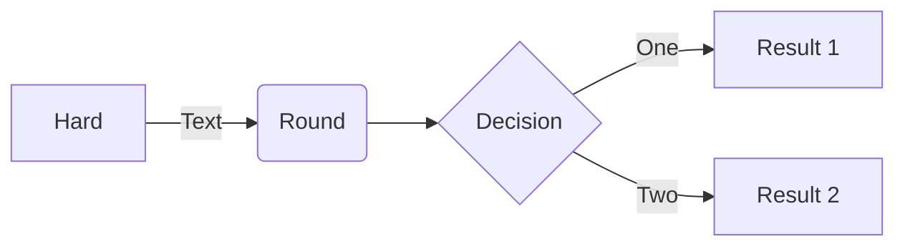
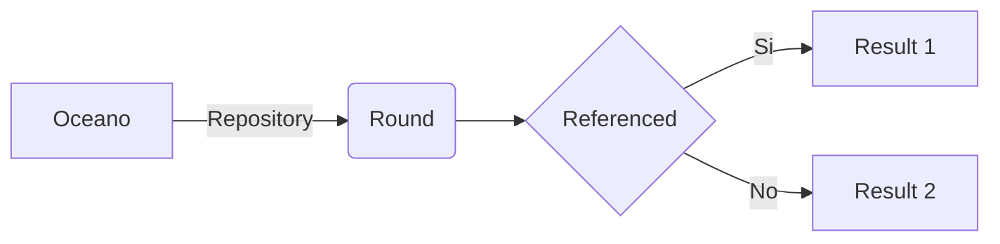
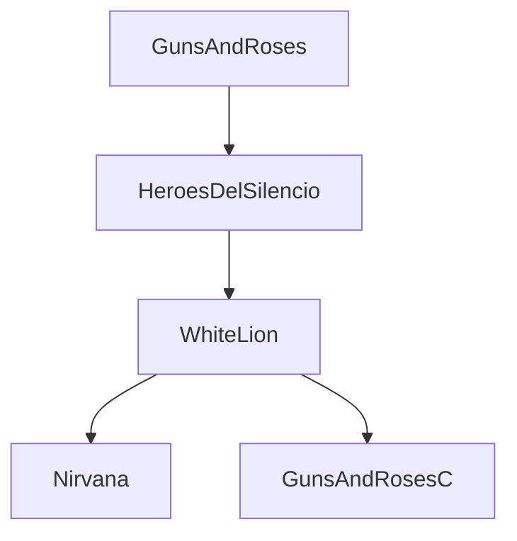
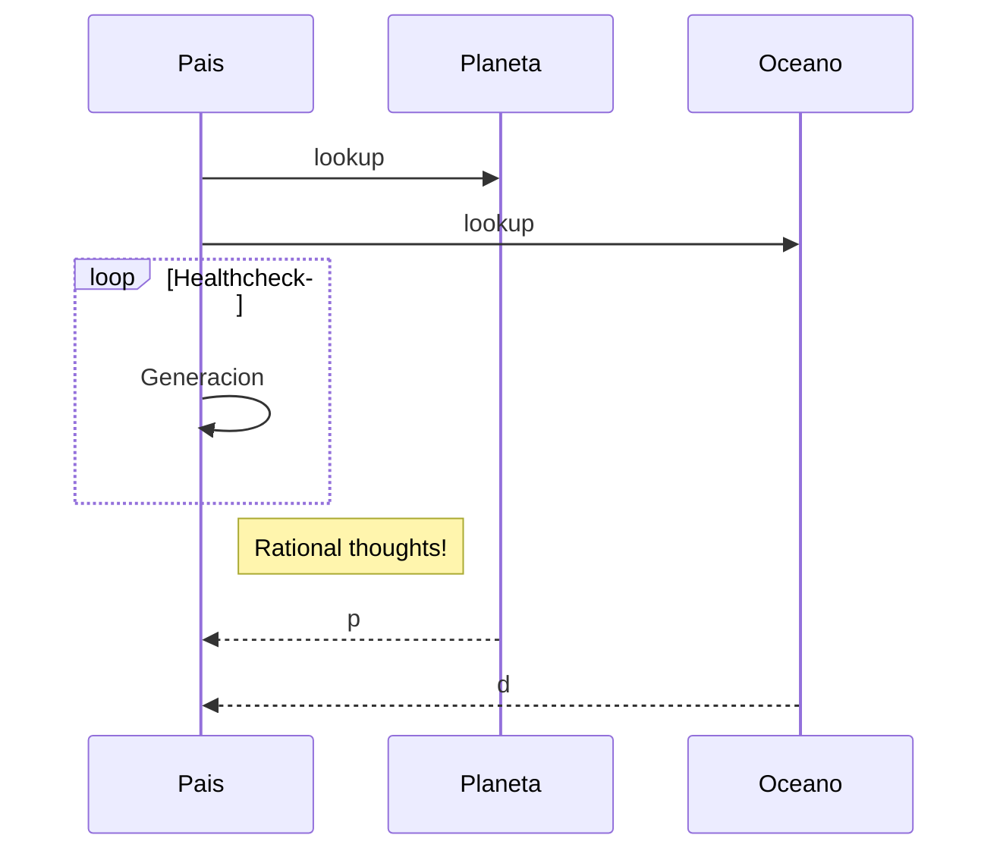
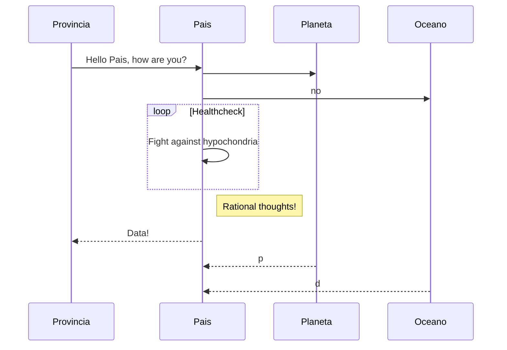

# Lookup

# Lookup

```mermaid
flowchart LR

A[Hard] -->|Text| B(Round)
B --> C{Decision}
C -->|One| D[Result 1]
C -->|Two| E[Result 2]
```
## Oceano

```mermaid
flowchart LR

A[Oceano] -->|Repository| B(Round)
B --> C{Referenced}
C -->|Si| D[Result 1]
C -->|No| E[Result 2]
```

```mermaid
graph TD;
    WhiteLion-->Nirvana;
    WhiteLion-->GunsAndRosesC;
    GunsAndRoses-->HeroesDelSilencio;
    HeroesDelSilencio-->WhiteLion;
```

 # Pais-Planeta

```mermaid
sequenceDiagram
Pais->>Planeta : lookup
Pais->>Oceano : lookup
loop Healthcheck
    Pais->>Pais: Generacion
end
Note right of Pais: Rational thoughts!
Planeta-->>Pais: p
Oceano-->>Pais: d

```

```mermaid
sequenceDiagram
Provincia->>Pais: Hello Pais, how are you?
Pais->>Planeta : 
Pais->>Oceano : no
loop Healthcheck
    Pais->>Pais: Fight against hypochondria
end
Note right of Pais: Rational thoughts!
Pais-->>Provincia: Data!
Planeta-->>Pais: p
Oceano-->>Pais: d

```

