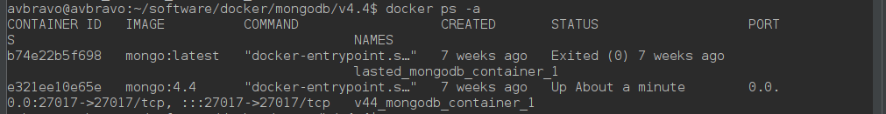
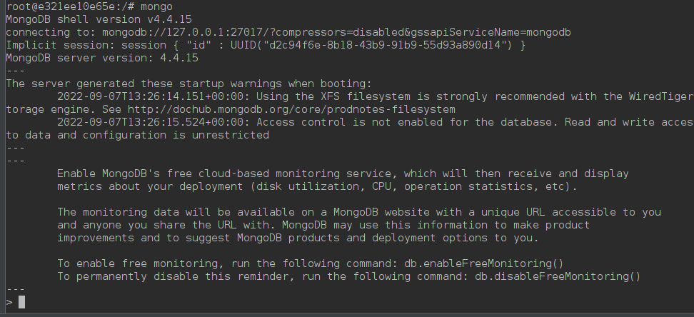
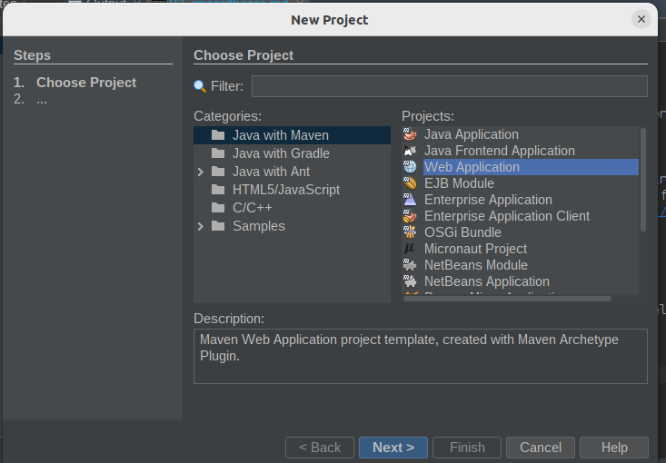
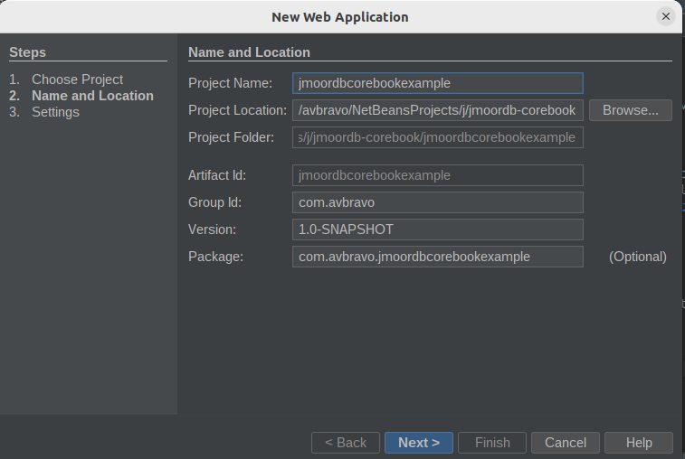
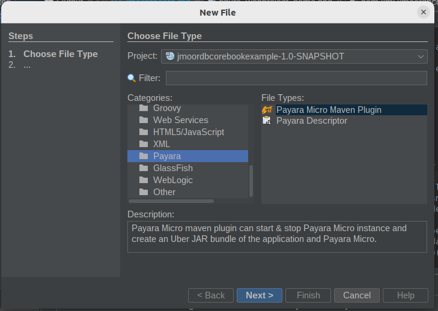
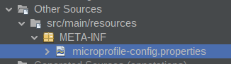

\newpage

\begin{flushright}
\section{Capítulo 2}
\end{flushright}

## Jmoordb-core

Jmoordb-core es un framework Java para bases de datos NoSQL. Surge de la 
reescritura de «*jmoordb*»[^2]. Con soporte para MongoDB en su versión inicial.
*Jmoordb-core* permite un desarrollo más ágil y rápido de los proyectos, mejorando
el performance de la aplicación, eliminando el uso de «Genéricos y Reflexión».

##  Objetivos
- Framework fácil de utilizar
- Verificación de sintaxis mientras escribe sus métodos.
- Implementar el lenguaje Jmoordb Query Language que posibilita generar consultas
- Generar operaciones analizando el nombre del método.
- Generar código nativo para el driver Java
- Mejorar el performance de la aplicación
- Soportar documentos embebidos y referenciados
- Almacena los documentos referenciados como documentos embebidos, de manera
  que se puedan realizar consultas de documentos embebidos como si fuesen 
  referenciados.

## Porque Jmoordb-core
 ¿Por qué crear un framework nuevo?, es una pregunta recurrente, tal vez la mejor 
respuesta la encontramos en el control sobre la evolución del mismo y en la 
experiencia de aprendizaje que podemos alcanzar.
Hace años había desarrollado un framework para bases de datos NoSQL llamado jmoordb.
Utilizaba genéricos y reflexión, lo que causaba impactos en el performance de la
aplicación, cómo un mayor consumo de recursos. Por esta razón se ha reescrito
jmoordb desde cero y este es el resultado que detallamos en este libro.
Un nuevo framework Jmoordb-core totalmente nuevo y no compatible con el antiguo 
jmoordb. Ahora el proceso de generación de código se realiza en tiempo de compilación
en lugar de tiempo de ejecución, logrando generar código más nativo y 
eficiente, eliminando él usó de genéricos y reflexión.

Al eliminar el uso de reflexión nos surgía una idea clara que fue impulsada por
un gran amigo, líder de la especificación JakartaNoSQL, Otavio Santana, y era el 
uso de Java Annotation Processing.
Con estas ideas en mente definimos algunos conceptos iniciales:  

1. Definir las anotaciones que definirán los entitys   
2. Definir las anotaciones que definirán los repositorios  
3. Tomar una base de datos NoSQL para hacer la implementación  
4. Crear un proyecto Java que permitiría mediante Java Annotation Processing 
   generar el código en tiempo de compilación.  
5. Necesitaba entender a profundidad la base de datos seleccionada (MongoDB), 
   sus ventajas y limitaciones.  
6. Producir algunas reglas para que el desarrollador pudiera utilizar en el
 framework.  
7. Generar un código lo más eficiente posible.  


Esto me llevo a algunas consideraciones.  

1. Al no existir el soporte directo para referencias en MongoDB, sino mediante 
uso de [$lookup de MongoDB](https://www.mongodb.com/docs/manual/reference/operator/aggregation/lookup/) , afecta
el desempeño de la aplicación, ya que podrían existir múltiples 
documentos referenciados entre ellos. Para solventar esta situación se optó por 
almacenar las referencias completas como documentos embebidos en la colección 
padre, de esa manera se puede especificar mediante anotaciones que cuando existan
dos o más documentos referenciados, se pueda buscar en un solo documento y al 
estar embebido el tiempo de consulta y el performance son muy eficientes.
Esto deja al desarrollador en la posición de hacer una consulta a la otra 
colección para verificar si esta ha sido modificada en un proceso alternativo.
También se permite que se realice una búsqueda en las colecciones 
referenciadas, lo que garantiza que siempre se contara con los documentos 
referenciados actualizados.  

2. Se evaluó el uso de $lookup de MongoDB, para hacer las consultas a documentos 
referenciados, pero se encontraron algunas condiciones de desempeño que se 
afectaban al contar con muchas referencias que implementar. Una solución fue 
generar  clases Supplier para cada Entity  que realizaran las operaciones de 
consultas sobre documentos embebidos y referenciados de una manera más eficiente
 que con la utilización de $lookup.  


3. En el diseño del framework se debe generar una implementación para cada 
Repository y generar un Supplier por cada entity definido.


## Requerimientos
Para la creación de un proyecto que utilice jmoordb-core revise los siguientes 
requerimientos:  

- APIs [Jakarta EE](https://jakarta.ee/) , 
- APIs [Microprofile](https://microprofile.io/) 
- Versión de Java 11 +.
- Maven o Gradle 
- Servidor que cumpla con las especificaciones Jakarta EE o 
  Microprofile,tales como Payara, WildFly, OpenLiberty, TomEE,
  Helidon entre otros.
- Base de datos MongoDB


## Arquitectura
Procederé a explicar la arquitectura y requerimientos para un proyecto 
- A partir de un Entity que representa un documento de la base de datos, definir
  una interface @Repository que contendrá métodos y anotaciones que permitirán 
  definir los métodos y el comportamiento de los mismos. 
- Defina una clase Producer que permitirá obtener la conexión a la base de datos 
- Jmoord-core en tiempo de compilación analizará los métodos y las anotaciones
  garantizando que se cumplan las reglas sintácticas y procederá a generar
  clases Supplier para cada entidad que contendrán las operaciones de conversión
  de documentos a objetos Java y viceversa. Además, generarán las implementaciones
  de los repositorios con base en las interfaces definidas con @Repository. 

## Docker
 Para los ejemplos que se utilizan en este libro necesitamos [docker](https://www.docker.com/).
Para instalar MongoDB. O si desea use MongoDB Atlas, o su instancia de MongoDB
que tiene instalada.
Si tiene experiencia con docker, omita esta sección, ya que está destinada a 
lectores que no han utilizado Docker, y se muestra el manejo de imágenes
utilizando docker-compose.
Mi sistema operativo es Ubuntu 22.04, por lo que procederé a instalar docker en 
Ubuntu de la siguiente manera:

### Instalar docker
\small
```shell
    sudo apt install docker
```
\normalsize
Instalar docker-compose
\small
```shell
    sudo apt install docker-compose
```
\normalsize
Verificar la versión de docker
\small
```shell
    docker-compose --version
```
\normalsize
Autorización de usuarios
\small
```shell
    sudo usermod -aG docker ${USER}
```
\normalsize
Aplicar los permisos
\small
```shell
    su - ${USER}
```
\normalsize
Verificar usuario
\small
```shell
    id -nG
```
\normalsize
### Instalar MongoDB
Crear el archivo **docker-compose.yml**
\small
```yaml
version: '3.7'
services:
  mongodb_container:
    image: mongo:latest
    ports:
      - 27017:27017
    volumes:
      - mongodb_data_container:/data/db

volumes:
  mongodb_data_container:
  
```
\normalsize

Cree el directorio data
\small
```shell
    sudo mkdir -p /data/db
```
\normalsize

De permisos de escritura
\small
```shel
    sudo chmod 777 /data/db
```
\normalsize
Cree el directorio de logs
\small
```shell
    sudo mkdir -p /var/log/mongodb
```
\normalsize

Inicializamos el contenedor ejecutando el siguiente comando en el directorio donde se
creó el archivo docker-compose.yml
\small
```shell
    docker-compose up -d
```
\normalsize
Para detener el contenedor, ejecute la siguiente instrucción 
\small 
```shell
    docker-compose stop
```
\normalsize
### Consola de MongoDB

Para ingresar al bash y administrar MongoDB desde consola, siga los siguientes
pasos:
Identifique el container id, de la imagen con la que desea interactuar
\small
```shell
     docker ps -a 
```
\normalsize
Se muestran los diferentes contenedores e imágenes que tenemos instalados 
mediante docker, como se puede apreciar en la figura a continuación
<figure>
    
    <figcaption></figcaption>
</figure>

Para ingresar al bash de la imagen mongo:4.4, identificamos el container id, 
para esta imagen que es: e321ee10e65e, y ejecutar:
\small
```shell
    docker exec -it e321ee10e65e bash
```
\normalsize
Con este procedimiento nos encontramos en el bash de nuestra imagen en docker,
procederemos a crear una carpeta para hacer backups y realizar copias de los
respaldos de las bases de datos.

Utilice el nombre apropiado para la carpeta
\small
```shell
    mkdir home/avbravo
```
\normalsize

Ingresar al directorio que creamos en el paso anterior
\small
```shell
    cd home/avbravo
```
\normalsize
### Copiar archivos  
Para copiar archivos desde nuestra imagen de docker al disco duro, es útil cuando
realizamos backups y deseamos guardarlos en nuestro disco. Cuando usamos servicios
Cloud, como MongoDB Atlas, esto no es necesario.
Para realizar las copias utilizamos
\small
```shell
    docker cp
```
\normalsize
En el siguiente ejemplo asumimos que tenemos un archivo que contiene el respaldo
y lo vamos a pasar a nuestro disco 
\small
```shell
  docker cp e321ee10e65e:/home/avbravo/backupdb /home/avbravo/backupdb
```
\normalsize

De modo contrario deseamos copiar un archivo desde nuestro equipo al contenedor
de docker, ejecute:
\small
```shell
  docker cp /home/avbravo/backupdb e321ee10e65e:/home/avbravo/backupdb 
```
\normalsize
### Mongo Shell
Pasos para ejecutar MongoDB desde el shell:
Ingrese al bash
\small
```shell
    docker exec -it e321ee10e65e bash
```
\normalsize
Ejecutar el comando
\small
```shell
mongo
```
\normalsize
Ahora nos encontramos en el shell de MongoDB   

<figure>
    
    <figcaption></figcaption>
</figure>


Para visualizar las bases de datos ejecute
\small
```shell
    show dbs
```  
\normalsize
### Respaldos  
Para realizar backups de bases de datos use el comando mongodump y guardarlo 
en la carpeta avbravo/docker, ejecute las siguientes instrucciones:
\small
```shell
mongodump --uri=mongodb://127.0.0.1:27017 -d pruebadb -o /home/avbravo/pruebadb
```
\normalsize

Podemos pasarlo a nuestro disco como explicamos previamente  
\small
```shell
docker cp e321ee10e65e:/home/avbravo/pruebadb  /home/avbravo/pruebadb
```
\normalsize
**Nota:**
 El símbolo ```\``` solo se usa para indicar que lo que está en la línea
siguiente se debe colocar en la misma línea. Elimine el símbolo "\" cuando
ejecute el comando.


### Restauración 
La restauración de una base de datos MongoDB se realiza mediante el comando
mongorestore
\small
```shell
mongorestore --uri=mongodb://127.0.0.1:27017  /home/avbravo/pruebadb
```
\normalsize


## Proyecto JakartaEE
  Crearemos un proyecto con nuestro IDE preferido utilizando Maven. En mi caso
utilizo [Apache NetBeans IDE](https://netbeans.apache.org/).

La siguiente sección está destinada a lectores con ninguna o poca experiencia
con el uso del IDE NetBeans, si usted lo maneja perfectamente o utiliza otro 
editor puede omitir esta sección.

### Instalar NetBeans IDE
 Existen varias maneras de realizar la instalación mediante los instaladores 
que encuentras en la página oficial, o construyendo mediante las fuentes.
Para Ubuntu, también lo puedes instalar utilizando [snap](https://snapcraft.io/netbeans)
Procedemos a instalar la última versión.
```shell
sudo snap install netbeans --edge --classic
```
### Crear proyecto Jakarta EE
Una vez instalado procedemos a crear un nuevo proyecto mediante el menú
File --> New Project, en la sección Categories: Java with Maven y en Project 
seleccionar Web Application


<figure>
    
    <figcaption></figcaption>
</figure>

Al presionar el botón Next, se despliega el diálogo para ingresar el nombre 
del proyecto ,la ruta donde será almacenado y la configuración del artificio 
maven.  Si no tiene experiencia previa con Maven, explicaré brevemente los 
identificadores:  
* artifactId: Nombre para el artefacto(proyecto).  
* groupId: Organización con autoría sobre el artefacto.  
* version: Número de versión. Debe ser incrementable.  
* package: Paquete principal.  
  

<figure>
    
    <figcaption></figcaption>
</figure>

Presione el botón Next, se despliega el diálogo, donde selecciona el Server y la
versión  de Java EE o JakartaEE.  
    El Server seleccionar **No Server Selected** y en Java EE Version: 
**JakartaEE 9 Web**. Tenga presente que al momento de escribir este libro NetBeans 
IDE y muchos servidores no soportan JakartaEE10, esto no causa ningún efecto en
los ejemplos del libro, ya que solo será necesario ajustar el archivo pom.xml, e
indicar las versiones adecuadas para cada especificación que se requiera.  


### PayaraMicro
 [PayaraMicro](https://www.payara.fish/learn/getting-started-with-payara-micro/) 
según lo define Payara :Es una plataforma ligera de código abierto para 
implementar aplicaciones y microservicios JakartaEE en contenedores. Su tamaño 
es pequeño, no requiere instalaciones ni configuraciones.

Recuerde que puede utilizar cualquier plataforma compatible con Jakarta EE para 
utilizar jmoordb-core.
Necesitamos es agregar el plugin maven de Payara Micro y las configuraciones 
a nuestro proyecto recién creado, similar al segmento de código siguiente:
\small
```xml
<plugin>
 <groupId>fish.payara.maven.plugins</groupId>
 <artifactId>payara-micro-maven-plugin</artifactId>
 <configuration>
  <payaraVersion>${version.payara}</payaraVersion>
  <deployWar>false</deployWar>
  <commandLineOptions>
    <option>
       <key>--autoBindHttp</key>
    </option>
    <option>
     <key>--deploy</key>
     <value>
       ${project.build.directory}/${project.build.finalName}
     </value>
    </option>
   </commandLineOptions>
  </configuration>
 <version>1.3.0</version>
</plugin>
``` 
\normalsize

A continuación se convertirá el proyecto a PayaraMicro, mediante el plugin, que 
está integrado en NetBeans IDE, facilitando el proceso de integración.
  Desde el menu del IDE, seleccione File --> New File y en categories seleccione 
**Payara** , en File Types: **Payara Micro Maven plugin**.  

<figure>
    
    <figcaption></figcaption>
</figure>


Al dar clic en siguiente nos solicita que seleccionemos la versión del plugin,
generalmente utilizamos la versión más reciente.

Al finalizar el proceso notará que el icono del proyecto ha cambiado, usted puede
cambiar las propiedades del proyecto haciendo clic derecho en el proyecto, cambie 
el nombre del proyecto **jmoordbcorebookexample-1.0-SNAPSHOT** por 
**jmoordbcorebookexample**,verifique las configuraciones iniciales del mismo.
Luego edite el archivo pom.xml , realice las siguientes acciones:

* Actualizar source a una versión mínima: 11+
* Actualice los plugins de maven a la ultima versión disponible
* Agregue dependencia de Microprofile
* Agregue la dependencia y repositorio de jmoordb-core. 
 
\small
```xml
    <dependency>
        <groupId>com.github.avbravo</groupId>
        <artifactId>jmoordb-core-processor</artifactId>
        <version>0.6</version>
    </dependency>

    <repositories>
      <repository>
        <id>jitpack.io</id>
        <url>https://jitpack.io</url>
      </repository>
    </repositories>
```
\normalsize

Usted puede clonar el proyecto de ejemplo que acompaña este libro y observar
las configuraciones indicadas para el proyecto de ejemplo.


### Microprofile-Config
Microprofile permite definir la configuración mediante el  uso del archivo 
microprofile-config.properties.
 El archivo es almacenado en la carpeta META-INF.
<figure>
    
    <figcaption></figcaption>
</figure>
Debemos establecer  las siguientes configuraciones.

|Atributo          | Descripción                                                | 
|-------------------       | -------------------------------------------------------    |
|                  |                                                            |
|mongodb.uri       |URL de la base de datos                      |
|mongodb.database  |Nombre de la base de datos                                  |            
|mongodb.database# |Nùmero de bases de datos    |            
|mongodb.jmoordb   |Base de datos de configuración para  jmoordb-core  |            

Ejemplo de archivo de configuración con múltiples bases de datos
\small
```
#mongodb.uri=mongodb+srv://mongodb/?retryWrites=true&w=majority;
mongodb.uri=mongodb://localhost:27017
#-- Base de datos de configuración jmoordb
mongodb.jmoordb= configurationjmoordbdb
#-- Base de datos
mongodb.database=world
mongodb.database1=test
mongodb.database2=store
```
\normalsize

### Produces
 Al necesitar trabajar con conexiones a MongoDB, utilizaremos un Produces que 
nos permitira inyectar un objeto de tipo MongoClient, en los repositorios 
obteniendo de esta manera la conexión a la base de datos. Por ejemplo en un 
repositorio usted puede inyectar MongoClient.
\small
```java

    @Inject
    MongoClient mongoClient;
```
\normalsize

Código completo de la clase **MongoDBManagerProducer**, que se utilizara para
gestionar las conexiones a la base de datos. 
\small
```java
import com.mongodb.client.MongoClient;
import com.mongodb.client.MongoClients;
import jakarta.enterprise.context.ApplicationScoped;
import jakarta.inject.Inject;
import java.io.Serializable;
import javax.enterprise.inject.Disposes;
import javax.enterprise.inject.Produces;
import org.eclipse.microprofile.config.Config;
import org.eclipse.microprofile.config.inject.ConfigProperty;

@ApplicationScoped
public class MongoDBManagerProducer implements Serializable {

    @Inject
    private Config config;
    @Inject
    @ConfigProperty(name = "mongodb.uri")
    private String mongodburi;
    
    @Produces
    @ApplicationScoped
    public MongoClient mongoClient() {
        MongoClient mongoClient = MongoClients.create(mongodburi);
       return mongoClient;

    }

    public void close(@Disposes final MongoClient mongoClient) {
        mongoClient.close();
    }

}
```
\normalsize

### Autoincrementable

Defina esta interface en su proyecto, que se utiliza para el manejo de valores
autoincrementables o secuenciales, en el capítulo 5, se explica con detalles su
uso.

\small
```java
import com.jmoordb.core.annotation.enumerations.JakartaSource;
import com.jmoordb.core.model.Autosequence;
import com.jmoordb.core.annotation.autosecuence.Autogenerated;
import com.jmoordb.core.annotation.autosecuence.AutosecuenceRepository;

@AutosecuenceRepository(entity = Autosequence.class, 
                    jakartaSource = JakartaSource.JAKARTA,
                    database = "{mongodb.database}", collection = "autosecuence")
public interface AutogeneratedRepository {

  @Autogenerated() 
  public Long generate(String database,String collection);

}
```
\normalsize

### Crear una entidad
Las entidades son clases Java con una serie de anotaciones que especifican un
documento de una colección en una base de datos NoSQL.
\small
```java
@Entity()
public class Oceano {
    @Id
    private String idoceano;
    @Column
    private String oceano;

    public Oceano() {
    }
}
```
\normalsize
### Crear un Repositorio
Defina una clase Java y decórela con anotaciones de tipo @Repository y esto 
permitirá que usted interactúe con las operaciones de la base de datos. Jmoordb-core
generará todo el código necesario para lograr estas funcionalidades.
\small
```java
@Repository(entity = Oceano.class)
public interface OceanoRepository extends CrudRepository<Oceano,String> { }
```
\normalsize

Al compilar el proyecto se generarán las clases y métodos para interactuar con
la base de datos. En los siguientes capítulos se explicará con detalles las 
anotaciones que serán necesarias para escribir entidades y repositorios.

Como se observa en este capítulo el uso de jmoordb-core es relativamente sencillo
solo debe establecer las configuraciones en el archivo microprofile-config, crear
la clase que implemente @Produces para gestionar la conexión a la base de datos
y escribir sus entidades y repositorios.

[^2]: Villarreal; Aristides, autor <cite>Jmoordb</cite>,
  [avbravo.blogspot.com](https://avbravo.blogspot.com) (<cite>Java Champions</cite>); .


## Resumen
En este capítulo se hizo una introducción a Jmoordb-core, los requisitos mínimos,
se explicó como instalar Docker para trabajar con imágenes de MongoDB,
Se creó un proyecto Jakarta EE con NetBeans IDE para definir una entidad,
establecer configuraciones y crear un repositorio.
En el siguiente capítulo, se explicará las entidades y sus anotaciones para 
declarar documentos embebidos y referenciados.
