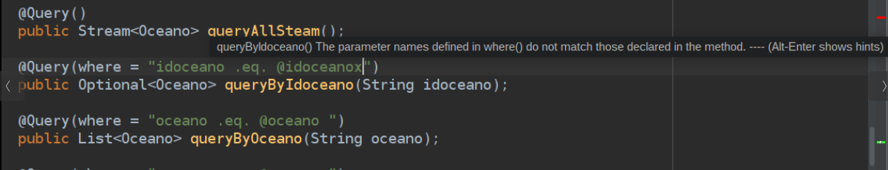
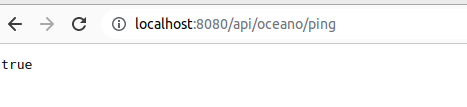
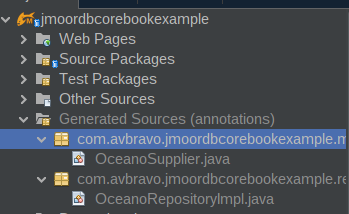

 \newpage

\begin{flushright}
\section{Capítulo 4}
\end{flushright}

## ¿Qué es un Repositorio?
 Es un patrón de diseño , en el sitio de  Martin Flower encontrarás un artículo 
escrito por Edward Hieatt and Rob Mee [Repository](https://martinfowler.com/eaaCatalog/repository.html)
, lo definen: como una capa intermedia utilizando una interface que permite 
abstraer el código mediando entre las capas de dominio y mapeo de datos, dando 
como resultado un aislamiento de los objetos del dominio del código que realiza
el mapeo de los datos. Este patrón nos permite abstraer la complejidad de la 
interacción con la base de datos.

 En el framework usted necesita definir una interface Repository para cada entidad, 
defina en ella los métodos que desee que realicen las operaciones contra la base 
de datos. Tenga presente que la implementación de estos métodos serán  generados
en tiempo de compilación con el mapeo de datos optimizados para la base de datos
 en particular.  
Se pueden utilizar con base en dos formas diferentes, un repositorio simple en el
cual usted debe definir todos los métodos para las operaciones  y el otro mediante 
la interface CrudRepository, que contiene los métodos para establecer el C.R.U.D.
(Create Read Update Delete).
A continuación mostraremos su uso

##  @Repository
Es la interface que define los métodos que serán generados para realizar las 
operaciones con la base de datos y sus colecciones. Usted contará con una serie
de anotaciones que le permitirán crear aplicaciones de manera sencilla.

Durante el proceso de compilación ocurren los siguientes eventos: 
- Se genera para cada entidad declarada con la anotación @Entity una clase Supplier,
  cuya finalidad es realizar conversión de  documentos a entidades y viceversa. 
  También se encarga de ejecutar las operaciones sobre  documentos embebidos y 
  referenciados.  
- Se generará la implementación de todos los métodos definidos en la interface con 
  la anotación @Repository. Esta implementación inyectará la clase Supplier del
  entity correspondiente.  
- Si una entidad contiene un atributo @Id autoincrementable, se inyectará la 
  interface AutogeneratedRepository.java(Debe estar definida esta interface en
  el paquete de repositorios). Y se implementará el código correspondiente para 
 manejar valores secuenciales de la llave primaria.  
    
La anotación @Repository contiene la siguiente estructura

\small
```java
import com.jmoordb.core.annotation.enumerations.JakartaSource;
import com.jmoordb.core.annotation.enumerations.TypeReferenced;
import java.lang.annotation.ElementType;
import java.lang.annotation.Retention;
import java.lang.annotation.RetentionPolicy;
import java.lang.annotation.Target;

@Target(ElementType.TYPE)
@Retention(RetentionPolicy.SOURCE)
public @interface Repository {
    Class<?> entity();
    JakartaSource jakartaSource() default JakartaSource.JAKARTA;
    String collection() default "";
    String database() default "{mongodb.database}";
}

```
\normalsize


|Atributo          | Descripción | 
|-----------       | -------------------------------------------------------    |
|                  |                |
|entity()          |Define la  clase de la entidad Entity.class    |
|jakartaSource()   |Especifique las fuentes de Jakarta o Java EE Legacy |            
|collection()      |Nombre de la colección. Vacío indica que es el mismo nombre el entity. |            
|database()        |Nombre de la base de datos a usar lo tomará de Microprofile-Config "{mongodb.database}" |


Creación de una interface repositorio sin métodos

\small
```java
@Repository(entity = Planeta.class)
public interface PlanteRepository {   }
```
\normalsize

##  Anotaciones 
Contamos con las diferentes anotaciones para utilizar en el repository
    

* @Count
* @Delete
* @DeleteBy
* @Lookup
* @Find
* @Ping
* @Query
* @Regex
* @RegexCount
* @Repository
* @Save
* @Update

Para crear un repositorio con métodos, solo debe agregar la anotación y luego
el método que desee implementar.

\small
```java
@Repository(entity = Planeta.class)
public interface PlanteRepository {
    @Save 
    public Optional<Planeta> save(Planeta planeta);

    @Delete(where = "idoceano .eq. @idoceano")
    public Long delete(String idoceano);
}

```
\normalsize    

## CrudRepository


Jmoordb-core, ofrece una interface CrudRepository. Que contiene los métodos más
comunes las operaciones como inserciones, actualizaciones, eliminación y búsquedas.
A continuación se muestra como está definida la interface en el framework.

\small
```java
public interface CrudRepository<T, PK> {
    @Save
    public Optional<T> save(T t);

    @Update
    public Boolean update(T t);

    @Find()
    public List<T> findAll();

    @Find()
    public List<T> findAllPagination(Pagination pagination);

    @Find()
    public List<T> findAllSorted(Sorted sorted);

    @Find()
    public List<T> findAllPaginationSorted(Pagination pagination,Sorted sorted);

    public Optional<T> findByPk(PK id);
    
    @DeleteBy
    public Long deleteByPk(PK id);
}

```
\normalsize

Ejemplo de una interface definida con un atributo primario de tipo String  

\small
```java
@Repository(entity = Oceano.class, jakartaSource = JakartaSource.JAKARTA,
            database = "{mongodb.database}", collection = "oceano")
public interface OceanoRepository extends CrudRepository<Oceano, String>{  
}       

```
\normalsize

Ejemplo de una interface definida con un atributo primario de tipo Long. 
Se puede omitir los atributos JakartaSource, database y collection.

\small  
```java       
@Repository(entity = Tiposdatos.class)
public interface TiposdatosRepository extends CrudRepository<Tiposdatos, Long>{
    
}
```
\normalsize

En un controller se procedería a inyectar la interface e invocar los métodos 
correspondientes:

\small
```java
@Inject
OceanoRepository oceanoRepository;

public String save(Oceano oceano){
       oceanoRepository,save(oceano);
}
```
\normalsize
 


En los repository solo tiene que indicar mediante {mongodb.database#} la 
referencia a la base de datos que desea usar

\small
```java
@Repository(entity = Persona.class, jakartaSource =  JakartaSource.JAKARTA,
            database ="{mongodb.database}",  collection = "persona")
public interface PersonaRepository {

    @Query(where = "")
    public List<Persona> findAll();

}
```
\normalsize

## Especificar base de datos
Usted puede indicar con que base de datos desea trabajar la interface 
repositorio, utilizando la declaración establecida en el archivo 
microprofile-config.properties. En el ejemplo se usara la base de datos definida
 como {mongodb.database1}.

\small
```java
@Repository(entity = Persona.class,  database ="{mongodb.database1}",
            collection = "persona")
public interface PersonaRepository {

    @Query(where = "")
    public List<Persona> findAll();
}
```
\normalsize

Utilizando base de datos 2

\small
```java
@Repository(entity = Person.class, database ="{mongodb.database2}")
public interface PersonRepository {

    @Query(where = "")
    public List<Person> findAll();
}
```
\normalsize

En la siguiente sección se detalla el uso de las diversas anotaciones
que pueden ser usadas con una interface definida con @Repository.

## @Save
- Crea un nuevo documento en la colección
- Devuelve un valor de tipo Boolean indicando si fue guardado o no.
- Puede devolver un valor de tipo Optional
- Solo admite un parámetro que es del tipo de la entidad definida
- Si hereda de CrudRepository no es necesario que defina el método

Estructura de la anotación

\small
```java
@Target(ElementType.METHOD)
@Retention(RetentionPolicy.SOURCE)
public @interface Save { }
```
\normalsize


Declarar una interface @Repository que implementa un método save(), solo indique
la anotación @Save.


\small
```java
@Repository(entity = Oceano.class,  jakartaSource = JakartaSource.JAKARTA,
           database = "{mongodb.database}",  collection = "oceano")
public interface OceanoRepository  {
@Save 
public Optional<Oceano> save(Oceano oceano);

@Save 
public Boolean saveBoolean(Oceano oceano);
}
```
\normalsize

Usando CrudRepository, no será necesario definir el método save(), ya que
este esta definido el CrudRepository.

\small
```java
@Repository(entity = Oceano.class)
public interface OceanoRepository extends CrudRepository<Oceano,String> {
}
```
\normalsize

## @Update 
- Actualiza una colección
- Devuelve un Boolean indicando si fue actualizado exitosamente
- Solo admite un parámetro que es del tipo de la entidad declarada
- Si hereda de CrudRepository no es necesario que defina el método

Estructura de la anotación

\small
```java
@Target(ElementType.METHOD)
@Retention(RetentionPolicy.SOURCE)
public @interface Update { }
```
\normalsize

Utilizando una definición simple de @Repository

\small
```java
@Repository(entity = Oceano.class)
public interface OceanoRepository  {
@Update
    public Boolean update(Oceano oceano);
}
```
\normalsize


Usando @Repository con un CrudRepository
\small
```java
@Repository(entity = Oceano.class,  jakartaSource = JakartaSource.JAKARTA,
            database = "{mongodb.database}", collection = "oceano")
public interface OceanoRepository extends CrudRepository<Oceano,String> {
}
```
\normalsize

## @Delete
- Establece que el método realizara una operación de eliminación de uno o más
  documentos.
- Los nombres de métodos deben iniciar con **delete**
- Devuelve un Long correspondiente al total de documentos eliminados
- where()-> aplica las condiciones que se usan para definir un  @Query excepto por 
  (paginación y sorted)
- Puede recibir un parámetro de tipo Search  en este caso el where() estara vacío.
- El Search no se puede utilizar con otros parámetros,

Estructura de la anotación:

\small
```java
@Target(ElementType.METHOD)
@Retention(RetentionPolicy.SOURCE)
public @interface Delete {
  String  where() default "";
}
```
\normalsize

Los operadores están encerrados entre . .

|                   | Operadores Válidos                                 | 
|-------------------| -----------------------------------------------    |
| **Comparación**   | **Lógicos**                                        |
|.eq.               |.and.                                               |
|-ne.               |.or.                                                |            
|.lt.               |,not.                                               |            
|-lte.              |                                                    |     
|.gt.               |                                                    |     
|.gte.              |                                                    |     


**Operadores no permitidos**
Los operadores no permitidos son:

|                   | Operadores no válidos   | 
|-------------------|---------------------    |
|                   |                  |
|  (                 |                  |
|  )                 |                  |
|  $                 |                  |
|  [                 |                  |
|  ]                 |                  |


Incluimos algunos ejemplos de uso de @Delete, en especial la sintaxis de where()

\small
```java

    @Delete(where = "idoceano .eq. @idoceano")
    public Long delete(String idoceano);

    @Delete(where = "idoceano .ne. @idoceano")
    public Long deleteNEQ(String idoceano);

    @Delete(where = "idoceano .lt. @idoceano")
    public Long deleteLT(String idoceano);

    @Delete(where = "idoceano .lte. @idoceano")
    public Long deleteLTE(String idoceano);

    @Delete(where = "idoceano .gt. @idoceano")
    public Long deleteGT(String idoceano);

    @Delete(where = "idoceano .gte. @idoceano")
    public Long deleteGTE(String idoceano);

    @Delete(where ="idoceano .eq. @idoceano .and. oceano .ne. @oceano")
    public Long delete(String idoceano, String oceano);

    @Delete(where ="idoceano .eq. @idoceano .and. oceano .ne. @oceano 
                    .not. fecha .gt. @fecha")
    public Long deleteIdOceanoAndOceanoNotFecha(String idoceano,
                        String oceano, Date fecha);

    @Delete(where = "idoceano .eq. @idoceano .and. oceano .ne. @oceano
                    .not. fecha .gt. @fecha .or. activo .ne. @activo")
    public Long deleteIdOceanoAndOceanoNotFechaOrActivo(String idoceano, 
                     String oceano, Date fecha, String activo);

    @Delete(where = "idoceano .eq. @idoceano .and. oceano .ne. @oceano 
                    .not. fecha .gt. @fecha .or. activo .eq. @activo 
                    .and. km .gt. @km")
    public Long deleteIdOceanoAndOceanoNotFechaOrActivoAndKm(
                     String idoceano, String oceano, Date fecha, 
                     String activo, Integer km);

    @Delete()
    public Long delete(Search search);
```
\normalsize
 

## @CountBy

- Cuenta los documentos que cumplan con la condición establecida en el nombre 
  del método
- Los nombres de métodos deben iniciar en **countBy**
- Nombres de **campo** inician en mayúscula 
- El comparador se coloca después del nombre de **campo**, (Si se omite se asume
  que es Equal).
- Comparadores: (Equal, NotEqual, GreaterThan, GreaterThanEqual, LessThan,
  LessThanEqual,Like)
- Operadores Lógicos: (And, Or, Not)
- JmoordbCore analizará el nombre del método y los parámetros e indicara si la 
 sintaxis es correcta, y generará el código correspondiente.
- Tipo de valor de retorno es Long

Estructura de la anotación

\small
```java
@Target(ElementType.METHOD)
@Retention(RetentionPolicy.SOURCE)
public @interface CountBy { }
```
\normalsize

Ejemplos de uso

\small
```java
@Repository(entity = Oceano.class) 
    public interface OceanoRepository {
  

    @CountBy
    public Long countByIdOceano(String idoceano);

    @CountBy
    public Long countByIdOceanoNotEqual(String idoceano);

    @CountBy
    public Long countByIdOceanoAndOceanoNotEqualAndDate(String idoceano, 
                     String oceano, Date date);

    @CountBy
    public Long countByIdOceanoAndOceano(String idoceano, String oceano);

    @CountBy
    public Long countByIdOceanoAndOceanoNotFechaGreaterThan(String idoceano, 
                     String oceano, Date fecha);

    @CountBy
    public Long countByIdOceanoAndOceanoNotFechaOrActivo(String idoceano,  
                    String oceano, Date fecha, String activo);

    @CountBy
    public Long countByIdOceanoAndOceanoNotFechaOrActivoAndKm(String idoceano,
                     String oceano, Date fecha, String activo, Integer km);
}
```
\normalsize

## @DeleteBy
- Genera métodos para realizar las operaciones de eliminación
- El contenido de los métodos se generará analizando el nombre del método
- Los nombres de métodos deben iniciar en **deleteBy**
- Nombres de **campo** inician en mayúscula 
- El comparador se coloca después del nombre de Campo, (Si se omite se asume que 
 es Equal).
- Comparadores: (Equal, NotEqual, GreaterThan, GreaterThanEqual, LessThan,
   LessThanEqual,Like)
- Operadores Lógicos: (And, Or, Not)
- JmoordbCore analizará el nombre del método y los parámetros e indicara si 
  la sintaxis es correcta, y generará el código correspondiente.
- Valores de retorno List<>, Set<>, Optional<>, Stream<>.

Estructura de la anotación

\small
```java
@Target(ElementType.METHOD)
@Retention(RetentionPolicy.SOURCE)
public @interface DeleteBy { }
``` 
\normalsize


Ejemplo de uso de @DeleteBy 

\small
```java
@Repository(entity = Oceano.class)
    public interface OceanoRepository {

    @DeleteBy
    public Long deleteByIdOceanoAndKm(String idoceano, Integer km);

    @DeleteBy
    public Long deleteByIdOceanoAndOceanoNotEqualAndDate(String idoceano, 
                      String oceano, Date date);

    @DeleteBy
    public Long deleteByIdOceano(String idoceano);

    @DeleteBy
    public Long deleteByIdOceanoNotEqual(String idoceano);

    @DeleteBy
    public Long deleteByIdOceanoAndOceano(String idoceano, String oceano);

    @DeleteBy
    public Long deleteByIdOceanoAndOceanoNotFechaGreaterThan(String idoceano,
                       String oceano, Date fecha);

    @DeleteBy
    public Long deleteByIdOceanoAndOceanoNotFechaOrActivo(String idoceano, 
                       String oceano, Date fecha, String activo);

    @DeleteBy
    public Long deleteByIdOceanoAndOceanoNotFechaOrActivoAndKm(String idoceano,
                      String oceano, Date fecha, String activo, Integer km);
}

```
\normalsize

## @Query
- Define las consultas que serán generadas en la implementación del Repository
- Los métodos deben iniciar con **query**
- Devuelve un List< Entity > o Set < Entity > o Optional< > o Stream< >
- Los valores Set se procesan como un List y luego se convierte a Set.
  Como se muestra en el ejemplo de @Lookup
- jmoordb-core verifica que los valores del atributo where() sean escrito correctamente.
- Son consultas básicas
- Para consultas complejas Utilice en su lugar @Lookup
- Para consultas de fechas se recomienda utilizar @Lookup
- Pagination y Sorted no se especifican en el where(), solo se definen como 
 parámetros del método.
- No se permite usar atributos Pagination y Sorted ene el where()

Estructura de la anotación

\small
```java
@Target(ElementType.METHOD)
@Retention(RetentionPolicy.SOURCE)
public @interface Query {
  String  where() default "";
}
```
\normalsize

Los operadores están encerrados entre . .

|                   | Operadores Válidos  |                   | 
|-------------------| --------------------|-------------------|
| **Comparación**   |   **Lógicos**       | **Desplazamiento**|
|.eq.               |.and.                |   .order. .by.    |
|-ne.               |.or.                 |   .limit. .skip.  |         
|.lt.               |,not.                |                   |
|-lte.              |                     |                   |
|.gt.               |                     |                   |
|.gte.              |                     |                   |


**Operadores no permitidos**
Los operadores no permitidos son:

|                    | Operadores no válidos | 
|------------------- |---------------------  |
|                    |                       |
|  (                 |                       |
|  )                 |                       |
|  $                 |                       |
|  [                 |                       |
|  ]                 |                       |


**Nota**:  
  Es importante que utilice una sola línea para definir las anotaciones con sus
atributos en el libro se muestran en varias líneas para cubrir el espaciado y
tamaño de las páginas.

#### Ejemplos  


Si no utiliza el atributo where() indica que será un método findAll(), y buscará
todos los registros.

\small
```java
@Query()
public List<Oceano> queryAll();
```  
\normalsize
 
En SQL sería una instrucción como la siguiente

\small
```sql
   select * from oceano 
```
\normalsize

@Query(where ="idoceano .eq. :idoceano)
Genera una consulta filtrada por el atributo idceano. Observe que en los ejemplos
se puede devolver un Optional o List<>. Tambien soporta Set<> y Stream<>.  

\small
```java
@Query(where = "idoceano .eq. @id")
public Optional<Oceano> queryById(String id);

@Query(where = "oceano .eq. @oceano")
public List<Oceano> queryByOceano(String oceano);
```
\normalsize

En SQL sería una instrucción como la siguiente

\small
```sql
   select * from oceano where idoceano = idoceano
```
\normalsize

Permite el uso de operadores booleanos .and., .or., .not.

\small
```java
@Query(where = "idoceano .eq. @idoceano .and. oceano .eq. @oceano")
public List<Oceano> queryByIdoceanoAndOceano(String idoceano,String oceano);
```
\normalsize

En SQL sería una instrucción como la siguiente

\small
```sql
select * from oceano where idoceano .eq. idoceano .and. oceano  .eq. :oceano
```
\normalsize

Utilizando múltiples operadores booleanos

\small
```java
@Query(where =
"idoceano .eq. :idocano .and. oceano .eq. :oceano .not. active .eq. @active")
```
\normalsize

En SQL sería una instrucción como la siguiente

\small
```sql
select * from oceano where idoceano = idoceano and oceano = :oceano and 
                                      active != 'si'
```
\normalsize

Aplicando  paginación y ordenación

\small
```java
@Query(where = "pagination .skip. @pagination")
public List<Oceano> queryAllPagination(Pagination pagination);

@Query(where = "idoceano .eq. @idoceano .limit. pagination .skip. @pagination")
public List<Oceano> queryByIdOceanoPagination(String idoceano,
                                              Pagination pagination);

@Query(where = "idoceano .eq. @idoceano .limit. pagination .skip. @pagination
                .order. sorted .by. @sorted")
public List<Oceano> queryByIdOceanoPaginationSorted(String idoceano, 
               Pagination pagination, Sorted sorted);
```
\normalsize

Acontinuación se muestra un listado de métodos de ejemplo, que son una guia para
la creación de sus repositorios.

\small
```java
@Query()
public List<Oceano> queryAll();

@Query()
public Set<Oceano> queryAllSet();

@Query()
public Stream<Oceano> queryAllSteam();

@Query(where = "idoceano .eq. @idoceano")
public Optional<Oceano> queryByIdoceano(String idoceano);

@Query(where = "oceano .eq. @oceano ")
public List<Oceano> queryByOceano(String oceano);

@Query(where = "oceano .eq. @oceano ")
public Set<Oceano> queryByOceanoSet(String oceano);

@Query(where = "idoceano .eq. @idoceano .and. oceano .eq. @oceano")
public List<Oceano> queryByIdoceanoAndOceano(String idoceano,String oceano);

@Query(where = "idoceano .eq. @idoceano .and. oceano .ne. @oceano .not. fecha 
               .gt. @fecha")
public List<Oceano> queryByIdOceanoAndOceanoNotFecha(String idoceano,
                          String oceano, Date fecha);

@Query(where = "idoceano .eq. @idoceano .and. oceano .ne. @oceano .not. fecha 
               .gt. @fecha .or. activo .ne. @activo")
public List<Oceano> queryByIdOceanoAndOceanoNotFechaOrActivo(String idoceano,
                           String oceano, Date fecha, String activo);

@Query(where = "idoceano .eq. @idoceano .and. oceano .ne. @oceano .not. fecha 
               .gt. @fecha .or. activo .eq. @activo  .and. km .gt. @km")
public List<Oceano> queryByIdOceanoAndOceanoNotFechaOrActivoAndKm(
                           String idoceano, String oceano, Date fecha,
                           String activo, Integer km);
 
@Query()
public List<Oceano> queryAllPagination(Pagination pagination);

@Query(where = "idoceano .eq. @idoceano")
public List<Oceano> queryByIdOceanoPagination(String idoceano, 
                           Pagination pagination);

@Query(where = "idoceano .eq. @idoceano .and. oceano .eq. @idoceano")
public List<Oceano> queryByIdoceanoAndOceanoPagination(String idoceano, 
                           String oceano, Pagination pagination);

Query(where = "idoceano .eq. @idoceano .and. oceano .ne. @oceano .not. fecha
              .gt. @fecha .or. activo .eq. @activo  .and. km .gt. @km")
public List<Oceano> queryByIdOceanoAndOceanoNotFechaOrActivoAndKmPagination(
                           String idoceano, String oceano, Date fecha,
                           String activo, Integer km, Pagination pagination);

@Query()
public List<Oceano> queryAllOrder(Sorted sorted);

@Query(where = "idoceano .eq. @idoceano")
public List<Oceano> queryByIdOceanoSorted(String idoceano, Sorted sorted);

@Query(where = "idoceano .eq. @idoceano .and. oceano .eq. @oceano .not. fecha 
               .gt. @fecha .or. activo .eq. @activo .and. km .gt. @km")
public List<Oceano> queryByIdOceanoAndOceanoNotFechaOrActivoAndKmSorted(
                           String idoceano, String oceano, Date fecha,
                           String activo, Integer km, Sorted sorted);

@Query()
public List<Oceano> queryAllPaginationSorted(Pagination pagination,Sorted sorted);

@Query(where = "oceano .eq. @oceano")
public List<Oceano> queryByOceanoPagination(String oceano,Pagination pagination,
                           Sorted sorted);

@Query(where = "idoceano .eq. @idoceano .and. oceano .eq. @oceano")
public List<Oceano> queryByIdOceanoPaginationSorted(String idoceano,
                           String oceano, Pagination pagination, 
                           Sorted sorted);

```
\normalsize

 Jmoordb-core verifica mientras usted escribe los métodos que estos cumplan
las reglas de sintaxis, indicándolas advertencias correspondientes. En este 
ejemplo puede observar que el nombre de uno de los parámetros no es adecuado,
éll framework genera la advertencia.

<figure>
    
    <figcaption></figcaption>
</figure>


## @Find 
- Genera consultas analizando el nombre de los métodos
- Los nombres de métodos deben iniciar por **findAll** o **findBy**
- Los nombres de **campo** inician en mayúscula
- El comparador se coloca después del nombre de campo, (Si se omite se asume 
  que es Equal).
- Comparadores: (Equal, NotEqual, GreaterThan, GreaterThanEqual, LessThan, LessThanEqual,Like)
- Operadores Lógicos: (And, Or, Not)
- JmoordbCore analizará el nombre del método y los parámetros mostrando sugerencias 
  en caso de una sintaxis incorrecta.
- Valores de retorno List<>, Set<>, Optional<>, Stream<>.

Estructura de la anotación

\small
```java
@Target(ElementType.METHOD)
@Retention(RetentionPolicy.SOURCE)
public @interface Find { }
```
\normalsize

Acontinuación se muestran diversas formas de escribir los métodos para @Find.

\small
```java
@Repository(entity = Oceano.class)
public interface OceanoRepository {

@Find()
public List<Oceano> findAll();

@Find()
public Set<Oceano> findAll();

@Find()
public Stream<Oceano> findAll();
@Find()
public List<Oceano> findAllPagination(Pagination pagination);

@Find()
public List<Oceano> findAllSorted(Sorted sorted);

@Find()
public List<Oceano> findAllPaginationSorted(Pagination pagination,Sorted sorted);

@Find()
public Optional<Oceano> findByIdoceanoNotEqual(String idoceano);

@Find()
public Optional<Oceano> findByIdoceano(String idoceano);
@Find()
public Optional<Oceano> findByIdoceanoNotEqual(String idoceano);

@Find()
public List<Oceano> findByOceano(String oceano);


@Find()
public Set<Oceano> findByOceano(String oceano);

@Find()
public List<Oceano> findByIdoceanoAndOceano(String idoceano, String oceano);

@Find()
public List<Oceano> findByIdOceanoAndOceanoNotFecha(String idoceano,
                           String oceano, Date fecha);

@Find()
public List<Oceano> findByIdOceanoAndOceanoNotFechaOrKmLessthan(String idoceano, 
                    String oceano, Date fecha, Integer km);

@Find()
public List<Oceano> findByIdOceanoAndOceanoNotFechaGreaterThanAndFechaLessThan
                          OrKmLessthan(String idoceano,String oceano, 
                                       Date fecha, Date fecha2, Integer km);

@Find()
public List<Oceano> findByIdOceanoAndOceanoAndFechaGreaterThan(String idoceano,
                                      String oceano, Date fecha);

@Find()
public List<Oceano> findByIdOceanoAndOceanoNotFechaOrActivo(String idoceano, 
                                      String oceano, Date fecha,String activo);

@Find()
public List<Oceano> findByIdOceanoAndOceanoNotFechaOrActivoAndKm(String idoceano,
                                      String oceano, Date fecha,String activo, 
                                      Integer km);

@Find()
public List<Oceano> findByIdOceanoPagination(String idoceano,
                                      Pagination pagination);

@Find()
public Set<Oceano> findByOceanoPagination(String idoceano,Pagination pagination);

@Find()
public List<Oceano> findByIdOceanoNotEqualPagination(String idoceano,
                                     Pagination pagination);

@Find()
public List<Oceano> findByIdOceanoSorted(String idoceano, Sorted sorted);

@Find()
public List<Oceano> findByIdOceanoPaginationSorted(String idoceano, 
                                     Pagination pagination, Sorted sorted);

@Find()
public List<Oceano> findByIdoceanoAndOceanoPagination(String idoceano, 
                                     String oceano, Pagination pagination);

@Find()
public List<Oceano> findByIdOceanoAndOceanoNotFechaOrActivoAndKmPagination(
                                     String idoceano, String oceano,Date fecha, 
                                     String activo,  Integer km, 
                                     Pagination pagination);

@Find()
public List<Oceano> findByIdOceanoAndOceanoNotFechaOrActivoAndKmPaginationSorted
                                    (String idoceano,String oceano,Date fecha, 
                                     String activo, Integer km,
                                     Pagination pagination, Sorted sorted);

@Find()
public List<Oceano> findByIdOceanoAndOceanoNotFechaOrActivoAndKmOrIdioma
                         NotEqualPaginationSorted(
                                     String idoceano,String oceano,
                                     Date fecha, String activo, Integer km,
                                     String idioma, Pagination pagination, 
                                     Sorted sorted);

@Find()
public List<Oceano> findByIdOceanoAndOceanoNotFechaOrActivoAndKmSorted(
                                    String idoceano, String oceano, 
                                    Date fecha, String activo, Integer km, 
                                    Sorted sorted);

```
\normalsize

## @Lookup
- Se utiliza como parámetros la clase Search que contiene (filter, pagination, sorted)
- Representa consultas complejas de tipo BSON que son construidas mediante [Filter de MongoDB](https://www.mongodb.com/docs/manual/reference/operator/aggregation/filter/).
- Es útil, por ejemplo, cuando tenemos un cliente JAX-RS y que queremos enviar 
  consultas complejas   en formato JSON. Luego son convertidas a BSON y se
  realiza la consulta sobre las colecciones  de la base de datos.
- Devuelve un List< Entity > o Set< Entity >  o Stream< >


Estructura de la anotación

\small
```java
@Target(ElementType.METHOD)
@Retention(RetentionPolicy.SOURCE)
public @interface Lookup{
}

```
\normalsize


Estructura de la clase Search.java

\small
```java 
public class Search {
    Document filter;
    Pagination pagination = new Pagination();
    Sorted sorted = new Sorted();
    public Search() {
    }
   // set/get    
}

```
\normalsize  
Ejemplo de un repositorio que implementa @Lookup  

\small
```java
    /**
     * @Lookup
     */
    @Lookup
    public List<Oceano> lookup(Search search);

    @Lookup
    public Set<Oceano> lookupSet(Search search);

    @Lookup
    public Stream<Oceano> lookupStream(Search search);
```
\normalsize  
   

## @Regex
- Se utiliza para búsquedas mediante [$regex en MongoDB](https://www.mongodb.com/docs/manual/reference/operator/query/regex/)
- Generalmente lo usamos con operaciones de tipo autocomplete.
- Valor de retorno List< Entity >  o Set< Entity >  o Stream< >
- field --> nombre del **campo** a utilizar en la búsqueda mediante $regex
- **CaseSensitive** : (predeterminado NO ) indica que no se tomará en cuenta
   mayúsculas o minúsculas.
- Se generará automáticamente ordenación usando el atributo field de los resultados
- **TypeOrder**: ASC (Ordena ascendentemente en base a field), DESC (Ordena
  descendentemente en base a field). 
- Es similar a la instrucción LIKE  de SQL
- Puede contener un segundo parámetro que es de tipo Pagination.
- El atributo field no debe estar vacío.
- Contiene mínimo un parámetro.
- where() se define como: field_of_collection .like. @parameter 
- El tipo de valor del primer atributo debe ser un  String
- Si usa paginación where() : seria field_of_collection .like. @parameter 
  .limit. pagination .skip. @pagination
- Si utiliza paginación debe colocarlo como segundo parámetro y de tipo Pagination.

En SQL serían una instrucciones como las siguientes

\small
```sql
select * from oceano where oceano LIKE "pac%"

select * from oceano where oceano LIKE "pac%" limit 1 skip 5
```
\normalsize  

Estructura de la anotación

\small
```java
@Target(ElementType.METHOD)
@Retention(RetentionPolicy.SOURCE)
public @interface Regex {
    String where();
    CaseSensitive caseSensitive() default CaseSensitive.NO;
    TypeOrder typeOrder() default TypeOrder.ASC;
}
```
\normalsize 

En el siguente ejemplo, no queremos que haga diferencias entre mayúsculas y
minúsculas con **CaseSensitive.NO**, y deseamos que ordene ascendentemente el
resultado mediante el atributo oceano y el parámetro @oceano.
Usando **CaseSensitive.YES** indicamos que hay diferencias entre mayúsculas y 
minúsculas. Y con TypeOrder.DESC indicamos que el orden será descendente.

\small
```java
@Regex(where = "oceano .like. @oceano  ",caseSensitive = CaseSensitive.NO, 
       typeOrder = TypeOrder.ASC)
public List<Oceano> regex(String oceano);

@Regex(where = "oceano .like. @oceano  ",caseSensitive = CaseSensitive.NO, 
       typeOrder = TypeOrder.ASC)
public Stream<Oceano> regexStream(String oceano);

@Regex(where = "oceano .like. @oceano  ", caseSensitive = CaseSensitive.YES, 
       typeOrder = TypeOrder.DESC)
public List<Oceano> regexSensitiveOrder(String oceano);

@Regex(where = "oceano .like. @oceano ", caseSensitive = CaseSensitive.YES,
       typeOrder = TypeOrder.DESC)
public Set<Oceano> regexOceano(String oceano);

@Regex(where = "oceano .like. @oceano ", caseSensitive = CaseSensitive.NO, 
       typeOrder = TypeOrder.ASC)
public List<Oceano> regexPagintation(String oceano, Pagination pagination);

@Regex(where = "oceano .like. @oceano", caseSensitive = CaseSensitive.YES,
        typeOrder = TypeOrder.DESC)
public List<Oceano> regexPagintationSorted(String oceano,Pagination pagination);

@Regex(where = "oceano .like. @oceano  ", caseSensitive = CaseSensitive.YES,
     typeOrder = TypeOrder.DESC)
public List<Oceano> regexSensitiveOrder(String oceano);


@Regex(where = "oceano .like. @oceano ",caseSensitive = CaseSensitive.YES,
           typeOrder = TypeOrder.DESC)
public Set<Oceano> regexOceano(String oceano);

@Regex(where = "oceano .like. @oceano .limit. pagination .skip. @pagination", 
                caseSensitive = CaseSensitive.NO, typeOrder = TypeOrder.ASC)
public List<Oceano> regexPagintation(String oceano, Pagination pagination);

@Regex(where = "oceano .like. @oceano .limit. pagination .skip. @pagination",
                 caseSensitive = CaseSensitive.YES, typeOrder = TypeOrder.DESC)
public List<Oceano> regexPagintationSorted(String oceano,Pagination pagination);

```  
\normalsize 


## @LikeBy
- LikeBy permite definir las consultas mediante el análisis del nombre de métodos
- Se utiliza para búsquedas mediante [$regex en MongoDB](https://www.mongodb.com/docs/manual/reference/operator/query/regex/)
- Generalmente lo usamos con operaciones de tipo autocomplete.
- Valor de retorno List< Entity >  o Set< Entity >  o Stream< >
- **CaseSensitive**:(predeterminado NO) indica que no se tomará en cuenta 
  mayúscula o minúsculas.
- Se generará automáticamente ordenación utilizando el atributo field de los resultados
- **TypeOrder**: ASC (Ordena ascendentemente con base en field), DESC:Ordena 
  descendentemente con base en field 
- Es similar a la instrucción LIKE  de SQL
- Puede contener un segundo parámetro que es de tipo Pagination.
- Contiene mínimo un parámetro.
- where() se define como: field_of_collection .like. @parameter 
- El tipo de valor del primer atributo debe ser un  String
- Si usa paginación where() : seria field_of_collection .like. @parameter
  .limit. pagination .skip. @pagination
- Si utiliza paginación debe colocarlo como segundo parámetro y de tipo Pagination.

En SQL serían una instrucciones como las siguientes

\small
```sql
select * from oceano where oceano LIKE "pac%"
select * from oceano where oceano LIKE "pac%" limit 1 skip 5
```
\normalsize 

Estructura de la anotación

\small
```java
@Target(ElementType.METHOD)
@Retention(RetentionPolicy.SOURCE)
public @interface LikeBy {
    CaseSensitive caseSensitive() default CaseSensitive.NO;
    TypeOrder typeOrder() default TypeOrder.ASC;
}
```
\normalsize 

En este ejemplo, no queremos que haga diferencias entre mayúsculas y minúsculas
 con CaseSensitive.NO, ordenarlo ascendentemente el resultado mediante el atributo 
océano y el parámetro @oceano.

\small
```java
@LikeBy(caseSensitive = CaseSensitive.NO, typeOrder = TypeOrder.ASC)
public List<Oceano> likeByOceano(String oceano);

@LikeBy(caseSensitive = CaseSensitive.NO, typeOrder = TypeOrder.ASC)
public Stream<Oceano> likeByIdOceano(String idoceano);

@LikeBy(caseSensitive = CaseSensitive.YES, typeOrder = TypeOrder.DESC)
public List<Oceano> likeByIdioma(String oceano);

@LikeBy(caseSensitive = CaseSensitive.YES, typeOrder = TypeOrder.ASC)
public Set<Oceano> likeByOceanoPagination(String oceano, Pagination pagination);

```
\normalsize 


## @CountLikeBy
- Cuenta los documentos con base en condiciones like, se utiliza asociado a @LikeBy
- Devuelve un valor de tipo Long.


Estructura de la anotación

\small
```java
@Target(ElementType.METHOD)
@Retention(RetentionPolicy.SOURCE)
public @interface CountLikeBy {
    CaseSensitive caseSensitive() default CaseSensitive.NO;
}
```
\normalsize 

Ejemplo de métodos

\small
```java
@Repository(entity = Oceano.class)
public interface OceanoRepository {
    @CountLikeBy(caseSensitive = CaseSensitive.NO)
    public Long countLikeByOceano(String oceano);

    @CountLikeBy(caseSensitive = CaseSensitive.NO)
    public Long countLikeByIdOceano(String idoceano);

    @CountLikeBy(caseSensitive = CaseSensitive.YES)
    public Long countLikeByIdioma(String oceano);

```
\normalsize 

## @Count(Search... search)
- Cuenta los documentos de una colección 
- Solo se permite parámetro Search,,, search
- Internamente válida si no tiene parámetro Search indica que se contaran todos
  los documentos,
- Si tiene un parámetro debe usarse de tipo Search
- Devuelve un Long

Estructura de la anotación

\small
```java
@Target(ElementType.METHOD)
@Retention(RetentionPolicy.SOURCE)
public @interface Count {
  
}
```
\normalsize 

Ejemplo de uso de repository

\small
```java
    @Count()
    public Long count(Search... search);
```
\normalsize 

## @CountBy
- Crea métodos count basándonos en el nombre del método
- Los nombres de métodos deben iniciar en **countBy**
- Nombres de **campo** inicia en mayúscula 
- El comparador se coloca después del nombre de campo, (Si se omite se asume 
  que es Equal).
- Comparadores: (Equal, NotEqual, GreaterThan, GreaterThanEqual, LessThan, 
  LessThanEqual,Like)
- Operadores Lógicos: (And, Or, Not)
- JmoordbCore analizará el nombre del método y los parámetros e indicara 
  si la sintaxis es correcta, y generará el código correspondiente.
- Valores de retorno Long

Estructura de la anotación

\small
```java
@Target(ElementType.METHOD)
@Retention(RetentionPolicy.SOURCE)
public @interface CountBy {
}

```
\normalsize 


Ejemplo de repository

\small
```java
@CountBy
public Long countByIdOceanoAndOceanoNotEqualAndDate(String idoceano, 
                 String oceano, Date date);

@CountBy
public Long countByIdOceano(String idoceano);

@CountBy
public Long countByIdOceanoNotEqual(String idoceano);

@CountBy
public Long countByIdOceanoAndOceano(String idoceano, String oceano);

@CountBy
public Long countByIdOceanoAndOceanoNotFechaGreaterThan(String idoceano,
                 String oceano, Date fecha);

@CountBy
public Long countByIdOceanoAndOceanoNotFechaOrActivo(String idoceano, 
                 String oceano, Date fecha, String activo);

@CountBy
public Long countByIdOceanoAndOceanoNotFechaOrActivoAndKm(String idoceano,
                 String oceano, Date fecha, String activo, Integer km);

```
\normalsize 


## @RegexCount
- Cuenta los registros usando $regex
- Valor de retorno Long
- Parámetro del método String
- where()  --> Sintaxis: field_of_collection .like. @parameter
- CaseSentitive --> Indica si se tomará en cuenta mayúsculas y minúsculas

Estructura de la anotación

\small
```java
@Target(ElementType.METHOD)
@Retention(RetentionPolicy.SOURCE)
public @interface RegexCount {
    String where();
    CaseSensitive caseSensitive() default CaseSensitive.NO;
}
```  
\normalsize 


Ejemplo de repository en el que buscamos contar los registros mediante el campo
océano, y no hacer diferencia entre mayúsculas y minúsculas. Con CaseSensitive.YES
indicamos que realice comparaciones asumiendo diferencias entre mayúsculas y 
minúsculas.

\small
```java
@RegexCount(where = "oceano .like. @oceano",caseSensitive = CaseSensitive.NO)
public Long regexCountOceano(String oceano);

@RegexCount(where = "oceano .like. @oceano", caseSensitive = CaseSensitive.YES)
public Long regexCountSensitive(String oceano);

@RegexCount(where = "oceano .like. @oceano", caseSensitive = CaseSensitive.YES)
public Long countRegexSensitive(String oceano);
    
``` 
\normalsize    


## Pagination

- Gestiona la paginación que se usara para las consultas.  
- Generalmente, se utiliza con anotaciones @Regex, @Query, @Lookup, @FindBy
- Se emplea Pagination mediante: .limit. pagination .skip. @pagination cuando está 
  acompañado de otras condiciones en los atributos where().
- Emplee solo pagination .skip. @pagination  cuando utilice otras condiciones
- .limit. indica a jmoordb-core que se estará utilizando paginación.

La clase Pagination contiene la siguiente definición:

\small
```java
public class Pagination {
    private Integer page;
    private Integer size;

    public Pagination() {
    }

  //set/get
    
    private Integer next(){
       return page< size ? page++ :page;
    }
    
    public Integer skip(){
        return    page > 0 ? ((page - 1) * size) : 0;        
    }
    
    public Integer limit(){        
        return size;
    }    
    //builder
}

```
\normalsize


Diferentes formas de utilizar paginación en sus métodos

\small
```java
@Query(where="pagination .skip. @pagination")
public List<Oceano> findAllPagination(Pagination pagination);

@Query(where = "oceano .eq. @oceano .limit. pagination .skip. @pagination 
                .order. sorted .by. @sorted")
public List<Oceano> findByOceanoPagination(String oceano, Pagination pagination,
                                           Sorted sorted);

@Find()
public List<Oceano> findByIdOceanoNotEqualPagination(String idoceano,
                         Pagination pagination);

```
\normalsize


## @Ping
- Esta anotación genera un método que devuelve un valor booleano si el ping  de
 conexión a la base de datos fue exitoso o no.
- No tiene parámetros 
- El valor de retorno es Boolean.

<figure>
    
    <figcaption></figcaption>
</figure>


Estructura de la anotación

\small
```java
@Target(ElementType.METHOD)
@Retention(RetentionPolicy.SOURCE)
public @interface Ping {

}
```
\normalsize

Ejemplo de uso en un repository.

\small
```java
  @Ping
  public Boolean ping();
```
\normalsize


Ejemplo utilizando un Endpoint:  
En el siguiente segmento se muestra un segmento de código de su implementación 
en un end-point usando [Microprofile](https://microprofile.io/), de manera que
nos permite mediante un microservicio conocer si la base de datos se conecta
o no de manera exitosa.

\small
```java
@GET
@Path("/ping")
@Operation(summary = "Ping a la base de datos", description = "Hace un ping 
a la base de datos")
@APIResponse(responseCode = "200", description = "The oceano")
@APIResponse(responseCode = "404", description = "When the id does not exist")
@APIResponse(responseCode = "500", description = "Server unavailable")
@Tag(name = "BETA", description = "This API is currently in beta state")
@APIResponse(description = "The ping", 
            content = @Content(mediaType = MediaType.APPLICATION_JSON,
            schema = @Schema(implementation = Oceano.class)))
public Boolean ping(){

    return oceanoRepository.ping().booleanValue();
}
```
\normalsize


## Ejemplo completo de un Repository
Este segmento de código muestra una interface repositorio que implementa
todas las anotaciones mostradas en este capítulo.
\small
```java
@Repository(entity = Oceano.class)
public interface OceanoRepository extends CrudRepository<Oceano, String> {

@Find()
public List<Oceano> findAll();

@Find()
public Set<Oceano> findAll();

@Find()
public Stream<Oceano> findAll();

@Find()
public List<Oceano> findAllPagination(Pagination pagination);

@Find()
public List<Oceano> findAllSorted(Sorted sorted);

@Find()
public List<Oceano> findAllPaginationSorted(Pagination pagination,Sorted sorted);

@Find()
public Optional<Oceano> findByIdoceanoNotEqual(String idoceano);

@Find()
public Optional<Oceano> findByIdoceano(String idoceano);

@Find()
public Optional<Oceano> findByIdoceanoNotEqual(String idoceano);

@Find()
public List<Oceano> findByOceano(String oceano);


@Find()
public Set<Oceano> findByOceano(String oceano);

@Find()
public List<Oceano> findByIdoceanoAndOceano(String idoceano,
                         String oceano);

@Find()
public List<Oceano> findByIdOceanoAndOceanoNotFecha(String idoceano, 
                         String oceano, Date fecha);

@Find()
public List<Oceano> findByIdOceanoAndOceanoNotFechaOrKmLessthan(String idoceano,
                         String oceano, Date fecha, Integer km);

@Find()
public List<Oceano> findByIdOceanoAndOceanoNotFechaGreaterThanAndFechaLessThan
                         OrKmLessthan( String idoceano,String oceano,
                                       Date fecha, Date fecha2,Integer km);

@Find()
public List<Oceano> findByIdOceanoAndOceanoAndFechaGreaterThan(String idoceano,
                                       String oceano,Date fecha);

@Find()
public List<Oceano> findByIdOceanoAndOceanoNotFechaOrActivo(String idoceano, 
                                       String oceano, Date fecha, String activo);

@Find()
public List<Oceano> findByIdOceanoAndOceanoNotFechaOrActivoAndKm(String idoceano,
                                       String oceano, Date fecha, String activo,  
                                       Integer km);
@Find()
public List<Oceano> findByIdOceanoPagination(String idoceano,
                                       Pagination pagination);

@Find()
public Set<Oceano> findByOceanoPagination(String idoceano, 
                                      Pagination pagination);

@Find()
public List<Oceano> findByIdOceanoNotEqualPagination(String idoceano, 
                                       Pagination pagination);


@Find()
public List<Oceano> findByIdOceanoSorted(String idoceano, Sorted sorted);

@Find()
public List<Oceano> findByIdOceanoPaginationSorted(String idoceano, 
                                        Pagination pagination, Sorted sorted);

@Find()
public List<Oceano> findByIdoceanoAndOceanoPagination(String idoceano,
                                        String oceano, Pagination pagination);

@Find()
public List<Oceano> findByIdOceanoAndOceanoNotFechaOrActivoAndKmPagination(
                                        String idoceano, String oceano, 
                                        Date fecha, String activo, Integer km, 
                                        Pagination pagination);

@Find()
public List<Oceano> findByIdOceanoAndOceanoNotFechaOrActivoAndKmPaginationSorted(
                                        String idoceano, String oceano, 
                                        Date fecha, String activo, Integer km,
                                        Pagination pagination, Sorted sorted);

@Find()
public List<Oceano> findByIdOceanoAndOceanoNotFechaOrActivoAndKmOrIdiomaNotEqual
                                       PaginationSorted(String idoceano,
                                       String oceano, Date fecha, String activo,
                                       Integer km, String idioma, 
                                       Pagination pagination, Sorted sorted);

@Find()
public List<Oceano> findByIdOceanoAndOceanoNotFechaOrActivoAndKmSorted(
                                      String idoceano, String oceano, Date fecha,
                                      String activo, Integer km, Sorted sorted);

@Query()
public List<Oceano> queryAll();

@Query()
public Set<Oceano> queryAllSet();

@Query()
public Stream<Oceano> queryAllSteam();

@Query(where = "idoceano .eq. @idoceano")
public Optional<Oceano> queryByIdoceano(String idoceano);

@Query(where = "oceano .eq. @oceano ")
public List<Oceano> queryByOceano(String oceano);

@Query(where = "oceano .eq. @oceano ")
public Set<Oceano> queryByOceanoSet(String oceano);

@Query(where = "idoceano .eq. @idoceano .and. oceano .eq. @oceano")
public List<Oceano> queryByIdoceanoAndOceano(String idoceano, String oceano);

@Query(where = "idoceano .eq. @idoceano .and. oceano .ne. @oceano .not. fecha 
               .gt. @fecha")
public List<Oceano> queryByIdOceanoAndOceanoNotFecha(String idoceano, 
                                                    String oceano, Date fecha);

@Query(where = "idoceano .eq. @idoceano .and. oceano .ne. @oceano .not. fecha 
                .gt. @fecha .or. activo .ne. @activo")
public List<Oceano> queryByIdOceanoAndOceanoNotFechaOrActivo(String idoceano, 
                                    String oceano, Date fecha, String activo);

@Query(where = "idoceano .eq. @idoceano .and. oceano .ne. @oceano .not. fecha 
               .gt. @fecha .or. activo .eq. @activo .and. km .gt. @km")
public List<Oceano> queryByIdOceanoAndOceanoNotFechaOrActivoAndKm(
           String idoceano, String oceano, Date fecha, String activo, Integer km);

@Query()
public List<Oceano> queryAllPagination(Pagination pagination);

@Query(where = "idoceano .eq. @idoceano")
public List<Oceano> queryByIdOceanoPagination(String idoceano, 
                                              Pagination pagination);

@Query(where = "idoceano .eq. @idoceano .and. oceano .eq. @idoceano")
public List<Oceano> queryByIdoceanoAndOceanoPagination(String idoceano, 
                                         String oceano, Pagination pagination);

@Query(where = "idoceano .eq. @idoceano .and. oceano .ne. @oceano .not. fecha 
                .gt. @fecha .or. activo .eq. @activo .and. km .gt. @km")
public List<Oceano> queryByIdOceanoAndOceanoNotFechaOrActivoAndKmPagination(
                String idoceano, String oceano, Date fecha, String activo, 
                Integer km, Pagination pagination);

@Query()
public List<Oceano> queryAllOrder(Sorted sorted);

@Query(where = "idoceano .eq. @idoceano")
public List<Oceano> queryByIdOceanoSorted(String idoceano, Sorted sorted);

@Query(where = "idoceano .eq. @idoceano .and. oceano .eq. @oceano .not. 
                fecha .gt. @fecha .or. activo .eq. @activo .and. km .gt. @km")
public List<Oceano> queryByIdOceanoAndOceanoNotFechaOrActivoAndKmSorted(
                String idoceano, String oceano, Date fecha, String activo, 
                Integer km, Sorted sorted);

@Query()
public List<Oceano> queryAllPaginationSorted(Pagination pagination, Sorted sorted);

@Query(where = "oceano .eq. @oceano")
public List<Oceano> queryByOceanoPagination(String oceano, Pagination pagination, 
                        Sorted sorted);

@Query(where = "idoceano .eq. @idoceano .and. oceano .eq. @oceano")
public List<Oceano> queryByIdOceanoPaginationSorted(String idoceano,
                    String oceano, Pagination pagination, Sorted sorted);

/**
 * @Lookup
 */
@Lookup
public List<Oceano> lookup(Search search);

@Lookup
public Set<Oceano> lookupSet(Search search);

@Lookup
public Stream<Oceano> lookupStream(Search search);


/**
 * @Regex
 */
@Regex(where = "oceano .like. @oceano  ", caseSensitive = CaseSensitive.NO,
                typeOrder = TypeOrder.ASC)
public List<Oceano> regex(String oceano);

@Regex(where = "oceano .like. @oceano  ", caseSensitive = CaseSensitive.NO, 
                typeOrder = TypeOrder.ASC)
public Stream<Oceano> regexStream(String oceano);

@Regex(where = "oceano .like. @oceano  ", caseSensitive = CaseSensitive.YES,
                typeOrder = TypeOrder.DESC)
public List<Oceano> regexSensitiveOrder(String oceano);

@Regex(where = "oceano .like. @oceano ", caseSensitive = CaseSensitive.YES, 
                typeOrder = TypeOrder.DESC)
public Set<Oceano> regexOceano(String oceano);

@Regex(where = "oceano .like. @oceano ", caseSensitive = CaseSensitive.NO, 
                typeOrder = TypeOrder.ASC)
public List<Oceano> regexPagintation(String oceano, Pagination pagination);

@Regex(where = "oceano .like. @oceano", caseSensitive = CaseSensitive.YES,
                typeOrder = TypeOrder.DESC)
public List<Oceano> regexPagintationSorted(String oceano, Pagination pagination);

/**
 * @RegexCount
 */
@RegexCount(where = "oceano .like. @oceano", caseSensitive = CaseSensitive.NO)
public Long regexCountOceano(String oceano);

@RegexCount(where = "oceano .like. @oceano", caseSensitive = CaseSensitive.YES)
public Long regexCountSensitive(String oceano);

/**
 * @Count
 */
@Count()
public Long count(Search... search);

@Ping
public Boolean ping();

/**
 * @Update
 */
 @Update
 public Boolean update(Oceano oceano);

/**
 * @Save
 */
 @Save
 public Optional<Oceano> save(Oceano oceano);

 @Save
 public Boolean saveOceano(Oceano oceano);

/**
 * @Delete @param idoceano
 * @return
 */
@Delete(where = "idoceano .eq. @idoceano")
public Long delete(String idoceano);

@Delete(where = "idoceano .ne. @idoceano")
public Long deleteNEQ(String idoceano);

@Delete(where = "idoceano .lt. @idoceano")
public Long deleteLT(String idoceano);

@Delete(where = "idoceano .lte. @idoceano")
public Long deleteLTE(String idoceano);

@Delete(where = "idoceano .gt. @idoceano")
public Long deleteGT(String idoceano);

@Delete(where = "idoceano .gte. @idoceano")
public Long deleteGTE(String idoceano);

@Delete(where = "idoceano .eq. @idoceano .and. oceano .ne. @oceano ")
public Long delete(String idoceano, String oceano);

@Delete(where = "idoceano .eq. @idoceano .and. oceano .ne. @oceano .not. fecha 
                .gt. @fecha")
public Long deleteIdOceanoAndOceanoNotFecha(String idoceano, String oceano,
                 Date fecha);

@Delete(where = "idoceano .eq. @idoceano .and. oceano .ne. @oceano .not. fecha
                 .gt. @fecha .or. activo .ne. @activo")
public Long deleteIdOceanoAndOceanoNotFechaOrActivo(String idoceano,
                  String oceano, Date fecha, String activo);

@Delete(where = "idoceano .eq. @idoceano .and. oceano .ne. @oceano .not. 
                 fecha .gt. @fecha .or. activo .eq. @activo .and. km .gt. @km")
public Long deleteIdOceanoAndOceanoNotFechaOrActivoAndKm(String idoceano, 
                 String oceano, Date fecha, String activo, Integer km);

@Delete()
public Long delete(Search search);

/**
 * @DeleteBy
 *
 */
@DeleteBy
public Long deleteByIdOceanoAndKm(String idoceano, Integer km);

@DeleteBy
public Long deleteByIdOceanoAndOceanoNotEqualAndDate(String idoceano, 
                                                     String oceano, Date date);

@DeleteBy
public Long deleteByIdOceano(String idoceano);

@DeleteBy
public Long deleteByIdOceanoNotEqual(String idoceano);

@DeleteBy
public Long deleteByIdOceanoAndOceano(String idoceano, String oceano);

@DeleteBy
public Long deleteByIdOceanoAndOceanoNotFechaGreaterThan(String idoceano, 
                  String oceano, Date fecha);

@DeleteBy
public Long deleteByIdOceanoAndOceanoNotFechaOrActivo(String idoceano,
                  String oceano, Date fecha, String activo);

@DeleteBy
public Long deleteByIdOceanoAndOceanoNotFechaOrActivoAndKm(String idoceano, 
                 String oceano, Date fecha, String activo, Integer km);

/**
 * CountBy
 *
 */
@CountBy
public Long countByIdOceanoAndOceanoNotEqualAndDate(String idoceano,
                  String oceano, Date date);

@CountBy
public Long countByIdOceano(String idoceano);

@CountBy
public Long countByIdOceanoNotEqual(String idoceano);

@CountBy
public Long countByIdOceanoAndOceano(String idoceano, String oceano);

@CountBy
public Long countByIdOceanoAndOceanoNotFechaGreaterThan(String idoceano, 
                     String oceano, Date fecha);

@CountBy
public Long countByIdOceanoAndOceanoNotFechaOrActivo(String idoceano, 
                     String oceano, Date fecha, String activo);

@CountBy
public Long countByIdOceanoAndOceanoNotFechaOrActivoAndKm(String idoceano,
                    String oceano, Date fecha, String activo, Integer km);

/**
 * @LikeBy
 */
@LikeBy(caseSensitive = CaseSensitive.NO, typeOrder = TypeOrder.ASC)
public List<Oceano> likeByOceano(String oceano);

@LikeBy(caseSensitive = CaseSensitive.NO, typeOrder = TypeOrder.ASC)
public Stream<Oceano> likeByIdOceano(String idoceano);

@LikeBy(caseSensitive = CaseSensitive.YES, typeOrder = TypeOrder.DESC)
public List<Oceano> likeByIdioma(String oceano);

@LikeBy(caseSensitive = CaseSensitive.YES, typeOrder = TypeOrder.ASC)
public Set<Oceano> likeByOceanoPagination(String oceano, Pagination pagination);

/*
@CountLikeBy
 */
@CountLikeBy(caseSensitive = CaseSensitive.NO)
public Long countLikeByOceano(String oceano);

@CountLikeBy(caseSensitive = CaseSensitive.NO)
public Long countLikeByIdOceano(String idoceano);

@CountLikeBy(caseSensitive = CaseSensitive.YES)
public Long countLikeByIdioma(String oceano);

}

```
\normalsize


Cuando se compila el proyecto se generan las implementaciones de los repositorios,
y se generan los Supplier de cada entity declarado.

<figure>
    
    <figcaption></figcaption>
</figure>


## Resumen
En este capítulo aprendiste a crear repositorios y definir métodos utilizando
diferentes sintaxis para interactuar con las bases de datos NoSQL.
En el siguiente capítulo se muestra como jmoordb-core maneja los atributos
secuenciales o auto-incrementales.