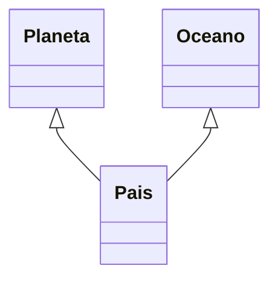

<p class="titulo-capitulo">CAPÍTULO 6</p>

## GUIA DE DESARROLLO

<figure>
    
    <figcaption></figcaption>
</figure>


## 01.27 Guia de desarrollo

### Enlaces importantes
### MongoDB Driver

[JAVA DRIVER CRUD](https://www.mongodb.com/docs/drivers/java/sync/v4.3/fundamentals/crud/read-operations/)

### Tutorial Oficial
https://www.mongodb.com/docs/drivers/java/sync/current/quick-start/

### Ejemplos de Conexion
https://www.mongodb.com/docs/drivers/java/sync/current/fundamentals/connection/connect/#std-label-java-other-ways-to-connect

### MongoDB Driver
https://www.mongodb.com/docs/drivers/java/sync/current/fundamentals/connection/mongoclientsettings/

### Produces
https://openliberty.io/docs/22.0.0.3/access-nosql-databases.html

--------------------------------------------------------------
## Crear repositorios (Repository Drafts)
https://cwiki.apache.org/confluence/display/DeltaSpike/Repository+Drafts
-------------------------------------------------------------
## Generación (Dinamica)de codigo en tiempo de ejecución(Runtime)
## Byte Buddy 
Genera clases dinamica y las invoca seria adecuado para la generación de implementacion  de interfaces
https://bytebuddy.net/#/tutorial
https://picodotdev.github.io/blog-bitix/2016/10/generacion-de-codigo-en-tiempo-de-ejecucion-con-byte-buddy/


G

## SQL Query Converter
Permite pasar sql a Mongodb
https://github.com/vincentrussell/sql-to-mongo-db-query-converter


## Annotation Processing
Generar anotaciones
'''
@Entity
public class Persona{
@Query
private String username;

}

'''


## Anotation Processing generar los metodos para la interface

https://www.baeldung.com/java-annotation-processing-builder

https://github.com/eugenp/tutorials/tree/master/annotations


 ## Leer anotaciones

 https://nadundesilva.medium.com/reading-annotations-at-run-time-using-the-java-reflections-api-ce175ba43b2
 

##  Tutoriales
http://tutorials.jenkov.com/

## Crear Framework WinterFramework
https://github.com/RRBarajas/WinterFramework/


## Jakarta CDI
https://jakarta.ee/specifications/cdi/3.0/jakarta-cdi-spec-3.0.html

## Generic con MongoDB
https://developpaper.com/java-advanced-features-reflection-use-reflection-to-convert-objects-into-mongodb-structure/


## Leer la anotación y ejecutar por reflexión
https://reflectoring.io/java-annotation-processing/


## Dependency Injection, Annotations, and why Java is Better Than you Think it is
https://www.objc.io/issues/11-android/dependency-injection-in-java/


## An Introduction to Annotations and Annotation Processing in Java
An Introduction to Annotations and Annotation Processing in Java
https://reflectoring.io/java-annotation-processing/


# Jakarta EE Starter 
https://start.jakarta.ee/
https://github.com/eclipse-ee4j/starter


## JSON-P
https://www.eclipse.org/community/eclipse_newsletter/2018/november/jsonjakartaee.php

https://rieckpil.de/whatis-json-processing-json-p/


## JSON-B
https://github.com/eclipse-ee4j/jsonb-api

https://www.baeldung.com/java-json-binding-api


## MongoDB Filters
[how-to-add-to-an-existing-mongodb-bson-filter-in-java](https://stackoverflow.com/questions/49875991/how-to-add-to-an-existing-mongodb-bson-filter-in-java)


Orden de invocación de clases
1. RepositoyProcessor.java
2. Invoca al anaizador de las anotaciones
```java
   RepositoryAnalizer repositoryAnalizer = RepositoryAnalizer.get(element, messager, database, typeEntity, repositoryMethodList);
```
3. Genera el codigo de los métodos
```java
   RepositorySourceBuilder repositorySourceBuilder = new RepositorySourceBuilder();
   repositorySourceBuilder.init(repository, repositoryData, repositoryMethodList, database, collection);

```

RepositorySourceBuildar.java
- invoca a SourceBuilder.java
```java
  for (RepositoryMethod repositoryMethod : repositoryMethodList) {
                switch (repositoryMethod.getAnnotationType()) {
                    case SAVE:
                        builder.append(sourceUtilBuilder.save(repositoryData, repositoryMethod));
                        break;
                    case PING:

                        builder.append(sourceUtilBuilder.ping(repositoryData, repositoryMethod));
                        break;
                    case UPDATE:
                        builder.append(sourceUtilBuilder.update(repositoryData, repositoryMethod));
                        break;

                    case LOOKUP:
                        builder.append(sourceUtilBuilder.lookup(repositoryData, repositoryMethod));
                        break;
                    case COUNT:
                        builder.append(sourceUtilBuilder.count(repositoryData, repositoryMethod));
                        break;
                    case REGEXCOUNT:
                        builder.append(sourceUtilBuilder.regexCount(repositoryData, repositoryMethod));
                        break;
                    case REGEX:
                        builder.append(sourceUtilBuilder.regex(repositoryData, repositoryMethod));
                        break;
                    case DELETE:
                        builder.append(sourceUtilBuilder.delete(repositoryData, repositoryMethod));
                        break;
                    case QUERY:
                        builder.append(sourceUtilBuilder.query(repositoryData, repositoryMethod));
                        break;

                }

```


## 01.26 RepositoryMethod
Es una clase interna que se usa para almacenar el contenido de los métodos de los repositorios
```java
public class RepositoryMethod {

     private AnnotationType annotationType;
    private ReturnType returnType;
    private String returnTypeValue;
    private String nameOfMethod;
    private CaseSensitive caseSensitive;
    private String where = "";
    private List<String> tokenWhere = new ArrayList<>();
    private List<ParamTypeElement> paramTypeElement;
    private TypeOrder typeOrder;
    private Boolean havePagination = Boolean.FALSE;
    private Boolean haveSorted = Boolean.FALSE;
    private String nameOfParametersPagination;
    private String nameOfParametersSorted;
    private WhereDescomposed whereDescomposed;
    private List<String> lexemas = new ArrayList<>();
    private List<String> worldAndToken = new ArrayList<>();

    public RepositoryMethod() {
    }

   //
}

```


# Supplier
- Es una clase que se generara al procesar la anotación @Entity
- Soporta valores de tipo simple, List<> , Set<>, Stream<>
- Su función es obtener los datos de un document y convertirlo al entity correspondiente
- Es invocado desde Repository
- Cuando tiene Embebidos el busca internamente
- Cuando un @Referenced tiene Referenciados se inyecta las Referencias y se buscan internamente
- Un @Referecenced con TypeReferenced == EMBEDDED indica que aunque este referenciado debe buscarlo internamente.
- Descompone cada entidad asignando cada atributo
- Para los Referenciados el Framework Inyecta los Repositorios correspondientes a cada entidad y realiza las busquedas.
## Modelo

***
- Definir atributos embebidos y referenciados
- Observe que edificio esta definido como @Referenced pero el tipo de referencia es EMBEDDED, esto indica que el framework no buscara en la colección referenciada EdificioRepository si no que lo cargara como un embebido local. Recuerde que el framework almacena todas las referencias como documentos embebidos y permite que usted especifuque si desea hacer una busqueda referenciada o lo utiliza mediante un Embedded. La ventaja es que permite un mejor performance ya que no se hace una consulta a otra colección. Desventaja es que el programador tendra la responsabilidad de verificar si esa entidad referenciada cambio en la otra colección mediante consultas a la otra colección.
- 
```java
@Entity
public class Tiposdatos {

    @Id(autogeneratedActive = AutogeneratedActive.ON)
    private Long idtiposdatos;

    @Column
    private Double saldo;
    @Column
    private Integer edad;
    @Column
    private Date fecha;
    @Column
    private Boolean activo;
    @Column
    private ObjectId objectId;
    @Column
    private Float flotante;
    @Column
    private int intprimitivo;
    @Column
    private List<String> apodos;
    @Column
    private List<Double> ventas;
    @Column
    private Set<String> deportes;
    @Column
    private Stream<String> valores;
    @Embedded
    private Idioma idioma;

    @Embedded
    private List<Musica> musica;
    @Embedded
    private Set<Persona> persona;

    @Embedded
    private Stream<Corregimiento> corregimiento;

    @Referenced(from = "oceano", localField = "oceano.idoceano")
    private Oceano oceano;
    @Referenced(from = "idprofesion", localField = "profesion.idprofesion")
    private Profesion profesion;
    @Referenced(from = "planeta", localField = "planeta.idplaneta")
    private List<Planeta> planeta;

    @Referenced(from = "grupoprofesion", localField = "grupoprofesion.idgrupoprofesion" )
    private Stream<Grupoprofesion> grupoprofesion;
   

    @Referenced(from = "edificio", localField = "edificio.idedificio",typeReferenced = TypeReferenced.REFERENCED)
    private Set<Edificio> edificio;
    
    @Referenced(from = "museo", localField = "museo.idmuseo",typeReferenced = TypeReferenced.EMBEDDED)
    private List<Museo> museo;
```
***
 @Id o @Column
 Realiza una conversión por cada tipo de datos
```java
 @Id(autogeneratedActive = AutogeneratedActive.ON)
    private Long idtiposdatos;

    @Column
    private Double saldo;
    @Column
    private Integer edad;
    @Column
    private Date fecha;
    @Column
    private Boolean activo;
    @Column
    private ObjectId objectId;
    @Column
    private Float flotante;
    @Column
    private int intprimitivo;
    @Column
    private List<String> apodos;
    @Column
    private List<Double> ventas;
    @Column
    private Set<String> deportes;
    @Column
    private Stream<String> valores;
```
Genera
```java
	 tiposdatos.setIdtiposdatos(document.getLong("idtiposdatos"));
	tiposdatos.setSaldo(document.getDouble("saldo"));
	tiposdatos.setEdad(document.getInteger("edad"));
	tiposdatos.setFecha(document.getDate("fecha"));
	tiposdatos.setActivo(document.getBoolean("activo"));
	tiposdatos.setObjectId(document.getObjectId("objectId"));
	tiposdatos.setFlotante((Float)document.get("flotante"));
	tiposdatos.setIntprimitivo((int)document.get("intprimitivo"));
	tiposdatos.setApodos(document.getList("apodos",java.lang.String.class));
	tiposdatos.setVentas(document.getList("ventas",java.lang.Double.class));
	tiposdatos.setDeportes(new java.util.HashSet<>(document.getList("deportes",java.lang.String.class)));
	tiposdatos.setValores(document.getList("valores",java.lang.String.class).stream());
```
***

***
 @Embedded simple
```java
  @Embedded
    private Idioma idioma;
```
Genera
```java
// Embedded idioma
	Document doc = (Document) document.get("idioma");
	Jsonb jsonb = JsonbBuilder.create();
	Idioma idioma = jsonb.fromJson(doc.toJson(), Idioma.class);
	tiposdatos.setIdioma(idioma);
```
***
@Embedd List<> 
```java
  @Embedded
    private List<Musica> musica;
```
Genera
```java
	// Embedded musica
	List<Musica> musicaList = new ArrayList<>();
	List<Document> musicaDoc = (List) document.get("musica");
	for( Document docMusica : musicaDoc){
		Musica musica = jsonb.fromJson(docMusica.toJson(),Musica.class);
		musicaList.add(musica);
	};
	tiposdatos.setMusica(musicaList);
```
***
@Embedd Set<> 
```java
  @Embedded
    private Set<Persona> persona;
```
Genera
```java
// Embedded persona
	List<Persona> personaList = new ArrayList<>();
	List<Document> personaDoc = (List) document.get("persona");
	for( Document docPersona : personaDoc){
		Persona persona = jsonb.fromJson(docPersona.toJson(),Persona.class);
		personaList.add(persona);
	};
```

***
@Embedd Stream<> 
```java
    @Embedded
    private Stream<Corregimiento> corregimiento;
```
Genera
```java
// Embedded corregimiento
	List<Corregimiento> corregimientoList = new ArrayList<>();
	List<Document> corregimientoDoc = (List) document.get("corregimiento");
	for( Document docCorregimiento : corregimientoDoc){
		Corregimiento corregimiento = jsonb.fromJson(docCorregimiento.toJson(),Corregimiento.class);
		corregimientoList.add(corregimiento);
	};
	tiposdatos.setCorregimiento(corregimientoList.stream());
```

***
## Referenced Simple
Tipo String y tipo LONG
```java
  @Referenced(from = "oceano", localField = "oceano.idoceano")
  private Oceano oceano;
  
    @Referenced(from = "idprofesion", localField = "profesion.idprofesion")
    private Profesion profesion;
```
Genera
```java
// Referenced oceano
	String idOceano= document.getString("oceano.idoceano");
	 Optional<Oceano> oceanoOptional = oceanoRepository.findByPk(idOceano);
	if(oceanoOptional.isPresent()){
		tiposdatos.setOceano(oceanoOptional.get());
	}
	// Referenced profesion
	Long idProfesion= document.getLong("profesion.idprofesion");
	 Optional<Profesion> profesionOptional = profesionRepository.findByPk(idProfesion);
	if(profesionOptional.isPresent()){
		tiposdatos.setProfesion(profesionOptional.get());
	}
```
***
## Referenced List

```java
@Referenced(from = "planeta", localField = "planeta.idplaneta")
    private List<Planeta> planeta;
```
Genera
```java
// Referenced List<planeta>
	 List<String>PlanetaPKList = (List)document.get("planeta.idplaneta");
	List<Planeta> planetaList = new ArrayList<>();
	for(String index :PlanetaPKList){
		 Optional<Planeta> planetaOptional = planetaRepository.findByPk(index);
		if(planetaOptional.isPresent()){
			planetaList.add(planetaOptional.get());
		}
	}
```
***
## Referenced Set

```java
@Referenced(from = "edificio", localField = "edificio.idedificio",typeReferenced = TypeReferenced.REFERENCED)
    private Set<Edificio> edificio;
```
Genera
```java
// Referenced Set<edificio>
	 List<Long>EdificioPKList = (List)document.get("edificio.idedificio");
	List<Edificio> edificioList = new ArrayList<>();
	for(Long index :EdificioPKList){
		 Optional<Edificio> edificioOptional = edificioRepository.findByPk(index);
		if(edificioOptional.isPresent()){
			edificioList.add(edificioOptional.get());
		}
	}
	tiposdatos.setEdificio(new java.util.HashSet<>(edificioList));
```

***
## Referenced Stream

```java
@Referenced(from = "grupoprofesion", localField = "grupoprofesion.idgrupoprofesion")
    private Stream<Grupoprofesion> grupoprofesion;
```
Genera
```java
// Referenced Stream<grupoprofesion>
	 List<String>GrupoprofesionPKList = (List)document.get("grupoprofesion.idgrupoprofesion");
	List<Grupoprofesion> grupoprofesionList = new ArrayList<>();
	for(String index :GrupoprofesionPKList){
		 Optional<Grupoprofesion> grupoprofesionOptional = grupoprofesionRepository.findByPk(index);
		if(grupoprofesionOptional.isPresent()){
			grupoprofesionList.add(grupoprofesionOptional.get());
		}
	}
	tiposdatos.setGrupoprofesion(grupoprofesionList.stream());
```

***
## Definiendo @Referenced de tipo typeReferenced = TypeReferenced.REFERENCED
```java
 @Referenced(from = "edificio", localField = "edificio.idedificio",typeReferenced = TypeReferenced.REFERENCED)
    private Set<Edificio> edificio;
```
Genera
```java
// Referenced Set<edificio>
	 List<Long>EdificioPKList = (List)document.get("edificio.idedificio");
	List<Edificio> edificioList = new ArrayList<>();
	for(Long index :EdificioPKList){
		 Optional<Edificio> edificioOptional = edificioRepository.findByPk(index);
		if(edificioOptional.isPresent()){
			edificioList.add(edificioOptional.get());
		}
	}
	tiposdatos.setEdificio(new java.util.HashSet<>(edificioList));

```

***
## Definiendo @Referenced de tipo Embedded
```java
    @Referenced(from = "edificio", localField = "edificio.idedificio", typeReferenced = TypeReferenced.EMBEDDED)
    private Set<Edificio> edificio;
```
Genera
```java
// Embedded edificio
	List<Edificio> edificioList = new ArrayList<>();
	List<Document> edificioDoc = (List) document.get("edificio");
	for( Document docEdificio : edificioDoc){
		Edificio edificio = jsonb.fromJson(docEdificio.toJson(),Edificio.class);
		edificioList.add(edificio);
	};
	tiposdatos.setEdificio(new java.util.HashSet<>(edificioList));
```

***
Codigo completo generado de la interface
```java
@RequestScoped
public class TiposdatosSupplier  implements Serializable{
// <editor-fold defaultstate="collapsed" desc="inject">

    @Inject
   OceanoRepository oceanoRepository ;
    @Inject
   ProfesionRepository profesionRepository ;
    @Inject
   PlanetaRepository planetaRepository ;
    @Inject
   GrupoprofesionRepository grupoprofesionRepository ;
    @Inject
   EdificioRepository edificioRepository ;
// </editor-fold>
// <editor-fold defaultstate="collapsed" desc=" public Tiposdatos get(Supplier<? extendsTiposdatos> s, Document document) ">

    public Tiposdatos get(Supplier<? extends Tiposdatos> s, Document document) {
        Tiposdatos tiposdatos= s.get(); 
        try {
		 tiposdatos.setIdtiposdatos(document.getLong("idtiposdatos"));
	tiposdatos.setSaldo(document.getDouble("saldo"));
	tiposdatos.setEdad(document.getInteger("edad"));
	tiposdatos.setFecha(document.getDate("fecha"));
	tiposdatos.setActivo(document.getBoolean("activo"));
	tiposdatos.setObjectId(document.getObjectId("objectId"));
	tiposdatos.setFlotante((Float)document.get("flotante"));
	tiposdatos.setIntprimitivo((int)document.get("intprimitivo"));
	tiposdatos.setApodos(document.getList("apodos",java.lang.String.class));
	tiposdatos.setVentas(document.getList("ventas",java.lang.Double.class));
	tiposdatos.setDeportes(new java.util.HashSet<>(document.getList("deportes",java.lang.String.class)));
	tiposdatos.setValores(document.getList("valores",java.lang.String.class).stream());
	// Embedded idioma
	Document doc = (Document) document.get("idioma");
	Jsonb jsonb = JsonbBuilder.create();
	Idioma idioma = jsonb.fromJson(doc.toJson(), Idioma.class);
	tiposdatos.setIdioma(idioma);
	// Embedded musica
	List<Musica> musicaList = new ArrayList<>();
	List<Document> musicaDoc = (List) document.get("musica");
	for( Document docMusica : musicaDoc){
		Musica musica = jsonb.fromJson(docMusica.toJson(),Musica.class);
		musicaList.add(musica);
	};
	tiposdatos.setMusica(musicaList);
	// Embedded persona
	List<Persona> personaList = new ArrayList<>();
	List<Document> personaDoc = (List) document.get("persona");
	for( Document docPersona : personaDoc){
		Persona persona = jsonb.fromJson(docPersona.toJson(),Persona.class);
		personaList.add(persona);
	};
	tiposdatos.setPersona(new java.util.HashSet<>(personaList));
	// Embedded corregimiento
	List<Corregimiento> corregimientoList = new ArrayList<>();
	List<Document> corregimientoDoc = (List) document.get("corregimiento");
	for( Document docCorregimiento : corregimientoDoc){
		Corregimiento corregimiento = jsonb.fromJson(docCorregimiento.toJson(),Corregimiento.class);
		corregimientoList.add(corregimiento);
	};
	tiposdatos.setCorregimiento(corregimientoList.stream());
	// Referenced oceano
	String idOceano= document.getString("oceano.idoceano");
	 Optional<Oceano> oceanoOptional = oceanoRepository.findByPk(idOceano);
	if(oceanoOptional.isPresent()){
		tiposdatos.setOceano(oceanoOptional.get());
	}
	// Referenced profesion
	Long idProfesion= document.getLong("profesion.idprofesion");
	 Optional<Profesion> profesionOptional = profesionRepository.findByPk(idProfesion);
	if(profesionOptional.isPresent()){
		tiposdatos.setProfesion(profesionOptional.get());
	}
	// Referenced List<planeta>
	 List<String>PlanetaPKList = (List)document.get("planeta.idplaneta");
	List<Planeta> planetaList = new ArrayList<>();
	for(String index :PlanetaPKList){
		 Optional<Planeta> planetaOptional = planetaRepository.findByPk(index);
		if(planetaOptional.isPresent()){
			planetaList.add(planetaOptional.get());
		}
	}
	tiposdatos.setPlaneta(planetaList);
	// Referenced Set<grupoprofesion>
	 List<String>GrupoprofesionPKList = (List)document.get("grupoprofesion.idgrupoprofesion");
	List<Grupoprofesion> grupoprofesionList = new ArrayList<>();
	for(String index :GrupoprofesionPKList){
		 Optional<Grupoprofesion> grupoprofesionOptional = grupoprofesionRepository.findByPk(index);
		if(grupoprofesionOptional.isPresent()){
			grupoprofesionList.add(grupoprofesionOptional.get());
		}
	}
	tiposdatos.setGrupoprofesion(grupoprofesionList.stream());
	// Embedded edificio
	List<Edificio> edificioList = new ArrayList<>();
	List<Document> edificioDoc = (List) document.get("edificio");
	for( Document docEdificio : edificioDoc){
		Edificio edificio = jsonb.fromJson(docEdificio.toJson(),Edificio.class);
		edificioList.add(edificio);
	};
	tiposdatos.setEdificio(new java.util.HashSet<>(edificioList));

         } catch (Exception e) {
              MessagesUtil.error(MessagesUtil.nameOfClassAndMethod() + " " + e.getLocalizedMessage());
         }
         return tiposdatos;
     }
// </editor-fold>
```


# Manejo de archivos del proyecto.
- Se utiliza la clase JmoordbCoreFileUtil.java
***
```java
//            System.out.println("Verifica si existe");
//            if (JmoordbCoreFileUtil.existFileInProject(element, entityData.getEntityName() + ".java")) {
//                System.out.println(" Si lo encontre");
//
//            } else {
//                error("Remember to create the file..... " + entityData.getEntityName() + ".java", element);
//            }
//            /**
//             * Paquete
//             */
//            System.out.println("[[[[ obtiene el paquete  ]]]");
//            String packageOfRepository = JmoordbCoreFileUtil.packageOfRepositoryInProject(element, entityData);
//            System.out.println("Paquete estara en  " + packageOfRepository);
//            if (packageOfRepository.equals("")) {
//                //error("No se encontro el repositoryyyyyyyyyyyy", element);
//
//            }
//
//            System.out.println("[[[[ obtiene el path  ]]]]");
//            String pathOfFile = JmoordbCoreFileUtil.pathOfFileInProject(element, entityData.getEntityName() + "Repository.java");
//
//            System.out.println("pathOfFile  " + pathOfFile);
//            
             /**
             * Lee el contenido del archivo
             */
//            System.out.println("\t\t [[[ Lee el archivo ]]]]");
//            String dataOfFile = JmoordbCoreFileUtil.readFileContent(element, entityData.getEntityName() + ".java");
//            System.out.println(dataOfFile);

           
```


***
Verificar si existe un repository
```java
  if (!JmoordbCoreFileUtil.existFileRepositoryInProject(element, entityData)) {
                error("Remember to create the repository for this entity" + entityData.getEntityName() + "Repository", element);
            }
```

## Obtener la ruta de un repository
```java
  String packageOfRepository = JmoordbCoreFileUtil.packageOfRepositoryInProject(element, entityData);
            System.out.println("El paquete estara en  " + packageOfRepository);
            if(packageOfRepository.equals("")){
                error("No se encontro el repositoryyyyyyyyyyyy", element);
                
            }
```
## Verificar si existe un archivo
 ```java
             if (!JmoordbCoreFileUtil.existFileInProject(element, "MyArchivo.java")) {
                error("Remember to create the repository for this entity" + entityData.getEntityName() + "Repository", element);
            }
```

## Obtener la ruta de un archivo
 ```java
 String pathOfFile = JmoordbCoreFileUtil.pathOfFileInProject(element, entityData.getEntityName()+"Repository.java");
 o
 String pathOfFile2 = JmoordbCoreFileUtil.pathOfFileInProject(element,"OceanoRepository.java");
```
Nos devuelve la ruta
 ```shell
/home/avbravo/NetBeansProjects/t/trace/jmoordb-core-processor-example/src/main/java/com/jmoordbcore/processor/example/repository/
```
 
## Leer un archivo
 ```java
  String dataOfFile =JmoordbCoreFileUtil.readFileContent(element, entityData.getEntityName()+".java");
  S
```

Genera
 ```java
 
  ```

 
***
```java
public class JmoordbCoreFileUtil {
    // <editor-fold defaultstate="collapsed" desc="String packageOfRepositoryInProject(Element element, EntityData entityData)">
    /**
     * Devuelve el package donde esta ubicado el repositorio
     *
     * @param element
     * @param entityData
     * @return
     */

    public static String packageOfRepositoryInProject(Element element, EntityData entityData) {
        String result = "";
        try {
            
            final TypeElement classElem = (TypeElement) element;
            final String prefix = System.getProperty("user.dir");
            final String className = classElem.getQualifiedName().toString();
            String fileName = prefix + "/src/main/java/" + className.replace('.', '/') + ".java";

            Path path = Paths.get(fileName);
           
            Integer pos = path.toAbsolutePath().toString().indexOf(System.getProperty("file.separator") + "src" + System.getProperty("file.separator") + "main" + System.getProperty("file.separator") + "java");
            String folderBase = path.toAbsolutePath().toString().substring(0, pos + 15);

            try ( Stream<Path> fileList = Files.find(Paths.get(folderBase), Integer.MAX_VALUE, (filePath, fileAttr) -> fileAttr.isRegularFile() && filePath.toString().endsWith(entityData.getEntityName() + "Repository.java"))) {
                List<String> someThingNew = fileList.sorted().map(String::valueOf).collect(Collectors.toList());
                if (someThingNew.isEmpty()) {
           //         System.out.println("\t\t\t [No se encontro el repositorio de la clase]");

                }
                for (String t : someThingNew) {
                    result = t.toString();
                    result = result.substring(pos + 1);
                    
                    result = result.replace(entityData.getEntityName() + "Repository.java", "");
                    result = result.replace(System.getProperty("file.separator"), ".");
                    result = result.replace("src.main.java.","");
                    t.toString();
            
                }

            }
        } catch (Exception e) {
            MessagesUtil.error(MessagesUtil.nameOfClassAndMethod() + " error() " + e.getLocalizedMessage());
        }
        return result;
    }
    // </editor-fold>
    
    
    
    
    
    
    // <editor-fold defaultstate="collapsed" desc="String packageOfFileProject(Element element, String fileToSearch)">
    /**
     * Devuelve el package donde esta ubicado el repositorio
     *
     * @param element
     * @param entityData
     * @return
     */

    public static String packageOfFileInProject(Element element, String fileToSearch) {
        String result = "";
        try {
           
            final TypeElement classElem = (TypeElement) element;
            final String prefix = System.getProperty("user.dir");
            final String className = classElem.getQualifiedName().toString();
            String fileName = prefix + "/src/main/java/" + className.replace('.', '/') + ".java";

            Path path = Paths.get(fileName);
           

            Integer pos = path.toAbsolutePath().toString().indexOf(System.getProperty("file.separator") + "src" + System.getProperty("file.separator") + "main" + System.getProperty("file.separator") + "java");
            String folderBase = path.toAbsolutePath().toString().substring(0, pos + 15);

            try ( Stream<Path> fileList = Files.find(Paths.get(folderBase), Integer.MAX_VALUE, (filePath, fileAttr) -> fileAttr.isRegularFile() && filePath.toString().endsWith(fileToSearch))) {
                List<String> someThingNew = fileList.sorted().map(String::valueOf).collect(Collectors.toList());
                if (someThingNew.isEmpty()) {
                   // System.out.println("\t\t\t [No se encontro el repositorio de la clase]");

                }
                for (String t : someThingNew) {
                    result = t.toString();
                    result = result.substring(pos + 1);
                    
                    result = result.replace(fileToSearch, "");
                    result = result.replace(System.getProperty("file.separator"), ".");
                    result = result.replace("src.main.java.","");
                    t.toString();
                   
                }

            }
        } catch (Exception e) {
            MessagesUtil.error(MessagesUtil.nameOfClassAndMethod() + " error() " + e.getLocalizedMessage());
        }
        return result;
    }
    // </editor-fold>
    
    
    
    // <editor-fold defaultstate="collapsed" desc="Boolean existFileRepositoryInProject(Element element, EntityData entityData)">
    /**
     * Verifica si existe el repositorio en cualquier directorio del proyecto
     * @param element
     * @param entityData
     * @return 
     */
    public static Boolean existFileRepositoryInProject(Element element, EntityData entityData) {
        Boolean result = Boolean.FALSE;
        try {
            
            final TypeElement classElem = (TypeElement) element;
            final String prefix = System.getProperty("user.dir");
            final String className = classElem.getQualifiedName().toString();
            String fileName = prefix + "/src/main/java/" + className.replace('.', '/') + ".java";

            Path path = Paths.get(fileName);
          
            Integer pos = path.toAbsolutePath().toString().indexOf(System.getProperty("file.separator") + "src" + System.getProperty("file.separator") + "main" + System.getProperty("file.separator") + "java");
            String folderBase = path.toAbsolutePath().toString().substring(0, pos + 15);

            try ( Stream<Path> fileList = Files.find(Paths.get(folderBase), Integer.MAX_VALUE, (filePath, fileAttr) -> fileAttr.isRegularFile() && filePath.toString().endsWith(entityData.getEntityName() + "Repository.java"))) {
                List<String> someThingNew = fileList.sorted().map(String::valueOf).collect(Collectors.toList());
                if (someThingNew.isEmpty()) {
          

                }else{
                     result = Boolean.TRUE; 
                }
//                for (String t : someThingNew) {
//                    result = Boolean.TRUE;
//                    t.toString();
//                  }

            }
        } catch (Exception e) {
            MessagesUtil.error(MessagesUtil.nameOfClassAndMethod() + " error() " + e.getLocalizedMessage());
        }
        return result;
    }

    // </editor-fold>
   
    // <editor-fold defaultstate="collapsed" desc="Boolean existFileInProject(Element element,String fyleToSearch)">
    /**
     * Verifica si existe un archivo en cualquier directorio
     * @param element
     * @param entityData
     * @return 
     */
    public static Boolean existFileInProject(Element element,String fyleToSearch) {
        Boolean result = Boolean.FALSE;
        try {
            System.out.println("....................................................................");
            final TypeElement classElem = (TypeElement) element;
            final String prefix = System.getProperty("user.dir");
            final String className = classElem.getQualifiedName().toString();
            String fileName = prefix + "/src/main/java/" + className.replace('.', '/') + ".java";

            Path path = Paths.get(fileName);
          
            Integer pos = path.toAbsolutePath().toString().indexOf(System.getProperty("file.separator") + "src" + System.getProperty("file.separator") + "main" + System.getProperty("file.separator") + "java");
            String folderBase = path.toAbsolutePath().toString().substring(0, pos + 15);

            try ( Stream<Path> fileList = Files.find(Paths.get(folderBase), Integer.MAX_VALUE, (filePath, fileAttr) -> fileAttr.isRegularFile() && filePath.toString().endsWith(fyleToSearch))) {
                List<String> someThingNew = fileList.sorted().map(String::valueOf).collect(Collectors.toList());
                if (someThingNew.isEmpty()) {
          

                }else{
                    result = Boolean.TRUE;
                }
//                for (String t : someThingNew) {
//                    result = Boolean.TRUE;
//                    t.toString();
//                  }

            }
        } catch (Exception e) {
            MessagesUtil.error(MessagesUtil.nameOfClassAndMethod() + " error() " + e.getLocalizedMessage());
        }
        return result;
    }

    // </editor-fold>
    
    
    
      // <editor-fold defaultstate="collapsed" desc="String pathOfRepositoryInProject(Element element, EntityData entityData)">
    /**
     * Devuelve la ruta del Repositorio en formato /home/
     *
     * @param element
     * @param entityData
     * @return
     */

    public static String pathOfRepositoryInProject(Element element, EntityData entityData) {
        String result = "";
        try {
            System.out.println("....................................................................");
            final TypeElement classElem = (TypeElement) element;
            final String prefix = System.getProperty("user.dir");
            final String className = classElem.getQualifiedName().toString();
            String fileName = prefix + "/src/main/java/" + className.replace('.', '/') + ".java";

            Path path = Paths.get(fileName);
           
            Integer pos = path.toAbsolutePath().toString().indexOf(System.getProperty("file.separator") + "src" + System.getProperty("file.separator") + "main" + System.getProperty("file.separator") + "java");
            String folderBase = path.toAbsolutePath().toString().substring(0, pos + 15);

            try ( Stream<Path> fileList = Files.find(Paths.get(folderBase), Integer.MAX_VALUE, (filePath, fileAttr) -> fileAttr.isRegularFile() && filePath.toString().endsWith(entityData.getEntityName() + "Repository.java"))) {
                List<String> someThingNew = fileList.sorted().map(String::valueOf).collect(Collectors.toList());
                if (someThingNew.isEmpty()) {
           //         System.out.println("\t\t\t [No se encontro el repositorio de la clase]");

                }
                for (String t : someThingNew) {
                    result = t.toString();
                    result = result.substring(pos + 1);
                    
                    result = result.replace(entityData.getEntityName() + "Repository.java", "");
                   // result = result.replace(System.getProperty("file.separator"), ".");
                //    result = result.replace("src.main.java.","");
                    t.toString();
            
                }

            }
        } catch (Exception e) {
            MessagesUtil.error(MessagesUtil.nameOfClassAndMethod() + " error() " + e.getLocalizedMessage());
        }
        return result;
    }
    // </editor-fold>
    
    
    
    
    
    
    // <editor-fold defaultstate="collapsed" desc="String pathOfFileProject(Element element, String fileToSearch)">
    /**
     * Devuelve la ruta del archivo en el repositorio
     *
     * @param element
     * @param entityData
     * @return
     */

    public static String pathiOfFileInProject(Element element, String fileToSearch) {
        String result = "";
        try {
           
            final TypeElement classElem = (TypeElement) element;
            final String prefix = System.getProperty("user.dir");
            final String className = classElem.getQualifiedName().toString();
            String fileName = prefix + "/src/main/java/" + className.replace('.', '/') + ".java";

            Path path = Paths.get(fileName);
           

            Integer pos = path.toAbsolutePath().toString().indexOf(System.getProperty("file.separator") + "src" + System.getProperty("file.separator") + "main" + System.getProperty("file.separator") + "java");
            String folderBase = path.toAbsolutePath().toString().substring(0, pos + 15);

            try ( Stream<Path> fileList = Files.find(Paths.get(folderBase), Integer.MAX_VALUE, (filePath, fileAttr) -> fileAttr.isRegularFile() && filePath.toString().endsWith(fileToSearch))) {
                List<String> someThingNew = fileList.sorted().map(String::valueOf).collect(Collectors.toList());
                if (someThingNew.isEmpty()) {
                   // System.out.println("\t\t\t [No se encontro el repositorio de la clase]");

                }
                for (String t : someThingNew) {
                    result = t.toString();
                    result = result.substring(pos + 1);
                    
                    result = result.replace(fileToSearch, "");
                    result = result.replace(System.getProperty("file.separator"), ".");
                   // result = result.replace("src.main.java.","");
                    t.toString();
                   
                }

            }
        } catch (Exception e) {
            MessagesUtil.error(MessagesUtil.nameOfClassAndMethod() + " error() " + e.getLocalizedMessage());
        }
        return result;
    }
    // </editor-fold>
    
}

```
