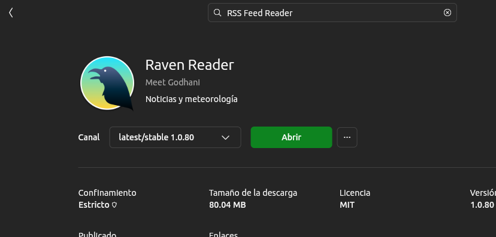

# 20.0 Instalacion

Lector de RSS  Raven Reader
```shell

```




Visualizador de bases de datos MongoDB
```
DB-Gate

```


```
"Ubuntu":{
"instalar ubuntu":{
                  1-Insertar USB
                  2-Presionar F2 Selecccionar inicio USB
                  3-Presionar F12
]


	"tools":"Creador de discos de arranque",
	"notas":"Notes",
	"slack":"Slack",
	"diff": {
          	"name":"diffpdf"
         	"install":"sudo apt-get install diffpdf"
                },
        "utube":{
               "install":"sudo snap install utube"
        }

```
            

```json
"Diseño":
{

Krita

ShotCut edita videos


Pencil para crear Mockup
  {
  sudo snap install pencil-snap-demo
  }
  
```


-->Draw.io Crea diagramas de flujo
{
sudo snap install drawio
}
}
sudo snap install video-downloader
-->kazam videos
  | SUPER+CTRL+R inicio
  | SUPER+CTRL+P Pausa
     (presionar nuevamente para continuar)
  | SUPER+CTRL+F Finaliza
  | SUPER+CRTL+Q -Sale de la grabacion
=========================================================

"Java":{
	"AdopOpenJDK",
	"Apache NetBeans":{
            	"plugins":"Github Issues Support"
            	},
	"Visual Studio Code",
	"Git",
	"Prometeush",
	"Grafana"
	"Docker",
}

"Databases":{
	"MongoDB":{
	"install":{
               sudo apt update	
               sudo apt install mongodb
               systemctl status mongodb
               sudo systemctl disable mongodb

	
	}{
	
	
	
	         "tools":{
                             "sudo snap install robo3t-snap"
                         }
                 },
        "SQL Servers",
	"Azure Data Studio"
}

# Microservices
-->PayaraMicro
-->Postman

#UTP
ip:192.168.60.243
mascara:255.255.255.0
puerta:192.168.60.1
dns:192.168.18.2

#WIFI IMPRESORA

name: Direct-cm8F-g400 Series
password:jJMASinkBS


--------------------------------------------------


-----------------
MONITOREO
: sudo apt install htop -y 
and running it in your terminal with just the command 
htop
----------------------


***
Visor de markdown
[mdview/](https://snapcraft.io/install/mdview/ubuntu)

Instalar
sudo snap install mdview

para ver el archivo en el browser
mdview miarchivo.md

