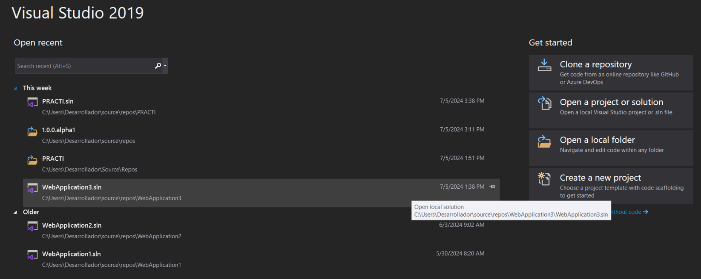
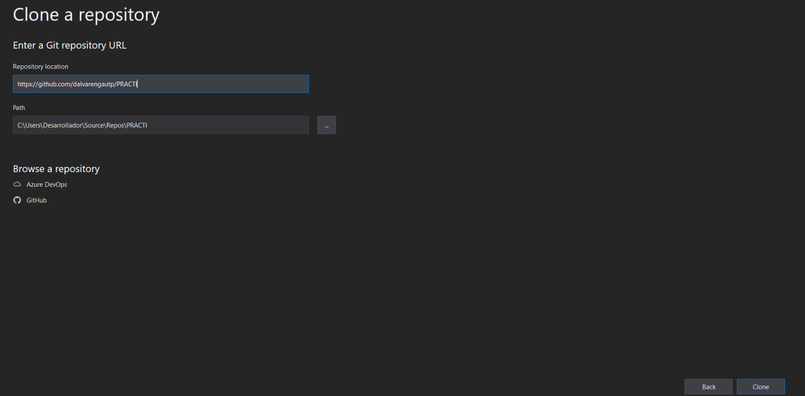
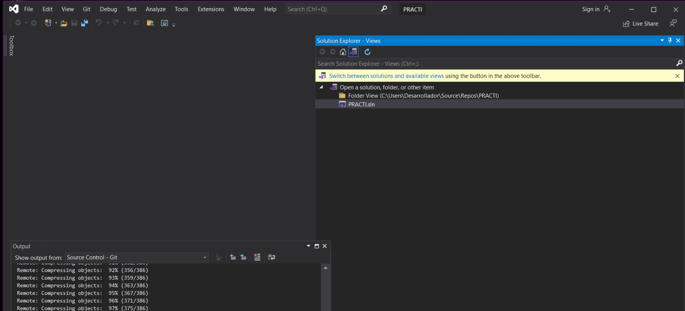
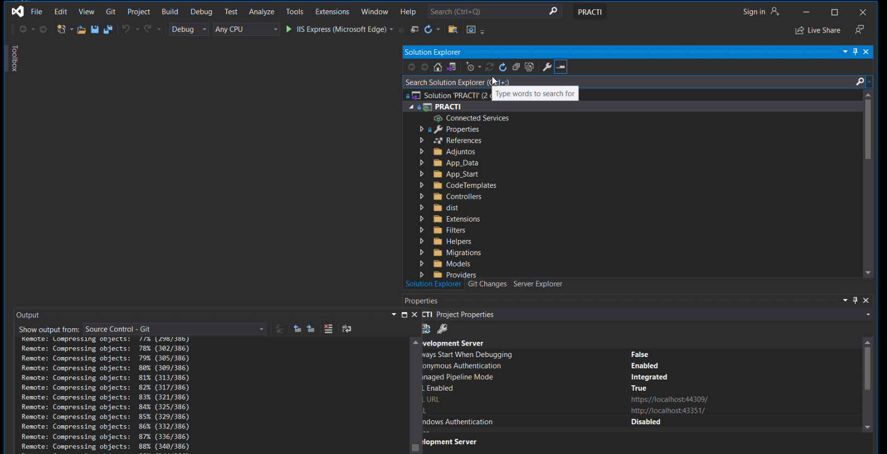
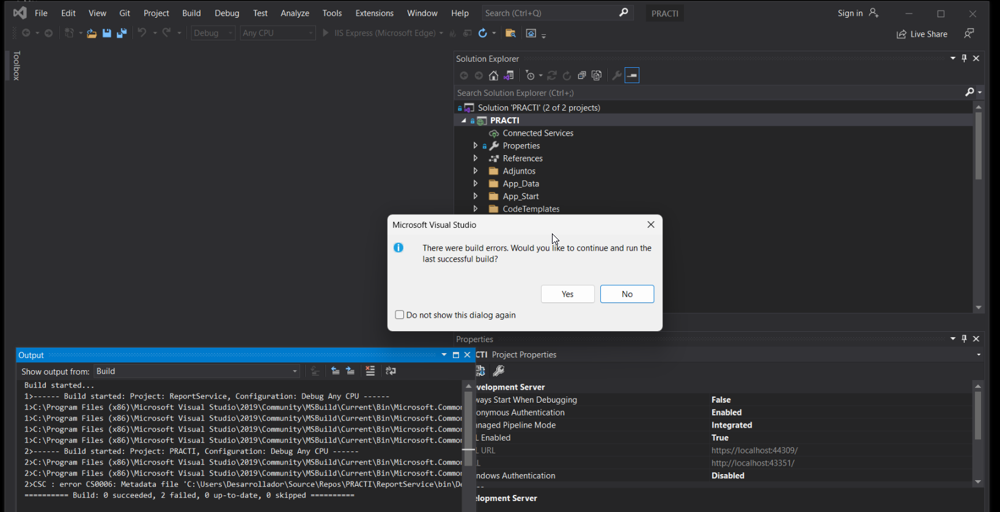
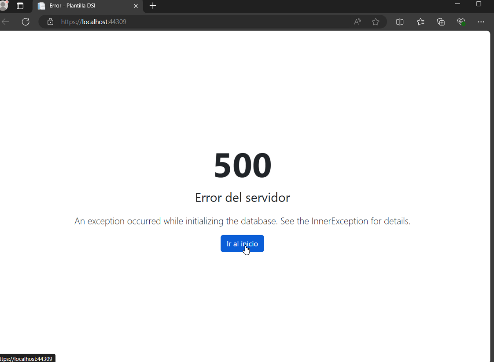

# Repositoriogit

[PRACTI](https://github.com/dalvarengautp/PRACTI)

## Numero de versiones 

```

<master>
  
<1.0.0> - 

<1.0.0.rc3> - 

<1.0.0.rc2> - 

<1.0.0.rc1> - 

<1.0.0.alpha3> -

<1.0.0.alpha2> - 

<1.0.0.alpha1> -

```


## Procedimiento de Clonación

1. Ingresar  Visual Studio



Seleccionar Clone a Repository


2. Indique el url del repositorio a clonar
```
https://github.com/dalvarengautp/PRACTI
```


De clic en el botón Clone

3. De doble clic en Practi.sln para abrir el proyecto


4. Ejecute el proyecto



5. Nos muestra que tiene errores
   

   
6. Errores encontrados

```
Severity	Code	Description	Project	File	Line	Suppression State
Error	CS0006	Metadata file 'C:\Users\Desarrollador\Source\Repos\PRACTI\ReportService\bin\Debug\ReportService.dll' could not be found	PRACTI	C:\Users\Desarrollador\Source\Repos\PRACTI\PRACTI\CSC	1	Active

Severity	Code	Description	Project	File	Line	Suppression State
Error		Could not copy the file "C:\Users\Desarrollador\Source\Repos\PRACTI\ReportService\SqlServerTypes\x86\msvcr120.dll" because it was not found.	ReportService			


```


Clean solution


# detener ejecución

# ejecutar desde consola
```
Update-Package Microsoft.CodeDom.Providers.DotNetCompilerPlatform -r

```

# Ejecutar el proyecto


# No se incluye la base de datos



Crear la carpeta App_Data dentro de PRACTI/PRACTI


Descargar los archivos de bases de datos y copiarlos en la carpeta Add_Data


##  Comando Actualizar Base datos
tendrias que ejecutar el comando: Update-Database


#~ SelectOneMenu
```
https://tom-select.js.org/examples/create-filter/#item-creation-examples
```

## Datatable

```
https://datatables.net/
```

---
# Crear Entity

En la carpeta Models->Tables


Contenido

```
namespace PRACTI.Models.Tables
{
    public class TipoEventoRegistro
    {
        [Key]
        [DatabaseGenerated(DatabaseGeneratedOption.None)]
        public byte Id { get; set; }
        [Required]
        [StringLength(60)]
        [Index("TipoEventoRegistro", IsUnique = true)]
        public string Nombre { get; set; }
        public virtual ICollection<EventoRegistro> EventoRegistro { get; set; }
        public DateTime CreatedAt { get; set; }
        public DateTime? UpdatedAt { get; set; }
    }
}
```

---
# View Model
Seleccionar Model-> Add -> Class 


