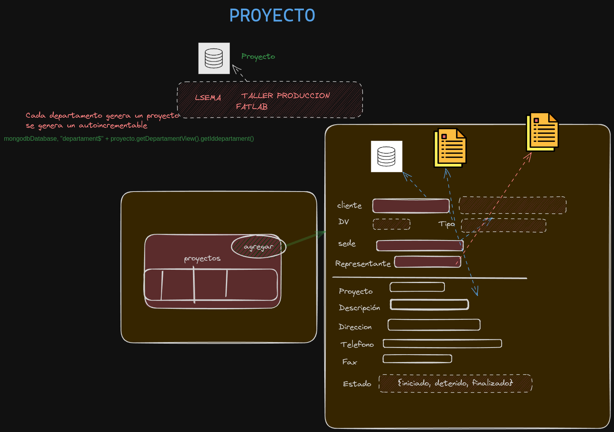

# Project Name: Network Enterprise Responsive Yaml System


Project Code: Nerys

sistema para gestionar los cobros 

## Tabla de Contenidos 

* [1. Introducción](#1-general)
    * [1.1. Detalle](#11-detalle)
* [2. Modulos](#2-modulos)
    * [2.1. Cliente](#21-clientes)
    * [2.2. Proyecto](#22-proyecto)
    * [2.3. Cotización](#23-cotizacion)
 

# 1. General

sistema para gestionar los cobros 

## 1.1. Detalle

Para Lsema, fatlab, taller producción

### 1.1.1. Modulos

# 2. Modulos


### 2.1 Clientes 

<details>
<summary>Clientes</summary>
<p>
   
Gestiona clientes de tipo Natural o jurídico.
<details>
<summary>Introducción</summary>
<p>
Tipo de cliente:

**Natural:**
 Establece el formato de cédula en base al tipo de cliente.

**Jurídico:**
* Aplica cuando es una empresa 
* Establece formato para RUC.
* Permite gestionar Sedes y Representantes de cada cliente

</p>
</details>

<details>
<summary>Entity</summary>
<p>
   
```java
@Entity
public class Cliente {
      @Id(autogeneratedActive = AutogeneratedActive.ON)
    private Long idcliente;
    @Column(generateQuery = true)
    private String cedularuc;

    @Column(commentary = "natural/juridico", generateQuery = true)
    private String tipocliente;
    @Column
    private String dv;
    @Column(generateQuery = true)
    private String name;
    @Embedded
    private List<Sede> sede;

    @Embedded
    private List<Representante> representante;

    @Column
    private String direccion;
    @Column
    private String telefono;
    @Column
    private String celular;
    
    @Column
    private String fax;
    
    
    @Column
    private String email;
    @Column
    private String observacion;

   
    @Column
    private Boolean gobierno;
       
    @Column
    private Boolean active;
    
    
    @Embedded
    List<ActionHistory> actionHistory;


```


</p>
</details>

</p>
</details>

___
### 2.2 Proyecto

<details><summary>Proyectos</summary>
<p>
   
* Cada unidad maneja proyecto diferente, por lo que se almacena en la coleccion proyecto el id y @EntityView DepartamentView
* Se genera un autoincrementable para id + departamentView de la siguiente manera


```java
  
proyecto.setId(autogeneratedRepository.generate(mongodbDatabase, "departament$" + proyecto.getDepartamentView().getIddepartament()));
  
```
  
* El departamento se obtiene al momento de logearse el usuario
  
* Se debe controlar el estado del proyecto. (iniciado, detenido, cancelado, finalizado)

Proyectos tienen estado
```
{iniciado, detenido, finalizado}

```
<details><summary>Diagramas</summary>
<p>
   


</p>
</details>

<details><summary>Entidades</summary>
<p>
   
```java
@Entity
public class Proyecto {

    @Id(autogeneratedActive = AutogeneratedActive.ON)
    private Long idproyecto;

    @Column(commentary = "Se genera por cada departamento")
    private Long id;

    @ViewReferenced(from = "departament", localField = "iddepartament")
    private DepartamentView departamentView;

    @Column
    private String proyecto;
    @Column
    private String descripcion;

    @Column
    private String direccion;

    @Column
    private String telefono;

    @Column
    private String fax;

    @Column
    private String email;

    @Column
    private Boolean active;

    @Column(commentary = "iniciado, detenido, cancelado,finalizado")
    private String estado;

    @Column(commentary = "Panameño en el extranejero/Extranjero con cédula/Naturalizado/Panameño antes de vigencia/Población indigena/Número de pasaporte/Juridico", generateQuery = true)
    private String tipocliente;

    @Referenced(from = "Cliente", localField = "idcliente")
    private Cliente cliente;

    @Embedded
    private Sede sede;

    @Embedded
    private Representante representante;

    @Column
    private Date fechaincial;

    @Column
    private Date fechafinal;

    @Embedded
    List<ActionHistory> actionHistory;

```
</p>
</details>

</p>
</details>


---

### 2.3 Cotizacion

<details><summary>Cotización</summary>
<p>

### Cotización 


</p>
</details>


