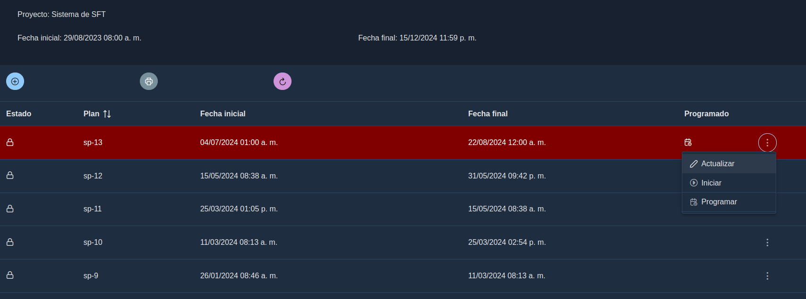
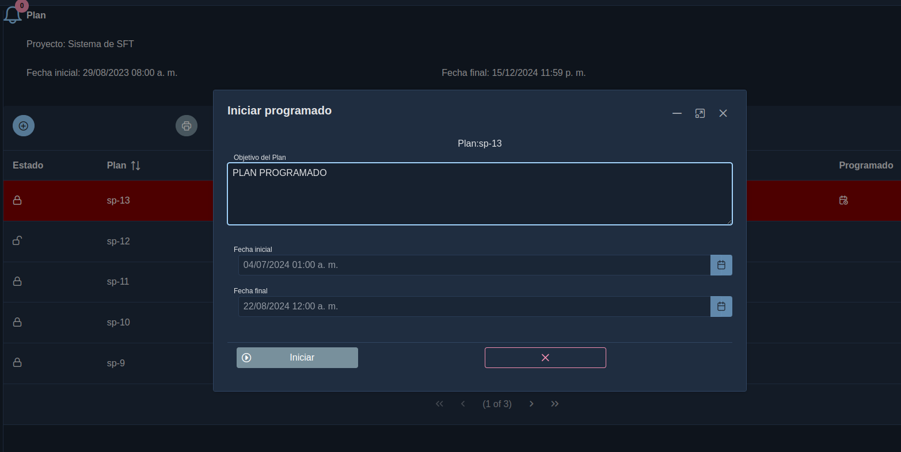
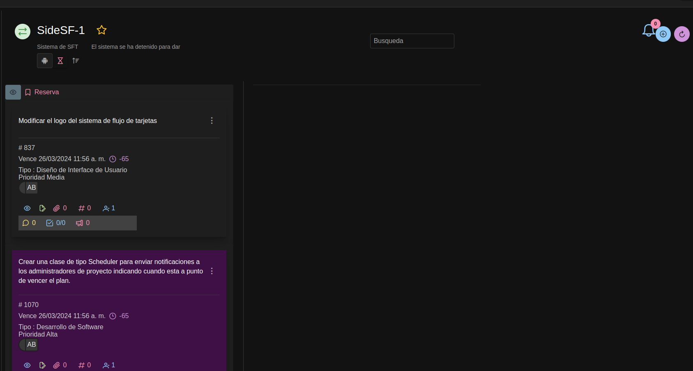

# sprint

* Cuando se crea un proyecto se puede generar todos los planes programados de manera automatica.
* Los sprint o planes de proyectos son dinamicos es decir se crea una colección por cada proyecto con la sintaxis : sprint_{idproyecto}
* Los planes que se crean desde la opción Planes pasan a un estado de programado inicialmente

## Validar de fechas 

* Para validar las fechas de un plan a crear o editar se debe recorrer todos los sorint y validar que no este en el rango, ya que puede creerse un sprint después de un programado pero con fechas anteriores 

# Programar Plan

* Permite crear planes para ser usados en el futuro
* Estos tienen condición programado true
* Cuando un plan pasa de programado a activo se cambia programado a false.
* Agregar atributo programado al sprint, cuando es nuevo plan y no es programado se asigna en false.
* Cuando hay plan abierto y se crea uno nuevo se valida las fechas y sera programado = true, abierto=false
* Recorrer todos los registros de sprint y colocar programado a false

## Iniciar un Plan programado
* Iniciar un plan es convertirlo en un plan abierto, por lo tanto no deben haber otro plan abierto
* Si existe un plan abierto debe ser cerrado primero para luego iniciar un plan programado.
* Indica que es el plan actual que se estara trabajando el tablero
* Asigna la fecha hora actual como hora de inicio
* Pasa los que estan en backlog
* Pasa las tarjetas en programación al tablero

## Programar

* Se creara una reserva por cada plan programado seleccionado
* Las tarjetas pueden ser movidas a otros planes programados al backlog o a un tablero
* 

---

# Reserva

* La reserva normal se mantiene, esta son pasadas desde el tablero actual al backlog
* Se pasan de la reserva al tablero
* Se pasan de la reserva a Reserva Programada
  
---

