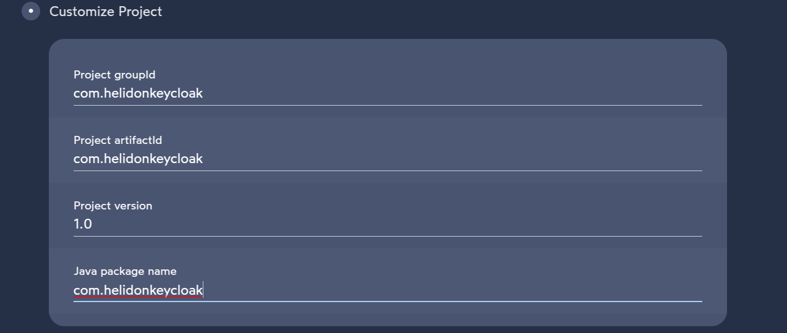
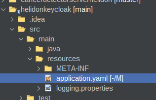
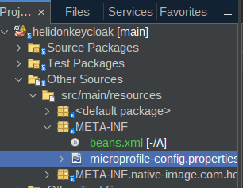
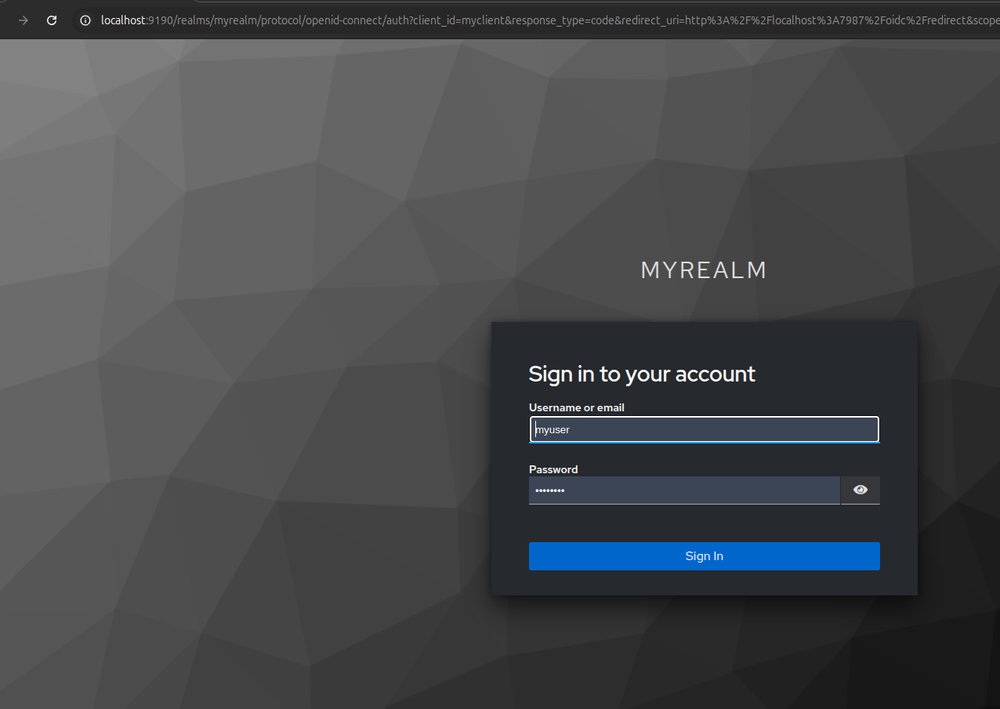

# 2.0 Helidon

Proyecto **helidonkeycloak**
[https://github.com/avbravo/h.git](https://github.com/avbravo/h.git)

Crear un proyecto con Helidon Starter **https://helidon.io/**



Presione el botón descargar

Descomprima el archivo y abralo en su IDE favorito


Abra el archivo **README.md** y se muestra los siguientes comandos


Ingrese a la consola para ejecutarlos


```bash
mvn package
java -jar target/helidonkeycloak.jar
```

## Exercise the application

Basic:
```
curl -X GET http://localhost:8080/simple-greet
Hello World!
```


JSON:
```
curl -X GET http://localhost:8080/greet
{"message":"Hello World!"}

curl -X GET http://localhost:8080/greet/Joe
{"message":"Hello Joe!"}

curl -X PUT -H "Content-Type: application/json" -d '{"greeting" : "Hola"}' http://localhost:8080/greet/greeting

curl -X GET http://localhost:8080/greet/Jose
{"message":"Hola Jose!"}
```


## Try health

```
curl -s -X GET http://localhost:8080/health
{"outcome":"UP",...

```


## Building a Native Image

The generation of native binaries requires an installation of GraalVM 22.1.0+.

You can build a native binary using Maven as follows:

```
mvn -Pnative-image install -DskipTests
```

The generation of the executable binary may take a few minutes to complete depending on
your hardware and operating system. When completed, the executable file will be available
under the `target` directory and be named after the artifact ID you have chosen during the
project generation phase.


## Try metrics

```
# Prometheus Format
curl -s -X GET http://localhost:8080/metrics
# TYPE base:gc_g1_young_generation_count gauge
. . .

# JSON Format
curl -H 'Accept: application/json' -X GET http://localhost:8080/metrics
{"base":...
. . .
```


## Building the Docker Image

```
docker build -t helidonkeycloak .
```

## Running the Docker Image

```
docker run --rm -p 8080:8080 helidonkeycloak:latest
```

Exercise the application as described above.
                                

## Run the application in Kubernetes

If you don’t have access to a Kubernetes cluster, you can [install one](https://helidon.io/docs/latest/#/about/kubernetes) on your desktop.

### Verify connectivity to cluster

```
kubectl cluster-info                        # Verify which cluster
kubectl get pods                            # Verify connectivity to cluster
```

### Deploy the application to Kubernetes

```
kubectl create -f app.yaml                              # Deploy application
kubectl get pods                                        # Wait for quickstart pod to be RUNNING
kubectl get service  helidonkeycloak                     # Get service info
kubectl port-forward service/helidonkeycloak 8081:8080   # Forward service port to 8081
```

You can now exercise the application as you did before but use the port number 8081.

After you’re done, cleanup.

```
kubectl delete -f app.yaml
```


## Building a Custom Runtime Image

Build the custom runtime image using the jlink image profile:

```
mvn package -Pjlink-image
```

This uses the helidon-maven-plugin to perform the custom image generation.
After the build completes it will report some statistics about the build including the reduction in image size.

The target/helidonkeycloak-jri directory is a self contained custom image of your application. It contains your application,
its runtime dependencies and the JDK modules it depends on. You can start your application using the provide start script:

```
./target/helidonkeycloak-jri/bin/start
```

Class Data Sharing (CDS) Archive
Also included in the custom image is a Class Data Sharing (CDS) archive that improves your application’s startup
performance and in-memory footprint. You can learn more about Class Data Sharing in the JDK documentation.

The CDS archive increases your image size to get these performance optimizations. It can be of significant size (tens of MB).
The size of the CDS archive is reported at the end of the build output.

If you’d rather have a smaller image size (with a slightly increased startup time) you can skip the creation of the CDS
archive by executing your build like this:

```
mvn package -Pjlink-image -Djlink.image.addClassDataSharingArchive=false
```

For more information on available configuration options see the helidon-maven-plugin documentation.
                                


## basic autentification microprofile restclient

https://itnext.io/authentication-with-microprofile-rest-client-d1e9da774f70


---
Edite el archivo pom.xml y agregue

```xml
<dependency>
    <groupId>io.helidon.microprofile</groupId>
    <artifactId>helidon-microprofile-oidc</artifactId>
</dependency>
```

Cree el archivo application.yaml en el directorio **src/main/resources/application.yaml**

En el tutorial https://helidon.io/docs/v3/mp/guides/security-oidc decia que es en **src/main/resources/application.yaml**



Configure el archivo con los siguientes parametros:

* client-id: Es el cliente que configuramos en keycloak.
* The client secret: Generado por Keycloak durante la sección Crear un cliente.
* identity-uri: Se utiliza para redirigir a la usuario a keycloak.
* frontend-uri: Te dirigirá de nuevo a la aplicación..

```yaml

security:
  providers:
    - abac:
      # Adds ABAC Provider - it does not require any configuration
    - oidc:
        redirect-uri: "/oidc/redirect"
        audience: "account"
        client-id: "myclient"   
        header-use: true
        client-secret: "gfXCrTap61O45MJcuTd1Q9JaYYC7RKeS"  
        identity-uri: "http://localhost:9190/realms/myrealm/"   
        frontend-uri: "http://localhost:7987"


```

Asegurese que Keycloak y la aplicación no esten corriendo en el mismo puerto.

Edite el archivo microprofile-config.properties y cambiamos el puerto al 7987 es decir el mismo que usemos en **frontend-uri**

```
server.port=7987
server.host=0.0.0.0

# Change the following to true to enable the optional MicroProfile Metrics REST.request metrics
metrics.rest-request.enabled=false

# Application properties. This is the default greeting
app.greeting=Hello

```





## Seguridad de la aplicación

Abra la clase GreetResource.java y modifique el método **getDefaultMessage()**

```java
@GET
@Produces(MediaType.APPLICATION_JSON)
public Message getDefaultMessage() {
    return createResponse("World");
}

```

Añada la anotación **@Authenticated** y el import **import io.helidon.security.annotations.Authenticated;**

```java
@Authenticated
@GET
@Produces(MediaType.APPLICATION_JSON)
public Message getDefaultMessage() {
    return createResponse("World");
}

```

Cuando un cliente envía una solicitud HTTP GET al endpoint http://localhost:7987/greet, se le redirige a Keycloak. 

Keycloak comprueba si el cliente tiene la autorización necesaria para acceder a este endpoint. 

Si el cliente puede iniciar sesión correctamente, Keycloak lo redirige al endpoint deseado. 

Si el cliente no puede iniciar sesión o los datos de acceso requeridos están incompletos, Keycloak deniega el acceso.


## Pruebas de la aplicación

Desabilitar la ejecución de los test mediante **-DskipTest=true**

```shell
mvn package -DskipTests=true

java -jar target/helidonkeycloak.jar 

```

Ingrese al navegador y pruebe el acceso a [http://localhost:7987/greet/Michael](http://localhost:7987/greet/Michael)

Genera el mensaje
```shell

{
  "message": "Hello Michael!"
}

```

Intente acceder a [http://localhost:7987/greet](http://localhost:7987/greet)

Se redirigue al portal de keycloak para autentificarse



