# 3.0 JWT

[Configurar JWT con Keycloak](https://docs.platformatic.dev/docs/next/guides/jwt-keycloak)

[MicroProfile JWT Auth to secure your applications](https://rieckpil.de/whatis-eclipse-microprofile-jwt-auth/)

Cree un nuevo Realm 

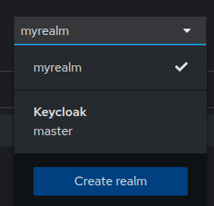

coloque como nombre **myjwt**

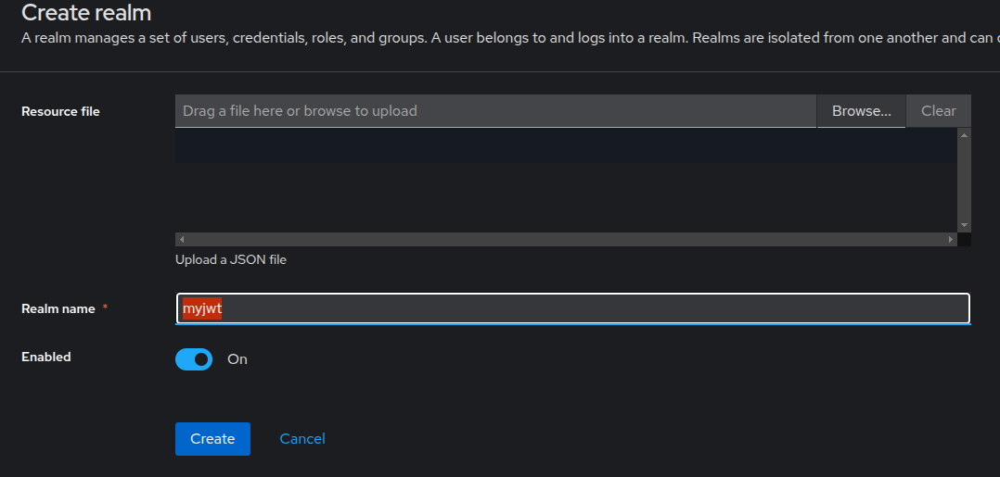

Presione el botón **Save**

Ingresar a keycloak y crear un nuevo cliente

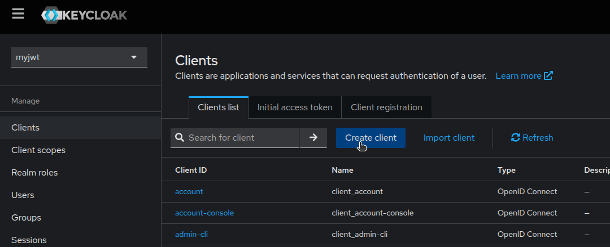


Establecer como ID **keycloak-jwt**


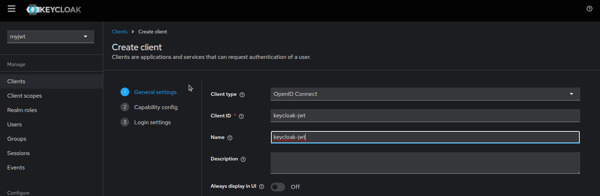

Presionar el botón Next

Activar:

Client authentication: **On**

Authentication flow: **Standar Flow**

- [x] Direct access grant

- [x] Service accounts roles


De click en el botón **Next**


Configure: 

Valid redirect URIs: **/***

Web origins: **/***

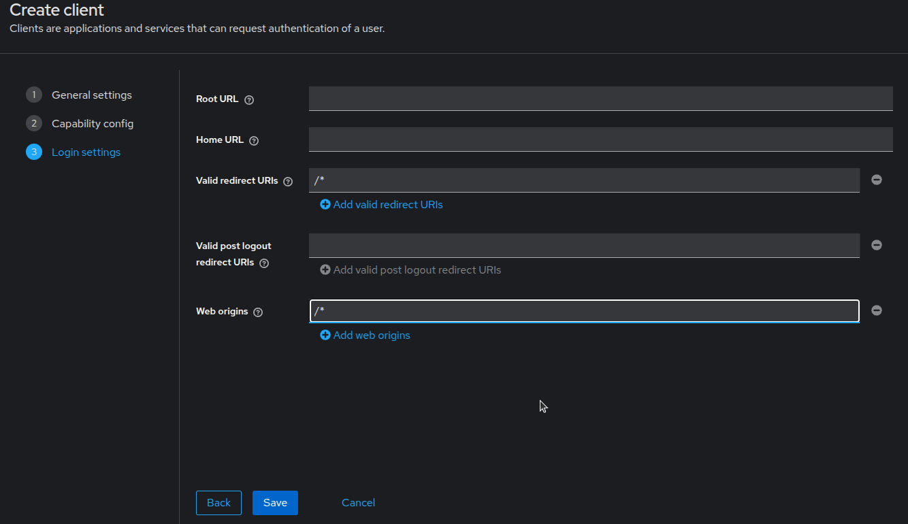

Presione el boton Save


En la pestaña Credentials

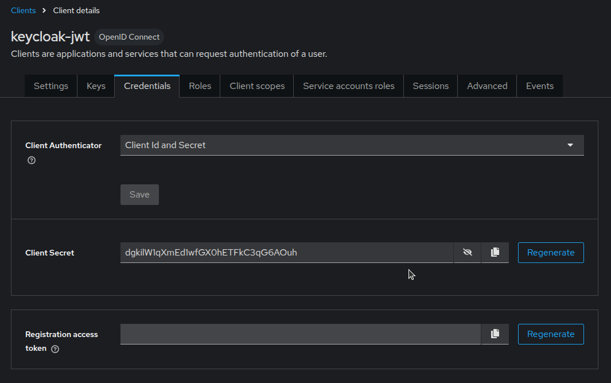

Puede copiar el Client Secret

Home

```
dgkilW1qXmEd1wfGX0hETFkC3qG6AOuh

```

Work:

```
xsSN4BbgYDYm0bd4ay5HNaXxIlB254Yk

```

## Realm roles

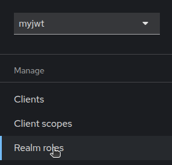

De clic en el botón **Create role**

Cree un rol llamado **movies:read**


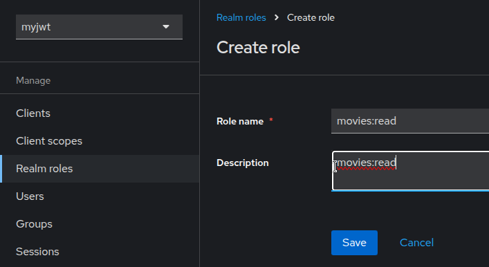

presione el botón **Save**

Regrese a la pestaña Clientes y seleccione **keycloak-jwt**

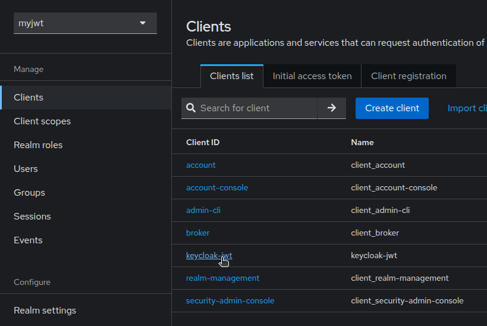


Seleccione la pestaña **Service Account Roles** de clic en Assing Role


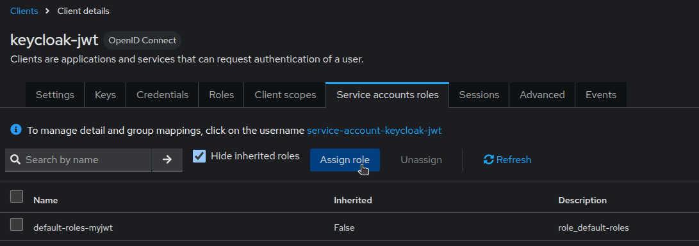

Se muestra la lista de roles

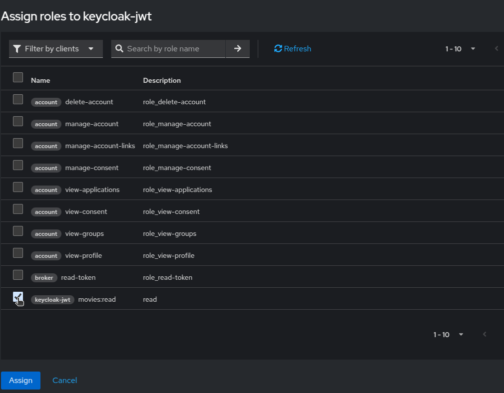


En el filtro seleccionar **Filter by realm roles**

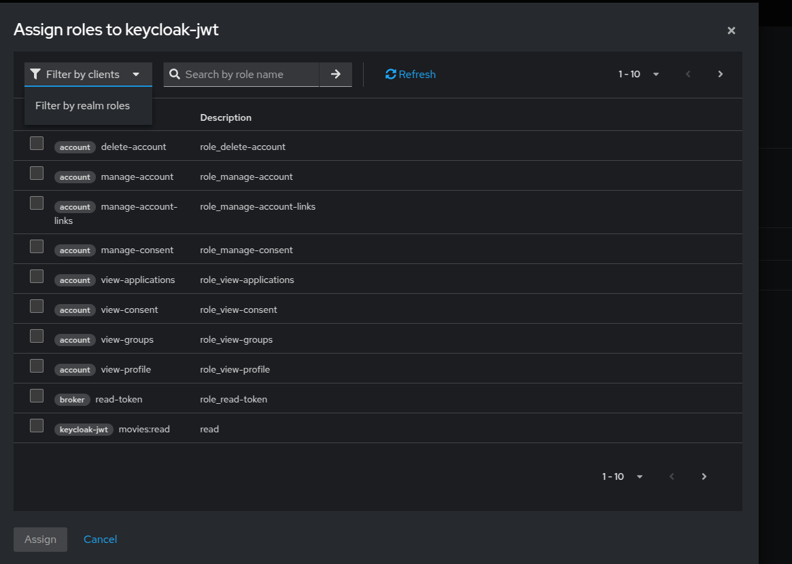

Seleccione la lista de rol seleccione **movies:read**

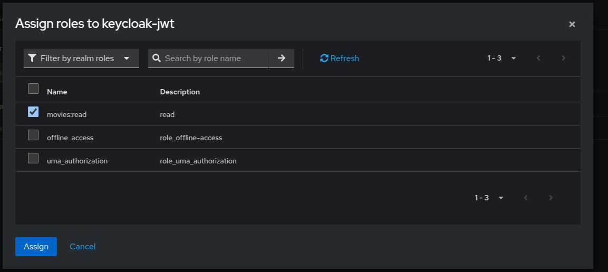

Se muestra la lista de roles

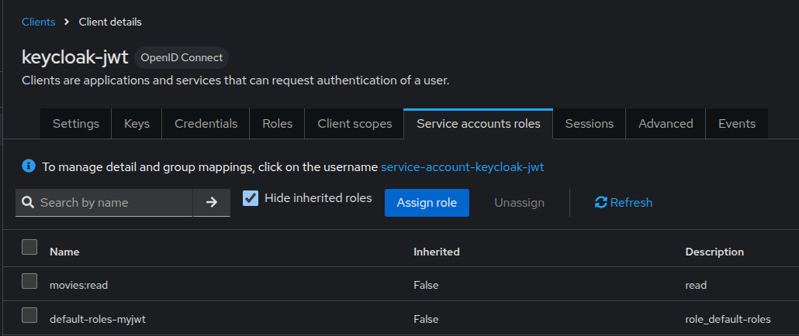


Desde consola ejecute

* Home

```shell

  curl -L --insecure -s -X POST 'http://127.0.0.1:9190/realms/myjwt/protocol/openid-connect/token' \
 -H 'Content-Type: application/x-www-form-urlencoded' \
 --data-urlencode 'client_id=keycloak-jwt' \
 --data-urlencode 'grant_type=client_credentials' \
 --data-urlencode 'client_secret=dgkilW1qXmEd1wfGX0hETFkC3qG6AOuh'
```

* Work
* 
```shell

  curl -L --insecure -s -X POST 'http://127.0.0.1:9190/realms/myjwt/protocol/openid-connect/token' \
 -H 'Content-Type: application/x-www-form-urlencoded' \
 --data-urlencode 'client_id=keycloak-jwt' \
 --data-urlencode 'grant_type=client_credentials' \
 --data-urlencode 'client_secret=xsSN4BbgYDYm0bd4ay5HNaXxIlB254Yk'

```


Se muestra el resultado generado

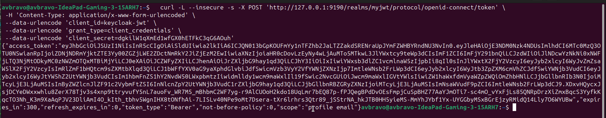


```shell

{"access_token":"eyJhbGciOiJSUzI1NiIsInR5cCIgOiAiSldUIiwia2lkIiA6ICJQN013bGpKOUFmYy1nTFZhb2JaLTZZakdSRENraUpJYmFZWHBYRndNU3NvIn0.eyJleHAiOjE3NDM0ODA2MzcsImlhdCI6MTc0MzQ4MDMzNywianRpIjoiMmM2Nzg4Y2MtZTBkYS00YmFkLWE2NDctODEwY2E1MTJmOTQ0IiwiaXNzIjoiaHR0cDovLzEyNy4wLjAuMTo5MTkwL3JlYWxtcy9teWp3dCIsImF1ZCI6ImFjY291bnQiLCJzdWIiOiJlNDcwYzNkNi0xNWFjLTQ3NjMtODkyMC0zNWZmOTQxMTBiMjYiLCJ0eXAiOiJCZWFyZXIiLCJhenAiOiJrZXljbG9hay1qd3QiLCJhY3IiOiIxIiwiYWxsb3dlZC1vcmlnaW5zIjpbIi8qIl0sInJlYWxtX2FjY2VzcyI6eyJyb2xlcyI6WyJvZmZsaW5lX2FjY2VzcyIsImRlZmF1bHQtcm9sZXMtbXlqd3QiLCJ1bWFfYXV0aG9yaXphdGlvbiJdfSwicmVzb3VyY2VfYWNjZXNzIjp7ImtleWNsb2FrLWp3dCI6eyJyb2xlcyI6WyJtb3ZpZXM6cmVhZCJdfSwiYWNjb3VudCI6eyJyb2xlcyI6WyJtYW5hZ2UtYWNjb3VudCIsIm1hbmFnZS1hY2NvdW50LWxpbmtzIiwidmlldy1wcm9maWxlIl19fSwic2NvcGUiOiJwcm9maWxlIGVtYWlsIiwiZW1haWxfdmVyaWZpZWQiOmZhbHNlLCJjbGllbnRIb3N0IjoiMTcyLjE3LjAuMSIsInByZWZlcnJlZF91c2VybmFtZSI6InNlcnZpY2UtYWNjb3VudC1rZXljbG9hay1qd3QiLCJjbGllbnRBZGRyZXNzIjoiMTcyLjE3LjAuMSIsImNsaWVudF9pZCI6ImtleWNsb2FrLWp3dCJ9.fY6BddnkJV3Hu61c_TZTHg3E9xUdUb9VgOkvenr8BoY-IiarlbBMVzVFeQzgAStkoqgOvcYkyaGT9WgIdANuL7ZNFHbmFZr1fkk3mBsXcsSW2a_ERZbe99s7vXoQkpJU4ZtwDGfwscZupp38sn2yL_pNSPgzYujrZmzAL10htJ1nHUG-4j6-1INnM_IufBTrHJaR9qVAe-1CprZKaVNVgfj84Q-WLiqk5F1h_ZWXGT_hQ-vZ5bQaZj6ZzpzaqifuCcTtkidO29uq1TXhcPtmOdNOyZCEZF6p2IAo8ncSObu7-Z04un70etvKqy70V3NrcE62__U6XYYpfPno_J4xdQ","expires_in":300,"refresh_expires_in":0,"token_type":"Bearer","not-before-policy":0,"scope":"profile email"}
```

Abra en el navegador en la pagina [https://jwt.io/](https://jwt.io/)

Pegue solo el contenido de "access_token" se muestra el contenido del JWT

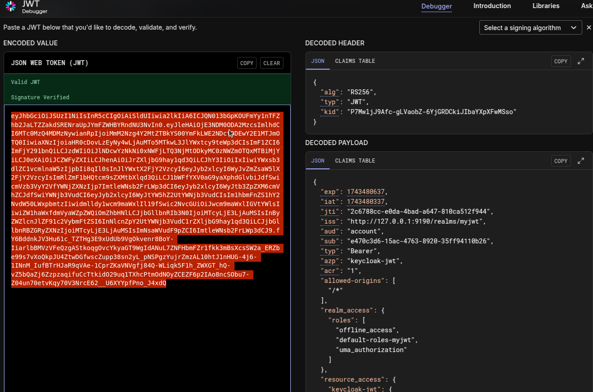


