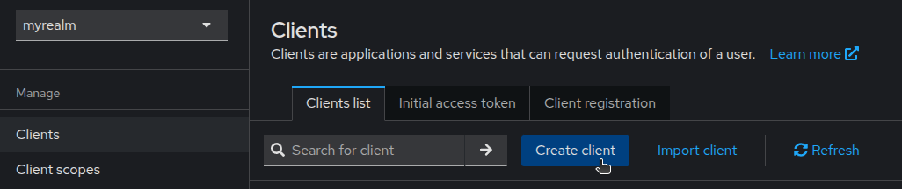
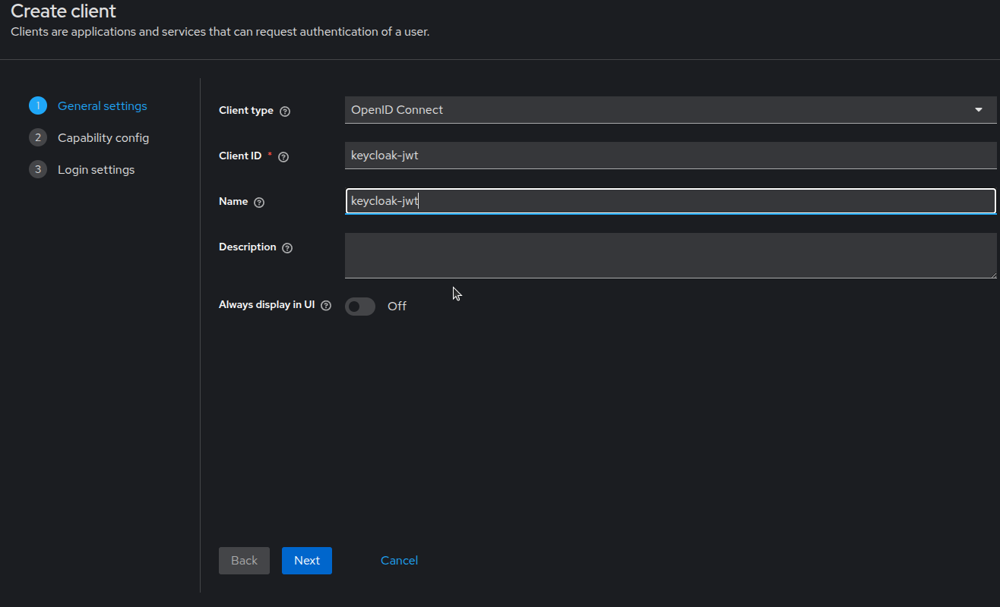
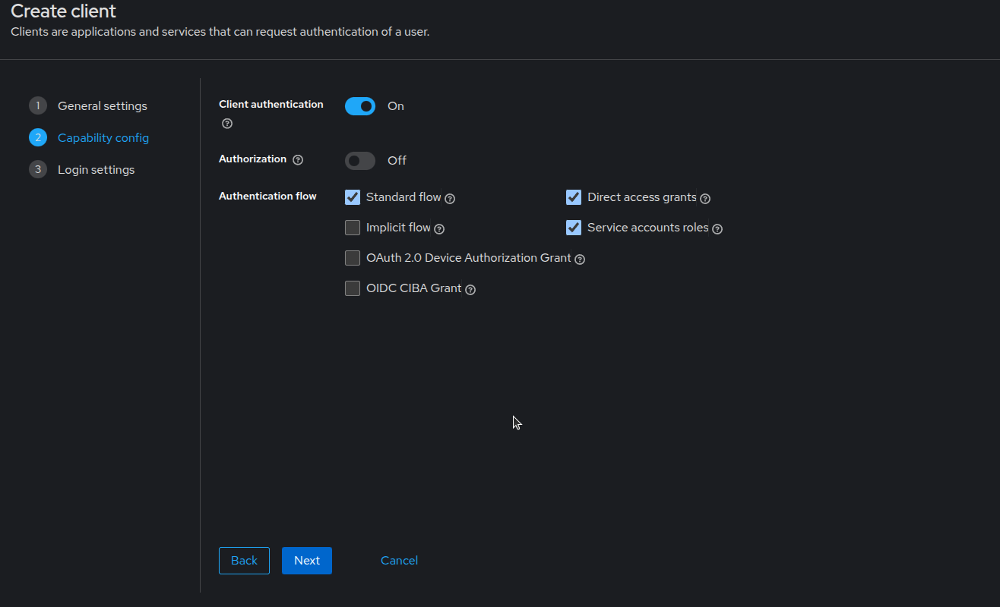
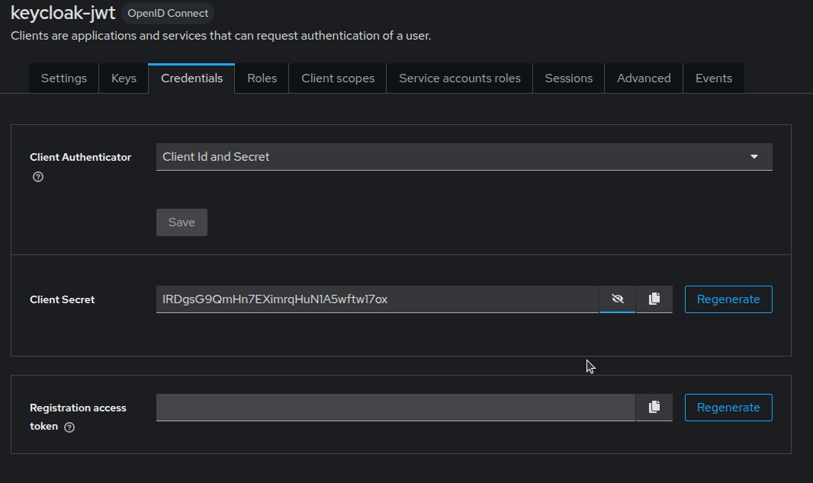
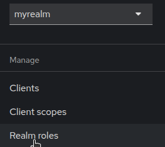
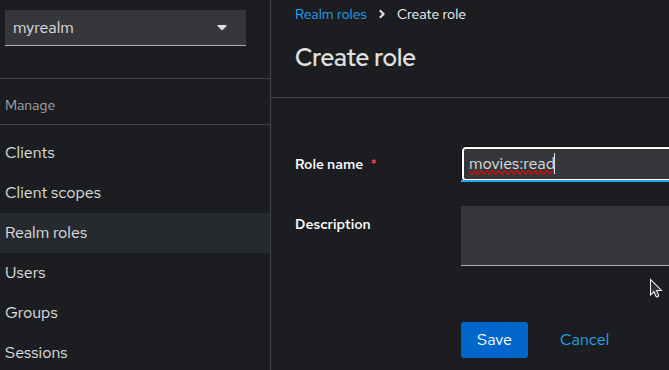
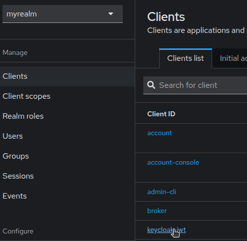

# 3.0 JWT

[Configurar JWT con Keycloak](https://docs.platformatic.dev/docs/next/guides/jwt-keycloak)

Ingresar a keycloak y crear un nuevo cliente




Establecer como ID **keycloak-jwt**




Presionar el botón Next

Activar:

Client authentication: **On**

Authentication flow: **Standar Flow**

- [x] Direct access grant

- [x] Service accounts roles




Configure: 

Valid redirect URIs: **/***

Web origins: **/***


Presione el boton Save


En la pestaña Credentials



Puede copiar el Client Secret

Work:
```
IRDgsG9QmHn7EXimrqHuN1A5wftw17ox

```

## Realm roles



Cree un rol llamado **movies:read**




presione el botón **Save**

Regrese a la pestaña Clientes y seleccione **keycloak-jwt**



