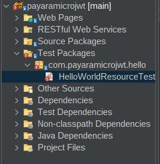
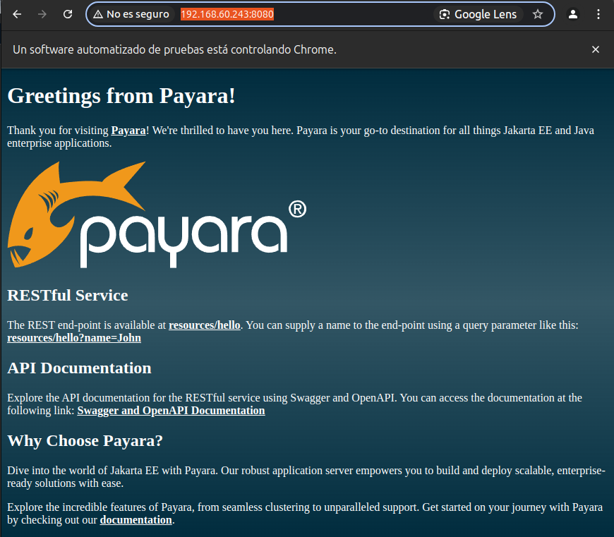
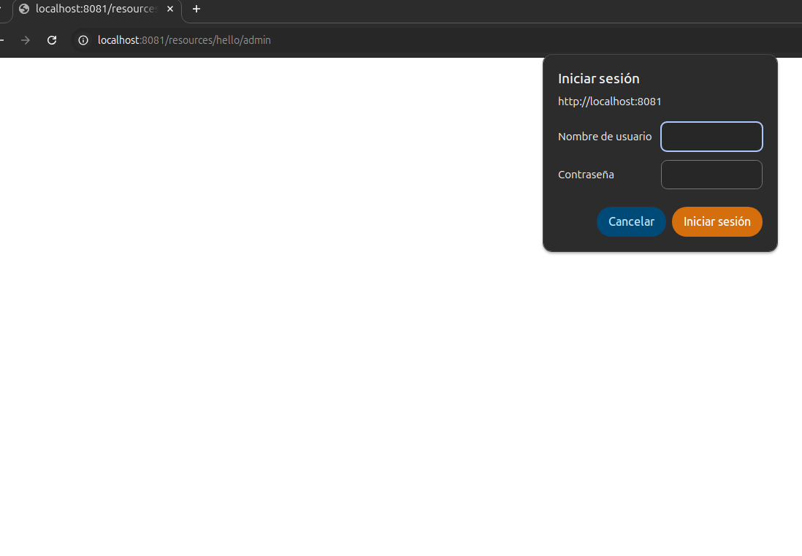

# 4.0 Payaramicro Jwt

## Enlaces

[Securing Jakarta EE Applications with OIDC and Keycloak](https://blog.payara.fish/securing-jakarta-ee-applications-with-oidc-and-keycloak)


## Proyecto

Clonar el directorio p desde [https://github.com/avbravo/p.git](https://github.com/avbravo/p.git)

Busque el proyecto: **payaramicrojwt**


## Creación del Proyecto

Ingrese a Payara Starter

Cree un proyecto nuevo para implementar la validación de JWT.

Project Description:
```
(*) Maven

Group ID: com.payaramicrojwt

Artifact ID: payaramicrojwt

Version: 0.1-SNAPSHOT

```
**Jakarta EE**

```
Jakarta EE version: Jakarta EE 10

Jakarta EE Profile: Core Profile
```

**Payara Platform**

Platform: Payara Micro

Payara Platform version: 6.2025.3


**Project Configuration**
```
Package: com.payaramicrojwt

(*) Include Tests

Java Version: Java SE 21
```

**MicroProfile**

```
(*) Full MP
(*) MicroProfile Config
(*) MicroProfile Open API
(*) MicroProfile Fault Tolerance
(*) MicroProfile Metrics

```

**Deployment Options**
```
(*) Docker
```

**ER Diagram Designer**
```
No seleccionar
```

**Security Configuration**

Login 


Descarge el proyecto y descomprimalo.

Abra el proyecto en su IDE


## Corrigiendo Errores




Agregue los imports

```java

import com.payaramicrojwt.resource.HelloWorldResource;
import com.payaramicrojwt.resource.RestConfiguration;

```

## Ejecutar la aplicación

De permisos a los archivos de ejecución maven

```shell
chmod 775 mvnw.cmd mvnw 

```

Consulte el archivo README.md de su proyecto para ver las indicaciones de ejecución ofrecidas.

### Ejecutar la aplicación

```shell

mvn clean package payara-micro:dev

```


### Construir la imagen de Docker

```
mvn docker:build
```

Ejecutar la imagen de Docker

```
docker run -p 8080:8080 payaramicrojwt:${project.version}
```


Ejecute la aplicación mediante

```shell

mvn clean package payara-micro:dev

```

Ingrese al navegador en la dirección [http://192.168.60.243:8080/](http://192.168.60.243:8080/)




# Crear la clase

```java
/*
 * Click nbfs://nbhost/SystemFileSystem/Templates/Licenses/license-default.txt to change this license
 * Click nbfs://nbhost/SystemFileSystem/Templates/Classes/Class.java to edit this template
 */
package com.payaramicrojwt.resource.oidc;
//import fish.payara.security.annotations.ClaimsDefinition;
//import fish.payara.security.annotations.LogoutDefinition;
//import fish.payara.security.openid.api.PromptType;

import jakarta.inject.Named;

import jakarta.enterprise.context.ApplicationScoped;
import jakarta.inject.Inject;
import jakarta.security.enterprise.authentication.mechanism.http.OpenIdAuthenticationMechanismDefinition;
import jakarta.security.enterprise.authentication.mechanism.http.openid.ClaimsDefinition;
import jakarta.security.enterprise.authentication.mechanism.http.openid.LogoutDefinition;
import jakarta.security.enterprise.authentication.mechanism.http.openid.PromptType;
import org.eclipse.microprofile.config.inject.ConfigProperty;
//import jakarta.security.enterprise.authentication.mechanism.http.OpenIdAuthenticationMechanismDefinition;

/**
 *
 * @author avbravo
 */
@OpenIdAuthenticationMechanismDefinition(
        clientId = "${oidConfig.clientID}",
        clientSecret = "${oidConfig.clientSecret}",
        redirectURI = "${baseURL}/index.xhtml",
        scope = {"openid", "email", "profile", "offline_access"},
        prompt = PromptType.LOGIN,
        providerURI = "${oidConfig.providerUri}",
        jwksReadTimeout = 10_000,
        jwksConnectTimeout = 10_000,
        claimsDefinition = @ClaimsDefinition(callerGroupsClaim = "${oidConfig.callerGroupsClaim}"),
        extraParameters = "audience=https://api.payara.fish/",
        logout = @LogoutDefinition(redirectURI = "${baseURL}/index.xhtml")
)
@Named("oidConfig")
@ApplicationScoped

public class OpenIDSecurityConfiguration {

    private static final String ROLES_CLAIM = "/roles";
    @Inject
    @ConfigProperty(name = "fish.payara.demos.conference.security.openid.clientId")
    private String clientID;
    @Inject
    @ConfigProperty(name = "fish.payara.demos.conference.security.openid.clientSecret")
    private String clientSecret;
    @Inject
    @ConfigProperty(name = "fish.payara.demos.conference.security.openid.provider.uri")
    private String providerUri;

    @Inject
    @ConfigProperty(name = "fish.payara.demos.conference.security.openid.custom.namespace")
    private String customNamespace;

    public String getClientID() {
        return clientID;
    }

    public String getClientSecret() {
        return clientSecret;
    }

    public String getProviderUri() {
        return providerUri;
    }

    public String getCallerGroupsClaim() {
        return customNamespace + ROLES_CLAIM;
    }

}

```

#
The parameters of the configuration annotation are as follows:
• clientId and clientSecret: These are credentials used by the application to authenticate
with the OpenID Provider (OP).
• redirectURI: This is the URI where the OP will redirect the user after success-
ful authentication.
• scope: These are the scopes requested from the OP. Scopes define the data and permis-
sions available to the application.
• prompt: This sets the prompt behaviour when the user is redirected to the OP.
• providerURI: The URI of the OP.
• jwksReadTimeout and jwksConnectTimeout: These are timeouts (in milliseconds) for
reading and connecting to the JWKS endpoint of the OP, respectively.
• claimsDefinition: This defines how claims from the OP are mapped in the application.
• extraParameters: Additional parameters sent in the authorization request to the OP.
• logout: This defines the logout behaviour and redirect URI after logout.


---

###

ingrese a http://localhost:8081/resources/hello/admin




Indique el usuario y password

myuser
denver16    

---

### nuevo

A continuación, te proporcionaré un proyecto completo con la configuración necesaria para integrar **Payara Micro** con **Keycloak**. Este ejemplo incluye:

1. Configuración de Keycloak.
2. Código del proyecto Payara Micro.
3. Archivos de configuración necesarios.

---

### **Estructura del Proyecto**
```
keycloak-payara-micro-demo/
├── src/
│   ├── main/
│   │   ├── java/
│   │   │   └── com/example/
│   │   │       ├── MyApplication.java
│   │   │       └── MyResource.java
│   │   └── resources/
│   │       └── META-INF/
│   │           └── microprofile-config.properties
├── pom.xml
└── README.md
```

---

### **1. Configuración de Keycloak**

#### **Paso 1.1: Crear un Realm**
1. Inicia Keycloak y accede al Admin Console (`http://localhost:8080/auth/admin`).
2. Crea un nuevo realm llamado `payara-demo`.

#### **Paso 1.2: Crear un Cliente**
1. Ve a la sección `Clients` y crea un nuevo cliente:
   - **Client ID**: `payara-client`
   - **Client Protocol**: `openid-connect`
   - **Access Type**: `confidential`
   - **Valid Redirect URIs**: `http://localhost:8080/*`
   - **Web Origins**: `*`

2. Guarda el **Client Secret** generado (lo necesitarás más adelante).

#### **Paso 1.3: Crear Roles**
1. Ve a la sección `Roles` y crea dos roles:
   - `admin`
   - `user`

#### **Paso 1.4: Crear Usuarios**
1. Ve a la sección `Users` y crea dos usuarios:
   - Usuario 1: `admin-user` con el rol `admin`.
   - Usuario 2: `regular-user` con el rol `user`.

---

### **2. Código del Proyecto Payara Micro**

#### **2.1: `pom.xml`**
Este archivo define las dependencias necesarias para el proyecto.

```xml
<project xmlns="http://maven.apache.org/POM/4.0.0"
         xmlns:xsi="http://www.w3.org/2001/XMLSchema-instance"
         xsi:schemaLocation="http://maven.apache.org/POM/4.0.0 http://maven.apache.org/xsd/maven-4.0.0.xsd">
    <modelVersion>4.0.0</modelVersion>

    <groupId>com.example</groupId>
    <artifactId>keycloak-payara-micro-demo</artifactId>
    <version>1.0-SNAPSHOT</version>
    <packaging>war</packaging>

    <properties>
        <maven.compiler.source>17</maven.compiler.source>
        <maven.compiler.target>17</maven.compiler.target>
    </properties>

    <dependencies>
        <!-- Jakarta EE API -->
        <dependency>
            <groupId>jakarta.platform</groupId>
            <artifactId>jakarta.jakartaee-api</artifactId>
            <version>10.0.0</version>
            <scope>provided</scope>
        </dependency>

        <!-- MicroProfile JWT -->
        <dependency>
            <groupId>org.eclipse.microprofile.jwt</groupId>
            <artifactId>microprofile-jwt-auth-api</artifactId>
            <version>1.2</version>
            <scope>provided</scope>
        </dependency>
    </dependencies>

    <build>
        <finalName>keycloak-payara-micro-demo</finalName>
        <plugins>
            <plugin>
                <groupId>org.apache.maven.plugins</groupId>
                <artifactId>maven-war-plugin</artifactId>
                <version>3.3.2</version>
            </plugin>
        </plugins>
    </build>
</project>
```

---

#### **2.2: `MyApplication.java`**
Esta clase define la aplicación JAX-RS.

```java
package com.example;

import jakarta.ws.rs.ApplicationPath;
import jakarta.ws.rs.core.Application;

@ApplicationPath("/api")
public class MyApplication extends Application {
}
```

---

#### **2.3: `MyResource.java`**
Esta clase contiene los endpoints REST seguros.

```java
package com.example;

import jakarta.annotation.security.RolesAllowed;
import jakarta.ws.rs.GET;
import jakarta.ws.rs.Path;
import jakarta.ws.rs.Produces;
import jakarta.ws.rs.core.MediaType;

@Path("/secure")
public class MyResource {

    @GET
    @Path("/admin")
    @RolesAllowed("admin")
    @Produces(MediaType.TEXT_PLAIN)
    public String adminEndpoint() {
        return "This is an admin-only endpoint.";
    }

    @GET
    @Path("/user")
    @RolesAllowed("user")
    @Produces(MediaType.TEXT_PLAIN)
    public String userEndpoint() {
        return "This is a user-only endpoint.";
    }
}
```

---

#### **2.4: `microprofile-config.properties`**
Este archivo contiene la configuración para conectar Payara Micro con Keycloak.

Ubicación: `src/main/resources/META-INF/microprofile-config.properties`

```properties
# Keycloak Server URL
mp.jwt.verify.publickey.location=http://localhost:8080/auth/realms/payara-demo/protocol/openid-connect/certs

# Realm Name
mp.jwt.verify.issuer=http://localhost:8080/auth/realms/payara-demo

# Client ID
client.id=payara-client

# Client Secret
client.secret=<your-client-secret>

# Redirect URI
redirect.uri=http://localhost:8080/callback
```

Reemplaza `<your-client-secret>` con el secreto del cliente que obtuviste en Keycloak.

---

### **3. Ejecutar el Proyecto**

#### **Paso 3.1: Compilar el Proyecto**
Ejecuta el siguiente comando para compilar el proyecto:

```bash
mvn clean package
```

Esto generará un archivo WAR en la carpeta `target`.

#### **Paso 3.2: Iniciar Payara Micro**
Descarga Payara Micro desde [su sitio oficial](https://www.payara.fish/downloads/payara-platform-community-edition/) y ejecuta el siguiente comando:

```bash
java -jar payara-micro.jar --deploy target/keycloak-payara-micro-demo.war
```

El servidor se iniciará en `http://localhost:8080`.

---

### **4. Probar el Proyecto**

1. Accede a los endpoints:
   - `http://localhost:8080/api/secure/admin` (requiere rol `admin`).
   - `http://localhost:8080/api/secure/user` (requiere rol `user`).

2. Serás redirigido a la página de inicio de sesión de Keycloak. Usa las credenciales de los usuarios creados anteriormente.

---

### **5. Notas Finales**
- Asegúrate de que Keycloak esté en ejecución antes de iniciar Payara Micro.
- Si usas HTTPS en Keycloak, actualiza las URLs en `microprofile-config.properties` para usar `https://`.
- Este ejemplo utiliza MicroProfile JWT para autenticación basada en tokens. Puedes personalizarlo según tus necesidades.

Si tienes dudas o problemas durante la implementación, ¡házmelo saber! 😊