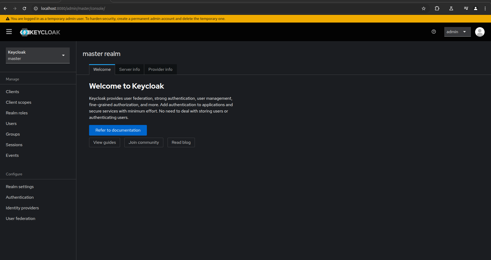
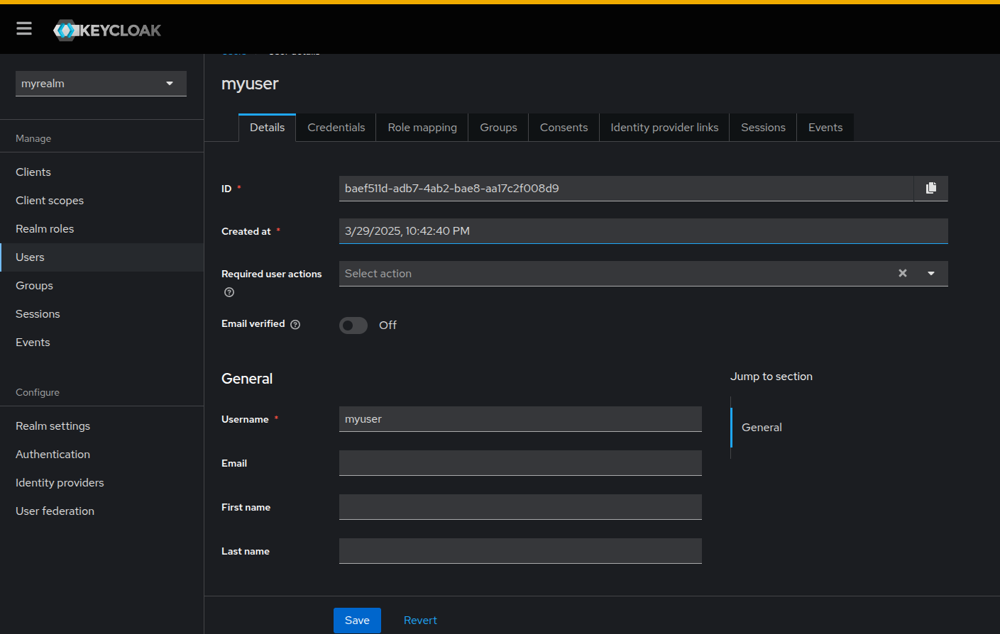
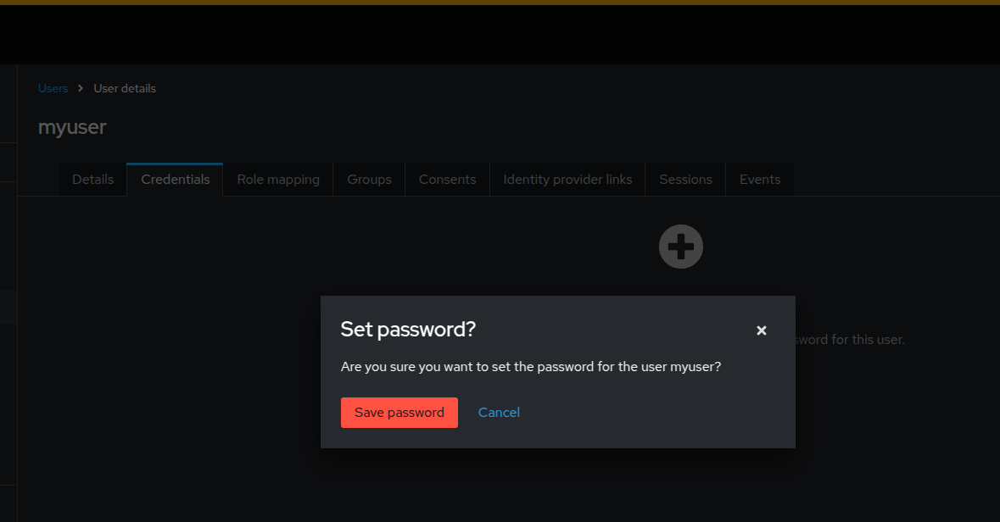
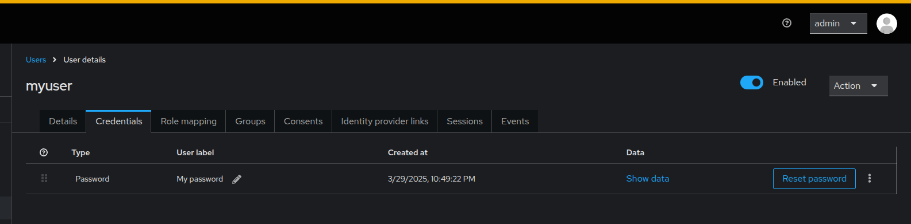

## KeyLoak

[keycloak](https://www.keycloak.org/)

[Get started with Keycloak on Docker](https://www.keycloak.org/getting-started/getting-started-docker)

[Helidon MP OIDC Security Provider](https://helidon.io/docs/v3/mp/guides/security-oidc)

```
Gestión de identidad y acceso de código abierto
Autentique sus aplicaciones y proteja sus servicios con el mínimo esfuerzo.
Olvídese del almacenamiento y la autenticación de usuarios.

Keycloak proporciona federación de usuarios, autenticación sólida, gestión de usuarios, autorización detallada y mucho más.
```


## Instalar Keycloak

Mediante docker. Especifique el puerto, en el ejemplo se usa el usuario admin, y password admin, y la versión de keyloak = 26.1.4

```
docker run -p 9190:8080 -e KC_BOOTSTRAP_ADMIN_USERNAME=admin -e KC_BOOTSTRAP_ADMIN_PASSWORD=admin quay.io/keycloak/keycloak:26.1.4 start-dev

```


### Modos de ejecución

* Desarrollador


```shell
   start-dev
```

* Building an optimized server runtime:
```shell
      build <OPTIONS>
```

  Start the server in production mode:
```shell
     start <OPTIONS>
```


### Consola de Administracion

Ingrese a [http://localhost:9190/admin](http://localhost:9190/admin)


Se muestra el dashboad




Un dominio en Keycloak es equivalente a un inquilino. Cada dominio permite al administrador crear grupos aislados de aplicaciones y usuarios. Inicialmente, Keycloak incluye un único dominio, llamado maestro. Úselo solo para administrar Keycloak, no para administrar aplicaciones.

Siga estos pasos para crear el primer dominio:

Abra la Consola de administración de Keycloak.

Haga clic en Keycloak junto al dominio maestro y luego en Crear dominio.


Introduzca myrealm en el campo Nombre del dominio.

Haga clic en Crear.


Se muestra el realname creado


## Crear usuario

En el menu **User** de clic en Create New User


El unico requerido es el nombre de usuario, utilizamos **myUser**


Presione el botón **Create**


El sistema genera un ID

```
baef511d-adb7-4ab2-bae8-aa17c2f008d9

```





De clic en la pestaña credenciales para crear el password.


De clic en **Set Password**


Para este usuario creamos el password **denver16**


Presione el botón **Save**

Luego nos pide que confirmemos el password



Se muestra el listado de las credenciales



En la pestana detalles actualizamos el nombre y apellido del usuario


## Verificar el usuario creado

Ingrese a 

[http://localhost:8080/realms/myrealm/account](http://localhost:8080/realms/myrealm/account)


_Ingresar con el

```
`usuario: myuser

password: denver16

```

Nos solicita cambiar el password por lo que usaremos **denver16A1**


Nos solicita el correo


Nos muestra el usuario creado


---

# Crear un cliente

* Ingrese a la consola con el usuario **admin**
* Asegurese que el realm seleccionado es **myrealm**

De clic en Client


*** Quede Aqui

https://www.keycloak.org/getting-started/getting-started-docker

en la seccion Secure the first application


y en
https://helidon.io/docs/v3/mp/guides/security-oidc
en la seccion  Create a Client


## Volver a ejecutar la imagen

* Si la imagen fue detenida

ejecute

```shell

docker ps -a

docker start $ID_O_NOMBREIMAGEN

```
