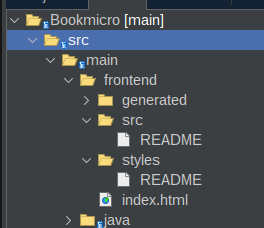
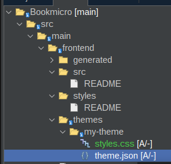
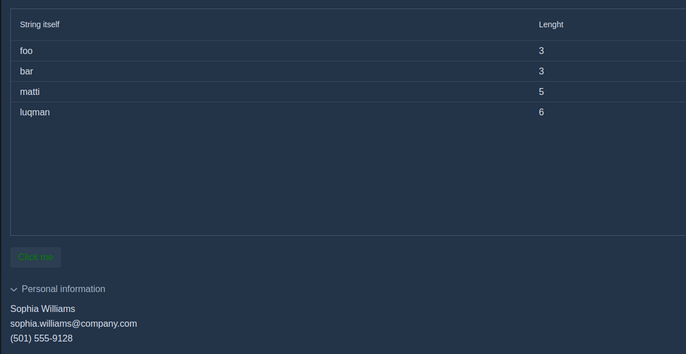

# 01. Temas

Para cambiar los temas realice los siguientes pasos:

1. Desde el explorador de archivos ubiquese en src/main/frontend



2. Cree la carpeta themes/my-theme




3.  Agregue los archivos:

* styles.css 

```css
/*
   CSS styling examples for the Vaadin app.

   This is the style entrypoint for the theme and together with css in ./components/ included
   automatically into the theme.

   Visit https://vaadin.com/docs-beta/latest/theming/application-theme/ for more information.
*/

/* Example: CSS class name to center align the content . */
.centered-content {
  margin: 0 auto;
  max-width: 250px;
}

/* Example: the style is applied only to the textfields which have the `bordered` class name. */
vaadin-text-field.bordered::part(input-field) {
  box-shadow: inset 0 0 0 1px var(--lumo-contrast-30pct);
  background-color: var(--lumo-base-color);
}


```


* theme.json


```json

{
  "lumoImports" : [ "typography", "color", "spacing", "badge", "utility" ]
}

```


Edite el archivo AppShell.java y agregue @Theme(themeClass = Lumo.class, variant = Lumo.DARK)

```java

import com.vaadin.flow.component.page.AppShellConfigurator;
import com.vaadin.flow.server.PWA;
import com.vaadin.flow.theme.Theme;
import com.vaadin.flow.theme.lumo.Lumo;

/**
 * This class is used to configure the generated html host page used by the app
 */
@PWA(name = "My Application", shortName = "My Application")
@Theme(themeClass = Lumo.class, variant = Lumo.DARK)
public class AppShell implements AppShellConfigurator {
    
}


```

Ejecute el proyecto y observe el tema aplicado

