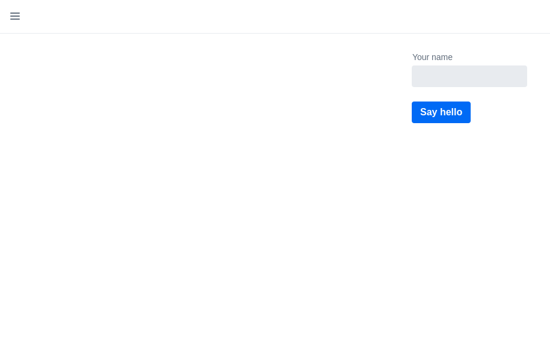
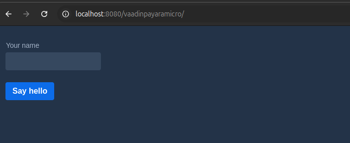

# Temas

* Para cambiar el tema edite la clase AppShell.java


```java

import com.vaadin.flow.component.page.AppShellConfigurator;
import com.vaadin.flow.server.PWA;
import com.vaadin.flow.theme.Theme;
import com.vaadin.flow.theme.lumo.Lumo;

/**
 * Use the @PWA annotation make the application installable on phones, tablets
 * and some desktop browsers.
 */
@PWA(name = "Project Base for Vaadin", shortName = "Project Base")
//@Theme("my-theme")
@Theme(themeClass = Lumo.class, variant = Lumo.DARK)
public class AppShell implements AppShellConfigurator {
}


```




* Comente @Theme("my-theme")

* Añada @Theme(themeClass = Lumo.class, variant = Lumo.DARK)


```java

import com.vaadin.flow.component.page.AppShellConfigurator;
import com.vaadin.flow.server.PWA;
import com.vaadin.flow.theme.Theme;
import com.vaadin.flow.theme.lumo.Lumo;

/**
 * Use the @PWA annotation make the application installable on phones, tablets
 * and some desktop browsers.
 */
@PWA(name = "Project Base for Vaadin", shortName = "Project Base")
//@Theme("my-theme")
@Theme(themeClass = Lumo.class, variant = Lumo.DARK)
public class AppShell implements AppShellConfigurator {
}


```



