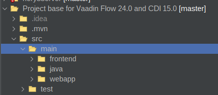
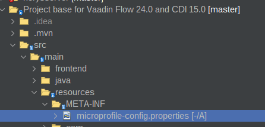
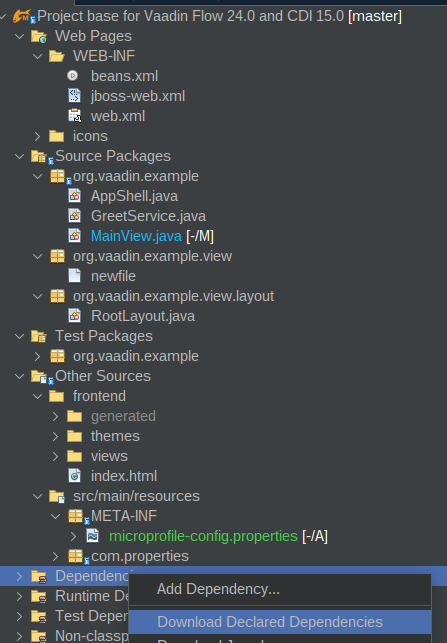

# Microprofile Config

Para configurar microprofile config copie en el directorio 


1. Dentro de src/main 





2. Cree el directorio resources\META-INF y copie alli el archivo microprofile-config.properties





Añada una propiedad al archivo microprofile-config.properties

```
mongodb.uri=mongodb://localhost:27017


```


3. Edite el archivo pom.xml y añada las dependencias

```
  <properties>
   <microprofile.version>6.1</microprofile.version>
   <microprofile-config-api.version>3.1</microprofile-config-api.version>
   <microprofile-health-api.version>4.0.1</microprofile-health-api.version>
   <microprofile-metrics-api.version>5.1.0</microprofile-metrics-api.version>
  </properties>


 <dependencies>

  <dependency>
            <groupId>org.eclipse.microprofile</groupId>
            <artifactId>microprofile</artifactId>
            <version>${microprofile.version}</version>
            <type>pom</type>
            <scope>provided</scope>
        </dependency>
        <dependency>
            <groupId>org.eclipse.microprofile.config</groupId>
            <artifactId>microprofile-config-api</artifactId>
            <version>${microprofile-config-api.version}</version>
        </dependency>
        
        
        <dependency>
            <groupId>org.eclipse.microprofile.health</groupId>
            <artifactId>microprofile-health-api</artifactId>
            <version>${microprofile-health-api.version}</version>
            <type>jar</type>
        </dependency>
 </dependencies>

```


4. En la sección dependencias de clic derecho, y seleccione **Download Declared Dependencies**.




5. Edite el archivo MainView.java y añada las dependencias

* Agregue los imports

```java
import org.eclipse.microprofile.config.Config;
import org.eclipse.microprofile.config.inject.ConfigProperty;


```

* Agregue mediante @Inject Config y @ConfigProperty


```java
     @Inject
    private Config config;
    @Inject
    @ConfigProperty(name = "mongodb.uri")
    private String mongodbUri;

```


* En el metodo constructor agregue dos Span uno con el texto mongodb.uri y el otro para mostrar el valor de la propiedad en el archivo microprofile-config.properties

```java


   Span label = new Span("");
        label.setVisible(true);
        label.setText("mongodb.uri");
        add(label);

        Span mongodbUriSpan = new Span(mongodbUri);
        mongodbUriSpan.getElement().getThemeList().add("badge small");

        add(mongodbUriSpan);


```


