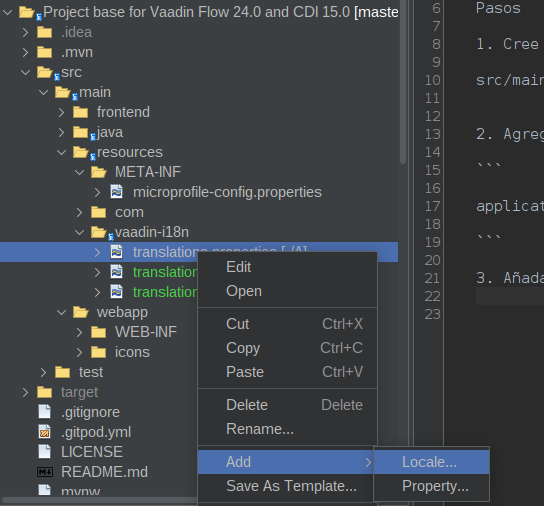
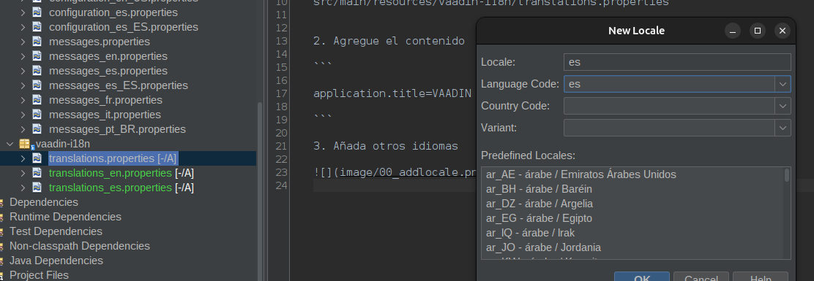
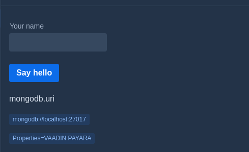

# Localization

[Localization](https://vaadin.com/docs/latest/flow/advanced/i18n-localization)


Pasos

1. Cree el directorio vaadin-i18n y añada el archivo translations.properties

src/main/resources/vaadin-i18n/translations.properties


2. Agregue el contenido

```

application.title=VAADIN PAYARA

```

3. Añada otros idiomas




* Seleccione los idimas a soportar




4. Para seleccionar las propiedades utilice 

``
getTranslation("application.title")

```

5. Edite el archivo MainView.java

y agregue

```java

  Span propertiesSpan = new Span("Properties=" + getTranslation("application.title"));
        propertiesSpan.getElement().getThemeList().add("badge small");

        add(propertiesSpan);


```

6. Ejecute el proyecto, puede observar la propiedad mostrada.

