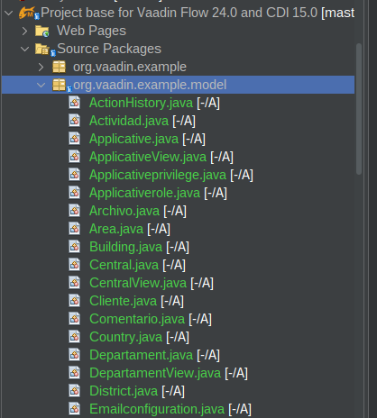
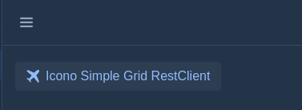
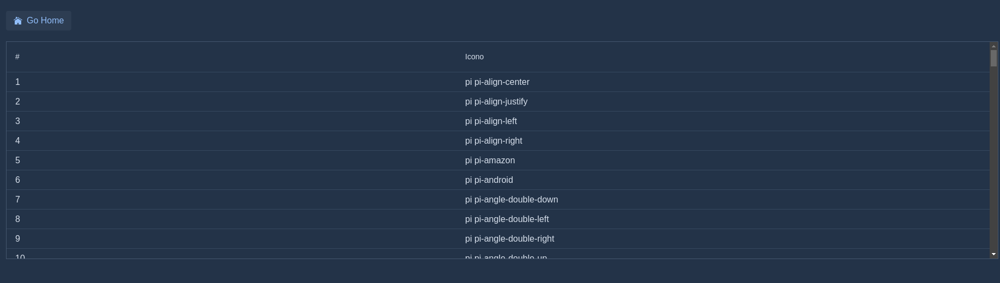

# Microprofile RestClient

Objetivo

* Consumir recursos de un endpoint que escucha en 9003

Pasos:

1. Agregar la dependencia en el archivo pom.xml

```
 <properties>
     <version.jmoordb-core-annotations>2.0.0</version.jmoordb-core-annotations>
 </properties>


  <dependencies>
      <dependency>
            <groupId>com.github.avbravo</groupId>
            <artifactId>jmoordb-core-annotations</artifactId>
            <version>${version.jmoordb-core-annotations}</version>
     </dependency>
  </dependencies>


```


1. Crear el paquete model y crear las entidades alli



```java

@Entity
public class Icono {
@Id(strategy = GenerationType.AUTO)
private Long idicono;
@Column
private String icono;

@Embedded
List<ActionHistory> actionHistory;
    public Icono() {
    }

//set/get

}


```


```java

@DocumentEmbeddable
public class ActionHistory {

   @Column
    private Date fecha;

    @Column
    private Long iduser;

    @Column
    private String evento;
    
    @Column(commentary = "Clase desde la que se invoca el evento")
    private String clase;
    
    @Column(commentary = "Metodo que invoca el eventeo")
    private String metodo;

    public ActionHistory() {
}
//set/get
}

```


2. Cree el paquete restclient y pergue RestClient alli

* Agregue el baseUri en @RegisterRestClient(baseUri = "http://localhost:9003/nerysserver/api/")

```java


import jakarta.ws.rs.DELETE;
import jakarta.ws.rs.GET;
import jakarta.ws.rs.POST;
import jakarta.ws.rs.PUT;
import jakarta.ws.rs.Path;
import jakarta.ws.rs.PathParam;
import jakarta.ws.rs.Produces;
import jakarta.ws.rs.QueryParam;
import jakarta.ws.rs.core.MediaType;
import jakarta.ws.rs.core.Response;
import java.util.Base64;
import java.util.List;
import org.eclipse.microprofile.config.Config;
import org.eclipse.microprofile.config.ConfigProvider;
import org.eclipse.microprofile.config.ConfigValue;
import org.eclipse.microprofile.openapi.annotations.enums.SchemaType;
import org.eclipse.microprofile.openapi.annotations.media.Content;
import org.eclipse.microprofile.openapi.annotations.media.Schema;
import org.eclipse.microprofile.openapi.annotations.parameters.Parameter;
import org.eclipse.microprofile.openapi.annotations.parameters.RequestBody;
import org.eclipse.microprofile.rest.client.annotation.ClientHeaderParam;
import org.eclipse.microprofile.rest.client.inject.RegisterRestClient;
import org.vaadin.example.model.Icono;

/**
 *
 * @author avbravo
 */
@RegisterRestClient(baseUri = "http://localhost:9003/nerysserver/api/")
@Path("/icono")
@ClientHeaderParam(name = "Authorization", value = "{lookupAuth}")
public interface IconoRestClient {

     // <editor-fold defaultstate="collapsed" desc="lookupAuth()">
    default String lookupAuth() {
        /**
         * *
         * Leer las configuraciones del archivo microprofile-config.properties
         */

        String secretKey = "SCox1jmWrkma$*opne2Amwz";

        Config config = ConfigProvider.getConfig();

        String userSecurity = config.getValue("userSecurity", String.class);

        // or
        ConfigValue passwordSecurity = config.getConfigValue("passwordSecurity");

            
        String userDecrypted = userSecurity;
        String passwordDecrypted = passwordSecurity.getValue();
  
        return "Basic "
                + Base64.getEncoder().encodeToString((userDecrypted + ":" + passwordDecrypted).getBytes());
    }
// </editor-fold>
    // <editor-fold defaultstate="collapsed" desc="findAll">
    @GET
    @Produces({MediaType.APPLICATION_XML, MediaType.APPLICATION_JSON})

    public List<Icono> findAll();
// </editor-fold>

    // <editor-fold defaultstate="collapsed" desc="Icono findByIdicono(@PathParam("idicono") Long idicono)">
    @GET
    @Path("{idicono}")
    public Icono findByIdicono(@Parameter(description = "El idicono", required = true, example = "1", schema = @Schema(type = SchemaType.NUMBER)) @PathParam("idicono") Long idicono);
// </editor-fold>

//    // <editor-fold defaultstate="collapsed" desc="List<Icono> findByIcono(@Parameter(description = "El icono", required = true, example = "1", schema = @Schema(type = SchemaType.STRING)) @QueryParam("icono") final String icono)">
    @GET
    @Path("icono")
    public List<Icono> findByIcono(@Parameter(description = "El icono", required = true, example = "1", schema = @Schema(type = SchemaType.STRING)) @QueryParam("icono") final String icono);
//// </editor-fold>

    

    // <editor-fold defaultstate="collapsed" desc="Response save">
    @POST

    public Response save(@RequestBody(description = "Crea un nuevo icono.", content = @Content(mediaType = "application/json", schema = @Schema(implementation = Icono.class))) Icono icono);
// </editor-fold>
    // <editor-fold defaultstate="collapsed" desc="Response update">

    @PUT

    public Response update(@RequestBody(description = "Crea un nuevo icono.", content = @Content(mediaType = "application/json", schema = @Schema(implementation = Icono.class))) Icono icono);

// </editor-fold>
    // <editor-fold defaultstate="collapsed" desc="Response delete">
    @DELETE
    @Path("{idicono}")

    public Response delete(@Parameter(description = "El elemento idicono", required = true, example = "1", schema = @Schema(type = SchemaType.NUMBER)) @PathParam("idicono") Long idicono);
    // </editor-fold>
    
    // <editor-fold defaultstate="collapsed" desc="List<Icono> lookup(@QueryParam("filter") String filter, @QueryParam("sort") String sort,  @QueryParam("page") Integer page, @QueryParam("size") Integer size)">
    @GET
    @Path("lookup")
    public List<Icono> lookup(@QueryParam("filter") String filter, @QueryParam("sort") String sort, @QueryParam("page") Integer page, @QueryParam("size") Integer size);
    // </editor-fold>    
    
    // <editor-fold defaultstate="collapsed" desc="public Long count(@QueryParam("filter") String filter, @QueryParam("sort") String sort, @QueryParam("page") Integer page, @QueryParam("size") Integer size);">
    @GET
    @Path("count")
    public Long count(@QueryParam("filter") String filter, @QueryParam("sort") String sort, @QueryParam("page") Integer page, @QueryParam("size") Integer size);
    // </editor-fold>    

       // <editor-fold defaultstate="collapsed" desc="Long countLikeByIcono(@QueryParam("icono") String icono)">
    @GET
    @Path("countlikebyicono")
    public Long countLikeByIcono(@QueryParam("icono") String icono);
    // </editor-fold>
    // <editor-fold defaultstate="collapsed" desc="List<Icono> likeByIcono(@QueryParam("icono") String icono)">

    @GET
    @Path("likebyicono")
    @Produces({MediaType.APPLICATION_XML, MediaType.APPLICATION_JSON})
    public List<Icono> likeByIcono(@QueryParam("icono") String icono);
    // </editor-fold>
}


```


3. Crear services

```java

import java.util.List;
import java.util.Optional;
import org.bson.Document;
import org.bson.conversions.Bson;
import org.vaadin.example.model.Icono;

/**
 *
 * @author avbravo
 */
public interface IconoServices {

    public List<Icono> findAll();

    public Optional<Icono> findByIdicono(Long idicono);

    public List<Icono> findByIcono(String icono);

    public Optional<Icono> save(Icono icono);

    public Boolean update(Icono icono);

    public Boolean delete(Long idicono);

    public List<Icono> lookup(Bson filter, Document sort, Integer page, Integer size);

    public Long count(Bson filter, Document sort, Integer page, Integer size);

    public Long countLikeByIcono(String icono);

    // <editor-fold defaultstate="collapsed" desc="List<Icono> likeByIcono( String iconoview)">
    public List<Icono> likeByIcono(String icono);
    // </editor-fold>

    public Boolean existsIcono(Icono icono);
}


```

4. Crear implementaciones

```java

import com.avbravo.jmoordbutils.FacesUtil;
import com.avbravo.jmoordbutils.JmoordbResourcesFiles;
import com.avbravo.jmoordbutils.encode.EncodeUtil;
import static com.mongodb.client.model.Filters.eq;
import com.vaadin.cdi.annotation.CdiComponent;
import jakarta.enterprise.context.ApplicationScoped;
import jakarta.inject.Inject;
import jakarta.ws.rs.core.Response;
import java.util.ArrayList;
import java.util.List;
import java.util.Optional;
import org.bson.Document;
import org.bson.conversions.Bson;
import org.vaadin.example.model.Icono;
import org.vaadin.example.restclient.IconoRestClient;
import org.vaadin.example.services.IconoServices;

/**
 *
 * @author avbravo
 */
@ApplicationScoped
@CdiComponent
public class IconoServicesImpl implements IconoServices {
    // <editor-fold defaultstate="collapsed" desc="@Inject">

//    @Inject
//    JmoordbResourcesFiles rf;
    // </editor-fold>
    // <editor-fold defaultstate="collapsed" desc="Microprofile Rest Client">
    @Inject
    IconoRestClient iconoRestClient;
// </editor-fold>

    @Override
    public List<Icono> findAll() {
        return iconoRestClient.findAll();
    }

    @Override
    public Optional<Icono> findByIdicono(Long idicono) {
        try {
            Icono result = iconoRestClient.findByIdicono(idicono);
            if (result == null || result.getIdicono() == null) {

            } else {
                return Optional.of(result);
            }
        } catch (Exception e) {
            FacesUtil.errorMessage(FacesUtil.nameOfClassAndMethod() + " " + e.getLocalizedMessage());
        }
        return Optional.empty();
    }

    @Override
    public List<Icono> findByIcono(String icono) {
        return iconoRestClient.findByIcono(icono);
    }

    // <editor-fold defaultstate="collapsed" desc="Optional<Icono> save(Icono icono)">
    @Override
    public Optional<Icono> save(Icono icono) {

        try {

            Response response = iconoRestClient.save(icono);

            if (response.getStatus() == 400) {

                String error = (response.readEntity(String.class));

                return Optional.empty();
            }

            Icono result = (Icono) (response.readEntity(Icono.class));

            return Optional.of(result);

        } catch (Exception e) {
            FacesUtil.errorMessage(FacesUtil.nameOfClassAndMethod() + " " + e.getLocalizedMessage());
        }
        return Optional.empty();

    }
    // </editor-fold>

    // <editor-fold defaultstate="collapsed" desc="Boolean update(Icono icono)">
    @Override
    public Boolean update(Icono icono) {
        Boolean result = Boolean.FALSE;
        try {

            Integer status = iconoRestClient.update(icono).getStatus();

            if (status == 201) {
                result = Boolean.TRUE;
            }

        } catch (Exception e) {
            FacesUtil.errorMessage(FacesUtil.nameOfClassAndMethod() + " " + e.getLocalizedMessage());
        }
        return result;
    }

    // </editor-fold>
    // <editor-fold defaultstate="collapsed" desc="Boolean delete(Long idicono)">
    @Override
    public Boolean delete(Long idicono) {
        Boolean result = Boolean.FALSE;
        try {

            Integer status = iconoRestClient.delete(idicono).getStatus();

            if (status == 201) {
                result = Boolean.TRUE;
            }

        } catch (Exception e) {
            FacesUtil.errorMessage(FacesUtil.nameOfClassAndMethod() + " " + e.getLocalizedMessage());
        }
        return result;
    }
    // </editor-fold>

    // <editor-fold defaultstate="collapsed" desc="List<Icono> lookup(Bson filter, Document sort, Integer page, Integer size)">
    @Override
    public List<Icono> lookup(Bson filter, Document sort, Integer page, Integer size) {
        List<Icono> iconoList = new ArrayList<>();
        try {
            iconoList = iconoRestClient.lookup(
                    EncodeUtil.encodeBson(filter),
                    EncodeUtil.encodeBson(sort),
                    page, size);
        } catch (Exception e) {
            FacesUtil.errorMessage(FacesUtil.nameOfClassAndMethod() + " " + e.getLocalizedMessage());
        }
        return iconoList;
    }
// </editor-fold>
// <editor-fold defaultstate="collapsed" desc="Long count(Bson filter, Document sort, Integer page, Integer size)">

    @Override
    public Long count(Bson filter, Document sort, Integer page, Integer size) {
        Long result = 0L;
        try {
            result = iconoRestClient.count(
                    EncodeUtil.encodeBson(filter),
                    EncodeUtil.encodeBson(sort),
                    page, size);
        } catch (Exception e) {
            FacesUtil.errorMessage(FacesUtil.nameOfClassAndMethod() + " " + e.getLocalizedMessage());
        }
        return result;
    }

    // </editor-fold>
    // <editor-fold defaultstate="collapsed" desc="public Long countLikeByIcono(@QueryParam("icono") String icono)">
    @Override
    public Long countLikeByIcono(String icono) {
        Long result = 0L;
        try {
            result = iconoRestClient.countLikeByIcono(icono);

        } catch (Exception e) {
            FacesUtil.errorMessage(FacesUtil.nameOfClassAndMethod() + " " + e.getLocalizedMessage());
        }
        return result;
    }

    // </editor-fold>
    // <editor-fold defaultstate="collapsed" desc="List<Icono> likeByIcono( String  iconoview)">
    @Override
    public List<Icono> likeByIcono(String icono) {
        return iconoRestClient.likeByIcono(icono);
    }
    // </editor-fold>

    // <editor-fold defaultstate="collapsed" desc="Boolean existsIcono(Icono icono)">
    /**
     * Verifica si tiene un Sprint con ese nombre para el proyecto
     *
     * @param proyecto
     * @param sprint
     * @return
     */
    @Override
    public Boolean existsIcono(Icono icono) {
        Boolean result = Boolean.FALSE;
        try {
            Bson filter = eq("icono", icono.getIcono());
            Document sort = new Document("idicono", -1);
            Integer total = count(filter, sort, 1, 1).intValue();

            if (total >= 1) {

                result = Boolean.TRUE;
            }
        } catch (Exception e) {
            FacesUtil.errorMessage(FacesUtil.nameOfClassAndMethod() + " " + e.getLocalizedMessage());
        }
        return result;

    }
    // </editor-fold>
}


```


5. Crear un grid basico para mostrar los elementos del proyecto

* Injecte el services
* Cree un grid y asigne los elementos

```java

package org.vaadin.example.view;

import com.vaadin.cdi.annotation.CdiComponent;
import com.vaadin.flow.component.UI;
import com.vaadin.flow.component.button.Button;
import com.vaadin.flow.component.button.ButtonVariant;
import com.vaadin.flow.component.combobox.ComboBox;
import com.vaadin.flow.component.confirmdialog.ConfirmDialog;
import com.vaadin.flow.component.grid.Grid;
import com.vaadin.flow.component.html.Span;
import com.vaadin.flow.component.icon.Icon;
import com.vaadin.flow.component.icon.VaadinIcon;
import com.vaadin.flow.component.notification.Notification;
import com.vaadin.flow.component.orderedlayout.HorizontalLayout;
import com.vaadin.flow.component.orderedlayout.VerticalLayout;
import com.vaadin.flow.data.renderer.ComponentRenderer;
import com.vaadin.flow.router.Route;
import jakarta.annotation.PostConstruct;
import jakarta.inject.Inject;
import java.util.ArrayList;
import java.util.List;
import org.eclipse.microprofile.config.Config;
import org.eclipse.microprofile.config.inject.ConfigProperty;

import org.vaadin.example.MainView;
import org.vaadin.example.model.Icono;
import org.vaadin.example.services.IconoServices;

/**
 *
 * @author avbravo
 */
@Route(value = "iconosimplegrid")
@CdiComponent
public class IconoSimpleGridView extends VerticalLayout {
// <editor-fold defaultstate="collapsed" desc="Config">

    @Inject
    private Config config;
    @Inject
    @ConfigProperty(name = "mongodb.uri")
    private String mongodbUri;
// </editor-fold>

    // <editor-fold defaultstate="collapsed" desc="services">
    @Inject
    IconoServices iconoServices;

// </editor-fold>
    List<Icono> iconos = new ArrayList<>();
    private static Grid<Icono> grid = new Grid<>(Icono.class, false);


    public IconoSimpleGridView() {

    }

    @PostConstruct
    public void init() {
        findAll();
        createHomeButton();
    
        createGrid();
    
    }

    
    private List<Icono> findAll(){
        iconos = iconoServices.findAll();
        return iconos;
    }
    private void createHomeButton() {

        var buttonLogin = new Button("Go Home");
        buttonLogin.setIcon(VaadinIcon.HOME.create());
        buttonLogin.addClickListener(event -> {
            UI.getCurrent().navigate(MainView.class);
        }
        );
        add(buttonLogin);
    }

 

    private void createGrid() {
        try {

  
            grid.setItems(iconos);
            grid.addColumn(Icono::getIdicono).setHeader("#").setAutoWidth(true);
            grid.addColumn(Icono::getIcono).setHeader("Icono").setAutoWidth(true);
            grid.addColumn(Icono::getActionHistory).setHeader("History").setVisible(false);
           
            add(grid);
            
        

        } catch (Exception e) {
            System.out.println("\terror " + e.getLocalizedMessage());
            Notification.show("error " + e.getLocalizedMessage());
        }
    }

   

}


```


7. Cree un botón en la clase MainView.java para invocar el view

```java
 var buttonIconoSimpleGrid = new Button("Icono Simple Grid RestClient");
            buttonIconoSimpleGrid.setIcon(VaadinIcon.AIRPLANE.create());
            buttonIconoSimpleGrid.addClickListener(event -> {
                UI.getCurrent().navigate(IconoSimpleGridView.class);
            }
            );
            add(buttonIconoSimpleGrid);

```
8. Ejecute el proyecto



Al dir clic ene l boton se muestra los registros



