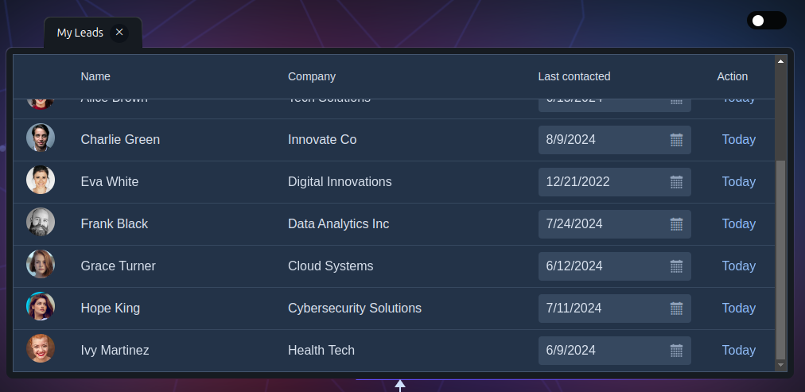
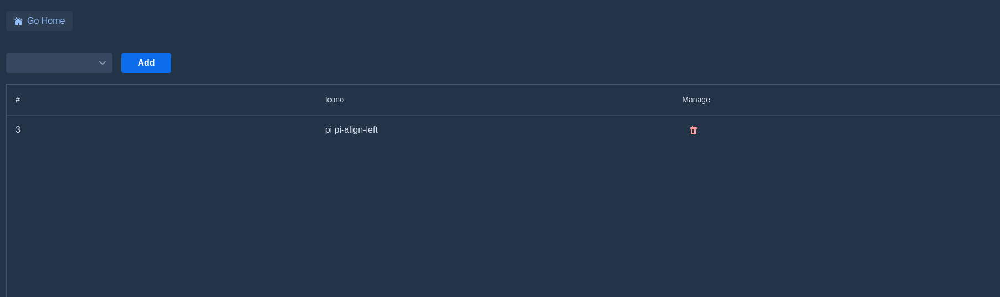
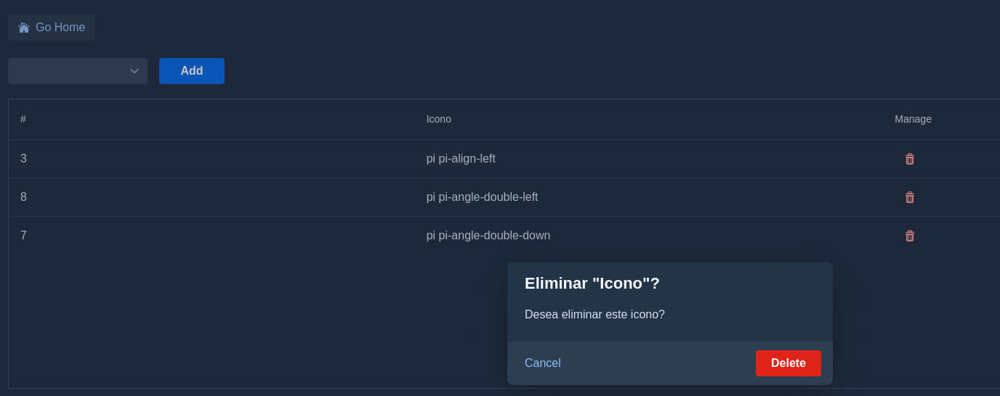

# Grid

Representan los datatable




Links


* [Grid](https://vaadin.com/docs/latest/components/grid)


* [Two ways of coding the UI](https://vaadin.com/?utm_content=303225692&utm_medium=social&utm_source=twitter&hss_channel=tw-33905417)


* [Grid Editable](https://vaadin.com/docs/latest/components/grid/inline-editing)


## Pagination

* [https://vaadin.com/directory/component/grid-pagination](https://vaadin.com/directory/component/grid-pagination)


---

## Ejemplos

1. Observe el capitulo 07.microprofilerestclient muestra un ejemplo sencillo


### Grid Avanzado con opciones de agregar desde un ComboBox

* Este ejemplo utiliza MicroprofilesRestClient desarrollado en el capitulo 07.microprofilerestclient. U_tiliza un combo, botón de agregar, un grid y un botón para editar los registros.

* Cree una clase nueva

* En createHomeButton() se creara un botón para regresar a la pagina principal

* createConfirmDialog(). Crea un dialogo para confirmar la eliminación

* setStatus(String value). Muestra el estatus seleccionado del dialogo de confirmación

* createComboBox(). Crea un combo con todos los iconos

*  createGrid(). Crea el grid para mostrar los elementos.

* refreshGrid(). Refresca el grid

* sendIcono(Icono icono). Agrega un icono a la lista y lo muestra en el grid.

* removeIcono(Icono icono). Elimina el icono de la lista


```java

import com.vaadin.cdi.annotation.CdiComponent;
import com.vaadin.flow.component.UI;
import com.vaadin.flow.component.button.Button;
import com.vaadin.flow.component.button.ButtonVariant;
import com.vaadin.flow.component.combobox.ComboBox;
import com.vaadin.flow.component.confirmdialog.ConfirmDialog;
import com.vaadin.flow.component.grid.Grid;
import com.vaadin.flow.component.html.Span;
import com.vaadin.flow.component.icon.Icon;
import com.vaadin.flow.component.icon.VaadinIcon;
import com.vaadin.flow.component.notification.Notification;
import com.vaadin.flow.component.orderedlayout.HorizontalLayout;
import com.vaadin.flow.component.orderedlayout.VerticalLayout;
import com.vaadin.flow.data.renderer.ComponentRenderer;
import com.vaadin.flow.router.Route;
import jakarta.annotation.PostConstruct;
import jakarta.inject.Inject;
import java.util.ArrayList;
import java.util.List;
import org.eclipse.microprofile.config.Config;
import org.eclipse.microprofile.config.inject.ConfigProperty;

import org.vaadin.example.MainView;
import org.vaadin.example.model.Icono;
import org.vaadin.example.services.IconoServices;

/**
 *
 * @author avbravo
 */
@Route(value = "iconoadvancedgrid")
@CdiComponent
public class IconoAdvancedGridView extends VerticalLayout {
// <editor-fold defaultstate="collapsed" desc="Config">

    @Inject
    private Config config;
    @Inject
    @ConfigProperty(name = "mongodb.uri")
    private String mongodbUri;
// </editor-fold>

    // <editor-fold defaultstate="collapsed" desc="services">
    @Inject
    IconoServices iconoServices;

// </editor-fold>
    List<Icono> iconos = new ArrayList<>();
    private static Grid<Icono> grid = new Grid<>(Icono.class, false);

    private static VerticalLayout hint;

    ConfirmDialog dialog = new ConfirmDialog();
    Span statusConfirmDialog = new Span();

    Icono iconoSelected = new Icono();

    public IconoAdvancedGridView() {

    }

    @PostConstruct
    public void init() {
        createHomeButton();
        createConfirmDialog();
        createComboBox();
        createGrid();
        this.refreshGrid();

    }

    private void createHomeButton() {

        var buttonLogin = new Button("Go Home");
        buttonLogin.setIcon(VaadinIcon.HOME.create());
        buttonLogin.addClickListener(event -> {
            UI.getCurrent().navigate(MainView.class);
        }
        );
        add(buttonLogin);
    }

    private void createConfirmDialog() {

        dialog = new ConfirmDialog();
        dialog.setHeader("Eliminar \"Icono\"?");
        dialog.setText(
                "Desea eliminar este icono?");

        dialog.setCancelable(true);
        dialog.addCancelListener(event -> setStatus("Canceled"));

        dialog.setConfirmText("Delete");
        dialog.setConfirmButtonTheme("error primary");
        dialog.addConfirmListener(event -> {
            setStatus("Deleted");
            this.removeIcono(iconoSelected);
        }
        );

        Button button = new Button("Open confirm dialog");
        button.addClickListener(event -> {
            dialog.open();
            statusConfirmDialog.setVisible(false);
        });

        add(statusConfirmDialog);
    }

    private void setStatus(String value) {
        statusConfirmDialog.setText("Status: " + value);
        statusConfirmDialog.setVisible(true);
    }

    private void createComboBox() {
        List<Icono> iconos = iconoServices.findAll();
        ComboBox<Icono> comboBox = new ComboBox<>();
        comboBox.setItems(iconos);
        comboBox.setItemLabelGenerator(Icono::getIcono);

        Button button = new Button("Add");
        button.addThemeVariants(ButtonVariant.LUMO_PRIMARY);
        button.addClickListener(e -> {
            sendIcono(comboBox.getValue());
            comboBox.setValue(null);

        });

        HorizontalLayout layout = new HorizontalLayout(comboBox, button);
        layout.setFlexGrow(1, comboBox);

        add(layout);
    }

    private void createGrid() {
        try {

//            grid.setItems(iconoServices.findAll());
            grid.setItems(iconos);
            grid.addColumn(Icono::getIdicono).setHeader("#").setAutoWidth(true);
            grid.addColumn(Icono::getIcono).setHeader("Icono").setAutoWidth(true);
            grid.addColumn(Icono::getActionHistory).setHeader("History").setVisible(false);
            grid.addColumn(
                    new ComponentRenderer<>(Button::new, (button, icono) -> {
                        button.addThemeVariants(ButtonVariant.LUMO_ICON,
                                ButtonVariant.LUMO_ERROR,
                                ButtonVariant.LUMO_TERTIARY);
                        button.addClickListener(e -> {
//                            this.removeIcono(icono);
                            iconoSelected = icono;
                            dialog.open();
                            statusConfirmDialog.setVisible(false);
                        });

                        button.setIcon(new Icon(VaadinIcon.TRASH));
                    })).setHeader("Manage");

            add(grid);
            
            hint = new VerticalLayout();
//        hint.setText("No invitation has been sent");
            hint.getStyle().set("padding", "var(--lumo-size-l)")
                    .set("text-align", "center").set("font-style", "italic")
                    .set("color", "var(--lumo-contrast-70pct)");
            add(hint);

        } catch (Exception e) {
            System.out.println("\terror " + e.getLocalizedMessage());
            Notification.show("error " + e.getLocalizedMessage());
        }
    }

    private void refreshGrid() {
        if (iconos.size() > 0) {

            grid.setVisible(true);
            hint.setVisible(false);
            grid.getDataProvider().refreshAll();
        } else {
            grid.setVisible(false);
            hint.setVisible(true);
        }
    }

    private void sendIcono(Icono icono) {

        if (iconos == null || iconos.contains(icono)) {
            Notification.show("Es null o ya lo contiene");
            return;
        }
        Notification.show("Agregando el icono");
        iconos.add(icono);
        this.refreshGrid();
    }

    private void removeIcono(Icono icono) {
        if (iconos == null) {
            Notification.show("Es null");
            return;
        }
        Notification.show("Removiendo el icono");
        iconos.remove(icono);
        this.refreshGrid();
    }

}


```

2. Agregar el boton MainView.java

```java
  var buttonIconoAdvancedGrid = new Button("Icono AdvancedGrid RestClient");
             buttonIconoAdvancedGrid.setIcon(VaadinIcon.AUTOMATION.create());
           buttonIconoAdvancedGrid.addClickListener(event -> {
                UI.getCurrent().navigate(IconoAdvancedGridView.class);
            }
            );
            add(buttonIconoAdvancedGrid);

```

3. Ejecutar el proyecto

* Aparece vacio el grid


* Seleccione un Icono del comboBox y presione el boton agregar



* Seleccione un registro y de clic en el botón eliminar


