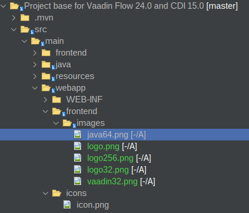

# Logo

Cree la carpeta **/frontend/images** en **src/main/webapp/


Coloque la imagen llamada logo.png



Recomendación imagen de 32x32


## Imagen
```java

Image i = new Image("frontend/images/java64.png", "Alternative image text");

```

## Crear un logo

Para usuarlo en siguiente capitulo  12.layout muestra un ejemplo de como mostrar el logo.

```java

final Header header = new Header(new Image("frontend/images/vaadin32.png", "Logo"), image);

```