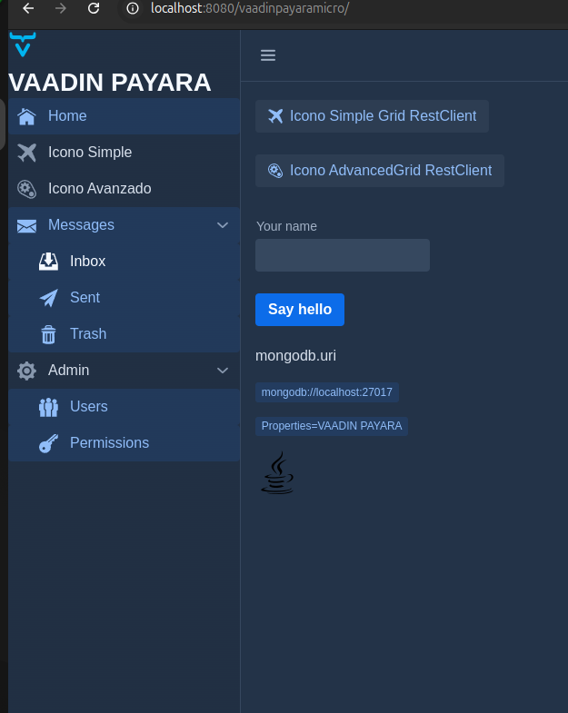

# Side Navigation

[Side Navigation(https://vaadin.com/docs/latest/components/side-nav)

Permite crear barras de navegación



En el capitulo 12 se muestra el layout que usa estos componentes.


```java


    private SideNav createNavigation() {
        final SideNav nav = new SideNav();
        nav.addItem(new SideNavItem(this.getTranslation("menubar.home"), MainView.class, VaadinIcon.HOME.create()));
        nav.addItem(new SideNavItem(this.getTranslation("menubar.iconosimple"), IconoSimpleGridView.class, VaadinIcon.AIRPLANE.create()));
        nav.addItem(new SideNavItem(this.getTranslation("menubar.iconoavanzado"), IconoAdvancedGridView.class, VaadinIcon.AUTOMATION.create()));
//        nav.addItem(new SideNavItem(this.getTranslation("shops")     , ViewShops.class         , VaadinIcon.SHOP.create()));
//        nav.addItem(new SideNavItem(this.getTranslation("inventory") , ViewInventory.class     , VaadinIcon.STORAGE.create()));
//        nav.addItem(new SideNavItem(this.getTranslation("customers") , ViewCustomers.class     , LineAwesomeIcon.PERSON_BOOTH_SOLID.create()));
//        nav.addItem(new SideNavItem(this.getTranslation("purchases") , ViewPurchases.class     , LineAwesomeIcon.SHOPPING_BASKET_SOLID.create()));

        SideNavItem messagesLink = new SideNavItem("Messages",
                MainView.class, VaadinIcon.ENVELOPE.create());
        messagesLink.addItem(new SideNavItem("Inbox", MainView.class,
                VaadinIcon.INBOX.create()));
        messagesLink.addItem(new SideNavItem("Sent", MainView.class,
                VaadinIcon.PAPERPLANE.create()));
        messagesLink.addItem(new SideNavItem("Trash", MainView.class,
                VaadinIcon.TRASH.create()));

        SideNavItem adminSection = new SideNavItem("Admin");
        adminSection.setPrefixComponent(VaadinIcon.COG.create());
        adminSection.addItem(new SideNavItem("Users", MainView.class,
                VaadinIcon.GROUP.create()));
        adminSection.addItem(new SideNavItem("Permissions",
                MainView.class, VaadinIcon.KEY.create()));

        nav.addItem(messagesLink, adminSection);
        return nav;
    }


``