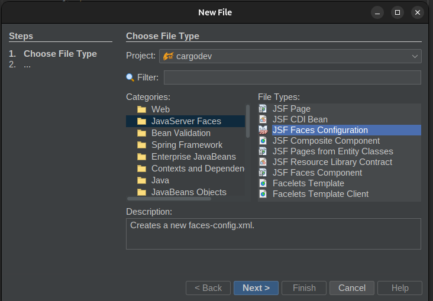

# 01.1 Configurar proyecto

Ubiquese en la carpeta WebPages/WEB-INF y cree el archivo faces-config.xml.

Desde el menu seleccione New File --> Categories: Java Server Faces File Types: JSF Faces Configuration



Seleccione el nombre


Agregue al contenido

```xml

<faces-config version="4.0"
              xmlns="https://jakarta.ee/xml/ns/jakartaee"
              xmlns:xsi="http://www.w3.org/2001/XMLSchema-instance"
              xsi:schemaLocation="https://jakarta.ee/xml/ns/jakartaee https://jakarta.ee/xml/ns/jakartaee/web-facesconfig_4_0.xsd">
    <application>
        <action-listener>org.primefaces.application.DialogActionListener</action-listener>
        <navigation-handler>org.primefaces.application.DialogNavigationHandler</navigation-handler>
        <view-handler>org.primefaces.application.DialogViewHandler</view-handler>
    </application>
</faces-config>


```

## Primefaces

Agregue al archivo pom.xml la biblioteca de primefaces

```xml
<!--
        Primefaces
-->
<dependency>
    <groupId>org.primefaces</groupId>
    <artifactId>primefaces</artifactId>
    <version>15.0.3</version>
    <classifier>jakarta</classifier>
</dependency>


```


Ahora cree una pagina JSF, desde el menú seleccione File --> New --> 


Indique como nombre index


Observer que el archivo web.xml se modifico

```xml


<?xml version="1.0" encoding="UTF-8"?>
<web-app version="6.0" xmlns="https://jakarta.ee/xml/ns/jakartaee" xmlns:xsi="http://www.w3.org/2001/XMLSchema-instance" xsi:schemaLocation="https://jakarta.ee/xml/ns/jakartaee https://jakarta.ee/xml/ns/jakartaee/web-app_6_0.xsd">
    <context-param>
        <param-name>jakarta.faces.PROJECT_STAGE</param-name>
        <param-value>Development</param-value>
    </context-param>
    <servlet>
        <servlet-name>Faces Servlet</servlet-name>
        <servlet-class>jakarta.faces.webapp.FacesServlet</servlet-class>
        <load-on-startup>1</load-on-startup>
    </servlet>
    <servlet-mapping>
        <servlet-name>Faces Servlet</servlet-name>
        <url-pattern>/faces/*</url-pattern>
    </servlet-mapping>
    <welcome-file-list>
        <welcome-file>faces/index.xhtml</welcome-file>
        <welcome-file>index.html</welcome-file>
    </welcome-file-list>
</web-app>

```

Si ingresa al navegador [http://192.168.60.243:8081/faces/index.xhtml](http://192.168.60.243:8081/faces/index.xhtml)

Obtendra la respuesta **Hello from Facelets**


* Modifique la sección **<servlet-mapping>** cambiando

```xml
<servlet-mapping>
    <servlet-name>Faces Servlet</servlet-name>
    <url-pattern>/faces/*</url-pattern>
</servlet-mapping>
```

por

```xml
<servlet-mapping>
<servlet-name>Faces Servlet</servlet-name>
<url-pattern>*.xhtml</url-pattern>
</servlet-mapping>
```

 Modifique la sección **<welcome-file-list>** cambiando

```xml
<welcome-file-list>
    <welcome-file>faces/index.xhtml</welcome-file>
    <welcome-file>index.html</welcome-file>
</welcome-file-list>
```

por

```xml
<welcome-file-list>
    <welcome-file>index.xhtml</welcome-file>
    <welcome-file>index.html</welcome-file>
</welcome-file-list>
```

Si ingresa al navegador [http://192.168.60.243:8081/index.xhtml](http://192.168.60.243:8081/index.xhtml)


* Ahora modifique el archivo index.xhtml

```html
<?xml version='1.0' encoding='UTF-8' ?>
<!DOCTYPE html PUBLIC "-//W3C//DTD XHTML 1.0 Transitional//EN" "http://www.w3.org/TR/xhtml1/DTD/xhtml1-transitional.dtd">
<html xmlns="http://www.w3.org/1999/xhtml"
      xmlns:h="jakarta.faces.html"
      xmlns:f="jakarta.faces.core">
    <h:head>
        <title>Facelet Title</title>
        <style>
            body {
                background-image: linear-gradient(rgba(0,44,62), rgba(0,44,62,.8), rgba(0,44,62));
                color: #fff;
            }
            a {
                font-weight: bold;`
                color: white;
            }
        </style>
    </h:head>
    <h:body>
        <f:view contentType="text/html">
      <h1>Greetings from Payara!</h1>
        <p>
            Thank you for visiting <a href="https://www.payara.fish/">Payara</a>! We're thrilled to have you here. Payara is your go-to destination for all things Jakarta EE and Java enterprise applications.
        </p>
        <p>
            <a href="https://www.payara.fish/"></a>
        </p>
        
        <h2>RESTful Service</h2>
        <p>
            The REST end-point is available at <a href="resources/hello">resources/hello</a>.
            You can supply a name to the end-point using a query parameter like this: <a href="resources/hello?name=John">resources/hello?name=John</a>
        </p>
        
                
        <h2>API Documentation</h2>
        <p>
            Explore the API documentation for the RESTful service using Swagger and OpenAPI. You can access the documentation at the following link:
            <a href="swagger.html">Swagger and OpenAPI Documentation</a>
        </p>
        
        <h2>Why Choose Payara?</h2>
        <p>
            Dive into the world of Jakarta EE with Payara. Our robust application server empowers you to build and deploy scalable, enterprise-ready solutions with ease.
        </p>
        <p>
            Explore the incredible features of Payara, from seamless clustering to unparalleled support. Get started on your journey with Payara by checking out our <a href="https://docs.payara.fish/">documentation</a>.
        </p>
        </f:view>
    </h:body>
</html>
```


Al ingresar al navegador se muestra la pagina


