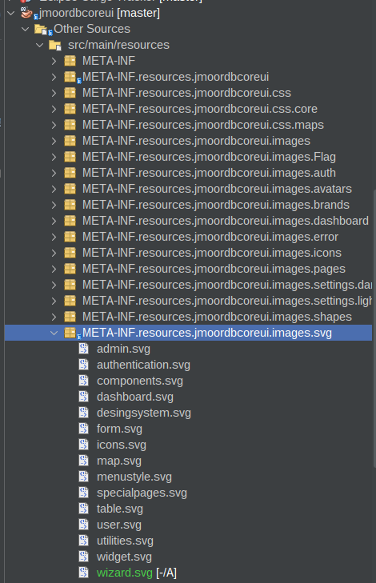
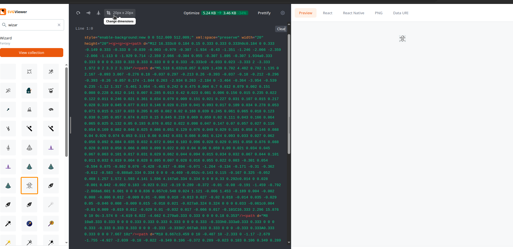
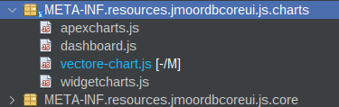
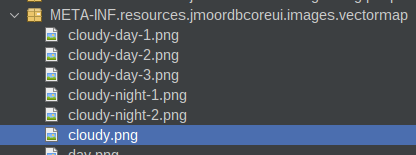
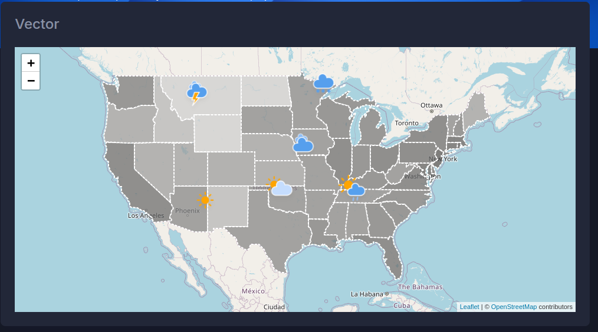

# 03. Configuración

En esta sección realizaremos la configuración de archivos de imagenes, css y js.


Dentro de Web Pages cree una carpeta llamada resources y dentro de ella cree las carpetas:

* css
* images
* js
* vendor


Quedaria

```

Web Pages/resources/css
Web Pages/resources/images
Web Pages/resources/js

```


En esta carpeta puede incluir los css, imagenes y js.


## Imagenes Locales

Por ejemplo si desea utilizar una imagen que se almacena en la carpeta imagenes puede utilizar.

* library: images
* name:folder/imagen

```html

     <h:graphicImage library="images" name="primefaces/favicon-32x32_1.png" />


```

**Java**

Si usa codigo Java imageContextRoot(getImageContextRoot()).

Recuerde incluir 
```java
MenuItem menuItemDashboard = new MenuItem.Builder()
                    .action(FacesUtil.contextPath()+"/dashboard.xhtml")
                    .text("Dashboard")
                    .minText("d")
                    .imageLibrary("images")
                    .imageName("primefaces/favicon-32x32_1.png")
                    .imageContextRoot(getImageContextRoot())
                    .roles(new ArrayList<>())
                    .build();

```


## Imagenes de la libreria jmoordbcoreui

```java
MenuItem menuItemDashboard = new MenuItem.Builder()
                    .action(FacesUtil.contextPath()+"/dashboard.xhtml")
                    .text("Dashboard")
                    .minText("d")
                    .imageLibrary("jmoordbcoreui")
                    .imageName("images/svg/dashboard.svg")
                    .imageContextRoot(getImageContextRoot())
                    .roles(new ArrayList<>())
                    .build();
```

## Iconos de primefaces

Descripción:

*  Verifique los iconos de primefaces en  [https://www.primefaces.org/showcase/icons.xhtml?jfwid=f2298](https://www.primefaces.org/showcase/icons.xhtml?jfwid=f2298)
*  .imageLibrary("primefaces")
*  imageName("pi icono")

```java
     MenuItem menuItemHorizontal = new MenuItem.Builder()
                    .action(FacesUtil.contextPath()+"/errors/error404.xhtml")
                    .text("Horizontal")
                    .minText("H")
                    .imageLibrary("primefaces")
                    .imageName("pi pi-check-square")
                    .imageContextRoot(getImageContextRoot())
                    .roles(new ArrayList<>())
                    .build();
```


---

## CSS

Generalmente se utilizan dentro de **<h:head/>**
De manera similar a las imagenes utilice la siguiente sintaxis.

* library: css
* name: folder/archivo.css

```html
 <h:outputStylesheet library="css" name="css/core/libs.min.css" />
```


## Java Script

Continua el mismo principio usado anteriormente


* library: js
* name: folder/archivo.js

```html
    <h:outputScript name="avbravo/archivo.js" library="js"/>

```

---
Esta sección explica como configurar las imagenes dentro de la libreria para su uso.
ò
## SVG

Descarge las imagenes desde [https://www.svgviewer.dev/](https://www.svgviewer.dev/)

Abra el proyecto jmoordbcoreui

Copielas en la carpeta META-INF.resources.jmoordbcoreui.images.svg





Para usarla

 <h:graphicImage library="jmoordbcoreui" name="images/svg/dashboard.svg" />


## Crear imagenes


Para obtener imagenes dirigase a [https://www.svgviewer.dev/](https://www.svgviewer.dev/)


Cambie las dimensiones a 20 x20 y descargue el svg, y siga los pasos anteriores.




## Modificar path de imagenes en .js

Abra el proyecto [https://github.com/avbravo/jmoordbcoreui](https://github.com/avbravo/jmoordbcoreui)

Cuando necesitamos indicar la ruta a una imagen dentro del archivo **vectore-chart.js**, como por ejemplo




Tiene la ruta

```js
    var cloudy = L.icon({
      iconUrl: '../../assets/images/vectormap/cloudy.png',
      iconSize:     [70, 70], // size of the icon
      iconAnchor:   [22, 94], // point of the icon which will correspond to marker's location
      popupAnchor:  [-3, -76] // point from which the popup should open relative to the iconAnchor
    });


```



Debemos modificar el url 

```
../../assets

```

por


**/jakarta.faces.resource/** images/vectormap/cloudy.png **.xhtml?ln=jmoordbcoreui'** 


**Resultado**
 
```html

var cloudy = L.icon({
  iconUrl: '/jakarta.faces.resource/images/vectormap/cloudy.png.xhtml?ln=jmoordbcoreui',
  iconSize:     [70, 70], // size of the icon
  iconAnchor:   [22, 94], // point of the icon which will correspond to marker's location
  popupAnchor:  [-3, -76] // point from which the popup should open relative to the iconAnchor
});

```


Ejemplo de uso agregue

```html
<html xmlns="http://www.w3.org/1999/xhtml"
      xmlns:ui="jakarta.faces.facelets"
      xmlns:h="jakarta.faces.html"
      xmlns:jmoordbcoreui="http://jmoordbcoreui.com/taglib"
      xmlns:p="http://primefaces.org/ui">
    <ui:composition template="/WEB-INF/templates/template.xhtml">
        <ui:define name="title">Cargo Administration</ui:define>
        <ui:define name="content">


            <div class="conatiner-fluid content-inner mt-n5 py-0">
                <div class="row">
                    <div class="col-lg-12">
                        <div class="card">
                            <div class="card-header d-flex justify-content-between">
                                <div class="header-title">
                                    <h4 class="card-title">Vector</h4>
                                </div>
                            </div>
                            <div class="card-body">
                                <div id="chart-map-column-04" class="custom-chart"></div>
                            </div>
                        </div>
                    </div>
                </div>
            </div>

            <h:outputScript name="js/charts/vectore-chart.js"/>
            <h:outputScript name="js/charts/dashboard.js" />

        </ui:define>
    </ui:composition>
</html>


```

Se despliegan las imagenes.





---

# Crear imagenes

* Descarge Imagen desde [https://cocomaterial.com/results?q=working&vectorId=2356](https://cocomaterial.com/results?q=working&vectorId=2356)

* Si descarga un svg lo puede covertir a png mediante [https://www.svgviewer.dev/svg-to-png](https://www.svgviewer.dev/svg-to-png)

* Redimensionar la imagen mediante [https://www.iloveimg.com/](https://www.iloveimg.com/)
