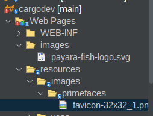

# 03. Configuración

En esta sección realizaremos la configuración de archivos de imagenes, css y js.


Dentro de Web Pages cree una carpeta llamada resources y dentro de ella cree las carpetas:

* css
* images
* js
* vendor


Quedaria

```

Web Pages/resources/css
Web Pages/resources/images
Web Pages/resources/js

```





En esta carpeta puede incluir los css, imagenes y js.


## Imagenes Locales

Por ejemplo si desea utilizar una imagen que se almacena en la carpeta imagenes puede utilizar.

* library: images
* name:folder/imagen

```html

     <h:graphicImage library="images" name="primefaces/favicon-32x32_1.png" />


```

**Java**

Si usa codigo Java imageContextRoot(getImageContextRoot()).

Recuerde incluir 
```java
MenuItem menuItemDashboard = new MenuItem.Builder()
                    .action(FacesUtil.contextPath()+"/dashboard.xhtml")
                    .text("Dashboard")
                    .minText("d")
                    .imageLibrary("images")
                    .imageName("primefaces/favicon-32x32_1.png")
                    .imageContextRoot(getImageContextRoot())
                    .roles(new ArrayList<>())
                    .build();

```


## Imagenes de la libreria jmoordbcoreui

```java
MenuItem menuItemDashboard = new MenuItem.Builder()
                    .action(FacesUtil.contextPath()+"/dashboard.xhtml")
                    .text("Dashboard")
                    .minText("d")
                    .imageLibrary("jmoordbcoreui")
                    .imageName("images/svg/dashboard.svg")
                    .imageContextRoot(getImageContextRoot())
                    .roles(new ArrayList<>())
                    .build();
```

## Iconos de primefaces

Descripción:

*  Verifique los iconos de primefaces en  [https://www.primefaces.org/showcase/icons.xhtml?jfwid=f2298](https://www.primefaces.org/showcase/icons.xhtml?jfwid=f2298)
*  .imageLibrary("primefaces")
*  imageName("pi icono")

```java
     MenuItem menuItemHorizontal = new MenuItem.Builder()
                    .action(FacesUtil.contextPath()+"/errors/error404.xhtml")
                    .text("Horizontal")
                    .minText("H")
                    .imageLibrary("primefaces")
                    .imageName("pi pi-check-square")
                    .imageContextRoot(getImageContextRoot())
                    .roles(new ArrayList<>())
                    .build();
```


---

## CSS

Generalmente se utilizan dentro de **<h:head/>**
De manera similar a las imagenes utilice la siguiente sintaxis.

* library: css
* name: folder/archivo.css

```html
 <h:outputStylesheet library="css" name="css/core/libs.min.css" />
```


## Java Script

Continua el mismo principio usado anteriormente


* library: js
* name: folder/archivo.js

```html
    <h:outputScript name="avbravo/archivo.js" library="js"/>

```

