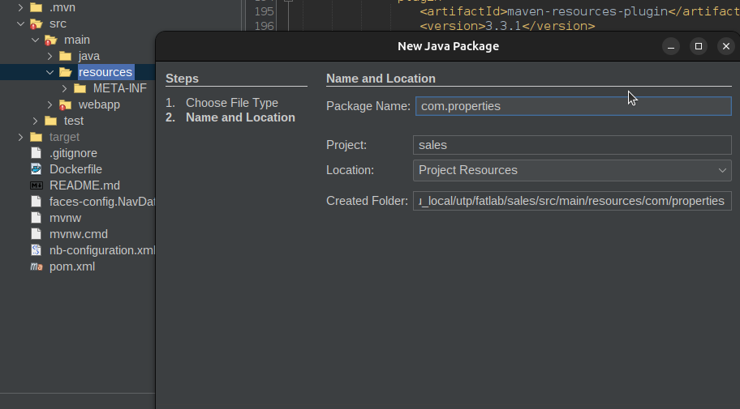
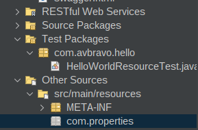
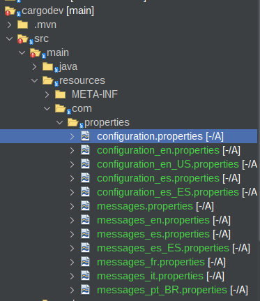
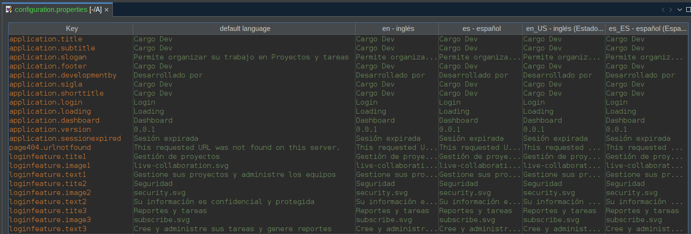
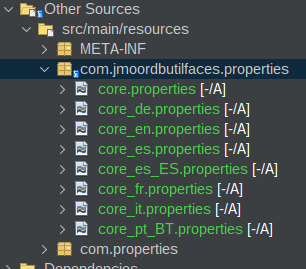

# 03.1 Archivos Properties

Cree la carpeta **com.properties** en src/main/resources/




Aparecen en la sección Other Sources  src/main/resources




Cree los archivos:

* configuration.properties

* information.properties

* messages





Archivo de configuración 



```
#Application
application.title=Cargo Dev
application.subtitle=Cargo Dev
application.slogan=Permite organizar su trabajo en Proyectos y tareas
application.footer=Cargo Dev
application.developmentby=Desarrollado por
application.sigla=Cargo Dev
application.shorttitle=Cargo Dev
#footer
application.login=Login
application.loading=Loading
application.dashboard=Dashboard
application.version=0.0.1

#session expired
application.sessionexpired =Sesión expirada
page404.urlnotfound=This requested URL was not found on this server.

#LoginFeature
loginfeature.tite1=Gestión de proyectos
loginfeature.image1=live-collaboration.svg
loginfeature.text1=Gestione sus proyectos y administre los equipos
loginfeature.tite2=Seguridad
loginfeature.image2=security.svg
loginfeature.text2=Su información es confidencial y protegida
loginfeature.tite3=Reportes y tareas
loginfeature.image3=subscribe.svg
loginfeature.text3=Cree y administre sus tareas y genere reportes


```

Cree el archivo **messages.properties** con algunas etiquetas

* field.
* menubar.
* menuitem.
* label.
* dialog.
* selectonemenu.
* info.
* barratitle.
* barralabel.
* print.
* headerText.
* columna.
* warning.
* title.
* inputmask.


```

# To change this license header, choose License Headers in Project Properties.
# To change this template file, choose Tools | Templates
# and open the template in the editor.
menubar.home=Home
menuitem.logout=Salir
menuitem.password=Password
button.newproject=Nuevo proyecto
field.avance=Avance
label.plan=Plan
tab.resumen=Resumen
button.sprint=Plan
dialog.tarjetaadd=Agregar tarjeta
selectonemenu.prioridadalta=Alta
info.savetarjeta=Se guardo exitosamente la tarjeta
dialog.tarjetaclone=Clonar Tarjeta
barratitle.tarjetas=Tarjetas
barralabel.pendiente=Pendiente
breadcrumb.schedule=Calendario
info.cambiarcolaboradortarjeta=Se cambio colaborador de la tarjeta
print.fecha=Fecha
info.saveproyecto=Proyecto se guardó exitosamente
headerText.sprint=Plan
columna.backlog=Reserva
breadcrumb.backlog=Reserva
menuitem.ia=IA
breadcrumb.informacion=Información
menuitem.user=Usuarios
menubar.settings=Configuración
warning.ingresetexto=Ingrese un texto
title.tarjetaclickeditar=De clic dara editar la tarjeta
inputmask.formatoestimacion=Formato [d] HH:mm
form.departament=Departamento
menuitem.departament=Departamento


```


Resultado final


## com.jmoordbutilfaces.properties

Contiene etiquetas para componentes generales del proyecto como botones entre otros.

Cree el paquete **com.jmoordbutilfaces.properties** 

Y copie los archivos core.properties





