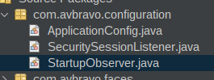

# 03.4 Configuración JakartaEE

Crear el parquete .configuration y crear dentro de el las clases

* ApplicationConfig.java
* SecuritySessionListener.java
* StartupObserver.java




* ApplicationConfig.java

```java
package com.avbravo.configuration;

import jakarta.enterprise.context.ApplicationScoped;
import jakarta.faces.annotation.FacesConfig;
import jakarta.security.enterprise.authentication.mechanism.http.CustomFormAuthenticationMechanismDefinition;
import jakarta.security.enterprise.authentication.mechanism.http.LoginToContinue;

/**
 *
 * @author avbravo
 */
@CustomFormAuthenticationMechanismDefinition(
        loginToContinue = @LoginToContinue(
                loginPage = "/index.xhtml",
                errorPage="/error.xhtml",
                useForwardToLogin = false
            )
)
@FacesConfig
@ApplicationScoped
public class ApplicationConfig {
    
}


```

* SecuritySessionListener.java


```java

import jakarta.servlet.http.HttpSession;
import jakarta.servlet.http.HttpSessionEvent;
import jakarta.servlet.http.HttpSessionListener;
import java.io.Serializable;
import java.util.Date;

/**
 *
 * @author avbravo
 */
public class SecuritySessionListener implements HttpSessionListener, Serializable {

    @Override
    public void sessionCreated(HttpSessionEvent se) {
        System.out.println("********************************************************************");
        System.out.println("Session created : " + se.getSession().getId() + " at " + new Date());
        System.out.println("********************************************************************");
    }

    @Override
    public void sessionDestroyed(HttpSessionEvent se) {
        HttpSession session = se.getSession();
        System.out.println("********************************************************************");
        System.out.println("session destroyed :" + session.getId() + " Logging out user... at  " + new Date());
        System.out.println("********************************************************************");
    }
}


```

* StartupObserver.java

```java
package com.avbravo.configuration;


import com.avbravo.utils.FacesUtil;
import jakarta.enterprise.context.ApplicationScoped;
import jakarta.enterprise.event.Observes;
import jakarta.enterprise.event.Shutdown;
import jakarta.enterprise.event.Startup;

/**
 *
 * @author avbravo
 */
@ApplicationScoped
public class StartupObserver {


// </editor-fold>
    public void observeStartup(@Observes Startup startupEvent) {

        System.out.println("CDI Container is starting");
        System.out.println("____________________________________________________");
        System.out.println("\t\t[" + FacesUtil.nameOfClassAndMethod() + "]");

        System.out.println("Revisar las carpetas para imagenes aqui() ");
        System.out.println("Leer la configuración de la aplicacion aqui() ");

        System.out.println("____________________________________________________");

        String path = "";
        String pathImage = "";
        String pathImagePhotoUser = "";
        String pathImagePhotoGeneral = "";
        String pathFileRepository = "";
        try {
            /**
             * images
             */


        } catch (Exception e) {
            FacesUtil.showError(FacesUtil.nameOfClassAndMethod() + " " + e.getLocalizedMessage());
        }

    }

    public void observeShutdown(@Observes Shutdown shutdownEvent) {
        System.out.println("CDI Container is stopping");
    }
}


```
