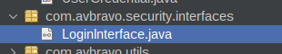

# 05. Login

Para crear los componentes para el login realizaremos los siguientes pasos:

1. Configurar el archivo index.xhtml
2. Crear la carpeta .security
3. Crear las clases LoginContoller.java, ProfileStore.java, SecurityIndentityStore.java, UserCredentials.java
4. Crear la carpeta .security.interfaces
5. Crear la interface LoginInterface.java


Edite el archivo index.xhtml añada en la sección **<f:facet name="first">**

```html
            <f:view locale="#{jmoordbLanguajes.locale !=null?jmoordbLanguajes.locale:'es'}">
            </f:view>
            <f:loadBundle basename="com.properties.messages" var="msg" />
            <f:loadBundle basename="com.properties.configuration" var="conf" />
            <f:loadBundle basename="com.jmoordbutilfaces.properties.core" var="core" />

```

Añada 

```html
title>#{conf['application.title']}</title>

```




```java

public interface LoginInterface {
    public String login();
    public String logout();
    public String next();
    public String reset();
    
}

```


* Login


```
<jmoordbcoreui:login controller="#{loginController}" 
                             title="Cargo Dev"
                             loginAction="login"
                             olvidoPasswordAction="forgotPassword"
                             registrarseAction="registrarse"
                             design="profile"
                             profileSelected="selectedOption"
                             usernameField = "username"
                             passwordField = "password"
                             rememberMeField="rememberMe"
                             signOtherAccountsRendered="false"

                             />


```

* Recovery password


```
 <jmoordbcoreui:resetpassword 
                           controller="#{loginController}" 
                             resetAction="reset"
                             emailField="emailRecovery"                         
                                                          
                             />
```


* Confirmemail


```
   <jmoordbcoreui:confirmemail 
                    controller="#{loginController}" 
                    emailField="emailRecovery"     
                    />

```


Pasos:

1. Modifique el archivo index.xhtml para agregar el componente login. Recuerde haber creado la clase 


```html  

 <jmoordbcoreui:login controller="#{loginController}" 
                                     loginAction="login"
                                     title="Cargo Dev"
                                     olvidoPasswordAction="forgotPassword"
                                     registrarseAction="registrarse"
                                     design="profile"
                                     profileSelected="selectedOption"
                                     usernameField = "username"
                                     passwordField = "password"
                                     rememberMeField="rememberMe"
                                     signOtherAccountsRendered="false"

                                     />

```

**Soporte para idiomas**

Recuerde que puede pasar los atributos de los archivos properties, como por ejemplo: **#{conf['application.title']}**.


Resultado index.xhtml


```html  
<?xml version='1.0' encoding='UTF-8' ?>
<!DOCTYPE html PUBLIC "-//W3C//DTD XHTML 1.0 Transitional//EN" "http://www.w3.org/TR/xhtml1/DTD/xhtml1-transitional.dtd">
<html xmlns="http://www.w3.org/1999/xhtml"
      xmlns:h="jakarta.faces.html"
      xmlns:p="primefaces"
      xmlns:f="jakarta.faces.core"
      xmlns:jmoordbcoreui="http://jmoordbcoreui.com/taglib"
      >
    <h:head>
        <f:facet name="first">
            <meta http-equiv="X-UA-Compatible" content="IE=edge"/>
            <meta http-equiv="Content-Type" content="text/html; charset=UTF-8"/>
            <meta name="viewport" content="width=device-width, initial-scale=1.0, maximum-scale=1.0, user-scalable=0, shrink-to-fit=no"/>
            <meta name="referrer" content="no-referrer"/>
            <meta name="referrer" content="strict-origin-when-cross-origin"/>
            <f:view locale="#{jmoordbLanguajes.locale !=null?jmoordbLanguajes.locale:'es'}">
            </f:view>
            <f:loadBundle basename="com.properties.messages" var="msg" />
            <f:loadBundle basename="com.properties.configuration" var="conf" />
            <f:loadBundle basename="com.jmoordbutilfaces.properties.core" var="core" />
        </f:facet>
        <jmoordbcoreui:css/>
        <!--<title>Cargo Dev</title>-->
        <title>#{conf['application.title']}</title>
        <!-- Aplicar jQuery.noConflict() -->
        <!--        <h:outputScript>
                    var $j = jQuery.noConflict();
                    $j(document).ready(function() {
                    console.log("jQuery noConflict está funcionando correctamente.");
                    });
                </h:outputScript>-->
    </h:head>
    <h:body>     
        <f:view contentType="text/html">
            <h:form enctype="multipart/form-data" prependId="false">

                <jmoordbcoreui:login controller="#{loginController}" 
                                     title="#{conf['application.title']}"
                                     loginAction="login"
                                     olvidoPasswordAction="forgotPassword"
                                     registrarseAction="registrarse"
                                     design="profile"
                                     profileSelected="selectedOption"
                                     usernameField = "#{core['login.username']}"
                                     passwordField = "#{core['login.password']}"                                     
                                     rememberMeField="#{core['login.remeber']}"
                                     signOtherAccountsRendered="false"

                                     />


            </h:form>
        </f:view>
    </h:body>
</html>
```

## LoginController.java

```java
/*
 * Click nbfs://nbhost/SystemFileSystem/Templates/Licenses/license-default.txt to change this license
 * Click nbfs://nbhost/SystemFileSystem/Templates/JSF/JSFManagedBean.java to edit this template
 */
package com.avbravo.secuity;


import com.avbravo.secuity.interfaces.LoginInterface;
import com.avbravo.utils.FacesUtil;
import com.avbravo.utils.JmoordbCoreResourcesFiles;
import jakarta.security.enterprise.SecurityContext;
import jakarta.annotation.PostConstruct;
import jakarta.annotation.PreDestroy;
import jakarta.inject.Named;
import jakarta.enterprise.context.SessionScoped;
import jakarta.faces.application.FacesMessage;
import jakarta.faces.context.ExternalContext;
import jakarta.faces.context.FacesContext;
import jakarta.inject.Inject;
import jakarta.security.enterprise.AuthenticationStatus;
import jakarta.security.enterprise.authentication.mechanism.http.AuthenticationParameters;
import jakarta.security.enterprise.credential.UsernamePasswordCredential;
import jakarta.servlet.http.HttpServletRequest;
import jakarta.servlet.http.HttpServletResponse;
import jakarta.validation.constraints.NotNull;
import java.io.Serializable;

/**
 *
 * @author avbravo
 */
@Named(value = "loginController")
@SessionScoped
//@DeclareRoles({"DEPT-ADMIN", "DIRECTOR"})
public class LoginController implements Serializable, LoginInterface {

    private static final long serialVersionUID = 1L;
    @NotNull
    private String username;
    @NotNull
    private String password;

    private String emailRecovery;

    @NotNull
    private boolean rememberMe;

    @Inject
    private SecurityContext securityContext;

    @Inject
    private FacesContext facesContext;

    @Inject
    private ExternalContext externalContext;

    @Inject
    JmoordbCoreResourcesFiles rf;

    /**
     *
     */
    Boolean isLogged = Boolean.FALSE;

    UserCredential userCredential = new UserCredential();
    ProfileStore profie;
    private String selectedOption;
    private String name = "";

    // <editor-fold defaultstate="collapsed" desc="set/get()">
    public String getEmailRecovery() {
        return emailRecovery;
    }

    public void setEmailRecovery(String emailRecovery) {
        this.emailRecovery = emailRecovery;
    }

    public boolean isRememberMe() {
        return rememberMe;
    }

    public void setRememberMe(boolean rememberMe) {
        this.rememberMe = rememberMe;
    }

    public Boolean getIsLogged() {
        return isLogged;
    }

    public void setIsLogged(Boolean isLogged) {
        this.isLogged = isLogged;
    }

    public String getUsername() {
        return username;
    }

    public void setUsername(String username) {
        this.username = username;
    }

    public String getPassword() {
        return password;
    }

    public void setPassword(String password) {
        this.password = password;
    }

    public ProfileStore getProfie() {
        return profie;
    }

    public void setProfie(ProfileStore profie) {
        this.profie = profie;
    }

    public UserCredential getUserCredential() {
        return userCredential;
    }

    public void setUserCredential(UserCredential userCredential) {
        this.userCredential = userCredential;
    }

    public String getSelectedOption() {
        return selectedOption;
    }

    public void setSelectedOption(String selectedOption) {
        this.selectedOption = selectedOption;
    }

    public String getName() {
        return name;
    }

    public void setName(String name) {
        this.name = name;
    }

// </editor-fold>
    /**
     * Creates a new instance of LoginController
     */
    public LoginController() {
    }

    @PostConstruct
    public void init() {
        System.out.println("::::::::::::::::::::::::::::::::::::::::::::::::::::::::::::::::::::::::::::::::::::::::");
        System.out.println("|----------|    Start   |----------|");
        System.out.println("::::::::::::::::::::::::::::::::::::::::::::::::::::::::::::::::::::::::::::::::::::::::");
        userCredential = new UserCredential();
        isLogged = Boolean.FALSE;
        var seconds = Long.parseLong(String.valueOf(facesContext.getExternalContext().getSessionMaxInactiveInterval()));
        System.out.println("seconds: " + seconds);
        //var endTime = JmoordbCoreDateUtil.secondsToHourMinuteSecondsTiempo(seconds);
    }

    // <editor-fold defaultstate="collapsed" desc="void preDestroy()">
    @PreDestroy
    public void preDestroy() {

    }

    // </editor-fold>
    //@RolesAllowed("DEPT-ADMIN")
    @Override
    public String login() {
        try {

            isLogged = Boolean.FALSE;
            System.out.println("llego al login");
            System.out.println("<--| username: " + username + " password: " + password + " |-->");
            // FacesUtil.showWarn(rf.fromCore("warning.usernameisempty"));
            AuthenticationStatus status = continueAuthentication();
            System.out.println("status " + status.toString());
            if (status == null) {
                FacesUtil.showWarn("Status es null");
                return "";
            }
            switch (status) {
                case SEND_CONTINUE:

                    facesContext.responseComplete();
                    FacesUtil.showWarn("SEND_CONTINUE");
                    break;
                case SEND_FAILURE:
                    System.out.println("SEND_FAILURE");
                    FacesUtil.showError("Authentication failed");
                    break;
                case SUCCESS:
                    //Aplica el tema del usuario
                    System.out.println("SUCCESS");
                    FacesUtil.showInfo("SUCCESS");
                    isLogged = Boolean.TRUE;

                //    return new CredentialValidationResult(username, new HashSet<>(Arrays.asList(roleForWebSecurity)));
                //  JmoordbCoreContext.put("LoginFaces.userLogged", userLogged);
                case NOT_DONE:
                    FacesUtil.showInfo("NOT_DONE");
            }
            FacesContext.getCurrentInstance().addMessage(null, new FacesMessage(username + " Welcome :" + password + " " + selectedOption));
            System.out.println("-----> call dashboard.xhtml");
            return "dashboard.xhtml";

        } catch (Exception e) {
            FacesUtil.showError(FacesUtil.nameOfClassAndMethod() + " " + e.getLocalizedMessage());
        }
        return "";
    }

    @Override
    public String logout() {
        return "";
    }

    // <editor-fold defaultstate="collapsed" desc="AuthenticationStatus continueAuthentication()">
    private AuthenticationStatus continueAuthentication() {
        return securityContext.authenticate(
                (HttpServletRequest) externalContext.getRequest(),
                (HttpServletResponse) externalContext.getResponse(),
                AuthenticationParameters.withParams()
                        .credential(new UsernamePasswordCredential(username, password))
        );
    }
    // </editor-fold>

    @Override
    public String next() {
        throw new UnsupportedOperationException("Not supported yet."); // Generated from nbfs://nbhost/SystemFileSystem/Templates/Classes/Code/GeneratedMethodBody
    }

    @Override
    public String reset() {
        try {
            System.out.println("---> llego a reset....");
            if (emailRecovery == null || emailRecovery.isEmpty() || emailRecovery.isBlank()) {
                FacesUtil.showWarn(rf.getMrb().getString("warning.ingreseemailrecuperacion"));
                return "";
            }
            System.out.println("......");
            return "confirmemail.xhtml";
        } catch (Exception e) {
            FacesUtil.showError(FacesUtil.nameOfClassAndMethod() + " " + e.getLocalizedMessage());
        }

        return "";
    }

}


```
